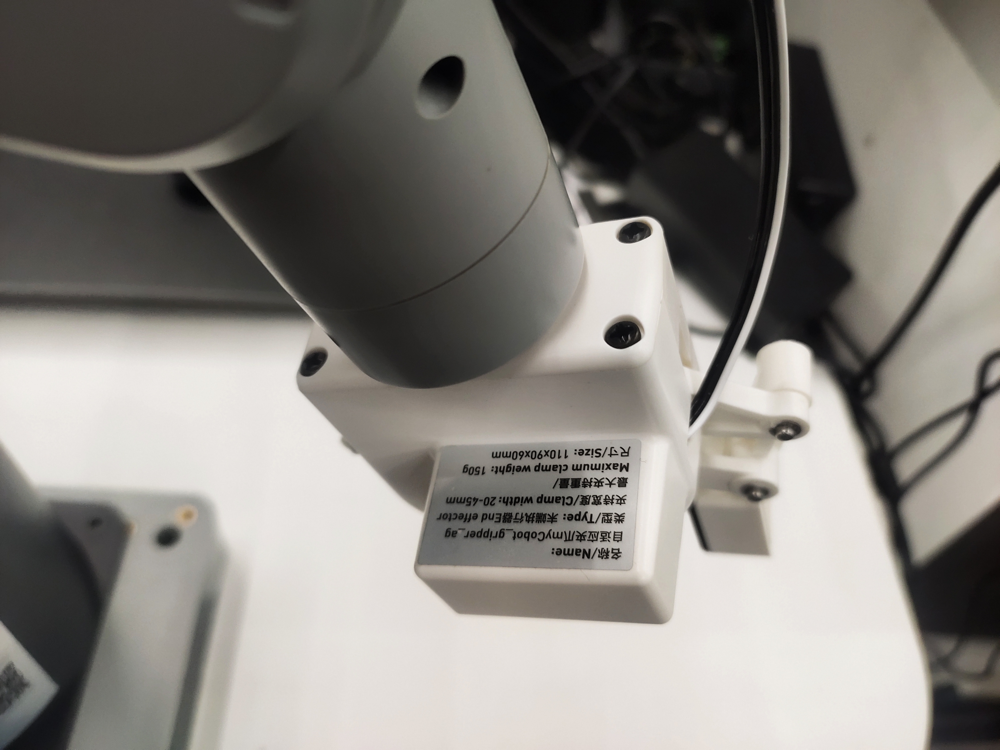
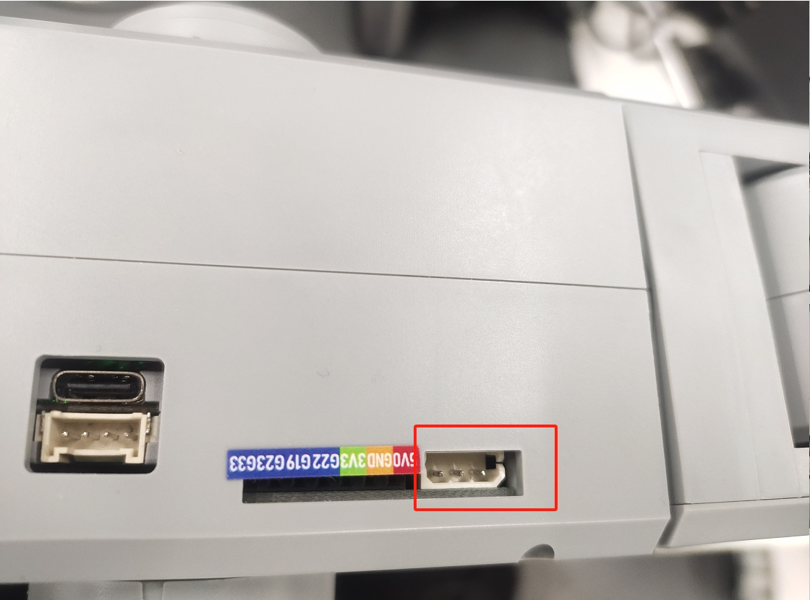
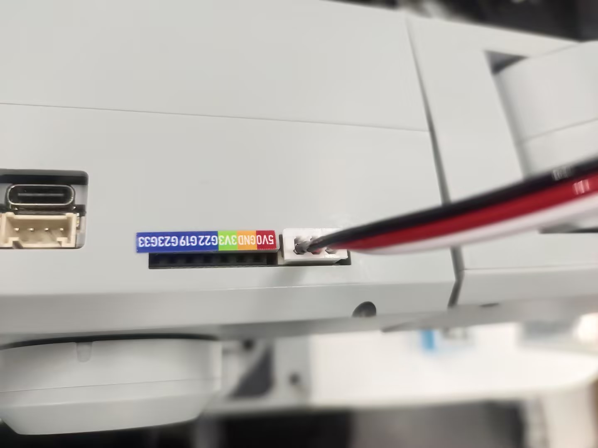
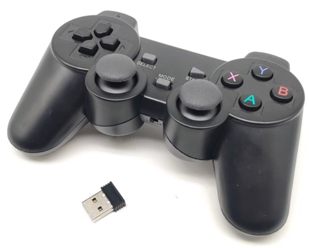
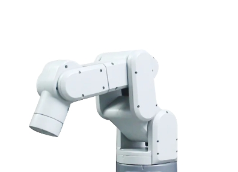
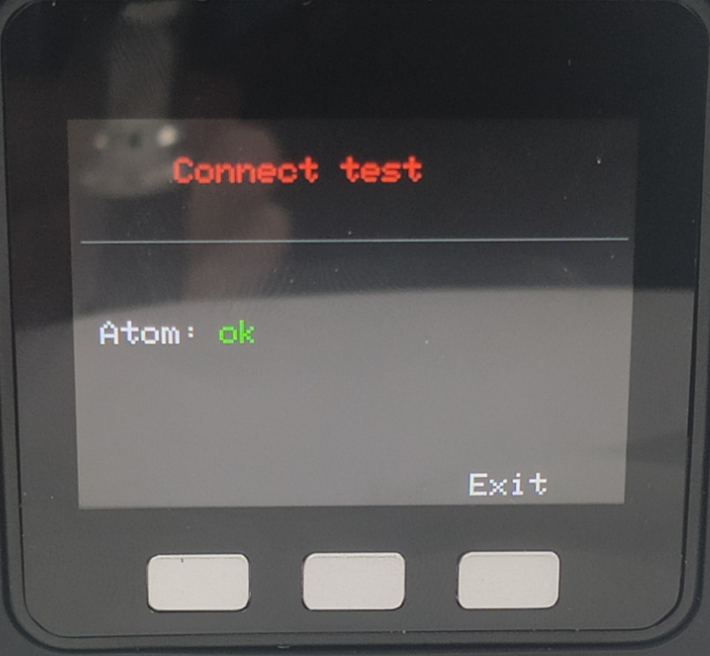
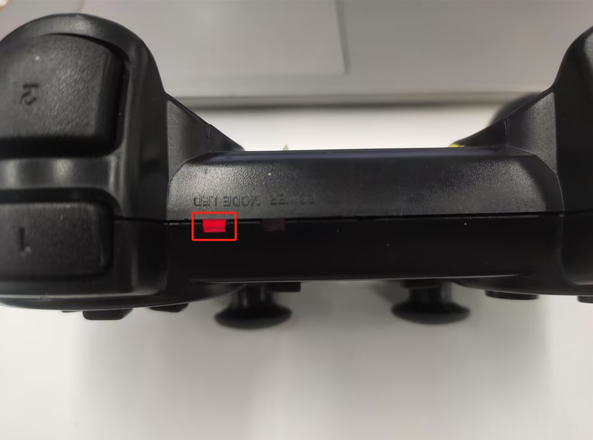

# 270 Handle remote control case

**Function description**: Use the game controller to control the robot to perform coordinate movement and gripper opening and closing

## 1 Gripper installation
Insert the Lego connector into the reserved socket of the gripper


Align the gripper with the connector inserted into the socket at the end of the robotic arm and insert it



Connect the extension line to the gripper


Insert the robotic arm control interface





## 2 Gripper test
```python
from pymycobot import MechArm,utils
import time
arm=MechArm(utils.get_port_list()[0])
for i in range(2):
    arm.set_gripper_state(1,100)#Gripper clamped
    time.sleep(1)
    arm.set_gripper_state(0,100)#Gripper open
    time.sleep(1)

```

## 3 Handle function description
**Note**: The handle needs to be purchased separately, please consult the official customer service for details



Plug the handle receiver into the computer

|Button|Function|
|---|---|
|Press the direction key↑|J5 negative movement|
|Press the direction key↓|J5 positive movement|
|Press the direction key←|J4 negative movement|
|Press the direction key→|J4 positive movement|
|Push the left joystick↑|X positive movement|
|Push the left joystick↓|X negative movement|
|Push the left joystick←|Y positive movement|
|Push the left joystick→|Y negative movement|
|Push the right joystick↑|Z positive movement|
|Push the right joystick↓|Z negative movement|
|Push the right joystick←|J6 negative movement|
|Push the right joystick→|J6 positive movement|
|Press the Y key|Gripper open|
|Press the A key|Gripper closed|

**Note**: Some handle buttons are not used, so they will not have any effect on the robot arm

## 4 Installation of handle dependency library
Open the terminal and enter the following command to install the handle driver library
```bash
pip install pygame
```
## 5 Preparation
Before connecting to the 12V power supply, you can manually adjust the robot arm to the posture shown in the figure below, and then enter the 12V power supply and communication data line. There should be no debris around the robot arm to avoid collision



Note that the screen of the robot arm seat should show ok



Turn on the switch of the handle


Note whether the MODE LED of the handle is on



**Note**: The robot arm can only be controlled when the MODE LED is on. If the handle is not used for a long time, it will enter the standby state. You can press the START button on the handle to activate it.


## 6 Example program
```python
import pygame
import sys
import time
from pymycobot import MechArm,utils
mc=MechArm(utils.get_port_list()[0])
init_angles=[0, 0, 0, 0, 80, 0]
mc.send_angles(init_angles,50)
pygame.init()
pygame.joystick.init()
button_pressed = False
hat_pressed=False
previous_state = [0,0,0,0,0,0] 

def joy_handler():
    global button_pressed
    global hat_pressed
    global previous_state
    if event.type == pygame.JOYAXISMOTION:
        axis = event.axis  
        value = round(event.value, 2)  
        if abs(value) > 0.1:  
            flag = True
            previous_state[axis] = value  
            if axis==0 and value==-1.00:
                mc.jog_coord(2,1,10)
            elif axis==0 and value==1.00:
                mc.jog_coord(2,0,10)
            if axis==1 and value==1.00:
                mc.jog_coord(1,0,10)
            elif axis==1 and value==-1.00:
                mc.jog_coord(1,1,10)
            if axis==2 and value==1.00:
                mc.jog_angle(6,0,10)
            elif axis==2 and value==-1.00:
                mc.jog_angle(6,1,10)                    
            if axis==3 and value==1.00:
                mc.jog_coord(3,0,10)
            elif axis==3 and value==-1.00:
                mc.jog_coord(3,1,10)
        else:
            if previous_state[axis] != 0:
                mc.stop()
                mc.stop()
                mc.stop()
                
                previous_state[axis] = 0  

    if event.type == pygame.JOYBUTTONDOWN:
        if joystick.get_button(3)==1:
            mc.set_gripper_state(0,100)
        if joystick.get_button(0)==1:
            mc.set_gripper_state(1,100)
                    
    if event.type == pygame.JOYHATMOTION:
        hat_value = joystick.get_hat(0) 
        if hat_value ==(0,-1):
            mc.jog_angle(5,0,10)
        elif hat_value ==(0,1):
            mc.jog_angle(5,1,10)
        elif hat_value ==(-1,0):
            mc.jog_angle(4,1,10)
        elif hat_value ==(1,0):
            mc.jog_angle(4,0,10)
        if hat_value != (0, 0):
            hat_pressed = True
        else:
            if hat_pressed: 
                mc.stop()
                mc.stop()
                mc.stop()
                hat_pressed = False  

if pygame.joystick.get_count() > 0:
    joystick = pygame.joystick.Joystick(0) 
    joystick.init()
else:
    print("No handle detected")
    pygame.quit()
    sys.exit()
running = True
while running:
    for event in pygame.event.get():
        if event.type == pygame.QUIT:
            running = False       
        joy_handler()
pygame.quit()
```

# 7 Effect display

