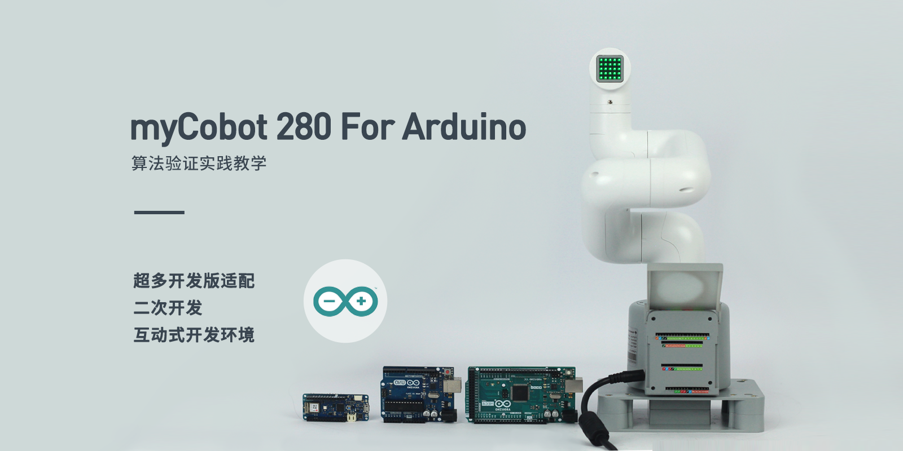

# 第一章 产品简介
## 1.产品概述

##### ER myCobot 280 For Arduino

##### 算法验证实践教学

### 产品简介

mycobot – 280 for Arduino 2023 机械臂基于 mycobot 280 协作机械臂系列开发使用 **M5STACK-ATOM ESP32** 核心主控，是大象机器人入门的产品，设备可以使用**Arduino MKRWIFI1010 \ MEGA2560 \ UNO** 等多种**支持UART串口通讯**接口模块的开发版扩展，下载大象机器人提供的产品驱动库，无需迁移开发板型号，只需简单链接，即可开始扩展开发。

myCobot 自重**860g**，有效载荷**250g**，有效工作半径**280mm**；体积小巧但功能强大，可搭配多种末端执行器适配多种应用场景，支持多平台软件的二次开发，满足**科研教育、智能家居，商业探索**等各种场景需求

### 设计理念

myCobot 280 For Arduino 采用 ATOM Matrix ESP32 Development Kit 核心开发板作为主控。搭载大象机器人自主研发的机器人运动控制操作系统固件，内置运动学正逆解。支持搭配多种Arduino开发版，进行扩展应用开发。使用Arduino开发板搭配多种Arduino官方支持的传感器，可以快速构建机械臂 机器视觉与机器人应用、控制逻辑开发、机器人融合开发、ROS仿真实验课堂的首选助手，帮助您快速开始六轴机械臂学习与应用。

### 设计目标

| 设计目标               | 描述                                                         | 应用场景及特点                                               |
| ---------------------- | ------------------------------------------------------------ | ------------------------------------------------------------ |
| **嵌入式编程课堂学习**     | 机械臂内置 ATOM Matrix ESP32 Development Kit，为设备提供了强大的运动学处理能力。支持多种型号开发板拓展。 | 用户可使用官方提供的Arduino驱动库，体验最新机器人操控功能，也可拓展不同功能的开发板，满足各类场景应用。 |
| **高级语言编程教学**       | 支持python2/3驱动库、ROS开发框架， 用户可以使用高级开发语言对机械臂进行开发。 | 产品支持搭配多串口应用的开发板，用户可以使用高级开发语言在虚拟环境中进行机械臂的控制及算法的验证，降低了对实验环境的要求， 提高了实验效率。 |
| **创意开发**               | myCobot 280 系列机械臂内置大象机器人自主研发的机器人运动控制算法，支持myBlockly拖拽式编程。 | 机械臂产品开源驱动库提供超90+机器人控制接⼝，1:1还原工业机器人基础控制接口，让用户编程体验更加接近真实的工业机器人开发应用。 |
| **技术创新与知识传播** | myCobot 280 For Arduino在商业展示中可以作为展示最新科技成果的平台，旨在提高公众对科技的理解和兴趣，并推动科技创新向商业化转化。 | 通过展示和演示最新的科技成果，增加公众参与度，促进科技知识的普及和科技产品的市场接受度。 |

### 产品特点

|                                    |                                                              |
| ---------------------------------- | ------------------------------------------------------------ |
| **超级扩展支持，无限可能**         | 标准**UART**串口，兼容多种开发板控件。 支持**Arduino MKRWIFI1010\MEGA2560\UNO**等各类开发版本扩展。 提供Mega和MKR开发板的基础固件，烧写**扩展多种开发**方式。 支持扩展**Python、ROS、myBlockly、C++、C#**等多种开发控制方式。 支持自主搭配**夹爪、吸泵**等不同配件，实现更多应用化场景。 支持拓展**人工智能套装**，用于机器人教育教学。 |
| **独特工业设计，极致小巧**         | 一体化设计，整体机身结构紧凑，净重仅860g，十分便于携带。 模块化设计，备件少、维护成本低，可快速拆卸更换，实现即插即用 |
| **支持ROS1+ROS2和图形化编程**      | 支持ROS1+ROS2多版本应用，让开发不再受限。 支持图形化编程软件，让机器人编程应用触手可及。 |
| **高配置，便捷开发**               | 内含6个高性能伺服电机，响应快，惯量小，转动平滑。 内置运动学正反求解算法，开放标准SDK |
| **图形化编程，支持工业机器人软件** | 采用 myBlockly 可视化编程软件，掌上自如编程，操作简单易上手。 支持 Arduino + ROS 开源系统 |
| **高配置，搭配Lego接口**           | 内含6个高性能伺服电机，响应快，惯量小，转动平滑。 底座及末端带有乐高科技件接口，适用于各项微型嵌入式设备开发。 |

## 2.产品应用

### 用户群体

|                              |                                                              |
| ---------------------------- | ------------------------------------------------------------ |
| **教育机构**                 | Arduino 平台大量开发扩展板支持，无论是基础入门，初级教育，高级应用均可以找到合适的开发组件。支持入门级教学的图像拖拽式编程软件 myBlockly ，拼图式编程、图形化调试⼯具，让新手也能轻松驾驭机械臂。 |
| **技术开发者和工程师**       | myCobot 280 For Arduino内置大象机器人自主研发的机器人运动控制算法，支持角度、坐标、电位值、 弧度值多种控制模式，极大的满足各种控制需求。能有效支持复杂数据分析、算法开发和验证活动。 |
| **商业展示和公共展览组织者** | myCobot 280 For Arduino可以扩展多种如 PC、工控机、嵌入式设备主控，适合多种应用场景；多配件叠加可以完成复杂项目应用，满足商业化展会展示，如机器人应用模型展示、教育教学套装展示、工业4.0的应用场景展示等 |
| **极客开发爱好者**           | myCobot 280 For Arduino基于Arduino生态开发支持大量开发板和扩展元器件，能极大满足极客爱好者的开发需求。 |

### 应用场景

| **用户组**                 | **应用场景**                                                 | **优势目标**                                                 |
| -------------------------- | ------------------------------------------------------------ | ------------------------------------------------------------ |
| **教育领域的教师和学生**   | - STEM 教育 - 机器人项目 - 跨学科研究项目 - 教育与研究 | - 提高学生对科技的兴趣 - 增强动手能力和解决问题的能力 - 促进创新思维和团队合作 - 为数据收集和机器人学提供实践平台 |
| **创客和技术开发者**       | - 原型开发 - 实验研究 - 算法测试和验证 - 机器人试教 | - 加速研究进展 - 连接理论与实践 - 推进技术创新 - 支持多种编程语言与开发环境 |
| **商业演示和营销专业人士** | - 展览展示 - 技术演示 - 品牌推广                       | - 吸引潜在客户和投资者 - 展示公司技术实力和创新产品 - 提升品牌影响力 |

---

## 3. 支持的扩展开发

mycobot 系列机械臂在教育和科研领域中极具价值，特别是在 Python 和 ROS（Robot Operating System)这两个广泛使用的开发环境中。这些环境提供了强大的支持，使得 mycobot  系列产品能够广泛应用于机器学习、人工智能研究、复杂运动控制以及视觉处理任务中。同时搭配自适应夹爪、摄像头法兰、吸泵等数十种配件，可以尽情发挥myCobot的创意想法。移动底盘+机械手臂 搭配开发，低成本开始机器人协作、SLAM建图、自主导航、ROS开发环境、六轴协作机器人控制、视觉识别、设备间通信等多种开发内容。

|  |  |
| ------------------------------------------------------------ | ------------------------------------------------------------ |
| **Python**                                                   | 机器人支持Python，具备完善的Python API库。 可通过Python控制机器人的关节角度、坐标、夹持器等。 |
| **ROS**                                                      | 支持 ROS1 和 ROS2 双版本，提供 RVIZ 仿真环境支持。 允许用户实时显示机械臂和采集机械臂的状态信息，使得myCobot 280 For Arduino适合 ROS 初学者和教育用途。 |
| **Arduino**                                                      | 支持 提供开源程序MyCobotBasic示例程序。同时用户也可以根据自身需要，对开源程序进行修改。 |
| **硬件接口**                                                 | 包括 IO、USB 等，方便连接各种传感器和执行器。              |
| **软件库**                                                   | 提供丰富的开源库和 API 来简化开发过程。                    |
| **myBlockly** | 既是图形化编程软件又是可视化工具。 用户可以拖拽模块创建程序，这个过程非常类似于搭积木，方便快捷易上手。 |

---

## 4. 购买地址

如果您有兴趣购买该设备，请点击下面的链接：  
淘宝：[https://shop504055678.taobao.com](https://shop504055678.taobao.com)  
Shopify：[https://shop.elephantrobotics.com/](https://shop.elephantrobotics.com/)  
速卖通：[https://elephantrobotics.aliexpress.com/store/1101941423](https://elephantrobotics.aliexpress.com/store/1101941423)

---

[下一章 →](../2.ProductParameter/2-ProductParameters.md)