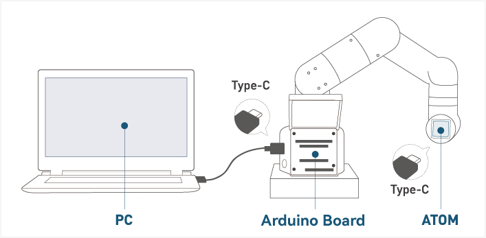

# Arduino 简单使用

## 1.连接设备

以 **myCobot 280-Arduino** 为例，用 合适的数据线链接机械臂和开发板以及 PC 端。

## 2.固件要求  

* ATOM ：使用 **MyStudio** 烧录最新版 AtomMain（末端的atom为算法储存运算终端，不可开发，只能使用本公司固件）

## 3.检测链接  

打开电脑设备管理器查看有无设备。如未检测到设备，请更换USB连接线，如果显示无法使用，请安装点击下载 **CP210X 驱动**（参考5.2软件使用说明） ，下载完成后解压并安装所需的驱动版本即可使用。

打开 **Arduino IDE -->工具 --> 端口** 查看有无设备。如未检测到设备，请更换USB连接线测试，或检测驱动是否安装成功。

## 4.开发前的注意事项
### 编译前的修改

导入库文件，如果您的机械臂是**myCobot280-Arduino**，请检查接入的开发板是否为Mega2560或者Uno，如果是： 

1.1 请将**MyCobotBasic\lib\avr-libstdcpp**放到**C:\Users\User\Documents\Arduino\libraries**下: 

 

 

### 编译前开发板的选择

若使用的开发板为Uno、Mega2560, 请进行以下步骤：

工具 --> 开发板 --> Arduino AVR Boards --> Arduino Uno（或者Arduino MEAG or Mega2560)，具体可看下图：

 
1 使用 uno 时，选择1 
2 使用Mega2560时，选择2 

2.2 开发板为mkr wifi1010，请进行以下步骤： 
开发板管理器搜索samd，如果没有安装，就安装，首先工具 --> 开发板 --> 开发板管理器，然后搜索samd，具体可看下图：

 

 

开发板选择mkr wifi1010，工具 --> 开发板 --> Arduino SAMD --> Arduino MKR WiFi1010

 

## 4.开始开发

以烧录一个官方 demo 为例，打开 **Arduino IDE --> 文件 --> 示例--> MyCobotBasic** 就可以看到所有的项目示例（如果未看到示例，可以将Arduino重启）。选择烧录一个简单的 demo , 例如 **--> MyCobot280--> MyCobot280-M5--> AnglesControl** 。

从示例文件中打开AnglesControl.ino

**注意：** 选择开发板为 **M5Stack-Core-ESP32** 和对应的 **COM口** 。

如果您使用的是myCobot280-M5，**请使用MyCobot280-M5文件夹下的ParameterList.h，替换掉MyCobotBasic文件夹下的ParameterList.h**，具体请看下图： 

**注意：** 使用不同机型时，请使用各自案例目录下的"ParameterList.h"文件替换"MyCobotBasic\ParameterList.h"文件

点击上传并等待右下方进度条跑完 

等待直到右下方显示上传成功，程序就已经下载完成

这时我们就能看到 **机器人** 开始工作。

## 5.部分案例介绍
目前不同机型都有角度、坐标、夹爪控制。 
**Transponder**： 
myCobot280-Arduino uno和Mega2560开发板使用案例，功能主要是通讯，在此基础上，使用RoboFlow、python、myblockly等控制机械臂，进行io控制。 
**AnglesControl**： 
这个demo是用于控制机械臂关于其关节的角度控制。 
**CoordsControl**： 
这个demo是用于控制机械臂关于其关节角度控制和坐标控制。 
**GripperControl**： 
这个demo是用于控制一个名为MyCobot的机械臂的夹爪（gripper）的开合动作以及角度的。 
 