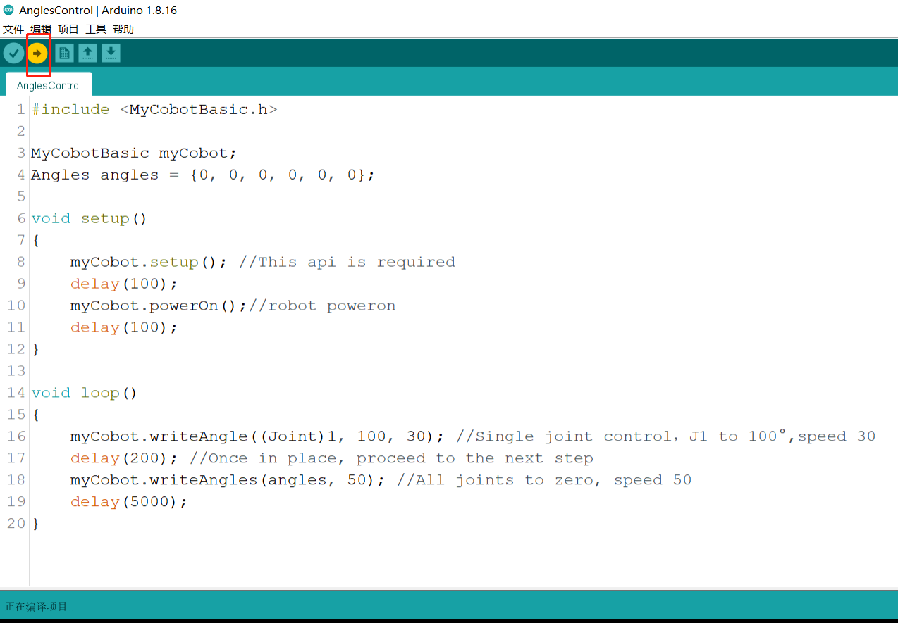

# Arduino 简单使用

## 1.连接设备

以 **myCobot 280-Arduino** 为例，用合适的数据线链接机械臂和开发板以及 PC 端。


## 2.固件要求  

* ATOM ：使用 **MyStudio** 烧录最新版 AtomMain（末端的atom为算法储存运算终端，不可开发，只能使用本公司固件）

## 3.检测链接  

打开电脑设备管理器查看有无设备。如未检测到设备，请更换USB连接线，如果显示无法使用，请安装点击下载 **CP210X 驱动**（参考5.2软件使用说明） ，下载完成后解压并安装所需的驱动版本即可使用。

打开 **Arduino IDE -->工具 --> 端口** 查看有无设备。如未检测到设备，请更换USB连接线测试，或检测驱动是否安装成功。

## 4.开发前的注意事项
### 编译前的修改

导入库文件，如果您的机械臂是**myCobot280-Arduino**，请检查接入的开发板是否为Mega2560或者Uno，如果是：<br>

1.1 请将**MyCobotBasic\lib\avr-libstdcpp**放到**C:\Users\User\Documents\Arduino\libraries**下:<br>

<br>

<br>

### 编译前开发板的选择

若使用的开发板为Uno、Mega2560, 请进行以下步骤：

工具 --> 开发板 --> Arduino AVR Boards --> Arduino Uno（或者Arduino MEAG or Mega2560)，具体可看下图：

<br>
1 使用 uno 时，选择1<br>
2 使用Mega2560时，选择2<br>

若使用的开发板为mkr wifi1010，请进行以下步骤：<br>
开发板管理器搜索samd，如果没有安装，就安装，首先工具 --> 开发板 --> 开发板管理器，然后搜索samd，具体可看下图：

<br>

<br>

开发板选择mkr wifi1010，工具 --> 开发板 --> Arduino SAMD --> Arduino MKR WiFi1010

<br>

## 4.开始开发

以烧录一个官方 demo 为例，打开 **Arduino IDE --> 文件 --> 示例--> MyCobotBasic** 就可以看到所有的项目示例（如果未看到示例，可以将Arduino重启）。选择烧录一个简单的 demo , 例如 **--> MyCobot280--> MyCobot280-M5--> AnglesControl** 。

从示例文件中打开AnglesControl.ino


**注意：** 选择开发板为 **M5Stack-Core-ESP32** 和对应的 **COM口** 。


如果您使用的是myCobot280-M5，**请使用MyCobot280-M5文件夹下的ParameterList.h，替换掉MyCobotBasic文件夹下的ParameterList.h**，具体请看下图：<br>


**注意： 使用不同机型时，请使用各自案例目录下的"ParameterList.h"文件替换"MyCobotBasic\ParameterList.h"文件**

点击上传并等待右下方进度条跑完<br>


等待直到右下方显示上传成功，程序就已经下载完成


这时我们就能看到 **机器人** 开始工作。


## 5.部分案例介绍
目前不同机型都有角度、坐标、夹爪控制。<br>
**Transponder**：<br>
myCobot280-Arduino uno和Mega2560开发板使用案例，功能主要是通讯，在此基础上，使用RoboFlow、python、myblockly等控制机械臂，进行io控制。<br>
**AnglesControl**：<br>
这个demo是用于控制机械臂关于其关节的角度控制。<br>
**CoordsControl**：<br>
这个demo是用于控制机械臂关于其关节角度控制和坐标控制。<br>
**GripperControl**：<br>
这个demo是用于控制一个名为MyCobot的机械臂的夹爪（gripper）的开合动作以及角度的。<br>
<br>

---

**Transponder案例说明**：
串口通信初始化与设置：在 setup 函数中，程序初始化了串口通信，并开启了 MyCobot 机械臂的电源。
数据包处理：在 loop 函数中，程序会不断调用相关函数来处理从客户端到 Atom（机械臂控制器）的数据、从 Atom 返回的数据，以及处理其他未被 Atom 处理的消息。
数据包校验：checkHeader 和 HandleStickyPackets 函数用于校验数据包的完整性和正确性。
处理 IO 引脚控制的命令：HandleOtherMsg 函数处理设置和读取 IO 引脚状态的命令。
数据传输：SendDataToUser 函数负责将 Atom 返回的数据包传回给用户。
数据缓冲管理：程序通过缓冲区管理数据的收发，并在特定条件下清理数据。

```cpp
#include <MyCobotBasic.h>  // 包含 MyCobot 机械臂的基本库文件
#include <vector>  // 包含标准库中的 vector 容器

#define SET_BASIC_OUT 0xa0  // 定义用于设置 IO 输出的指令代码
#define GET_BASIC_IN 0xa1  // 定义用于获取 IO 输入的指令代码

byte HEADER = 0xfe;  // 定义数据包的起始字节
byte FOOTER = 0xfa;  // 定义数据包的结束字节

using namespace std;
vector<int> client_data;  // 用于存储从客户端接收到的数据
vector<int> temp_data;  // 用于临时存储处理中的数据
vector<int> atom_data;  // 用于存储从 Atom 返回的数据
int count = -1, data = -1;  // 初始化计数器和数据变量
int t_begin;  // 定义时间变量，用于计算延时

void setup()
{
    Serial.begin(115200);  // 初始化主串口，波特率为 115200
    Serial1.begin(1000000);  // 初始化辅助串口，波特率为 1000000
    delay(100);  // 延时 100 毫秒

    MyCobotBasic myCobot;  // 实例化 MyCobotBasic 类
    delay(500);  // 延时 500 毫秒
    
    myCobot.powerOn();  // 开启 MyCobot 机械臂电源
    delay(500);  // 延时 500 毫秒
    
    pinMode(15, OUTPUT); // 将引脚 15 设置为输出模式
    pinMode(5, OUTPUT);  // 将引脚 5 设置为输出模式
    pinMode(2, OUTPUT);  // 将引脚 2 设置为输出模式
}

void loop()
{
    ClientDataToAtom();  // 将客户端数据发送给 Atom
    AtomDataToClient();  // 将 Atom 返回的数据发送给客户端
    OtherMsgToClient();  // 处理其他未被 Atom 处理的消息
    ClearData();  // 清理数据缓存
}

/*
 * 检查串口 wifi 或蓝牙返回消息的头部是否为 0xfe 0xfe
 */
 bool checkHeader(vector<int> &v_data)
 {
    if (v_data[0] == HEADER && v_data[1] == HEADER)  // 如果数据包的前两个字节为 HEADER
        return true;  // 返回 true 表示头部正确
    return false;  // 否则返回 false
 }

bool HandleStickyPackets(vector<int> &v_data)
{
    // 获取协议的长度以判断结束符是否为 0xfa
    vector<int>::iterator it_vdata = v_data.begin() + 2 + v_data[2];
    int len = v_data.size();  // 获取数据包的长度
    // 首先判断长度是否小于 5，指令长度至少为 5
    if (len >= 5 && len <= (v_data[2] + 3)) {  // 如果数据包的长度合法
        if (*it_vdata == FOOTER) {  // 如果结束符为 FOOTER
            v_data.erase(it_vdata + 1, v_data.end());  // 删除多余的数据
            return true;  // 返回 true 表示数据包正确
        }
    } 
    return false;  // 返回 false 表示数据包有问题
}

/*
 * 处理 Atom 没有处理的一些客户端消息
 */
 bool HandleOtherMsg(vector<int> &v_data)
 {
    bool flag = false;  // 初始化标志位
    switch (v_data[2]) {  // 根据指令的第三个字节选择处理流程
        case 4:
            switch (v_data[3]) {
                case SET_BASIC_OUT: {  // 如果指令是设置 IO 输出
                    byte pin_no = v_data[4];  // 获取需要设置的引脚编号
                    pinMode(pin_no, OUTPUT);  // 将该引脚设置为输出模式
                    delay(5);  // 延时 5 毫秒
                    bool pin_data = v_data[5];  // 获取需要设置的引脚状态
                    digitalWrite(pin_no, pin_data);  // 设置引脚输出高低电平
                }
                break;
            }
            break;
        case 3:
            switch (v_data[3]) {
                case GET_BASIC_IN: {  // 如果指令是获取 IO 输入
                    byte pin_no = v_data[4];  // 获取需要读取的引脚编号
                    pinMode(pin_no, INPUT);  // 将该引脚设置为输入模式
                    delay(5);  // 延时 5 毫秒
                    bool pin_state = digitalRead(pin_no);  // 读取引脚的输入状态
                    delay(5);  // 延时 5 毫秒
                    v_data[2] = 0x04;  // 修改指令长度
                    v_data.insert(v_data.end() - 1, pin_state);  // 将引脚状态添加到数据包中
                    flag = true;  // 设置标志位为 true
                }
                break;
            }
            break;
    }
    return flag;  // 返回标志位
 }

/*
 * 将 Atom 返回的消息发送给用户
 */
 void SendDataToUser(vector<int> &v_data)
 {
    if (checkHeader(v_data) && HandleStickyPackets(v_data)) {  // 如果数据包头部正确且数据包处理成功
        if (HandleOtherMsg(v_data)) {  // 处理可能的 IO 引脚命令
            for (int i = 0; i < v_data.size(); i++) {  // 将数据包逐字节发送给用户
                Serial.write(v_data[i]);
            }
        }
        v_data.clear();  // 清空数据包
    }
    return;
 }

void ClientDataToAtom()
{
    if (Serial.available() > 0) {  // 如果主串口有可用数据
      count = 1; 
      while (Serial.available() > 0) {  // 读取主串口的数据
          data = Serial.read();  // 读取一个字节的数据
          Serial1.write(data);  // 将数据发送给 Atom
          client_data.push_back(data);  // 将数据存储在 client_data 缓存中
      }
      t_begin = millis();  // 记录当前时间
    }
}

void AtomDataToClient()
{
    int temp;
    bool flag = false;
    if (Serial1.available() > 0) {  // 如果辅助串口有可用数据
        count = 0;
        while (Serial1.available() > 0) {  // 读取辅助串口的数据
            data = Serial1.read();  // 读取一个字节的数据
            if (data == HEADER && (temp = Serial1.read()) == HEADER) {  // 如果读到数据包的头部
                Serial.write(temp);  // 将数据发送给用户
                flag = true;  // 设置标志位
            }
            if (flag) {
                Serial.write(data);  // 将数据发送给用户
            }
        }
    }
}

void OtherMsgToClient()
{
    if (count == 1 && ((millis() - t_begin) > 10)) {  // 如果客户端数据传输结束并且超过 10 毫秒
        count = 0;  // 重置计数器
        for (int i = 0; i < client_data.size(); i++) {  // 将 client_data 中的数据复制到 temp_data 中
            temp_data.push_back(client_data[i]);
        }
        SendDataToUser(temp_data);  // 将数据发送给用户
    }
}

void ClearData()
{
    if (count == 0){  // 如果计数器为 0
        client_data.clear();  // 清空 client_data 缓存
    }
}
```

---

**AnglesControl案例说明**

该示例程序主要实现了以下功能：

1. 初始化 MyCobot 机械臂并上电。
2. 在循环中控制机械臂的第一个关节（Joint 1）旋转到指定角度，并设置运动速度。
3. 在设置完第一个关节角度后，控制所有关节归零，并设置归零过程的速度

```cpp
#include <MyCobotBasic.h>

MyCobotBasic myCobot;
Angles angles = {0, 0, 0, 0, 0, 0};

void setup()
{
    myCobot.setup(); //This api is required
    delay(100);
    myCobot.powerOn();//robot poweron
    delay(100);
}

void loop()
{
    myCobot.writeAngle((Joint)1, 100, 30); //Single joint control，J1 to 100°,speed 30
    delay(200); //Once in place, proceed to the next step
    myCobot.writeAngles(angles, 50); //All joints to zero, speed 50
    delay(5000);
}
```

**CoordsControl案例说明：**

该程序实现了以下功能：

1. 初始化 MyCobot 机械臂并上电。
2. 设置机械臂初始姿态。
3. 在主循环中，首先将机械臂的 X 轴坐标移动到 30mm 的位置。
4. 随后，将机械臂的坐标设置为预定义的 `coords` 值，即指定的六个坐标轴位置。<br>

```cpp
#include <MyCobotBasic.h> // 引入 MyCobotBasic 库，用于控制 MyCobot 机械臂

MyCobotBasic myCobot; // 创建 MyCobotBasic 对象，用于后续控制机械臂

Coords coords = {194.700, -67.400, 131.300, -177.260, -3.760, -110.880}; 
// 初始化一个 Coords 结构体，定义机械臂的目标坐标系位置（包括 X, Y, Z 位置和姿态角）

void setup()
{
    myCobot.setup(); // 初始化 myCobot 对象（必须调用该函数）
    delay(100); // 延迟 100 毫秒，等待初始化完成
    myCobot.powerOn(); // 为机械臂上电，准备开始控制
    delay(100); // 延迟 100 毫秒，等待机械臂上电
    myCobot.writeAngles({0, -10, -123, 45, 0, 20}, 50); 
    // 设置机械臂的初始姿态，具体角度为 {J1, J2, J3, J4, J5, J6}，速度为 50
    delay(6000); // 延迟 6000 毫秒，等待机械臂移动到指定初始姿态
}

void loop()
{
    myCobot.writeCoord((Axis)1, 30, 30); // 控制机械臂的 X 轴坐标移动到 30mm，速度为 30
    delay(300); // 延迟 300 毫秒，等待 X 轴移动到指定位置
    myCobot.writeCoords(coords, 30); // 设置机械臂的坐标为预定义的 `coords` 值，速度为 30
    delay(5000); // 延迟 5000 毫秒，等待机械臂移动到指定坐标位置
}
```

**GripperControl案例说明：**

该程序实现了以下功能：

1. 初始化 MyCobot 机械臂并上电。
2. 在主循环中，按顺序控制夹爪的位置和状态，包括夹爪张开、闭合和指定角度的控制。<br>

```cpp
#include <MyCobotBasic.h> // 引入 MyCobotBasic 库，用于控制 MyCobot 机械臂

MyCobotBasic myCobot; // 创建 MyCobotBasic 对象，用于后续控制机械臂

void setup()
{
    myCobot.setup(); // 初始化 myCobot 对象（必须调用该函数）
    delay(100); // 延迟 100 毫秒，等待初始化完成
    myCobot.powerOn(); // 为机械臂上电，准备开始控制
    delay(100); // 延迟 100 毫秒，等待机械臂上电
}

void loop()
{
    myCobot.setGripperValue(80, 50); // 将夹爪移动到 80°，速度为 50
    delay(500); // 延迟 500 毫秒，等待夹爪移动到指定角度
    myCobot.setGripperValue(20, 50); // 将夹爪移动到 20°，速度为 50
    delay(500); // 延迟 500 毫秒，等待夹爪移动到指定角度
    myCobot.setGripperState(0, 30); // 打开夹爪，速度为 30
    delay(600); // 延迟 600 毫秒，等待夹爪完全打开
    myCobot.setGripperState(1, 30); // 关闭夹爪，速度为 30
    delay(600); // 延迟 600 毫秒，等待夹爪完全关闭
}

```