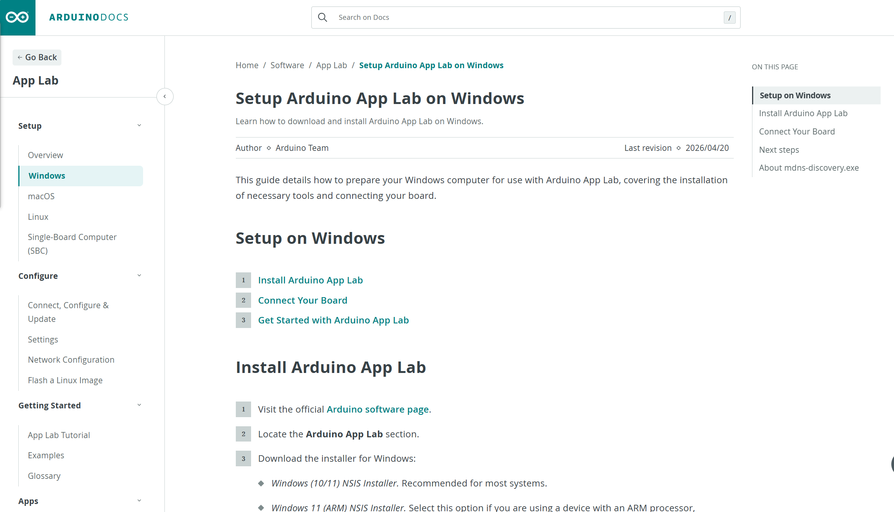
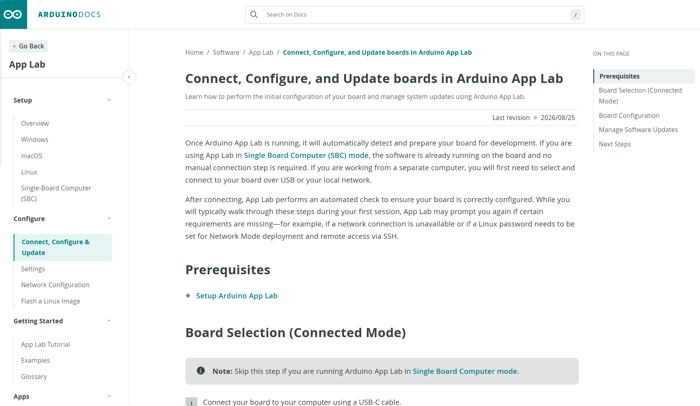

# 7.1 UNO Q 与 Arduino App Lab 快速入门

本节面向首次使用 myCobot 280 for Arduino 与 UNO Q 的客户。请先完成本节的 RGB 验证，再进入UNO Q Python、网络控制或手柄控制等开发内容。

## 1. 先阅读 UNO Q 官方用户手册

UNO Q 的供电、USB-C 接口、显示输出、网络、扩展接口和系统功能以 Arduino 官方资料为准。首次开机、连接外设或需要确认板卡本体能力时，请先阅读 [Arduino UNO Q User Manual](https://docs.arduino.cc/tutorials/uno-q/user-manual/)。

本 GitBook 只说明 UNO Q 与 myCobot 280 的配合使用，不替代官方板卡手册。若官方手册与本文在板卡操作方面有差异，请以官方最新版为准。

## 2. 选择使用方式

| 使用方式 | 适用对象 | 建议用途 |
| --- | --- | --- |
| Arduino App Lab（PC-hosted） | 首次使用者、普通客户 | 用电脑导入并运行 myCobot 案例；这是推荐的起点 |
| Arduino App Lab（SBC） | 有显示器、键鼠的用户 | 直接在 UNO Q 上运行 App；手柄案例使用此方式 |
| UNO Q Python | 有 Python 开发需求的用户 | 在 UNO Q 的 Debian 环境编写和调试脚本 |
| TCP Socket | 有局域网集成需求的用户 | 从电脑上的 Python 程序远程控制机械臂 |

以上入口都会控制同一台机械臂。切换入口前，请先点击 **Stop**、结束脚本或断开客户端，避免多个程序同时发送指令。

> 客户首次验证只需使用 Arduino App Lab（PC-hosted）和 RGB 案例，无需了解 Bridge、RPC 或底层通信细节。

首次使用建议选择 PC-hosted 模式：使用支持数据传输的 USB-C 线将电脑与 UNO Q 连接。需要在 UNO Q 上直接操作或使用手柄时，再选择 SBC 模式。

## 3. 硬件准备

- myCobot 280 for Arduino 及电源
- Arduino UNO Q 及合适的供电方式
- 按交付接线连接 UNO Q 与机械臂的通信线
- PC-hosted 模式所需的 USB-C **数据线**
- SBC 模式所需的显示器、键盘和鼠标
- 手柄控制所需的手柄接收器及带外部供电能力的 USB Hub

UNO Q 可通过 USB-C、5V 或 VIN 供电。客户默认使用 USB-C 供电与连接；若改用 5V 或 VIN，请严格按 Arduino 官方用户手册的电压要求接线，且不要同时接入多个供电来源。


图 7.1-1 UNO Q 供电方式（来源：Arduino UNO Q 官方用户手册）


图 7.1-2 UNO Q 与 myCobot 280 连接实物图

## 4. 安全事项

1. 固定机械臂底座，确认供电和通信线连接正确，不要带电改接 D0/D1 或外设供电。
2. 清空机械臂运动范围，确保人员远离关节和末端，并准备好急停措施。
3. 先执行版本、角度和 RGB 等不会引起机械臂运动的检查，再执行回零或关节运动。
4. 回零同样会产生运动，不可在空间不足时直接运行。
5. 夹爪和吸泵案例只能在相应外设安装、接线正确后运行。
6. 同一时刻只允许一个入口发送运动指令。

---

## 5. 安装 Arduino App Lab

Arduino App Lab 用于开发和运行 UNO Q App。一个 App 可以同时包含在 Linux 侧运行的 Python 程序、在 MCU 侧运行的 Arduino Sketch，以及可选的 Bricks。

### 5.1 下载 Arduino App Lab

访问 [Arduino Software](https://www.arduino.cc/en/software/#app-lab-section)，找到 **Arduino App Lab** 区域。请勿误选 Arduino IDE 或 Arduino Lab for MicroPython。下载页面会根据操作系统提供相应安装包；版本会持续更新，请始终下载官网最新版。



图 7.1-3 Arduino App Lab Windows 官方安装说明（来源：Arduino 官方文档）

官方原文：[Setup Arduino App Lab on Windows](https://docs.arduino.cc/software/app-lab/setup/windows/)

### 5.2 Windows 安装

1. 在官网下载页面选择 Windows 安装包。普通 Windows 10/11 电脑选择 x64 安装程序；ARM Windows 11 设备选择 ARM 安装程序。
2. 下载完成后运行 `.exe` 文件。
3. 按安装向导完成安装，然后启动 Arduino App Lab。
4. 在窗口标题或 About 页面确认 App Lab 已正常启动。文档中的版本号只用于示例，以官网当前版本为准。

如果已经安装 App Lab，软件通常会自动提示更新。需要手动更新时，重新下载最新版安装包并按提示覆盖旧版本。详情参见 [Arduino 官方手动更新说明](https://support.arduino.cc/hc/en-us/articles/24305472458652-Manually-update-Arduino-App-Lab)。

### 5.3 macOS 与 Linux

- **macOS**：从官网下载 `.dmg`，打开后将 Arduino App Lab 拖入 `Applications` 文件夹。参见 [macOS 官方安装说明](https://docs.arduino.cc/software/app-lab/setup/macos/)。
- **Linux**：从官网下载 `.tar.gz`，解压到合适目录后按包内说明启动。参见 [Linux 官方安装说明](https://docs.arduino.cc/software/app-lab/setup/linux/)。

## 6. 首次连接与配置（PC-hosted）

1. 为机械臂和 UNO Q 正确供电。
2. 使用支持数据传输的 USB-C 线连接 UNO Q 和电脑。只有充电功能的线缆无法完成设备识别。
3. 启动 App Lab，等待 UNO Q 完成启动；首次识别可能需要约 60 秒。
4. 在设备选择区域选择检测到的 UNO Q，并按引导完成设备名称、Linux 密码和网络设置。
5. 如果 App Lab 提示软件或板端系统需要更新，先保存现有项目，再按提示完成更新并重启 App Lab。
6. 首次通过 USB 完成配置后，可在同一局域网内使用 Network 连接方式。



图 7.1-4 UNO Q 连接、配置与更新（来源：Arduino 官方文档）

官方原文：[Connect, Configure and Update](https://docs.arduino.cc/software/app-lab/configure/config/)

> 请妥善保存首次设置的设备密码。本文不提供统一密码，也不要在公开工单或聊天中发送密码。

## 7. SBC 模式（可选）

SBC 模式是在 UNO Q 连接显示器、键盘和鼠标后，直接运行板端预装的 App Lab。该模式不需要通过 USB 数据线连接另一台电脑。


图 7.1-5 SBC 模式与 PC-hosted 模式连接示意（来源：Arduino UNO Q 官方用户手册）

左侧为 SBC 模式：UNO Q 通过带外部供电能力的 USB-C Hub 连接显示器、键盘和鼠标。右侧为 PC-hosted 模式：电脑通过 USB-C 数据线连接 UNO Q。

- 外接键鼠、手柄接收器或其他 USB 外设时，建议使用带外部供电能力的 USB Hub。
- 首次使用仍需根据界面完成网络、密码和系统更新配置。
- 本项目的手柄案例使用 SBC 模式。

官方原文：[Single-Board Computer Mode](https://docs.arduino.cc/software/app-lab/setup/standalone/)

---

## 8. 导入并运行 myCobot 案例

myCobot 280 案例以完整 App ZIP 包提供。导入后应保留以下结构：

```text
app.yaml
python/
  main.py
  requirements.txt
  pymycobot-4.0.8b1+unoq-*.whl
sketch/
  sketch.ino
```

- `python/main.py` 是 Linux 侧 Python 入口。
- `sketch/sketch.ino` 在 MCU 侧提供 `XferBridgeMsg`。
- `python/requirements.txt` 声明 App 环境依赖。
- 本地 `pymycobot` wheel 是 UNO Q 适配版本，不能替换为未适配的普通版本。

不要只复制 `main.py`，否则 Bridge RPC 方法和项目依赖可能缺失。

### 8.1 导入并运行案例

1. 启动 App Lab 并选择已配置的 UNO Q。
2. 在 Apps 页面使用 **Import** 导入完整 ZIP；如果当前版本要求先创建 App，则将 `app.yaml`、`python/` 和 `sketch/` 一起放入项目并保持相对路径。
3. 检查项目文件完整后点击右上角 **Run**。
4. 等待 App Lab 编译 Sketch、部署 Python 依赖并启动 App。首次运行可能比后续运行耗时更长。
5. 在 Console 中查看：
   - **Start-up**：构建、部署和启动日志；
   - **Main / Python**：`main.py` 的输出和运行错误；
   - **Sketch**：MCU Sketch 的串口输出。
6. 测试完成后点击 **Stop**，等待当前 App 完全停止再切换其他控制入口。


图 7.1-6 Arduino App Lab 快速入门（来源：Arduino 官方文档）

官方原文：[Tutorial: Using Arduino App Lab](https://docs.arduino.cc/software/app-lab/getting-started/quickstart/)

### 8.2 推荐使用顺序

| 案例包 | 功能 | 运行条件 |
| --- | --- | --- |
| `Control Robot RGB.zip` | 末端 RGB 变色，不运动 | 首个验证案例 |
| `Robot Go Home.zip` | 机械臂回零 | 清空运动空间 |
| `Robot Single Joint Angle.zip` | 单关节运动 | 清空运动空间 |
| `Robot Multi Joint Angles.zip` | 多关节目标角度运动 | 清空运动空间 |
| `Robot Sway.zip`、`Robot Dance.zip` | 连续运动演示 | 充分清空工作区域 |
| `Robot Gripper.zip` | 自适应夹爪动作 | 已安装夹爪 |
| `Robot Pump.zip` | 吸泵和释放阀动作 | 已安装吸泵并核对接线 |
| `Robot Handle Control.zip` | 手柄控制 | SBC 模式、接收器和匹配驱动 |

建议先运行 RGB 案例。RGB 正常后，再按回零、单关节、多关节、连续运动和外设案例的顺序测试。

### 8.3 常见启动问题

| 现象 | 检查方法 |
| --- | --- |
| ZIP 无法导入 | 确认使用完整 App ZIP，而不是源文件子目录或单个 `main.py` |
| 未检测到 UNO Q | 检查 USB-C 线是否支持数据、板卡是否完成启动，以及 App Lab 的设备选择区域 |
| Python 依赖安装失败 | 检查 `requirements.txt` 和本地 wheel 是否存在，保持压缩包原有结构 |
| `method XferBridgeMsg not available` | 检查 `sketch/sketch.ino` 是否存在并成功部署，查看 Start-up 与 Sketch 日志 |
| App 已启动但机械臂无动作 | 先停止其他控制程序，再检查机械臂供电、接线和 Main/Python 日志 |

[← 返回本章目录](README.md) | [下一节 →](7.2-Python.md)


