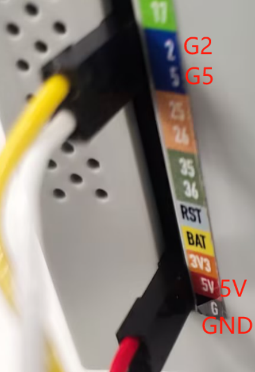
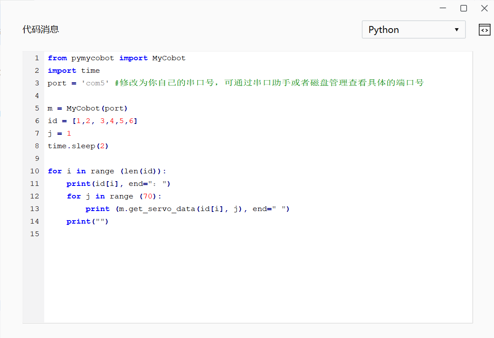

# 其他

**Q：mycobot test tool怎么用？**

mycobot test tool这个工具是出厂使用的，不建议用户使用，使用后可能会导致零位或者pid异常的情况，造成机器损坏，请直接删除此工具。
如果已经使用此工具导致机械臂运动异常，请参考下文重新调整pid及零位，并在后续使用过程禁止继续使用此出厂测试工具。
重置pid方法参考链接：
https://drive.google.com/file/d/1UWhaaSTuwLFImuEGY1J2tvgxTQDwWxK_/view?usp=sharing 
零位校准方法参考链接：
https://drive.google.com/file/d/1XtKH-ykKWPH0q9Z_YHwzkgwNKRhstHhi/view?usp=sharing 

**Q:垂直吸泵关闭吸泵后不泄气，吸附能够正常吸附但是程序运行结束了垂直吸泵的状态还是吸附是什么原因？**

A:
1. 率先排查GPIO口是否有接错现象，正确接法如图

Pi的接法


M5接法：



2. 确定上述没问题还是不行，可以尝试将代码中的高低电平调换，排查是什么原因

|  |  | 
|---------------|---------------|
| 图1 (源代码)     | 图2（修改后）     |

可根据修改后的代码排查关闭电磁阀和泄气阀门是高电平泄气还是低电平泄气，以此类推。

**Q：机器异常时如何重置成出厂设置？**

恢复成出厂设置主要在于固件、镜像、pid及零位的重置。以下为重置方案：
- **关于重置固件**：建议务必确保将mystudio更新最新版本，然后下载对应的最新Atom版本固件、minirobot固件（仅存在于M5系列机器）及pico固件（仅存在于320系列机型）重置固件的方法请参考gitbook的mystudio章节
  
- **关于重置镜像**：重置镜像时将清空原系统中的所有内容，如有重要文件，请注意提前保存，重置镜像的方法参考gitbook系统使用章节

- **关于重置pid**：一般情况下当机器出现关节严重抖动，关节动作速度异常，关节蜷缩在一起的情况下可重置pid，重置方法参考：https://drive.google.com/file/d/1UWhaaSTuwLFImuEGY1J2tvgxTQDwWxK_/view?usp=sharing 

- **关于重置零位**：一般情况下当机器出现零位不正确，关节限位异常可重新零位校准，重置方法参考：https://drive.google.com/file/d/1XtKH-ykKWPH0q9Z_YHwzkgwNKRhstHhi/view?usp=sharing 

**Q：urdf文件下载路径在哪里？**

- A：请参考以下路径，所有mycobot机型的urdf都在此路径中：https://github.com/elephantrobotics/mycobot_ros/tree/noetic/mycobot_description/urdf 

**Q:  使用蓝牙或者wifi功能的时候，无法控制机械臂怎么排查？**

A：M5机械臂支持支持三种通讯方式，分别是usb串口，wifi及蓝牙通讯，最为常用的usb串口通讯方式，在每种通讯方式使用前，需要确保将M5的LCD屏幕调到对应方式，并保持这个通讯状态，才能正常控制机械臂。

**wifi通讯模式**：使用python章节中的TCP/IP案例时，需要让M5的LCD屏幕保持在wifi通讯界面，如下图所示：


**蓝牙通讯方式**：使用手机APP控制时，需要让M5的LCD屏幕保持在蓝牙通讯界面，如下图所示：


确保通讯模式状态选择正确后，再次尝试控制机械臂

**Q：通过串口或socket通讯，经过机器人的控制器控制电机，指令传输延时多大？有通讯时序图吗？实时性如何？**

这边没有串口或socket通讯的延时测试数据，据我们这边开发使用反馈来看，实时性还是挺高的，不会出现很滞后的情况

**Q：280M5机械臂基座标系是怎么样的？**


**Q：280的关节是串口总线的控制方式吗？**

A:是的

**Q: 关于坐标的理解有更多的解释吗？**

A：控制坐标运动的API是send_coords([x,y,z,rx,ry,rz], speed)
**x、y、z 坐标：** 控制了机械臂末端执行器在空间中的位置。改变这些坐标值将使机械臂移动到不同的空间位置，从而实现在三维空间中的定位。
**rx、ry、rz 姿态角度：** 控制了机械臂末端执行器的姿态或朝向。这些值通常以欧拉角的形式给出，描述了机械臂末端执行器相对于基坐标系的旋转，欧拉角顺序是zyx。改变这些值将使机械臂的末端执行器旋转到不同的角度或方向。
例如：
当你调整 +X 时，这表示在当前机械臂末端执行器的位置沿着当前末端执行器的 X 轴正方向移动一定的距离。这个动作会导致机械臂整体向某个方向移动。而当你调整 RX 时，这表示在当前机械臂末端执行器的姿态绕当前末端执行器的 X 轴旋转一定的角度。这个动作会导致机械臂整体发生旋转，末端执行器的方向会发生改变。
综合来看，+X 和 RX 的调整都会直接影响机械臂的运动状态，+X 控制位置的移动，而 RX 控制姿态的变化。
如果你更直观的看到变化，我们建议你使用myblockly的串口控制工具，单次调整一个参数，观察其在坐标系中的变化，请注意在观察rx、ry、rz 的时候如果想更加直观，请注意调整J1关节为0的时候调整x，ry，在关节为90时，调整y和rx
你可以参考下文的坐标系图示：


**Q: 关于DH参数的Offset 有更多的解释吗？Offset 是绕z旋转吗?**

A:DH参数描述了机械臂中相邻连杆之间的几何和运动关系。
在DH参数表中，Offset参数表示前一个连杆绕其z轴旋转对下一个连杆位置的影响，即连接两个连杆时的偏移量。对于机械臂中的Offset参数，一般表示上一个连杆绕自己的z轴旋转对下一个连杆位置的影响，而不是绕下一个连杆的z轴旋转。因此Offset不是绕z旋转，而是表示连接两个连杆时的位移。

**Q: 280机械臂供电的电压区间范围是多少?瞬间电流有多大?**
A: 12V  正负10%，5A

**Q: 280M5的J1关节内径是多少？**
A:70mm

**Q: 为什么280m5的这个DH模型中的F1处，定义了两个坐标系？**


**Q:承接上面的问题，为什么1-2轴实体距离不一样，但是原点设置是重合的呢**

A:因为旋转轴相交，DH建模有规定，如果相邻关节的旋转轴相交，那原点要定在交点上

**Q：请问如果对各轴舵机进行角度控制和反馈获取，最短的通讯周期可以做到多少？**

A：这个需要根据速度决定间隔时间，最低响应时间是50ms

**Q：mycobot系列机器有碰撞检测吗？**

A：280带算法碰撞自干涉，已经集成到设置关节角度及坐标的API里了

**Q:Atom的usb接口输入参数是多少？**

A:5V @ 500mA

**Q：270 j3关节无法实时显示关节值如何处理？**

A：参考链接：https://drive.google.com/drive/folders/1BrvMxJltcLsr8T8-4kKOB7SH0D_qZkIP?usp=sharing 
其中对应的固件已经完成了替换，可直接运行对应python文件

**Q:vnc拖拽卡顿怎么处理？**

A: 如果是由于在vnc中拖动任何窗口造成的卡顿断连，可以按照下面的图片做一些配置，选项需要与下面的图片一致。成功设置后，将解决由于拖动窗口导致VNC断开的问题。


**Q：更换280的第2个关节，发现4颗螺丝滑丝了怎么拆出来？**

关于关节的替换问题，那4个螺丝可以不必拆卸，请拆卸中间那颗大螺丝，然后将J2关节主体固定回去，然后用力将整个连轴件一并抽取出来即可，具体操作我为你录制了一个视频，你可以参考

**Q:关节扭矩信息提供吗？**

A:我们的机器都只提供整体关节的整体信息，不提供舵机、电机执行单元的内部扭矩、电压电流等参数信息，公开的是机械臂整体参数，如重复定位精度，电源电压等等


**Q:下图中的查看看两坐标之间的关系怎么理解？**


A: 指的是如果你想查看名为 "turtle1" 的坐标系相对于名为 "turtle2" 的坐标系的变换关系，可以使用这个指令，通俗一点来说就是当你运行这个命令时，它会告诉你一个物体（"turtle1"）相对于另一个物体（"turtle2"）的位置和方向信息。就像在地图上你可以知道一个城市相对于另一个城市的位置一样

**Q:ROS2的环境被不小心改动，我可以直接删掉280pi的ROS，自己重新安装吗？**
A:关于ROS重新安装这个问题，我们不建议用户自己重新安装，因为ROS环境的搭建会相对复杂，容易出错，如果需要重置ROS环镜，我们建议用户重新刷写系统镜像，具体方法请参考 [基于ROS开发使用](https://docs.elephantrobotics.com/docs/mycobot-ar-cn/12-ApplicationBaseROS/)

**Q：主机如何将文件传输到虚拟机中**

A:按下图设置共享文件夹，可以将PC中的文件传输到虚拟机中


**Q:同一个位置，机械臂到位以后，重复定位偏差过大怎么解决？**

新旧机器都可以通过调pid，尽可能减少偏差，

附：https://docs.qq.com/doc/DU0VhT2JNVUdNUEJS，https://drive.google.com/file/d/1UWhaaSTuwLFImuEGY1J2tvgxTQDwWxK_/view?usp=sharing
但是旧版机器因为机械臂的2、4关节存在齿轮间隙，容易在重力的作用下产生关节偏差，最终影响末端精度，这四组关节值中2、4关节的受力不一致，所以精度也不太一样。目前建议通过程序进行调整，当机器到达点位后，可以在此点位再读一次点位，检查如果存在偏差，在此基础上再单关节调整具体偏差值，以达到到达指定点位的效果。

**Q:API和串口指令直接控制关节有什么区别？**

API 提供了简化、抽象化的接口，使开发更高效和容易，适合快速开发和集成。
串口指令 提供了直接、底层的控制，适合需要精细调整或开发自定义功能的场景，但通常开发和调试更复杂。
总得来说：
使用串口指令直接控制机械臂更加灵活，但也更加复杂，需要对通信协议有深入的了解；而使用API控制更加简单方便，但可能会受限于API提供的功能和性能。

**Q:windows运行git指令报错**


A:这是没有安装git导致的，需要先安装了git，再使用git指令

**Q: 280M5在使用arduino的时候如果使用垂直吸泵是无法使用2，5这俩IO口的这俩io口被串口占用了，使用别的io口就可以控制了，可以根据下面的代码进行控制使用。**

```python
#include <MyCobotBasic.h>

void setup()
{
  pinMode(1,OUTPUT); 
  pinMode(3,OUTPUT); 
  
}

void loop()
{

  delay(100);
  digitalWrite(1,1); 
  delay(100);
  digitalWrite(3,0); 
  delay(100);
  digitalWrite(1,0); 
  delay(100);
  digitalWrite(3,1); 
  delay(1000);

}
```

**Q：MDI和JOG的区别是什么？**

A: MDI（Manual Data Input）称为设定值直接给定运行方式。即上位控制器直接设 置目标位置、速度、加减速度后，轴自动移动到目标位置的定位方式。MDI 也是 实际应用中最常使用的一种定位功能。
JOG朝某一方向连续移动。

**Q: 海外的维修政策表格**


**Q:各个机型pymycobot的最新支持版本是什么？**


**Q: DH表 如何区分标准和改进**

sdh，std，标准   mdh，modify，改进
我们提供的是标准DH表，客户如果需要可以自己去转化，只是两种不同的描述方式。


**Q:报错缺少opencv_camera,如何处理？**


A:报错是显示缺少可执行权限，可能需要添加权限


改为用mycobot_280的，不需要用pi本身的了，因为m5那边占用有文件了，两边不能同时占有，否则会造成后面的编译失败。


**Q:数据传输速度怎么看？**
A：使用以下代码：

```python
import time
from pymycobot.mycobot import MyCobot
mc = MyCobot("COM8",115200, debug = True)
while 1:
    mc.get_angles()
```


write表示下发的获取指令，read是返回的消息，左侧是时间。这里显示518write +611read，表示约100ms完成了一次get_angles的读取，频率是10hz。

**Q:适配器指示灯不亮**

A:有可能是短路后适配器自我保护断电了，适配器断开几分钟再使用。几分钟不行就再久一点15分钟后单独给适配器上电看亮不亮。

**Q:机械臂某一关节无法运动，如何处理？**

A:可以通过python脚本，循环读角度，然后手动的去转动该关节，看角度有没有变化。
如果有返回值排查以下几点，蒋信息返回给技术支持人员。
1、get_servo_status查看J2舵机有没有欠压/过压等硬件问题
2、手动转动J2看有没有明显阻力，对比其它关节；单独给J2上使能focus_servo(2)
3、脚本，查看参数有没有问题。



**Q：末端零位异常**

A:长时间使用自适应夹爪夹取物品后会出现夹爪和末端零位异常的现象，需要将夹爪静止。

**Q：什么的是正向运动学和逆向运动学？**

A：正向运动学（Forward Kinematics）是指已知机器人各个关节的角度（或位移），求解机器人末端执行器（如机械臂的手爪）在笛卡尔空间中的位置和姿态。get_coords()的API中实现了，但是具体的算法不公开。
逆运动学（Inverse Kinematics）与正向运动学相反，它是指已知机器人末端执行器在笛卡尔空间中的位置和姿态，求解机器人各个关节的角度（或位移）write_coords()、send_coords()
