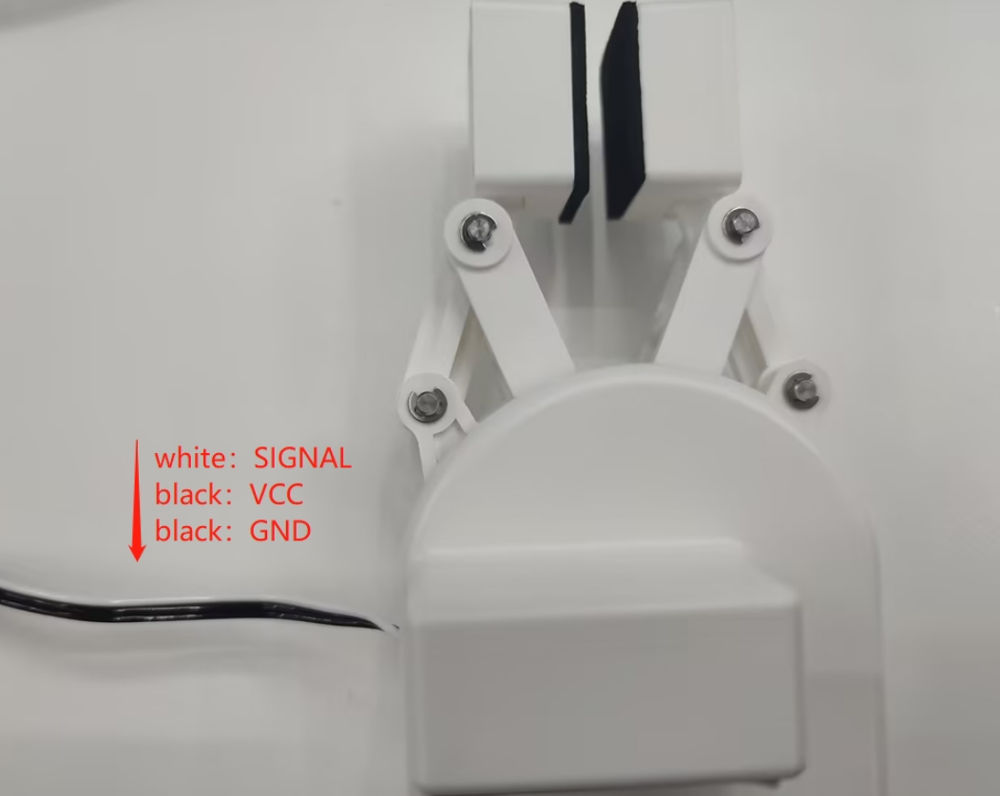

# 配件相关问题

**Q: 280M5与吸泵2.0的io连接示意图及快速使用源码**

- A:新版v2.0版本myblockly源码如下：
    

    吸泵上的G5引脚为吸泵开关控制引脚，G2标签为电磁阀控制引脚。均为低电平有效。
电磁阀的作用是使吸泵在释放的时候更加迅速，如在未使用电磁阀的情况下，吸泵也是可以正常工作的，只是关闭吸泵时释放物体的速度相对较慢。
源码此处使用G5号引脚控制吸泵的开合，使用G2号引脚控制电磁阀的开合，电磁阀开合主要工作在关闭吸泵阶段。
注意此处吸泵与机器端指定连接的引脚不是固定的，在机器端，G2和G5引脚不是唯一选择，可更换至机器上其他任意2个普通GPIO进行控制，但在更改控制引脚的时候需要注意吸泵端的G2和G5引脚功能说明-吸泵端G5标签对应的引脚为吸泵开关控制引脚，G2标签为电磁阀控制引脚，均为低电平有效。
如下面源码使用GPIO18、19控制吸泵，其中选中G19连接吸泵的G5用于控制吸泵开合，另外的G18则连接吸泵的G2引脚，用于控制电磁阀。

    

**Q：mycobot自适应夹爪的引脚线序与连接方式是怎样的？**

mycobot自适应夹爪的引脚介绍参考下图：

夹爪连接方式：

**Q：平行夹爪的使用源码**

**Q：关于夹持物体与机械臂运动之间有什么需要注意的吗？**

当负载 > 500g时，速度需要低于 50%。
