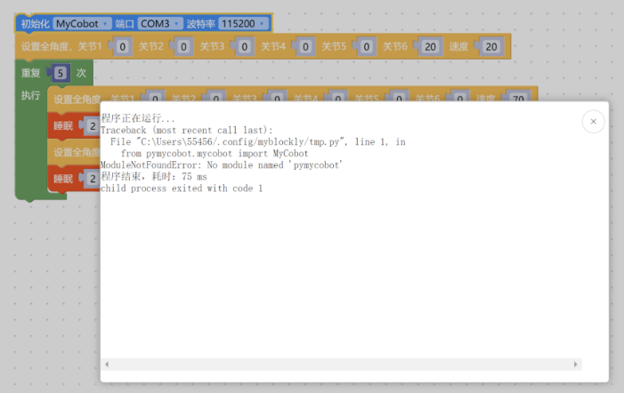
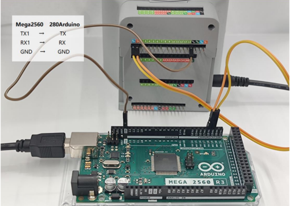
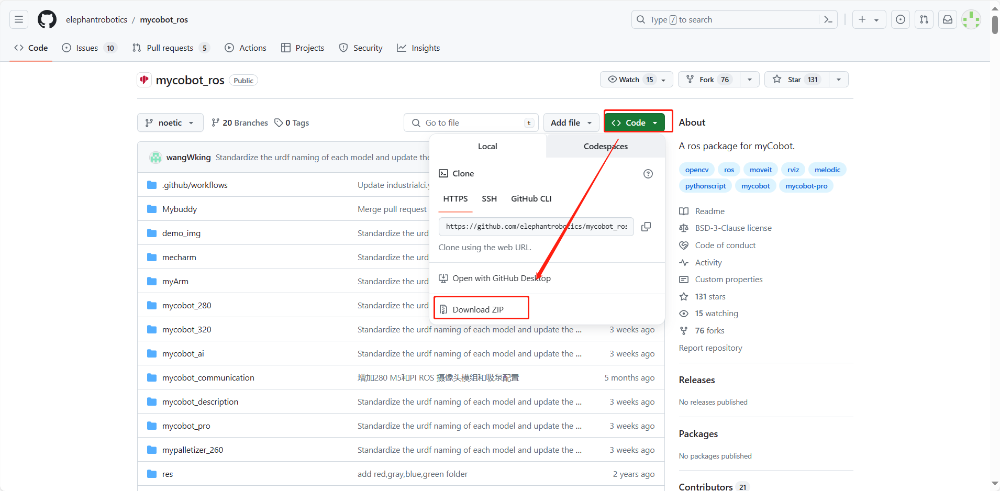

# 软件问题

## 1 myStudio相关

**Q：myStudio是什么？**
- A: 是我们公司自研软件。它是一款给我们公司推出的现有机械臂进行固件烧录或修改的工具。


**Q：minirobot、Atom、PICO固件下载异常排查方法是什么？**

1. 检查网络连接是否正常，下载固件的过程中是需要连接网络先下载固件的。
   
2. 检查线路是否已经连接完成，细节如下：
   在M5/Arduino系列机器中，烧录Atom固件时，需要使用USB线将末端的Atom接口与电脑的usb口连接；M5系列机器在烧录nimirobot固件时，则使用USB线将M5stack的侧面接口与电脑的usb口连接即可。

3. 选择对应机型的固件，不要选错其他机型的。
   
4. 下载并安装驱动，如果下载驱动后仍然无法识别，可尝试更换最新的 [ch340驱动](https://www.wch.cn/download/CH341SER_EXE.html) ，如果安装了驱动之后仍然无法显示端口号且系统为win11机型，可尝试 [Win11系统装CH340驱动方法](https://blog.csdn.net/m0_52242552/article/details/126219464)。
   
5. 尝试换一个usb线缆、usb端口或者电脑下载试试，避免线缆不具备数据传输功能导致固件下载异常。
   
6. 卸载mystudio，重新将mystudio安装在非C盘位置试试，例如将mystudio安装在D盘。在mystudio安装在C盘时，对文件权限要求相对苛刻，可能会出现固件无法烧录的情况。

**Q:280arduino无法烧录固件如何处理？**

A：我们已经验证正版Arduino mega2560固件是可以正常烧录mystudio固件的，验证视频如下：
https://drive.google.com/file/d/1C7OhUlgkG05WX0LcPSollQZ0Vj-yJZhS/view?usp=sharing 

针对你的arduino mage2560板子无法烧录烧录固件的情况建议你检查以下几点：
1. 检查网络连接是否正常，下载固件的过程中是需要连接网络先下载固件的。
2. 在烧录固件时，断开mycobot280Arduino与mega2560之间的tx、rx引脚连接，在下载固件是会存在串口冲突，存在无法正常烧录固件的情况，请在烧录成功后再连接tx、rx引脚。
3. 尝试在进入mystudio之后再重新拔插一下usb端口，重新烧录。
4. 尝试在烧录mega固件的时候，按一下arduino主板上的复位按键试试。
5. 卸载mystudio，重新将mystudio安装在非C盘位置试试，例如将mystudio安装在D盘。在mystudio安装在C盘时，对文件权限要求相对苛刻，可能会出现固件无法烧录的情况。

如果上述方法均不起作用，那可能是你的Arduino mega2560主板与mycobot280Arduino固件不兼容的原因，你可以考虑更换其他mega2560主板下载固件或直接使用UNO主板的arduino开发方式控制机械臂。

**注意：** 在使用UNO主板时，不需要使用mystudio下载固件，可以直接使用Arduino IDE开发方式可烧录对应的案例代码控制机械臂，只有使用mega2560及WIFI1010主板控制机械臂时才需要使用mystudio下载对应的固件

## 2 myblockly相关

**Q: 遇到报错信息：ModuleNotFoundError: No module named “pymycobot”，如何处理？**



- A: 报错提示缺少pymycobot文件的包括原因及解决方法参考下文3点：
①没有安装pymycobot或者pymycobot出错，对应的解决方法是重新安装pymycobot，指令是pip3 install pymycobot --upgrade --user
②如是M5或AR系列机器，需注意在安装python的过程中没有勾选下图的“Add Pythonxx to PATH”，需要卸载python后重新安装python，并将此选项勾选


③如是M5或AR系列机器，请确认PC中是否有多个python版本，建议卸载PC内所有python版本重新安装一个python3.8以上的版本，注意保持在PC中有且仅有一个python3.8以上版本。如实际使用需要多个python版本，请指定pymycobot使的python版本并在调用pymycobot库时指定python运行的版本

**Q：280arduino与mega2560板子一起使用，无法正常使用myblockly控制关节，运动及读取都无响应，如何处理？**

- A：下载myblockly1.4.4版本，或在使用最新版myblockly时，注意在用开发板Arduino MEGA2560，积木块控制机械臂时，需要使用者手动添加延时积木块，后再发指令，使用快速移动工具则需要打开串口后间隔1s再发送指令

  

**Q:  myblockly的快递移动工具无法显示实时角度怎么处理？**

- A:这个一般是由于设备串口信息选择错误、pymycobot异常导致的，建议根据本文的"首次使用自查"方案进行排查，如未能正常控制机械臂，请尝试更新pymycobot，对应更新方案是在cmd或者终端中输入指令`pip install pymycobot --upgrade --user`
最后如果仍然无法正常控制，请尝试更新myblockly软件，更新方法请参考下面的链接：
https://drive.google.com/file/d/1yBWzhbSBUYsZPBl7PBdZKRwk3al71Dc7/view?usp=sharing 

**Q：运行程序结果显示 child process exited with code 1，正常吗？**

- A: 这个不是报错。是全部的程序都运行结束返回了二进制数字1。代表已经全部顺利运行完成。

**Q：如何在myblockly中预设代码块内容，包括进入系统后机型、波特率等信息都是对应接入的机型的？**

- A：目前在myblockly中初次启动默认的机型是mycobot、波特率115200，暂时没有更改初始波特率的方法，但是你可以自己制作保存一个初始化的json文件，下次进入myblockly后加载此文件可得到预设的代码块。
制作及保存json文件的方法请参考下文：https://drive.google.com/file/d/1g_dd933TK1tptnisUad4PBfwSRsWWFeQ/view?usp=sharing 

## 3 RoboFlow相关

**Q：无法下载Roboflow软件，Roboflow无法正常控制机器如何处理？**

- A：目前Roboflow软件仅支持600/630这两款Pro 专业协作，不再支持mycobot协作型或其他型号机器，mycobot系列机器建议使用的控制方式是myblockly、python及ros，值得一提的是，myblockly是一款与Roboflow图形化界面相似的软件，如果您需要使用可视化图形编程可优先考虑使用myblockly软件。
	​				
## 4 Python相关

**Q：运行提示缺少库文件Q:遇到报错信息：ModuleNotFoundError: No module named “pymycobot”，如何处理？**

- A1：没有安装pymycobot，对应的解决方法是重新安装pymycobot，指令是`pip3 install pymycobot --upgrade --user`

- A2: 在安装python的过程中没有勾选下图的“Add Pythonxx to PATH”，需要卸载python后重新安装python，并将此选项勾选。
  
- 
  
- A3: 如是M5或AR系列机器，请确认PC中是否有多个python版本，建议卸载PC内所有python版本重新安装一个python3.8以上的版本，注意保持在PC中有且仅有一个python3.8以上版本。如实际使用需要多个python版本，请指定pymycobot使的python版本并在调用pymycobot库时指定python运行的版本。

- A4：建议使用3.9版本的pyhton，pyhton12会出现不兼容的情况。

**Q：send_coords(coords, speed, mode)中的mode有没有通俗一点的解释？**

- A：线性1代表机械臂末端以直线的方式抵达目标位置，如果因为限位、结构等原因无法走直线，那指令就不会完全执行；
线性0表示末端以任意姿态抵达目标位置，由于没有直线的限制，不容易出现指令不执行的现象。

**Q：set_fresh_mode(mode) 的插补和刷新模式有什么区别？**

- A: 插补0是指起始点和终止点之间规划了很多密集的点位，从而达到控制中间段轨迹的效果。
如何达到程序并行的效果：非插补1就是没有中间段的规划，控制不了轨迹，但是运动会相对平滑。

**Q：在仅改变Z轴的情况下，轨迹不是直上直下的，但是最后落点是只改了Z轴，这个正常吗，如何确保中间轨迹也是直线？**


- 开插补走直线就能确保轨迹了
  ```python
  set_fresh_mode(0) # 开插补
  send_coords(coords, speed, mode=1) # 走直线
  ```

注意一定要开插补之后，在send_coords设置的智能规划路线才有用。
插补是指起始点和终止点之间规划了很多密集的点位，从而达到控制中间段轨迹的效果。
非插补就是没有中间段的规划，控制不了轨迹。

**Q：get_error_information()的返回值为-1是什么意思？**

- A：`get_error_information()`的返回值为-1，表示无法正常通讯，你需要检查电源适配器及usb线是否连接，检查LCD屏幕是否停留Atom：ok界面，如果线路未连接成功，且未显示ok均会出现通讯异常的情况，需要重新连接再测试。

**Q：用280机器的绘制案例是发现形状轨迹不是很直，能优化吗？**

- A1：使用签字笔硬质文具等来用这个绘制案例，得到轨迹有偏差这是正常 的。这种偏差主要有2个原因造成，一是由于mycobot使用的是伺服舵机，有一定的精度偏差（如果是使用时间较长的机器，由于关节老化，其关节的偏差会更大），二是在使用硬笔在绘画时跟桌面接触距离比较苛刻，距离过高轨迹容易产生轨迹中断，距离过低会出现笔尖阻力过大卡顿的问题，所以绘制出来的效果并不理想。目前建议使用软质文具进行绘画，例如毛笔毛刷等工具，这对改善绘画效果有一定帮助。

- A2：另外，你可以将机械臂的运动模式更改成插补模式，这样运动轨迹会相对平直。

  ```python
  set_fresh_mode(0) # 开插补
  send_coords(coords, speed, mode=1) # 走直线
  ```

  注意一定要开插补之后，在send_coords设置的智能规划路线才有用。
插补是指起始点和终止点之间规划了很多密集的点位，从而达到控制中间段轨迹的效果。

**Q:识别到的目标位置，末端无法到达，怎么判断这个坐标是否可以到达然后处理？**

- A：solve inv kinematics(target coords, current_angles)用这个接口看是否有解就可以了。
  solve_inv_kinematics(target_coords, current_angles)
  - 功能 : 将坐标转为角度。
  - 参数：
    - target_coords: list 所有坐标的浮点列表。
    - current_angles: list 所有角度的浮点列表，机械臂当前角度
  - 返回值: list 所有角度的浮点列表。

## 5 Arduino相关

**Q:Arduino使用UNO能不能使用串口控制**

- A：能，接TX、RX，使用串口指令可进行控制

**Q:Arduino如何使用串口控制？**

- A：在不带任何主控板的情况下，接一个usb转ttl模块（TX、RX、GND）,可使用串口助手工具控制发送我们提供的串口指令，实现控制关节运动等功能


在使用时需要注意，选用波特率：1000000及对应的端口


在使用机器人自由模式(关闭所有扭力输出)串口发送示例：FE FE 03 1A 01 FA时，注意当Atom灯变黄色之后，需要按住Atom按键才能进行关节移动


**Q：280arduino支持的控制方式**

- A：280Arduino支持：
Arduino mkrwifi1010，mega2560， UNO，等多种支持UART串口通讯接口模块的开发版扩展。
其中UNO由于硬件的接口有限，无法使用Python控制，需要用Arduino IDE控制，且uno板子是通过杜邦线连接到arduino板子上的，不能直接插。

**注意：** 目前的280AR串口波特率改为1000000，不同开发板的接线不同：

|   开发板类型   |           波特率           |   控制方式   |  接线方式  |  接线图  |
| :------: | :----------------------: | :----------------------: | :-----------------: | :---------: |
|   mega2560   |      1000000      | python/MyBlockly |TX0-->RX、RX0-->TX、GND-->GND      |  |
|   mega2560   |      1000000      | Arduino IDE |TX1-->RX、RX1-->TX、GND-->GND      ||
|   UNO   |      1000000      | Arduino IDE |tx-->tx RX-->RX、GND-->GND      ||
| mkrwifi1010 |           1000000           | 暂无    |  暂无| 暂无|


## 6 ROS相关

**Q：有没有配置好环境的虚拟机镜像？**

- A：我们有提供一个配置好ROS1及ROS2环境且内置ROS源码的虚拟机环境，用户可以通过下面这个链接下载，并将虚拟机文件导入VirtualBox，省去自己配置环境的麻烦，当测试ROS案例时建议使用我们已经配置好的虚拟机环境进行验证，避免由于环境配置的原因导致的一些案例运行报错
请参考虚拟机文件导入虚拟机软件的操作步骤视频：https://drive.google.com/file/d/1KeYk_CUgDE46rVn7zbd0EhraIbgt3qZt/view?usp=sharing

  [ROS1虚拟机文件下载](http://download-elephantrobotics.oss-cn-shenzhen.aliyuncs.com/system_images/ubuntu20.04_ROS1_V20230731.ova.zip) 

  [ROS2虚拟机文件下载](https://download-elephantrobotics.oss-cn-shenzhen.aliyuncs.com/system_images/ubuntu20.04_ROS2_V20240228.zip)

  [虚拟机软件VirtualBox下载](https://www.virtualbox.org/wiki/Downloads)

**Q：导入ROS2虚拟机文件的时候报错怎么处理？**


- A: 这是因为虚拟机软件Oracle VM VirtualBox版本过低导致的，需更新虚拟机软件版本。

**Q：如何重新下载ROS源码包？**

- A：使用指令拉取：
  
  ```bash
  git clone https://github.com/elephantrobotics/mycobot_ros.git
  ```

  或着手动下载，下载方法进入到ROS源码包地址按照下图进行操作，源码包地址：https://github.com/elephantrobotics/mycobot_ros

  


**Q: 运行ROS moveit案例发现报错ImprotError：No module named yaml咋办？**


- A：在这个脚本开头第一行，把Python解释器改为python3

**Q：运行虚拟机找不到串口怎么处理？**

- A:使用USB线将M5机械臂与PC连接，打开虚拟机设置→USB设备→添加USB设备→选择串口号QinHeng xxxxx，这个就是机器的串口设备。
如果没有这个设备号，可以通过重新拔插设备获取对应的USB设备号，拔插有串口变化的即对应的机器串口设备号

  

**Q:使用基于mujoco的环境进行仿真训练，因此需要机器人的xml文件**

- A:目前GitHub上只有280JN的xml文件：[280JN](https://github.com/elephantrobotics/mycobot_mujoco) 
- 提供给客户如何将dae、urdf类型的文件转换成xml文件的方法给客户，让客户用[meshlab自行转换]([https://blog.csdn.net/qq_43309940/article/details/128292151?spm=1001.2101.3001.6650.1&utm_medium=distribute.pc_relevant.none-task-blog-2defaultCTRLISTRate-1-128292151-blog-131092562.235^v38^pc_relevant_yljh&depth_1-utm_source=distribute.pc_relevant.none-task-blog-2defaultCTRLISTRate-1-128292151-blog-131092562.235^v38^pc_relevant_yljh&utm_relevant_index=2)。

**Q：终端切换到~/catkin_ws/src中使用git安装并更新mycobot_ros时，出现目标路径"mycobot_ros"已经存在，原因是什么？**
- A：说明`~/catkin_ws/src`中已经存在一个`mycobot_ros`程序包，需要提前将其删掉，再重新执行git操作即可。

**Q：rosrun运行时，终端报错显示`counld not open port /dev/ttyUSB0：Permission: '/dev/ttyUSB0'`，是为什么？**

- A：串口权限不够，终端输入`sudo chmod 777 /dev/ttyUSB0`赋予权限。

**Q：rosrun运行时，终端提示`Unable to register with master node [http://localhost:11311]: master may not be running yet. Will keep trying`的原因是？**

- A：运行ros程序前，需开启ros节点，终端输入`roscore`。

**Q：rosrun运行时，终端报错显示`counld not open port /dev/ttyUSB0：No such file or directory: '/dev/ttyUSB1'`，是为什么？**

- A：串口有误。需确认当前机械臂的实际串口。可通过`ls /dev/tty*`查看。

**Q：在Ubuntu18.04中进行`catkin_make`构建代码失败,终端提示`Project 'cv_bridge' specifies '/usr/include/opencv' as an include dir, which is not found.`等报错信息**

- A：配置文件中的opencv路径与系统实际路径不相符。需使用sudo修改配置文件（路径为`/opt/ros/melodic/share/cv_bridge/cmake/cv_bridgeConfig.cmake`），系统实际opencv路径位于`/usr/include/`路径下。


**Q：刚克隆下来的mycobot_ros程序包，然后直接运行rosrun程序，出现`package 'mycobot_280' not found`的错误或者找不到该文件之类的错误？**

- A：刚克隆下来的mycobot_ros需要构建代码进行ros环境编译。终端输入
  
```bash
cd ~/catkin_ws/
catkin_make
source devel/setup.bash
```

**Q：编译完成后，新开终端运行launch指令时，为什么会出现下面的错误？**

   


 - A1：系统没有添加ros环境变量，所以每次开启新终端都要source：

```bash
cd ~/catkin_ws/
source devel/setup.bash
```

- A2：系统添加ros环境变量，每次开启新终端后无需执行source：

```bash
# noetic为Ubuntu20.04系统
echo "source /opt/ros/noetic/setup.bash" >> ~/.bashrc
source ~/.bashrc
```

- A3：可能是指令中的文件名与实际中mycobot_ros包里面的文件名不一致，请仔细检查指令是否有误。

## 7 C++相关

**Q：找不到各种dll文件怎么处理？**

- A1：如果myCobotCpp.dll缺失，将之前放到lib目录下的myCobotCpp.dl放到mycobotcppexample.exe所在目录下.
- A2: 如果报缺少QT5Core.dll，打开qt command (菜单栏搜索QT) ，选择msvc2017 64-bit，执行windeployqt--release myCobotCppExample.exe所在目录(如: windeployqt --release D:lvs2019myCobotCpploutlbuildlx64-Releaselbin) 此处执行命令后如果报找不到vs安装路径，请检查vs环境变量的设置.

以上步骤执行后，如果报缺少qt5serialport.dll文件，将gt安装目录处的此文件(路径如: D:lgt5.12.1015.12.10msvc2017 64bin)，拷贝到myCobotCppExample.exe所在目录

**Q：生成myCobotCppExample.exe可执行文件，这个有可能是什么问题？**

选择下图中的启动

