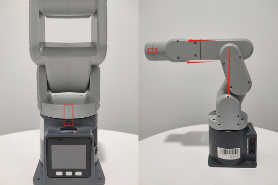

# 硬件问题

**Q：M5屏幕无法显示画面，如何解决？**

1. 检查电源适配器与机器是否接触良好，可以尝试重新拔插一下电源适配器
2. 轻轻按压屏幕边角，让M5satck与内部扩展板接触良好

3. 查看gitbook，下载对应的minirobot固件，注意如果是2021年280m5，建议刷AtomMain2.8的,basic1.0

4. 可以拆开底座螺丝查看内部线缆是否有脱落，如有，请接上后再使用

**Q：机械臂上电锁不住如何解决？**

1. 检查是否有接上原装电源适配器，或者适配器是否接触良好，可以尝试重新拔插电源适配器

2. 检查关节在断电状态，能否正常转动，会不会出现阻力过大或者过小的情况，初步判断是否内部结构物理断裂，无物理断裂则接着往下检查.

3. 检查Atom固件，方法如下：

   在正常情况下，机械臂上电后会自锁，且Atom亮绿灯，如下图所示（注意mechArm无灯态显示）

   

   在机械臂上电后，Atom不亮绿灯或者关节无法自锁，可按照以下几点进行排查：
   ①轻轻按压Atom屏幕，使Atom与机械臂内部板块接触良好。

   ②查看gitbook获取mystudio使方法，根据机型及版本信息，使用mystudio下载对应的Atom固件，如在烧录过程遇到任何问题，请参考本文mystuidio相关"固件下载异常"获取排查步骤。

   ③在成功烧录Atom固件且机械臂未连接电源的情况下，使用type-c连接Atom，若Atom亮起绿灯，但拔掉type-c后Atom绿灯熄灭，则判断为判断为Atom正常，但机械臂内部存在线路脱落或损坏问题，需要联系技术人员处理。

   ④在成功烧录Atom固件且机械臂未连接电源的情况下，使用type-c连接Atom但是没亮绿灯，则判断为Atom硬件损坏，需要联系技术人员更换

**Q：按下急停后，释放急停锁不住了，怎么让机械臂再次锁住？**

需要给机器重新上电，例如以myblockly给机器上电

**Q: 关节抖动、关节角度偏差过大或关节无力下坠如何优化？**

1. 参考机器人参数介绍章节，检查实际负载是否在机械臂有效负载范围内，负载过大会导致关节抖动，可适当减轻实际关节的负载

2. 将运动模式更改成刷新模式，这样会机械臂的运行轨迹会相对平滑，具体的API，请参考
set_fresh_mode(1)

3. 查看以下链接内容调整pid：https://drive.google.com/file/d/1UWhaaSTuwLFImuEGY1J2tvgxTQDwWxK_/view?usp=sharing
4. 查看gitbook章节，使用mystudio下载对应版本的Atom固件，建议下载最新的
5. 查看gitbook第5章节，对机械臂进行零位校准，也可参考下面链接的校准步骤：https://drive.google.com/file/d/1XtKH-ykKWPH0q9Z_YHwzkgwNKRhstHhi/view?usp=sharing
6. 使用时间较长的机器(3个月以上)可能会出现关节老化产生关节间隙的情况，可按照以下视频，手动掰动关节，查看是否存在关节虚位：https://drive.google.com/file/d/1tXDUALmfw1z0u6lM9uH5hOHivjbRoWxW/view?usp=sharing
7. 如果存在关节老化虚位问题，这种抖动则属于机器自然老化无法避免。

**Q: 什么是关节零位点？**

以下图为例，关节与关节外壳边缘之前会设计有一个拱形槽，这个就是关节零位点

一般校准后零点姿态如下：

特别注意270的关节零位姿态如下：

**Q：有没有零位校准的方法？**

请参考gitbook第5章节或者下面这个链接：

https://drive.google.com/file/d/1XtKH-ykKWPH0q9Z_YHwzkgwNKRhstHhi/view?usp=sharing

**Q：G36的IO口是没法用吗，为什么用万用表测量没有电压返回？**

- A：basic上的36可以用，被定义成了输入引脚，如果客户需要测试IO是否可以使用，能够让客户自行修改basic的固件代码，固件是开源的，客户自己写个程序，单控io的

**Q: myCobot的关节的限位？**
- A: 一轴和五轴有限位，一轴顺时针约165°左右，逆时针165°左右。五轴可时针、逆时针可转动约165°

**注意：转动机械臂时应小角度、轻轻地转动，到达限位后就不可用力继续转动。**

**Q：atom在机械臂中的作用是什么？**

- A：atom在机械臂中主要进行机械臂的运动学算法控制：包括了正逆运动学，选解，加减速，速度同步，多次方插补，坐标转换等，需要的实时控制与多线程等。atom的相关程序暂不开源。

**Q：不同版本的机械臂支持什么通信接口？**

- A：基于微处理器的机械臂支持socket通信TCP；基于微控制器的机械臂可以USB转串口通信。

**Q：电机使用过程中自动断电，是为什么？**

- A：使用时间较长电机过热保护。此现象是正常现象，等待几分钟后即可继续使用。

