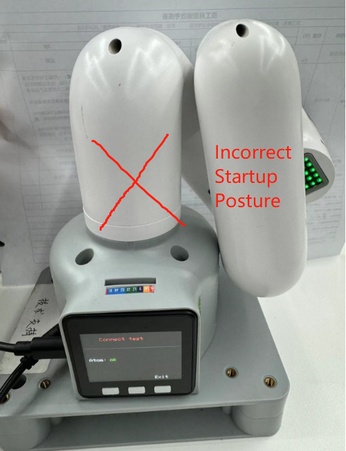

# 首次使用自查-机器关节功能验

>> **注意:** 在机械臂启动时，请注意不要让机械臂处于蜷缩或者关节之间触碰的姿态，建议启动时,机械臂姿态应如下图1所示，图2、图3均为错误启动姿态：

|  |  |    |
|---------------|---------------|---------------|
| 图1 (正确姿态)     | 图2（错误姿态）     |  图3（错误姿态）      |

## 关节控制方法步骤

### 1.进行硬件连接

 - AR系列机器的硬件连接：
  
    AR系列机械臂需要确保接上电源适配器、usb数据线。

### 2.进行软件环境安装与配置

使用AR版本机器需要自备一台电脑。在电脑上安装python、pymycobot库及usb串口驱动，具体请参考gitbook的环境配置章节。

### 3.USB通讯示例

请使用myblockly或者python源码案例进行机械臂关节运动验证。

**特别注意使用usb串口开放方式需要选择对应串口及波特率，才能使机械臂与电脑正常通讯，从而正常控制机械臂：**

| 机器型号       | 串口号 |  波特率  |
| :-----------: | :---------: | :---------: |
| 260 M5         | Win: COM; Linux: /dev/ttyUSB | 115200 |
| 270 M5         | Win: COM; Linux: /dev/ttyUSB | 115200 |
| 280 M5         | Win: COM; Linux: /dev/ttyUSB | 115200 |
| 280 AR         | Win: COM; Linux: /dev/ttyUSB | 1000000 |
| 280 PI         | /dev/ttyAMA0 | 1000000 |
| 280 JetsonNano         | /dev/ttyTHS1 | 115200 |
| 320 M5         | Win: COM; Linux: /dev/ttyUSB | 115200 |
| 320 PI         | /dev/ttyAMA0 | 115200 |
| 280 PI         | /dev/ttyAMA0 | 1000000 |
| 270 PI         | /dev/ttyAMA0 | 1000000 |

**注意：** 关于AR系列机器的COM口的选择，需要根据当前个人电脑识别的端口号进行实时选择，因为每个人电脑识别到的COM口号都可能不一样且不固定的，具体选择的方案可以在本文档查看“Q：为什么选择某个com口的时候会被拒绝连接？或者说怎么找到对应的com口？”的答复

#### 3.1 机械臂关节运动myblockly源码


当你看到机械臂的关节1在0-90度循环运动3次效果，说明机械臂关节1响应正常，可尝试更改关节ID测试其他关节及循序渐进学习使用gitbook的其他案例或者利用机械臂做各种有趣的事情！
指的一提的是，如果你目前对myblockly的代码块开发方式并不熟悉，还有一个相对快捷的关节验证方式是：使用myblockly快速移动工具进行简单的关节运动控制，具体用法请参考：[myblockly快速移动工具使用](https://drive.google.com/file/d/1pDR-WBjkGrLcRdeshDmAMIWbEpu_jsJW/view?usp=sharing)


#### 3.2 机械臂关节运动关节python源码

```python
#运动效果为机械臂围绕零位姿态，1-6关节逐一运动±20度
import time
from pymycobot.mycobot import MyCobot

if __name__ == "__main__":
    cobot = MyCobot('com22',115200)#根据机型选择对应的端口号及波特率
    cobot.set_fresh_mode(1)
    cobot.send_angles([0, 0, 0, 0, 0, 0], 20)
    time.sleep(2)
    print("start")
    for i in range(1,7):
        cobot.send_angle(i, (-30), 20)
        time.sleep(2)
        cobot.send_angle(i, (30), 20)
        time.sleep(2)
        cobot.send_angle(i, (0), 20)
        time.sleep(2)

```

当你看到机械臂围绕零位姿态，1-6关节逐一运动±20度的运动效果，说明关节1-6响应正常，可循序渐进学习使用gitbook的其他案例或者利用机械臂做各种有趣的事情！

**如果执行案例没有看到相对应的效果，那么请参考下文的常见问题解决方案，另外请注意在联系技术支持人员前确保你已经检查了以下5点：**

1. 机械臂是否能在上电之后正常锁住？如果不能锁住，请参考FQA硬件相关问题：“Q：机械臂上电锁不住如何解决？”进行排查
2. 如果你的是M5系列机械臂，你的电脑与M5stack侧面的usb口是否通过type-c连接着？
3. 如果你的是M5系列机械臂，你的屏幕LCD现在是否停留在停留在Atom：ok界面？
4. 如果你的是M5系列机械臂，LCD界面显示Atom：no，请参考“Q：机械臂上电锁不住如何解决？”进行排查
5. 运行代码是否有任何报错信息？

请尽可能详细描述下使用细节，如果方便的话请提供一个操作视频，这将会有助于快速分析定位问题，提前感谢！
