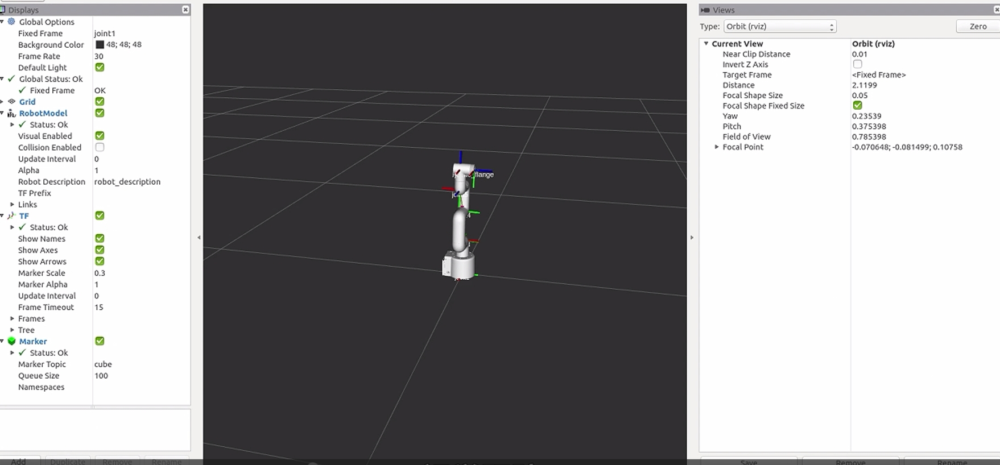

# 机器人 ROS STAG码视觉跟踪

## 1 设备环境说明

myCobot 280 Arduino + 树莓派4B开发板 + myCobot 摄像头模组 + ROS Noetic

## 2 硬件安装

>将相机安装在 mycobot 的末端。 本视觉部分使用 eye-in-hand 的方式。重新安装相机之后，需进行一次手眼标定。

<video id="my-video" class="video-js" controls preload="auto" width="100%"
poster="" data-setup='{"aspectRatio":"16:9"}'>
  <source src="./img/RASPI4B_Hardware_Installation.mp4" type='video/mp4' >
</video>

## 3 mycobot_ros安装

`mycobot_ros`是大象机器人推出的适用于其mycobot系列桌面六轴机械臂的ROS1包。

ROS1项目地址: [http://github.com/elephantrobotics/mycobot_ros](http://github.com/elephantrobotics/mycobot_ros)

机械臂API驱动库地址: [https://github.com/elephantrobotics/pymycobot](https://github.com/elephantrobotics/pymycobot)


为了保证用户能及时使用最新的官方包，可以通过文件管理器进入`/home/er/catkin_ws/src`文件夹，打开控制台终端（ 快捷键 <kbd>Ctrl</kbd>+<kbd>Alt</kbd>+<kbd>T</kbd> ) ，输入以下命令进行更新：

```bash
# 克隆github上的代码
cd ~/catkin_ws/src
git clone https://github.com/elephantrobotics/mycobot_ros.git # 在决定是否执行此命令之前，请查看下面的注意部分
cd ..     # 回到工作区
catkin_make # 在工作区中构建代码
source devel/setup.bash # 添加环境变量
```

**注意:** 如果在`/home/er/catkin_ws/src（相当于~/catkin_ws/src）`目录下已经存在`mycobot_ros`文件夹，则需要先删除原来的`mycobot_ros`，然后再执行上述命令。 其中，目录路径中的`er`为系统的用户名。 如有不一致，请修改。

至此ROS1环境搭建完成。

## 4 使用前提

### python依赖库

使用pip安装以下python库

```bash
pip install stag-python

pip install opencv-python

pip install scipy

pip install numpy

pip install pymycobot
```

### Stag码

本文使用stag码用作二维码跟踪，建议使用彩印，黑白打印识别率较低。


下载地址: [Stag码下载](https://drive.google.com/drive/folders/0ByNTNYCAhWbILXd2SE5FY1c3WXM?resourcekey=0-nWeENtNZql2j9AF32Ud8sQ)

**注意**：stag码的左上角为编号，使用opencv的stag识别库可以识别该编号，你可以为不同编号设计不同的行为逻辑，比如00设为位置跟踪，01设为姿态跟踪，02设为回到观测点。

## 5 原理说明

① **Eye-in-Hand 视觉模式：**

相机被安装在机械臂末端，实现“眼随手动”的视觉观察方式。这种结构便于相机始终面向目标，提高识别准确率。

② **STAG 码识别与编号逻辑：**

通过 stag-python + OpenCV 实时识别 STAG 码的位置和编号。不同编号代表不同任务指令（如：编号 00 跟踪物体，编号 01 返回观测点等）。

③ **手眼标定与坐标变换：**

在程序初始化阶段，先完成手眼标定，建立相机坐标系与机械臂坐标系之间的 4×4 齐次变换矩阵。
一旦 STAG 码被识别，其位置可通过矩阵变换转换到机械臂的坐标系下，实现精确定位。

④ **目标位姿计算与运动控制：**

程序根据识别到的 STAG 码坐标与当前机械臂位姿，计算目标位置。通过 ROS 的话题通信机制（Topic），下发运动指令控制机械臂到达指定位置。

⑤ **行为控制逻辑：**

根据 STAG 码的编号，程序可以执行不同策略：

编号 00： 进入持续跟踪模式，机械臂不断调整位置以对准二维码。

编号 01： 返回初始观测姿态，便于重新识别。

## 6 手眼标定

### 手眼矩阵原理

手眼标定是视觉跟踪必不可少的一环，其作用是求得机械臂坐标系（手）与相机坐标系（眼）之间的相对关系，我们把这种相对关系用一个4*4的手眼矩阵来表示，具体原理可以参考：[手眼矩阵原理](https://blog.csdn.net/weixin_45844515/article/details/125571550)

### 手眼标定方法

> **注意：** 重新安装相机之后，需进行一次手眼标定。

将相机装配到机械臂上（一般装配在机械臂末端），连接需要控制的机械臂

命令行运行：

```python
cd ~/mycobot_ros/mycobot_280arduino/mycobot_280arduino/camera_calibration  # 终端切换到目标路径
python3 camera_calibration.py  # 相机id， 默认为 0.
```

[camera_calibration.py](https://github.com/elephantrobotics/mycobot_ros/blob/noetic/mycobot_280/mycobot_280arduino/camera_calibration/camera_calibration.py) ：实现手眼标定，获取相机到机械臂坐标系的变换矩阵

此时机械臂会先运动到观测姿态

```python
self.origin_mycbot_level = [-90, 5, -104, 14, 0, 0]
def Matrix_identify(self, ml):
    ml.send_angles(self.origin_mycbot_level, 50)  # 移动到观测点
    self.wait()
    ...
```

**注意**： 用户可自定义修改观测点位，比如旋转6关节使相机处于更合适的位置。

1. 运动到观测姿态后，终端会弹出以下提示，将stag码置于相机视野内，输入任意键即可继续识别

```bash
make sure camera can observe the stag, enter any key quit
```

若相机识别到stag码，则会自动进入下一步识别，机械臂移动并捕捉机械臂和相机的位置信息

2. 终端会弹出提示，输入任意键后机械臂会放松，根据提示移动机械臂末端至贴紧二维码（详细可见视频）

```bash
Move the end of the robot arm to the calibration point, press any key to release servo
```

3. 贴紧后根据提示，输入任意键完成手眼标定

```bash
focus servo and get current coords
```

4. 此时会打印save successe, wait to verify信息，程序将自动进入验证环节。

**验证环节:** 完成标定后机械臂会回到手眼标定的观测姿态，此时会重复识别并验证标定参数是否正确，请保证stag码仍然在相机视野内，此时若显示"matrix error"则表示验证未通过，需用重新运行标定程序！

5. 此时会打印EyesInHand_matrix信息，视为标定完成，生成"EyesInHand_matrix.json配置文件，标定成功后无需重复操作！

具体效果参考如下视频：

<video id="my-video" class="video-js" controls preload="auto" width="100%"
poster="" data-setup='{"aspectRatio":"16:9"}'>
  <source src="./img/RASPI4B_Hand_eye_Calibration.mp4" type='video/mp4' >
</video>

**注意**：**手眼标定可能会由于操作不当、机器虚位等原因出现误差，当视觉跟踪效果不好时，需要重新手眼标定**

## 7 程序运行

>> 本案例机械臂的控制方式：使用ROS中的话题进行通信。
USB相机启动方式：使用ROS中的相机usb_cam节点进行启动。

usb_cam 安装命令：

```bash
# Ubuntu 20.04 
sudo apt install ros-noetic-usb-cam   
```

主要涉及代码文件：

[1. communication_topic.launch](https://github.com/elephantrobotics/mycobot_ros/blob/noetic/mycobot_communication/launch/communication_topic.launch) ： 启动机械臂通信节点（话题模式）

[2. mycobot_topics.py](https://github.com/elephantrobotics/mycobot_ros/blob/noetic/mycobot_communication/scripts/mycobot_topics.py) ： 将 pymycobot 封装为 ROS topic 通信接口

[3. open_camera.launch](https://github.com/elephantrobotics/mycobot_ros/blob/noetic/mycobot_280/mycobot_280arduino/launch/open_camera.launch) ： 启动 USB 相机驱动

[4. listen_real_of_topic.py](https://github.com/elephantrobotics/mycobot_ros/blob/noetic/mycobot_280/mycobot_280arduino/scripts/listen_real_of_topic.py) ： 监听并打印机械臂状态

[5. detect_marker_with_topic.launch](https://github.com/elephantrobotics/mycobot_ros/blob/noetic/mycobot_280/mycobot_280arduino/launch/detect_marker_with_topic.launch) ：一键启动通信+相机，程序初始化入口

[6. detect_stag.py](https://github.com/elephantrobotics/mycobot_ros/blob/noetic/mycobot_280/mycobot_280arduino/scripts/detect_stag.py) ：主控制脚本，识别二维码并驱动机械臂响应

其中相机文件 `open_camera.launch` 中的相机设备参数默认为 `/dev/video0`.

```bash
<!-- //指定设备文件名，默认是/dev/video0 -->
    <param name="video_device" value="/dev/video0" />
```

命令行运行：

```bash
cd ~/catkin_ws
source devel/setup.bash

roslaunch mycobot_280arduino detect_marker_with_topic.launch port:=/dev/ttyAMA0 baud:=1000000
```

+ port： 串口字符串
+ baud： 波特率

将实时显示 mycobot 的状态。



紧接着运行stag识别跟踪脚本。打开新的命令行：

```bash
cd ~/catkin_ws
source devel/setup.bash
rosrun mycobot_280arduino detect_stag.py
```

启动后，机械臂会运动到观测点

```python
self.origin_mycbot_horizontal = [-90, -35.85, -52.91, 88.59, 0, 0.0]
ml.send_angles(self.origin_mycbot_horizontal, 50)  # 移动到观测点
time.sleep(3)
...

```

用户可以自行修改观测点：

```python
def vision_trace_loop(self, ml):
    mc.set_fresh_mode(1)
    time.sleep(1)

    ml.send_angles(self.origin_mycbot_horizontal, 50)  # 移动到观测点
    self.wait()
    origin = ml.get_coords()
    while origin is None:
        origin = ml.get_coords()
    time.sleep(1)
    while 1:
        _ ,ids = self.stag_identify()
        if ids[0] == 0:
            self.camera.update_frame()  # 刷新相机界面
            frame = self.camera.color_frame()  # 获取当前帧
            cv2.imshow("Enter any key to exit", frame)

            target_coords,_ = self.stag_robot_identify(ml)
            self.coord_limit(target_coords)
            print(target_coords)
            for i in range(3):
                target_coords[i+3] = origin[i+3]
            ml.send_coords(target_coords, 30)  # 机械臂移动到二维码前方
            # time.sleep(0.5)
        elif ids[0] == 1:
            ml.send_angles(self.origin_mycbot_horizontal, 50)  # 移动到观测点
```

- `_ ,ids = self.stag_identify()`

    此处识别了stag码的ids编号，并针对不同的编号设置了不同的行为逻辑，其中0表示跟踪，1表示回到观测姿态

- `target_coords = self.stag_robot_identify(ml)`

    target_coords是计算出的基于机械臂坐标系的stag码坐标

- `self.coord_limit(target_coords)`

    这里限制了机械臂的活动范围，用户可自行修改运动范围

- 由于我们在手眼矩阵中添加了300mm的工具偏移，此时计算得到的target_coords与物体的实际位置存在300mm的偏差，该偏差有助于保持相机的观测距离
  
  ```bash
  self.IDENTIFY_LEN = 300  # 用于保持识别距离
  ```

## 8 效果展示

<video id="my-video" class="video-js" controls preload="auto" width="100%"
poster="" data-setup='{"aspectRatio":"16:9"}'>
  <source src="./img/RASPI4B_STAG_Effect.mp4" type='video/mp4' >
</video>
