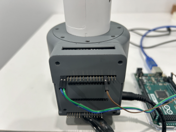
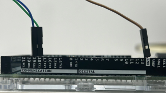
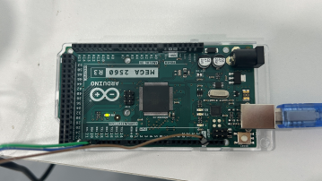
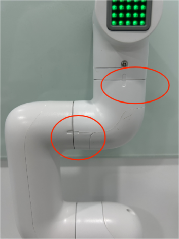

# Chapter 4 First Use
## 1. Product Standard List
## 1.1 Product List Image
> Thank you for choosing the Elephant Robot myCobot 280 For Arduino Robotic Arm. This chapter is designed to help you easily get started with the Elephant Robotic product and enjoy every wonderful moment brought by the product.


## 1.2 Product Standard List Comparison Table

| Serial Number | Product |
| :----: | :------------------------------------------- |
| 1 | myCobot Robotic Arm (Model myCobot 280 For Arduino) |
| 2 | myCobot Robotic Arm-Product Brochure |
| 3 | myCobot Robotic Arm-Matching Power Cord |
| 4 | USB-Type C |
| 5 | Several Dupont Wires |

**Note:** After the packaging box arrives, please confirm that the robot packaging is intact. If there is any damage, please contact the logistics company and the supplier in your area in time. After unpacking, please check the actual items in the box according to the list of items.

---
## 2. Product unpacking guide
## 2.1 Product unpacking graphic guide

**Why do you need to disassemble the product according to the steps**

In this section, we strongly recommend disassembling the product according to the specified steps. This not only helps to ensure that the product is not damaged during transportation, but also minimizes the risk of unexpected failures. Please read the following graphic guide carefully to ensure the safety of your product during the unpacking process.

- **1** Check the packaging box for damage. If there is any damage or missing accessories, please contact the logistics company and the supplier in your area in time.

- **2** Open the box and take out the product brochure, sponge packaging cover, myCobot robot arm, matching power supply, flat base and accessory bag.

- **3** Make sure each step is completed before proceeding to the next step to prevent unnecessary damage or omissions.

**Note:** After taking out the product, please carefully check the appearance of each item. Please check the actual items in the box against the list of items.

## 3. Startup Inspection Guide
## 3.1 Structural Installation and Fixing

During the movement of the **robotic arm**, if the **bottom surface of myCobot is not connected to the desktop or other bottom surface**, myCobot will still **shake or overturn**.

**There are three common ways to fix the robotic arm**:

1) Use Lego keys to fix it on a base with a Lego interface

We sell two types of bases: flat suction cup base and G-type clamp base

​ Flat base Applicable model: myCobot 280

* Install suction cups at the four corners of the base and tighten them.

* Use the included Lego technology parts to connect the flat base and the bottom of the robotic arm.

* Fix the four suction cups on a flat and smooth surface before starting to use.
* Tips: You can add a small amount of non-conductive liquid under the suction cup to fill the gap between the suction cup and the desktop to achieve the best adsorption effect.


---

G-type base Applicable models: myCobot 280 series, myPalletizer 260


- Use the G-clip to fix the base to the edge of the table

- Use the included Lego tech parts to connect the base and the bottom of the robot arm

- Make sure it is stable before starting to use


2 myCobot base screw hole connection

The robot needs to be fixed on a solid base before it can be used normally. Base weight requirements: fixed base, or mobile base.

Please make sure that there are corresponding threaded holes on the fixed base before installation.

Before formal installation, please confirm:

* The installation environment meets the requirements of the above "Working Environment and Conditions" table.

* The installation location is not less than the robot's working range, and there is enough space for installation, use, maintenance, and repair.

* Place the base in a suitable position.

* The installation-related tools are ready, such as screws, wrenches, etc.

**After confirming the above content**, please move the robot to the base installation table, adjust the robot position, and align the robot base fixing holes with the holes on the base installation table. After aligning the holes, align the screws with the holes and tighten them.

* Note: When adjusting the robot position on the base installation table, please try to avoid pushing and pulling the robot directly on the base installation table to avoid scratches. When manually moving the robot, please try to avoid applying external force to the fragile parts of the robot body to avoid unnecessary damage to the robot.

---
## 4. Power on and preliminary inspection
## Power on the robot

Before operation, please make sure you have read and followed the contents of **Chapter 1 Safety Instructions** to ensure safe operation. At the same time, connect the power adapter to the robot arm and fix the base of the robot arm on the table. The connection method is shown in Figure 3-1:


Figure 3-1

myCobot **must be powered by an external power supply** to provide sufficient power:

- Rated voltage: 12V
- Rated current: 3-5A
- Plug type: DC 5.5mm x 2.1

Note that **it cannot be powered by just the TypeC plugged into the M5Stack-basic**. Use the official power adapter to avoid damage to the robot arm.

## Connect external devices

- Connect to the computer via USB


Figure 3-2 USB interface connection diagram

## Robot working status detection
## Unboxing video

<video id="my-video" class="video-js" controls preload="auto" width="100%"
poster="" data-setup='{"aspectRatio":"16:9"}'>
<source src="https://www.elephantrobotics.com/wp-content/uploads/2022/05/Arduino%E8%A7%86%E9%A2%91%E7%9A%84%E6%9B%B4%E6%8D%A2%E4%B8%AD.mp4#t=4"></video>

## Hardware connection

**Note:** The current 280AR serial port baud rate is changed to 1000000. The wiring of different development boards is different:

| Development board type | Baud rate | Control method | Wiring method | Wiring diagram |
| :------: | :----------------------: | :----------------------: | :-----------------: | :---------: |
| mega2560 | 1000000 | python/MyBlockly |TX0-->RX、RX0-->TX、GND-->GND |  |
| mega2560 | 1000000 | Arduino IDE |TX1-->RX、RX1-->TX、GND-->GND ||
| UNO | 1000000 | Arduino IDE |tx-->tx RX-->RX, GND-->GND ||
| mkrwifi1010 | 1000000 | None | None | None |

## How to perform zero calibration

**Note: Please strictly follow the steps below**

1. Power on the robot arm first (if the green light is on, it means the robot arm is powered on)


2. Connect the Arduino board (the connection position is shown in the figure below)





3. Connect the serial port to the computer (if the green light is on, it means the computer is successfully connected)



After connecting, you can follow the steps below to view the connection port number

Click this computer --> Right-click to manage --> Click Device Manager --> Click Port


Calibration zero position example

```python
from pymycobot.mycobot import MyCobot

from pymycobot import PI_PORT, PI_BAUD # When using the Raspberry Pi version of mycobot, you can reference these two variables to initialize MyCobot. If not, you can leave this line of code blank
import time

# The above needs to be written at the beginning of the code, meaning to import the project package

# MyCobot class initialization requires two parameters: serial port and baud rate

# The first is the serial port string, such as:
# linux: "/dev/ttyUSB0"
# windows: "COM6"
# The second is the baud rate:
# M5 version is: 1000000
# The following is as follows:
# mycobot-M5:
# linux:
# mc = MyCobot("/dev/ttyUSB0", 1000000)
# windows:
# mc = MyCobot("COM6", 1000000)
# mycobot-raspi:
# mc = MyCobot(PI_PORT, PI_BAUD)
#
# Initialize a MyCobot object
# The following is the object code for the windows version
mc = MyCobot("COM6", 1000000)
# Power off the robot and relax the joints
time.sleep(2)
mc.release_all_servos()
# After relaxing the joints, bend the robot to align the zero position scale of the robot
time.sleep(2)

# Calibrate the robot joints one by one
for i in range(1, 7):
mc.set_servo_calibration(i)
time.sleep(1)

# Power on the robot to lock the robot
mc.power_on()
time.sleep(2)

# Print all joint angles
print(mc.get_angles())
time.sleep(1)
```

Example diagram of robot arm calibration zero position (alignment of adjacent joint zero position scale lines is the joint zero position)



Example diagram of robot arm joint zero position


## 5. Common Problem Solving
This section aims to help users solve common problems encountered during use, covering hardware, software, accessories, and how to self-check for the first time. If you encounter problems while using the robot arm, please read the contents of this section first to find solutions. If the listed problems cannot help you solve and you have more after-sales questions to consult, please add the after-sales butler WeChat.

[First-time self-check](../../4-SupportAndService/9.Troubleshooting/9.4-first-time-self-check.md)

[Common software problems and solutions](../../4-SupportAndService/9.Troubleshooting/9.2-software.md)

[Common hardware problems and solutions](../../4-SupportAndService/9.Troubleshooting/9.3-hardware.md)

[Common accessories problems and solutions](../../4-SupportAndService/9.Troubleshooting/9.1-accessories.md)

[Other problems and solutions](../../4-SupportAndService/9.Troubleshooting/9.0-other.md)

---

If you have read all the contents of this chapter, please continue to read the next chapter. <br>
[← Previous Chapter](../3.UserNotice/3-UserInstructions.md) | [Next Chapter →](../../3-FunctionsAndApplications/5.BasicFunction/README.md)