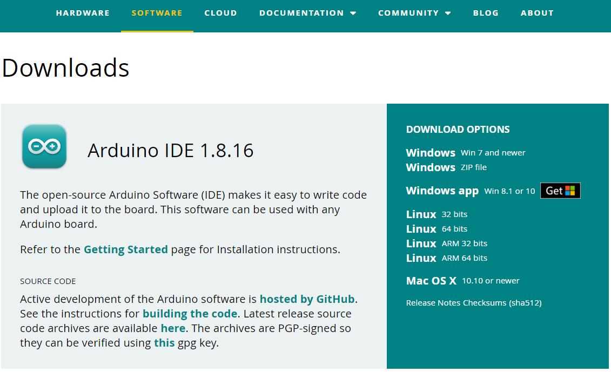
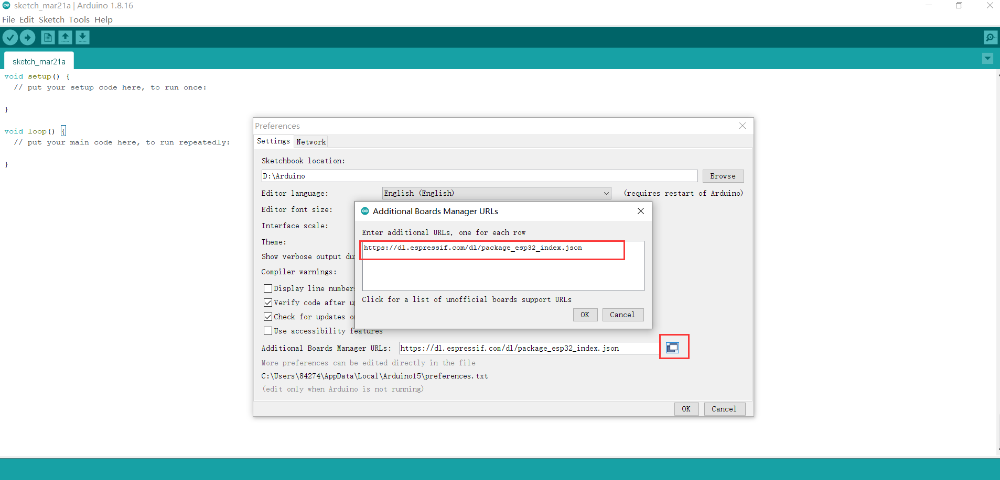
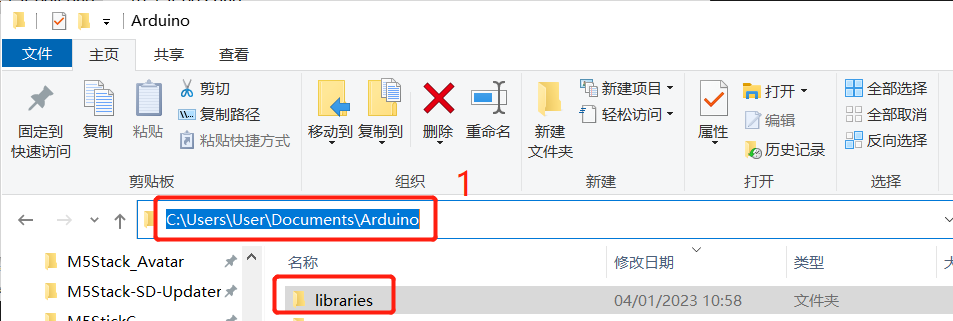
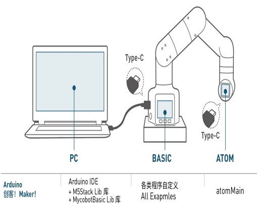
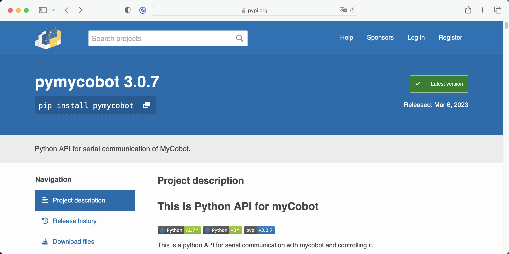
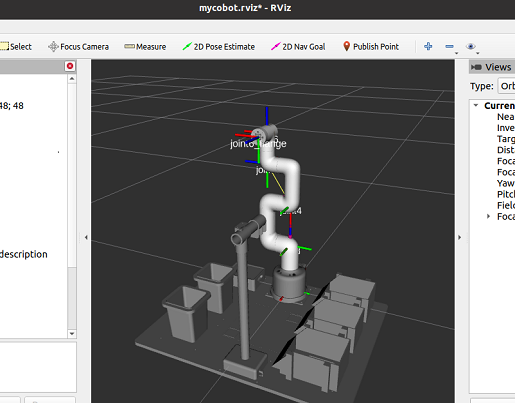

# 开发环境建设

## 1 如何构建环境

### 1 **Arduino IDE** 下载

 
 **Arduino IDE Download Address** 

- [Arduino 官方网站](https://www.arduino.cc/en/software) 

- [Windows X64](https://downloads.arduino.cc/arduino-1.8.16-windows.exe)

- [Mac OS X](https://downloads.arduino.cc/arduino-1.8.16-macosx.zip)

- [Linux ARM 64](https://downloads.arduino.cc/arduino-1.8.16-linuxaarch64.tar.xz)

### 2 已安装的驱动程序

刻录程序之前, M5Core主机 (包括 M5Stack-basic/GRAY/M5GO/FIRE/FACES在内) / 根据您使用的操作系统，对设备用户的**微控制类型**, 请下载相应的驱动程序包. 解压缩包后，选择相应OPERATION系统位的安装包.

对于Mac OS，确保系统设置正确 **首选设置 --> 安全和隐私 --> 通用** 并允许用户从App Store或经批准的开发人员处获取。

   下载 **M5Stack-basic**串行端口驱动程序 **CP210X** 或 **CP34X**

  **CP210X**

  - [ **Windows10** ](https://download.elephantrobotics.com/software/drivers/CP210x_VCP_Windows.zip)

  - [ **MacOS** ](https://download.elephantrobotics.com/software/drivers/CP210x_VCP_MacOS.zip)

  - [ **Linux** ](https://download.elephantrobotics.com/software/drivers/CP210x_VCP_Linux.zip)

解压缩zip包后，根据计算机**操作系统**选择要安装的相应安装包（win10和win11选择x64或x86进行安装）。

 

  **CP34X**

  - [ **Windows10** ](https://download.elephantrobotics.com/software/drivers/CH9102_VCP_SER_Windows.exe)

  - [ **MacOS** ](https://download.elephantrobotics.com/software/drivers/CH9102_VCP_MacOS.zip)

### 3 添加board

* 打开Arduino IDE 然后选择 **File --> Preferences --> Settings** 去添加下方的url到additional board manager:

  https://m5stack.oss-cn-shenzhen.aliyuncs.com/resource/arduino/package_m5stack_index.json

 

 

* 添加后,点击 **Tools --> Board --> Boards Manager**, 在新的弹出对话框中, 输入和搜索  **M5Stack** , 单击“安装” (如果搜索失败，可以尝试重新启动  **Arduino**  程序), 如下所示：

 

* 添加后,点击 **Tools --> Board**, 检查是否成功，如下图所示：

 

### 4 添加相关库

**注意：** 请下载最新的库，第一版为v0.0.1。

  * 点击下载相关依赖库
    - [**MycobotBasic**](https://github.com/elephantrobotics/MyCobotBasic/tags)(Mycobot280-Arduino机型导入后可以参考**arduinolib_use**章节进行使用)。具体请看下图，.zip适用于Windows系统，.tar.gz适用于Linux系统： 

 

* 库安装说明

  首先通过单击**File --> Preferences** 检查Arduino项目文件夹的位置 (您可以将路径复制到硬盘以查找库文件夹) 

 

 

 
1 将路径复制到此处，然后按enter键查找库文件夹

  将其解压缩到库目录中的相应文件夹中。 如果您正在使用**Arduino**, 不要覆盖它，只需添加到现有的**库**。

 

  恭喜您，您已经构建了一个**Arduino**相关的开发环境。 

注意: Arduino环境配置和案例编译可以在我们的b站视频中看到  ( https://www.bilibili.com/video/BV1Vi4y1c7DQ/ ) .

## 2 基于 Arduino 开发使用
Arduino 是一款简单易用、便于上手的开源电子原型平台，包含硬件部分（各种符合 Arduino 规范的开发板）和软件部分（ Arduino IDE 和相关的开发包）。 硬件部分（或称开发板）由微控制器（MCU）、闪存（Flash）以及一组通用输入/输出接口（GPIO）等构成，你可以将它理解为是一块微型电脑主板。 软件部分则主要由PC端的 Arduino IDE 以及相关的板级支持包（BSP）和丰富的第三方函数库组成。使用者可以借由 Arduino IDE 轻松地下载你所持有的开发板相关的BSP和需要的函数库，用于编写你的程序。我们有一个开源库MyCobotBasic，它是我们公司开发的一款开源机器人控制库，需要使用我们公司开发的机器人方可使用。使用该库，您可以通过蓝牙、WiFi、串口等方式控制我们的机器人，同时支持外接传感器、IIC通信、LED灯等功能。您可以根据自己的需求DIY不同的应用场景，也可以参考我们提供的MiniRobot示例代码或者角度、坐标、夹爪等控制案例。MiniRobot示例代码中包含蓝牙、WiFi、拖动示教、距离传感器等控制相关的内容。用户安装Arduino环境后，可以直接查看 Arduino简单使用和相关接口。详情请查阅Arduino开发指引章节。 

## 3 基于Python 开发使用
我们的机器人支持Python，Python API库的开发也越来越完善。 可以通过Python控制机器人的关节角度、坐标、夹持器等方面。 参考**python开发相关章节**获取更多信息。

## 4 基于Blockly 开发使用
myBlockly是一款全可视化的模块化编程软件，属于图形化编程语言，详情可查阅基于myBlockly开发相关章节。

## 5 基于ROS开发
ROS 是开源的，是用于机器人控制的一种后操作系统，或者说次级操作系统。通过ROS，我们能够在虚拟环境中实现对机械臂的仿真控制。我们将通过 rviz 平台实现对机械臂的可视化，并使用多种方式对我们的机械臂进行操作；通过moveit 平台进行机械臂行动路径的规划和执行，达到自由控制机械臂的效果。

Ros的出现解决了机器人各个部件的通信问题。 后来，越来越多的机器人算法被集成到ROS中。 **ROS2**继承了**ROS**，比**ROS**更强大更好。
与仅支持Linux系统的**ROS**相比，**ROS2**还支持**windows**、**mac**，甚至**RTOS**平台。关于ROS和ROS2开发的更详细内容请查看相关章节。
