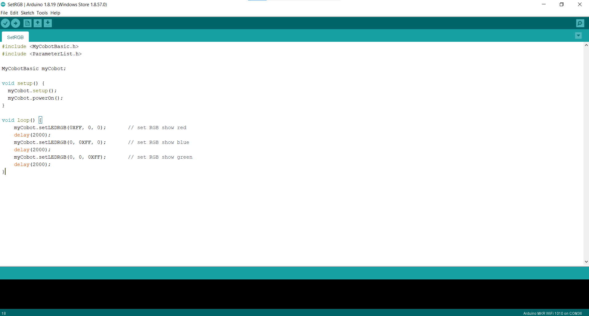
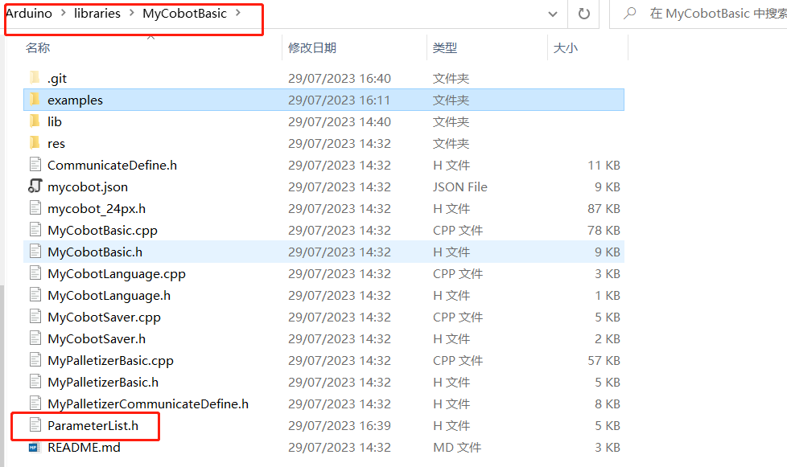

# Simple use of Arduino

## Connect the device

Take **myCobot 280-M5** as an example, use the Tyep-C data cable to connect the M5Stack-basic on the base of the robot arm to the PC.

## Firmware requirements

* ATOM: Use **MyStudio** to burn the latest version of AtomMain

* Basic: No requirements

## Check the link

Open the computer device manager to check if there is any device. If the device is not detected, please change the USB cable. If it is not available, please install and click to download **CP210X driver**. After downloading, unzip and install the required driver version to use it.

Open **Arduino IDE --> Tools --> Port** to check if there is a device. If the device is not detected, please change the USB cable to test, or check whether the driver is installed successfully.

## Start development

Take burning an official demo as an example. Open **Arduino IDE --> File --> Examples --> MyCobotBasic** to see all project examples (if you don't see the example, you can restart Arduino). Choose to burn a simple demo, for example **--> MyCobot280--> MyCobot280-M5--> AnglesControl**.

Open AnglesControl.ino from the example file

**Note:** Select the development board as **M5Stack-Core-ESP32** and the corresponding **COM port**.

If you are using myCobot280-M5, **please use ParameterList.h in the MyCobot280-M5 folder to replace ParameterList.h in the MyCobotBasic folder**. Please see the following figure for details: 

**Note:** When using different models, please use the "ParameterList.h" file in the respective case directory to replace the "MyCobotBasic\ParameterList.h" file

Click upload and wait for the progress bar in the lower right corner to finish running 

Wait until the lower right corner shows that the upload is successful, and the program has been downloaded

At this time, we can see the **robot** start working.

For the interface and driver of **basic buttons and screen**, please refer to the following documents: 

Button: https://docs.m5stack.com/en/api/core/button  
Screen: https://docs.m5stack.com/en/api/core/lcd  

## Introduction to some cases
Currently, different models have angle, coordinate, and gripper control.
**Transponder:**
MyCobot280-Arduino uno and Mega2560 development board use case, the main function is communication, on this basis, use RoboFlow, python, myblockly, etc. to control the robot arm and perform io control. 
**AnglesControl:**
This demo is used to control the angle control of the robot arm about its joints. 
**CoordsControl:**
This demo is used to control the angle control and coordinate control of the robot arm about its joints. 
**GripperControl:**
This demo is used to control the opening and closing action and angle of the gripper of a robot arm called MyCobot. 

Note: Arduino environment configuration and case compilation can be seen in our gitbook document or the video on our Bilibili (https://space.bilibili.com/2126215657).

---
