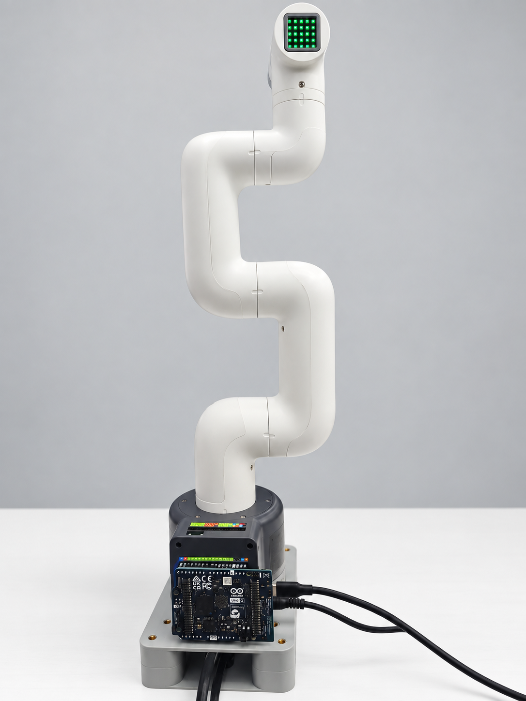
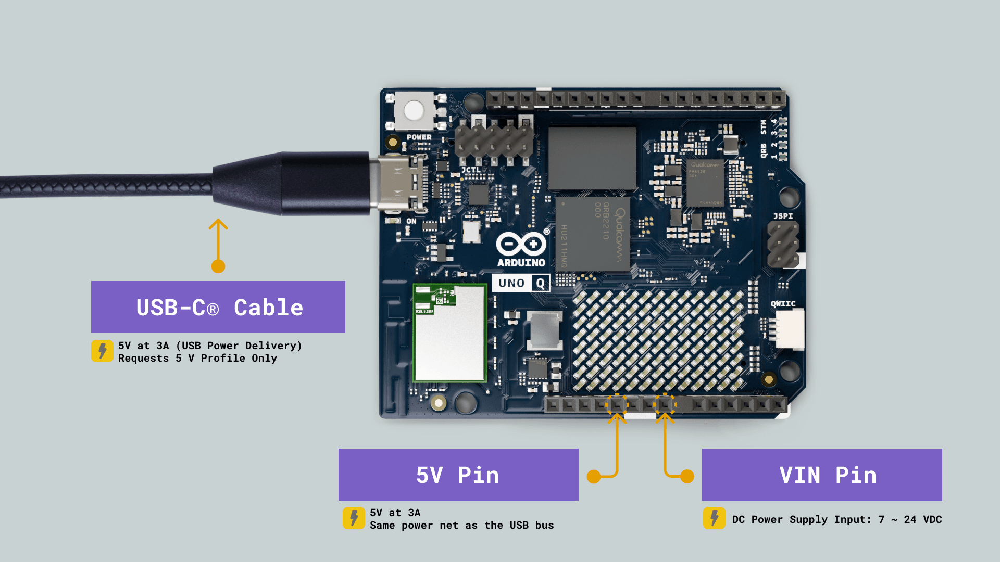
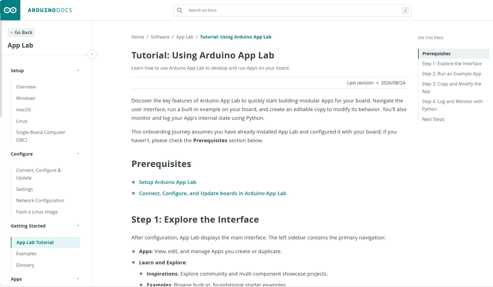
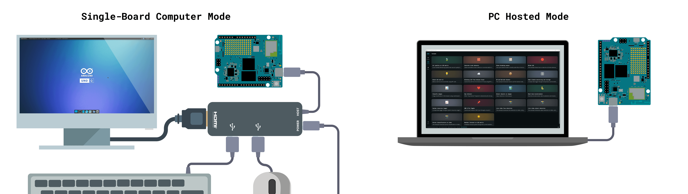

# 7.1 Getting Started with UNO Q and Arduino App Lab

This section is intended for first-time use of myCobot 280 with Arduino UNO Q. It explains how to choose a control mode, connect the hardware, install Arduino App Lab, import examples, and run the first verification program.

For the official board overview, power options, and mode description, refer to the [Arduino UNO Q user manual](https://docs.arduino.cc/tutorials/uno-q/user-manual/). App Lab installation and operation should always follow the latest official Arduino pages.

## 1. Control Modes

| Mode | Where the program runs | Typical use | Recommended interface |
| --- | --- | --- | --- |
| App Lab PC-hosted mode | App Lab on a PC | First setup, importing examples, quick verification | App Lab Run |
| SBC mode | UNO Q Debian desktop | Standalone use with monitor, keyboard, mouse, USB Hub, and gamepad | App Lab on UNO Q or terminal Python |
| Python on UNO Q | UNO Q Debian / App Lab Python | Local scripts and customer demos | `MyCobot280(unoq_bridge=True)` |
| TCP Socket | PC on the same LAN | Remote Python control from a PC | `MyCobot280Socket("UNO_Q_IP", 9000)` |

Only one control entry should send motion commands at the same time. Stop the current App Lab project or Python script before switching to another mode.

## 2. Hardware Checklist

- myCobot 280 for Arduino.
- Arduino UNO Q development board installed on the robot base.
- Original robot power adapter and a stable power outlet.
- USB-C cable that supports data transfer.
- PC running Windows, macOS, or Linux.
- Optional for SBC mode: monitor, keyboard, mouse, USB Hub with power delivery, and USB gamepad receiver.

Figure: UNO Q connected to myCobot 280.

## 3. Power and Safety

UNO Q can be powered through USB-C, the 5V pin, or the VIN pin. For robot use, keep the robot powered by its standard power adapter and avoid changing power wiring while the robot is powered on.

Figure: UNO Q power options. Source: Arduino official documentation.

Before every motion test:

- Place the robot on a stable desktop or fixture.
- Keep the arm away from people, cables, and fragile objects.
- Run RGB or read-only examples before running motion examples.
- Use a low speed for the first joint or coordinate movement.
- Keep the Stop button or terminal interrupt method ready.

## 4. Install Arduino App Lab

Open the [Arduino Software](https://www.arduino.cc/en/software) page and download the latest Arduino App Lab. Do not choose Arduino IDE when following this chapter.

### Windows

1. Open the Arduino Software page.
2. Find the Arduino App Lab download area.
3. Download the Windows installer.
4. Run the installer and follow the on-screen instructions.
5. Start Arduino App Lab and confirm it opens normally.

Figure: Windows installation steps. Source: Arduino official documentation.

### macOS

Download the App Lab DMG file from the official software page, open it, and drag Arduino App Lab into Applications. If macOS blocks the first launch, allow it in System Settings according to the system prompt.

### Linux

Download the TAR.GZ package from the official software page, extract it, and start App Lab from the extracted application directory. Use the official Arduino documentation if the package name or launch command changes.

## 5. First Device Configuration

Use a USB-C cable that supports data transfer to connect UNO Q to the PC. In PC-hosted mode, App Lab runs on the PC and communicates with UNO Q through USB-C.

In App Lab, complete the first-time configuration according to the prompts:

- Detect the UNO Q device.
- Check system updates.
- Set or confirm the device name.
- Set the user password.
- Configure Wi-Fi or Ethernet if network functions are needed.

Figure: UNO Q connection and configuration. Source: Arduino official documentation.

For manual App Lab updates, follow the official help center article: [Manually update Arduino App Lab](https://support.arduino.cc/hc/en-us/articles/24305472458652-Manually-update-Arduino-App-Lab).

## 6. Import and Run an App Lab Project

An App Lab project is imported as a complete ZIP package. Do not copy only `main.py` into a blank project, because the project also depends on `python/`, `sketch/`, `app.yaml`, and local wheel files.

General workflow:

1. Open Arduino App Lab.
2. Choose Import and select the complete ZIP package.
3. Select the UNO Q device.
4. Click Run.
5. Watch the Start-up, Main/Python, and Sketch Console outputs.
6. Click Stop before disconnecting the device or switching to another control mode.

Figure: Project, Run, and Console areas in App Lab. Source: Arduino official documentation.

Recommended test order:

1. RGB example without robot motion.
2. Home position example.
3. Single-joint example.
4. Multi-joint example.
5. Dance example.
6. Gripper example.
7. Pump example.

If import fails, confirm that the selected file is the complete ZIP project. If the board is not detected, replace the USB-C cable with a data cable and reconnect UNO Q. If dependency installation fails, check the wheel files included in the project. If `XferBridgeMsg` is unavailable, update the UNO Q system and firmware side according to the App Lab and project instructions.

## 7. SBC Mode (Optional)

In SBC mode, UNO Q works as a small single-board computer. Connect an external monitor, keyboard, mouse, and USB Hub with power delivery. This mode is useful when the robot needs to run without a PC.

Figure: SBC mode and PC-hosted mode. Source: Arduino official documentation.

The gamepad example in this chapter is designed for SBC use. It can be run from App Lab or directly from a Python terminal on UNO Q Debian.

[Chapter Home](README.md) | [Next: Python Development](7.2-Python.md)
