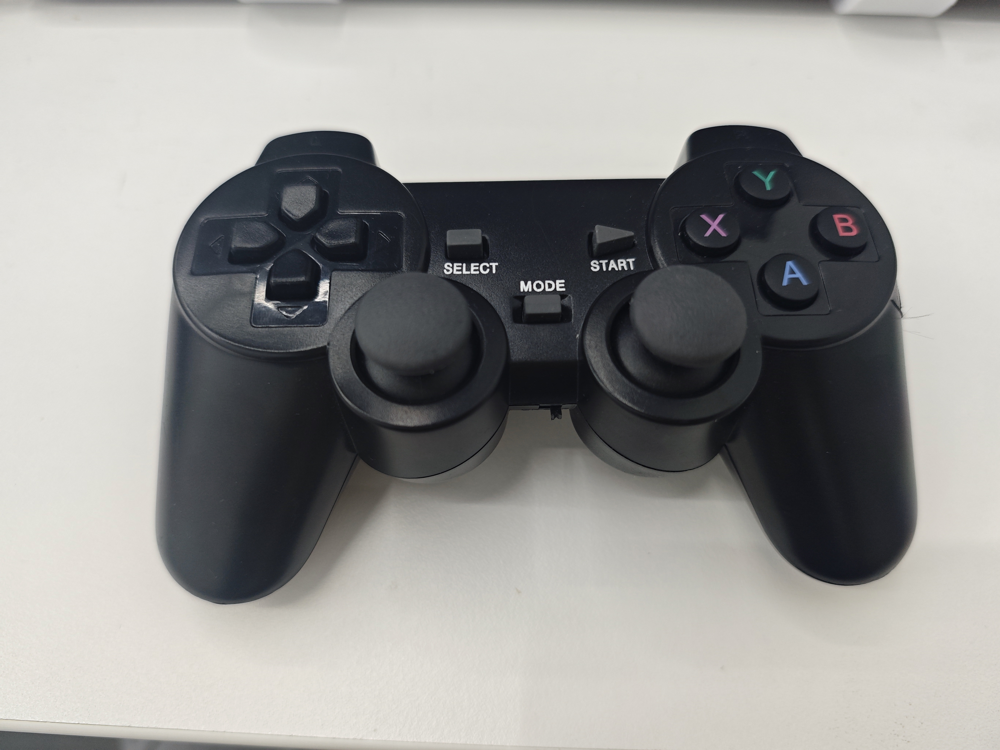

# 7.4 SBC Gamepad Control

The gamepad control example is intended for UNO Q SBC mode. It can be started from App Lab or directly from the UNO Q Debian terminal.



Figure: USB gamepad used for the UNO Q control example.

## Hardware Requirements

- UNO Q running in SBC mode.
- External monitor, keyboard, and mouse.
- USB Hub with enough power capability.
- USB gamepad receiver connected to the Hub.
- Robot fixed securely with enough clear space around it.

## Run from Debian Terminal

```bash
cd ~/mycobot/example
python3 myCobot280_unoq_handle_control.py
```

The source file is also included with this GitBook resource package: [mycobot280-unoq-handle-control.py](/resource/3-FunctionsAndApplications/7.UNOQDevelopmentBoard/mycobot280-unoq-handle-control.py).

## Button and Axis Mapping

| Control | Direction / Button | Trigger condition | Function |
| --- | --- | --- | --- |
| Left stick | Up | axis 1 < -0.3 | X increases: `jog_coord(1, 1, 50)` |
| Left stick | Down | axis 1 > 0.3 | X decreases: `jog_coord(1, 0, 50)` |
| Left stick | Left | axis 0 < -0.3 | Y increases: `jog_coord(2, 1, 50)` |
| Left stick | Right | axis 0 > 0.3 | Y decreases: `jog_coord(2, 0, 50)` |
| Right stick | Up | axis 3 < -0.3 | Z increases: `jog_coord(3, 1, 50)` |
| Right stick | Down | axis 3 > 0.3 | Z decreases: `jog_coord(3, 0, 50)` |
| Right stick | Left | axis 2 < -0.3 | RX increases: `jog_coord(4, 1, 50)` |
| Right stick | Right | axis 2 > 0.3 | RX decreases: `jog_coord(4, 0, 50)` |
| D-pad | Up | hat y = 1 | RY increases: `jog_coord(5, 1, 50)` |
| D-pad | Down | hat y = -1 | RY decreases: `jog_coord(5, 0, 50)` |
| D-pad | Left | hat x = -1 | RZ increases: `jog_coord(6, 1, 50)` |
| D-pad | Right | hat x = 1 | RZ decreases: `jog_coord(6, 0, 50)` |
| A | Press | button A | Open gripper |
| B | Press | button B | Close gripper |
| X | Press | button X | Turn pump on |
| Y | Press | button Y | Turn pump off |
| L1 / R1 | Press | shoulder button | Adjust speed or auxiliary action according to the example script |
| L2 | Press | trigger | Release all servos |
| R2 | Press | trigger | Focus all servos |
| START / SELECT | Press | center button | Start, stop, or auxiliary action according to the example script |

> Safety warning: L2 releases the servos. After release, the robot may lose holding force and drop under gravity. Hold the robot or make sure it is in a safe posture before using this function.

## Mapping Test

If the gamepad does not behave as expected, run the mapping test example first and confirm the axis, button, and D-pad values printed by `pygame`. Different controllers may report different numbers.

Common checks:

- Confirm the receiver is connected before starting the script.
- Reconnect the receiver if no controller is detected.
- Use `lsusb` to check whether the USB receiver is visible.
- Restart the script after reconnecting the gamepad.
- Stop App Lab or other Python programs before starting gamepad control.

[Previous: TCP Socket](7.3-TCPSocket.md) | [Next: Troubleshooting](7.5-Troubleshooting.md)
