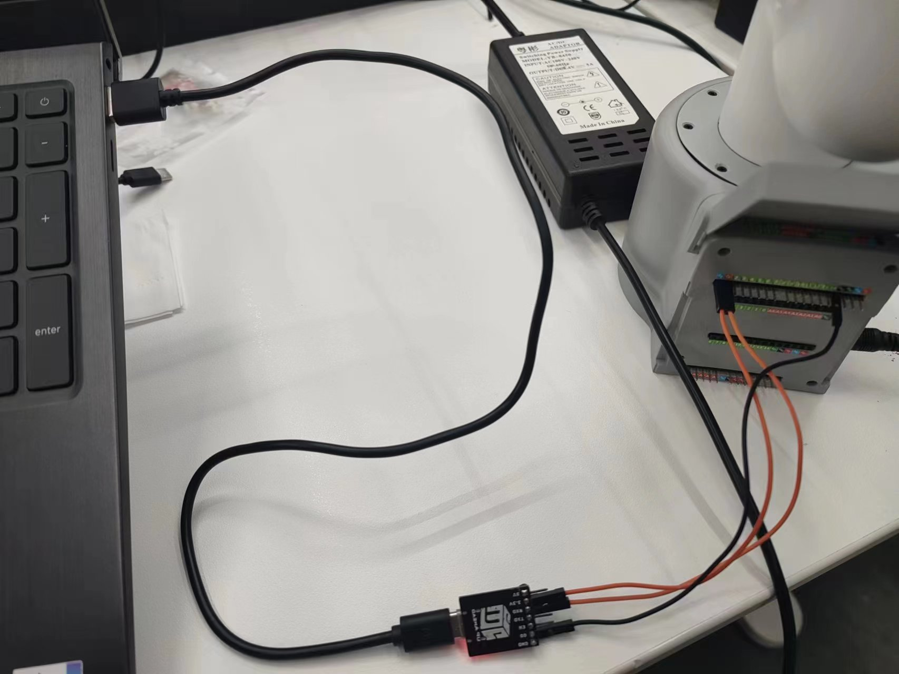
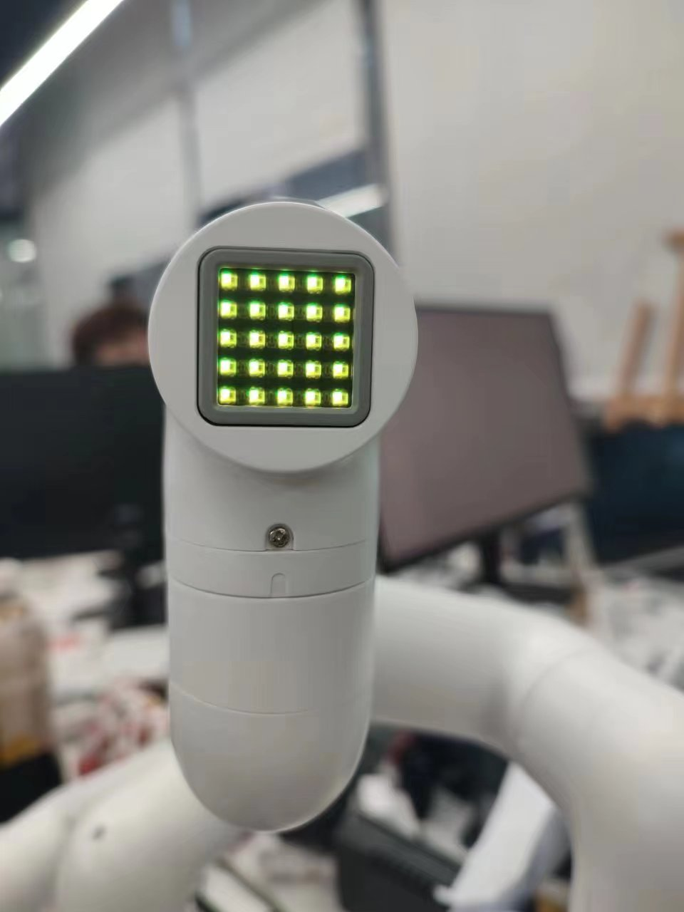
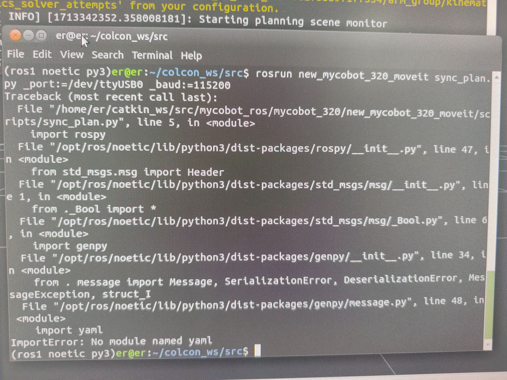
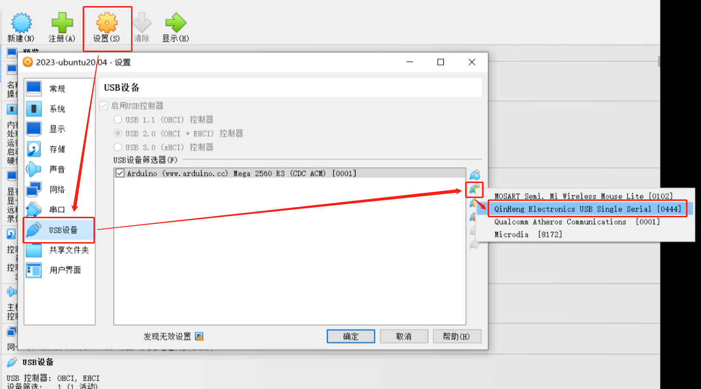
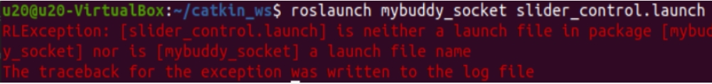

# Software Issues

**Q: Why can't my compiler find the corresponding device?**
- A: You need to build a development environment and install the corresponding project library before you can develop the device.

## 1 myStudio related

**Q: What is myStudio?**
- A: It is our company's self-developed software. It is a tool for burning or modifying the firmware of the existing robot arm launched by our company.

**Q: What is the method to troubleshoot the abnormal download of minirobot, Atom, and PICO firmware?**

1. Check whether the network connection is normal. During the firmware download process, you need to connect to the network to download the firmware first.

2. Check whether the line has been connected. The details are as follows:
In the M5/Arduino series machine, when burning the Atom firmware, you need to use a USB cable to connect the Atom interface at the end to the USB port of the computer; when the M5 series machine burns the nimirobot firmware, use a USB cable to connect the side interface of the M5stack to the USB port of the computer.

3. Select the firmware of the corresponding model, and don't choose the wrong model.

4. Download and install the driver. If it still cannot be recognized after downloading the driver, try to replace the latest [ch340 driver](https://www.wch.cn/download/CH341SER_EXE.html). If the port number still cannot be displayed after installing the driver and the system is a win11 model, try [How to install the CH340 driver in Win11 system](https://blog.csdn.net/m0_52242552/article/details/126219464).

5. Try to change a USB cable, USB port or computer to download it to avoid abnormal firmware download caused by the cable not having data transmission function.

6. Uninstall mystudio and reinstall mystudio in a non-C drive location, such as installing mystudio in the D drive. When mystudio is installed in the C drive, the file permissions are relatively strict, and the firmware may not be burned.

**Q: What to do if 280Arduino cannot burn firmware?**

A: We have verified that the genuine Arduino mega2560 firmware can burn the mystudio firmware normally. The verification video is as follows:
https://drive.google.com/file/d/1C7OhUlgkG05WX0LcPSollQZ0Vj-yJZhS/view?usp=sharing

For the situation that your arduino mage2560 board cannot burn the firmware, it is recommended that you check the following points:
1. Check whether the network connection is normal. During the firmware download process, you need to connect to the network to download the firmware first.
2. When burning the firmware, disconnect the tx and rx pins between mycobot280Arduino and mega2560. There will be a serial port conflict when downloading the firmware, and there may be a situation where the firmware cannot be burned normally. Please connect the tx and rx pins after the burning is successful.
3. Try to unplug and plug the USB port again after entering mystudio and burn it again.
4. Try to press the reset button on the Arduino motherboard when burning the mega firmware.
5. Uninstall mystudio and try to reinstall mystudio in a non-C drive location, such as installing mystudio in the D drive. When mystudio is installed in the C drive, the file permissions are relatively strict, and the firmware may not be burned.

If the above methods do not work, it may be because your Arduino mega2560 motherboard is incompatible with the mycobot280Arduino firmware. You can consider replacing other mega2560 motherboards to download firmware or directly use the Arduino development method of the UNO motherboard to control the robotic arm.

**Note: ** When using the UNO motherboard, you do not need to use mystudio to download the firmware. You can directly use the Arduino IDE development method to burn the corresponding case code to control the robotic arm. Only when using the mega2560 and WIFI1010 motherboards to control the robotic arm do you need to use mystudio to download the corresponding firmware

## 2 myblockly related

**Q: What should I do if I encounter the error message: ModuleNotFoundError: No module named "pymycobot"?**


- A: The error message indicates that the pymycobot file is missing. Please refer to the following 3 points for the reasons and solutions:
①If pymycobot is not installed or pymycobot fails, the corresponding solution is to reinstall pymycobot. The command is pip3 install pymycobot --upgrade --user
②If it is an M5 or AR series machine, please note that the "Add Pythonxx to PATH" in the figure below is not checked during the installation of python. You need to uninstall python and reinstall python, and check this option


③If it is an M5 or AR series machine, please confirm whether there are multiple python versions in the PC. It is recommended to uninstall all python versions in the PC and reinstall a version higher than python3.8. Note that there is only one python version higher than python3.8 in the PC. If multiple python versions are required for actual use, please specify the python version used by pymycobot and specify the python version when calling the pymycobot library

**Q: When using 280arduino with mega2560 board, myblockly cannot be used to control joints normally, and there is no response to movement and reading. How to deal with it?**

- A: Download myblockly1.4.4 version, or when using the latest version of myblockly, please note that when using the development board Arduino MEGA2560 and the building block to control the robot arm, the user needs to manually add the delay building block and then send the command. When using the fast movement tool, you need to open the serial port and send the command after an interval of 1s


**Q: How to deal with the fact that myblockly's express movement tool cannot display the real-time angle?**

- A: This is generally caused by incorrect selection of device serial port information and pymycobot exception. It is recommended to check according to the "First Use Self-Check" solution in this article. If the robot arm cannot be controlled normally, please try to update pymycobot. The corresponding update solution is to enter the command `pip install pymycobot --upgrade --user` in cmd or terminal.
Finally, if it still cannot be controlled normally, please try to update the myblockly software. Please refer to the following link for the update method:
https://drive.google.com/file/d/1yBWzhbSBUYsZPBl7PBdZKRwk3al71Dc7/view?usp=sharing

**Q: The result of running the program shows child process exited with code 1. Is it normal?**

- A: This is not an error. All programs have finished running and returned the binary number 1. It means that all have been successfully completed.

**Q: How to preset the code block content in myblockly, including the model, baud rate and other information after entering the system, which are all corresponding to the connected model?**

- A: Currently, the default model for the first startup in myblockly is mycobot and the baud rate is 115200. There is no way to change the initial baud rate, but you can make and save an initialization json file yourself. Next time you enter myblockly, load this file to get the preset code block.
For how to make and save json files, please refer to the following: https://drive.google.com/file/d/1g_dd933TK1tptnisUad4PBfwSRsWWFeQ/view?usp=sharing

## 3 Roboflow Related

**Q: What should I do if I cannot download the Roboflow software or if Roboflow fails to properly control the robot?**

- A: Currently, the Roboflow software only supports the  600 Pro  and  630 Pro  (two professional collaborative robot models). It no longer supports the  Mycobot  collaborative series or other robot models.
For Mycobot-series robots, it is recommended to use  MyBlockly,  Python, or  ROS  for control. Notably,  MyBlockly  is a software with a graphical interface similar to Roboflow. If you prefer visual, block-based programming,  MyBlockly  is the preferred choice.
    ​				
## 4 Python related

**Q: The running prompt is missing library filesQ: The error message: ModuleNotFoundError: No module named "pymycobot", how to deal with it?**

- A1: Pymycobot is not installed. The corresponding solution is to reinstall pymycobot. The command is `pip3 install pymycobot --upgrade --user`

- A2: During the installation of Python, the "Add Pythonxx to PATH" in the figure below was not checked. You need to uninstall Python and reinstall Python, and check this option.

- 

- A3: If it is an M5 or AR series machine, please confirm whether there are multiple Python versions in the PC. It is recommended to uninstall all Python versions in the PC and reinstall a version higher than Python 3.8. Note that there is only one Python version higher than Python 3.8 in the PC. If multiple python versions are required for actual use, please specify the python version used by pymycobot and specify the python version when calling the pymycobot library.

- A4: It is recommended to use version 3.9 of pyhton, as pyhton12 will be incompatible.

**Q: Is there a more popular explanation for the mode in send_coords(coords, speed, mode)?**

- A: Linear 1 means that the end of the robot reaches the target position in a straight line. If it cannot go in a straight line due to limitations, structure, etc., the command will not be fully executed;
Linear 0 means that the end reaches the target position in an arbitrary posture. Since there is no straight line restriction, it is not easy for the command to not be executed.

**Q: What is the difference between the interpolation and refresh modes of set_fresh_mode(mode)?**

- A: Interpolation 0 means that many dense points are planned between the starting point and the end point, so as to achieve the effect of controlling the trajectory of the middle segment.
How to achieve the effect of program parallelism: Non-interpolation 1 means that there is no planning of the middle segment, and the trajectory cannot be controlled, but the movement will be relatively smooth.

**Q：Is it normal for the trajectory not to be straight up and down when only the Z-axis is changed, but the final landing point is adjusted only in the Z-axis? How can the middle trajectory be ensured to be straight？**


- Turn on interpolation and walk in a straight line to ensure the trajectory

```python
set_fresh_mode(0) # Turn on interpolation
send_coords(coords, speed, mode=1) # Walk in a straight line
```

Note that the intelligent planning route set in send_coords will only be useful after turning on interpolation.
Interpolation means that many dense points are planned between the starting point and the end point, so as to achieve the effect of controlling the trajectory of the middle section.
Non-interpolation means that there is no planning of the middle section, and the trajectory cannot be controlled.

**Q: What does the return value of get_error_information() being -1 mean?**

- A: The return value of `get_error_information()` is -1, indicating that communication is not possible. You need to check whether the power adapter and USB cable are connected, and whether the LCD screen stays on the Atom: ok interface. If the line is not connected successfully and does not display ok, communication abnormalities will occur. You need to reconnect and test again.

**Q: In the case of drawing with a 280 machine, it is found that the shape trajectory is not very straight. Can it be optimized?**


- A1: It is normal to get a deviation in the trajectory when using a signature pen or hard stationery to draw this case. There are two main reasons for this deviation. First, mycobot uses a servo motor, which has a certain accuracy deviation (if it is a machine that has been used for a long time, the deviation of its joints will be greater due to aging of the joints). Second, when using a hard pen to draw, the contact distance with the desktop is relatively demanding. If the distance is too high, the trajectory is prone to interruption. If the distance is too low, the pen tip resistance will be too large and the drawing effect is not ideal. It is currently recommended to use soft stationery for drawing, such as brushes and other tools, which will help improve the drawing effect.

- A2: In addition, you can change the motion mode of the robot arm to interpolation mode, so that the motion trajectory will be relatively straight.

```python
set_fresh_mode(0) # Enable interpolation
send_coords(coords, speed, mode=1) # Go straight
```

Note that the intelligent planning route set in send_coords will only be useful after interpolation is turned on.
Interpolation means that many dense points are planned between the starting point and the end point to achieve the effect of controlling the trajectory of the middle section.

**Q: The target position is identified, but the end cannot reach it. How to determine whether this coordinate can be reached and then process it?**

- A: Use solve inv kinematics(target coords, current_angles) to see if there is a solution.
solve_inv_kinematics(target_coords, current_angles)
- Function: Convert coordinates to angles.
- Parameters:
- target_coords: list A floating point list of all coordinates.
- current_angles: list A floating point list of all angles, the current angle of the robot
- Return value: list A floating point list of all angles.

## 5 Arduino related

**Q: Can Arduino be controlled by serial port using UNO**

- A: Yes, connect TX and RX, and use serial port commands to control

**Q: How to use serial port control on Arduino?**

- A: Without any main control board, connect a USB to TTL module (TX, RX, GND), and use the serial port assistant tool to control the sending of the serial port commands we provide to achieve functions such as controlling joint movement



When using, please note that the baud rate is 1000000 and the corresponding port


When using the robot free mode (turn off all torque outputs), the serial port sends an example: FE FE 03 1A 01 FA. Note that when the Atom light turns yellow, you need to press and hold the Atom button to move the joint.



**Q: Control method of 280Arduino**

1. Yes, if you use uno board, you need arduino to control it. You can use python or ros for mkrwifi1010 mega2560.
2. The uno board is connected to the arduino board through Dupont line, and it cannot be directly plugged in.
3. We have cases for arduino, which can be used directly. I will give you the link and screenshots, and you can burn them directly into the uno board. If you want to develop other arduino programs yourself, you can directly compile the last case with Arduino software. The tutorial is in this part.

## 6 ROS related

**Q: Is there a virtual machine image with a configured environment?**

- A: We have provided a virtual machine environment with configured ROS1 and ROS2 environments and built-in ROS source code. Users can download it through the following link and import the virtual machine file into VirtualBox, saving the trouble of configuring the environment by themselves. When testing ROS cases, it is recommended to use the virtual machine environment we have configured for verification to avoid some case operation errors due to environmental configuration reasons
Please refer to the operation steps video of importing virtual machine files into virtual machine software: https://drive.google.com/file/d/1KeYk_CUgDE46rVn7zbd0EhraIbgt3qZt/view?usp=sharing

[ROS1 virtual machine file download](http://download-elephantrobotics.oss-cn-shenzhen.aliyuncs.com/system_images/ubuntu20.04_ROS1_V20230731.ova.zip)

[Download ROS2 virtual machine file](https://download-elephantrobotics.oss-cn-shenzhen.aliyuncs.com/system_images/ubuntu20.04_ROS2_V20240228.zip)

[Download virtual machine software VirtualBox](https://www.virtualbox.org/wiki/Downloads)

**Q: How to deal with errors when importing ROS2 virtual machine files?**


- A: This is because the version of the virtual machine software Oracle VM VirtualBox is too low, and the virtual machine software version needs to be updated.

**Q: How to re-download the ROS source code package?**

- A: Use the command to pull:

```bash
git clone https://github.com/elephantrobotics/mycobot_ros.git
```

Or download manually. The download method is to enter the ROS source code package address and follow the steps below. The source code package address is: https://github.com/elephantrobotics/mycobot_ros


**Q: What should I do if I run the ROS moveit case and get an error ImprotError: No module named yaml?**



- A: In the first line of this script, change the Python interpreter to python3

**Q: What should I do if the serial port cannot be found when running the virtual machine?**

- A: Use a USB cable to connect the M5 robot to the PC, open the virtual machine settings → USB device → Add USB device → Select the serial port number QinHeng xxxxx, which is the serial port device of the machine.
If there is no such device number, you can get the corresponding USB device number by re-plugging the device. The serial port number corresponding to the machine serial port device number is the one that changes when plugging and unplugging.

  

**Q: Using a mujoco-based environment for simulation training, the robot's xml file is required**

- A: Currently, there is only the 280JN xml file on GitHub: [280JN](https://github.com/elephantrobotics/mycobot_mujoco)
- Provide customers with methods on how to convert dae and urdf files into xml files, and let customers use [meshlab to convert by themselves](https://blog.csdn.net/qq_43309940/article/details/128292151?spm=1001.2101.3001.6650.1&utm_medium=distribute.pc_relevant.none-task-blog-2defaultCTRLISTRate-1-128292151-blog-131092562.235^v38^pc_relevant_yljh&depth_1-utm_source=distribute.pc_relevant.none-task-blog-2defaultCTRLISTRate-1-128292151-blog-131092562.235^v38^pc_relevant_yljh&utm_relevant_index=2).

**Q: When the terminal switches to ~/catkin_ws/src and uses git to install and update mycobot_ros, the target path "mycobot_ros" already exists. What is the reason?**
- A: This means that there is already a `mycobot_ros` package in `~/catkin_ws/src`. You need to delete it in advance and then re-execute the git operation.

**Q: When rosrun is running, the terminal reports an error message `counld not open port /dev/ttyUSB0: Permission: '/dev/ttyUSB0'`, why?**

- A: The serial port permissions are insufficient. Enter `sudo chmod 777 /dev/ttyUSB0` in the terminal to grant permissions.

**Q: When rosrun is running, the terminal prompts `Unable to register with master node [http://localhost:11311]: master may not be running yet. Will keep trying`. Why?**

- A: Before running the ros program, you need to open the ros node. Enter `roscore` in the terminal.

**Q: When rosrun is running, the terminal reports an error message `counld not open port /dev/ttyUSB0: No such file or directory: '/dev/ttyUSB1'`, why?**

- A: The serial port is incorrect. You need to confirm the actual serial port of the current robot. You can check it through `ls /dev/tty*`.

**Q: In Ubuntu 18.04, `catkin_make` failed to build the code, and the terminal prompted `Project 'cv_bridge' specifies '/usr/include/opencv' as an include dir, which is not found.` and other error messages**

- A: The opencv path in the configuration file does not match the actual system path. You need to use sudo to modify the configuration file (the path is `/opt/ros/melodic/share/cv_bridge/cmake/cv_bridgeConfig.cmake`), and the actual system opencv path is under the `/usr/include/` path.

**Q: I just cloned the mycobot_ros package, and then ran the rosrun program directly. The error `package 'mycobot_280' not found` or the file could not be found appeared?**

- A: The mycobot_ros that I just cloned needs to build the code for ros environment compilation. Terminal input

```bash
cd ~/catkin_ws/
catkin_make
source devel/setup.bash
```

**Q: After the compilation is completed, why does the following error appear when the launch command is run in a new terminal?**



- A1: The system does not add ros environment variables, so you need to source each time you open a new terminal:

```bash
cd ~/catkin_ws/
source devel/setup.bash
```

- A2: The system adds ros environment variables, and you do not need to execute source each time you open a new terminal:

```bash
# noetic is Ubuntu20.04 system
echo "source /opt/ros/noetic/setup.bash" >> ~/.bashrc
source ~/.bashrc
```

- A3: The file name in the command may be inconsistent with the actual file name in the mycobot_ros package. Please check the command carefully for errors.

## 7 C++ related

**Q: What should I do if I can't find various dll files?**

- A1: If myCobotCpp.dll is missing, put myCobotCpp.dl in the lib directory to the directory where mycobotcppexample.exe is located.

- A2: If QT5Core.dll is missing, open qt command (search QT in the menu bar), select msvc2017 64-bit, and execute windeployqt--release to the directory where myCobotCppExample.exe is located (such as: windeployqt --release D:lvs2019myCobotCpploutlbuildlx64-Releaselbin). If the vs installation path cannot be found after executing the command here, please check the settings of the vs environment variables.

After executing the above steps, if the qt5serialport.dll file is missing, move this file in the gt installation directory (path such as: D:lgt5.12.1015.12.10msvc2017 64bin), copy it to the directory where myCobotCppExample.exe is located

**Q: Generate the myCobotCppExample.exe executable file, what could be the problem?**
Select the start

