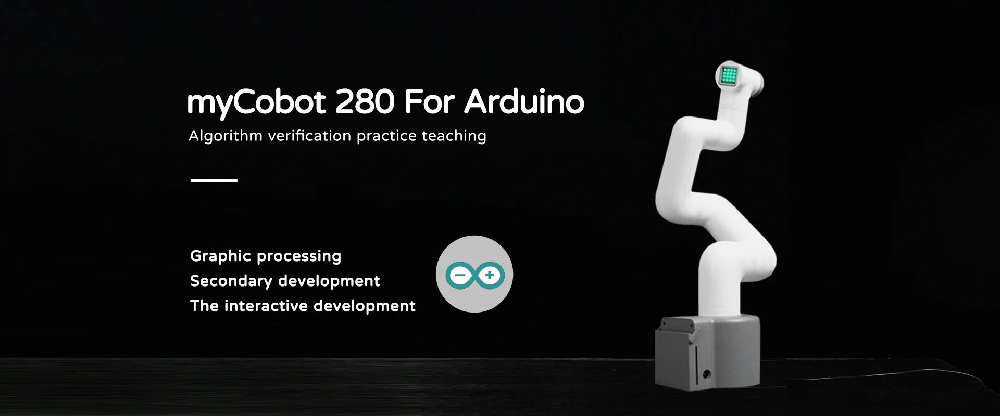
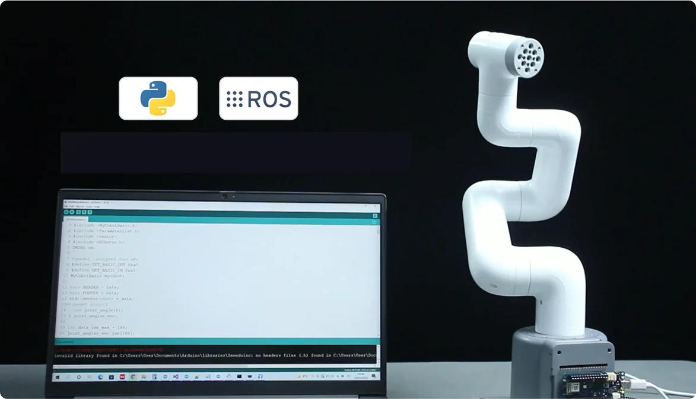
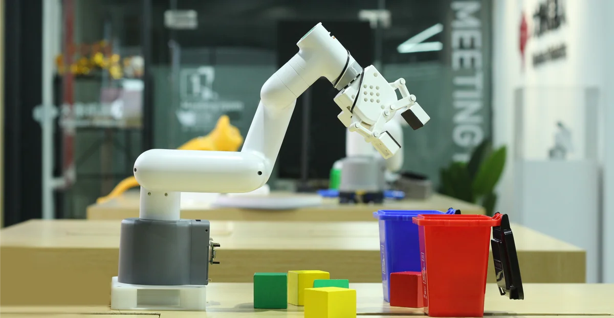
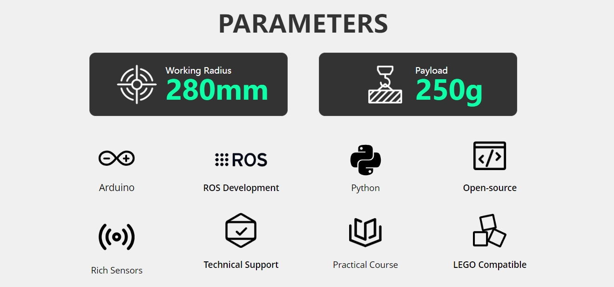

# Chapter 1 Product Introduction
## 1. Product Overview

##### ER myCobot 280 For Arduino

##### Algorithm Verification Practice Teaching

### Product Introduction

The mycobot – 280 for Arduino 2023 robot arm is based on the mycobot 280 collaborative robot arm series and uses the **M5STACK-ATOM ESP32** core control. It is an entry-level product of Elephant Robotics. The device can use **Arduino MKRWIFI1010 \ MEGA2560 \ UNO** and other **support UART serial communication** interface module development version expansion, download the product driver library provided by Elephant Robotics, no need to migrate the development board model, just a simple link, you can start expansion development.

myCobot weighs **860g**, has a payload of **250g**, and an effective working radius of **280mm**; it is small in size but powerful in function. It can be matched with a variety of end effectors to adapt to a variety of application scenarios, supports secondary development of multi-platform software, and meets the needs of **scientific research and education, smart home, commercial exploration** and other scenarios

### Design concept

myCobot 280 For Arduino uses ATOM Matrix ESP32 Development Kit core development board as the main control. It is equipped with the robot motion control operating system firmware independently developed by Elephant Robotics, with built-in kinematic forward and inverse solutions. It supports matching with a variety of Arduino development boards for extended application development. Using the Arduino development board with a variety of sensors officially supported by Arduino, you can quickly build a robotic arm. It is the preferred assistant for machine vision and robot applications, control logic development, robot fusion development, and ROS simulation experiment classrooms, helping you quickly start learning and applying six-axis robotic arms.

### Design Goal

| Design Goal | Description | Application Scenarios and Features |
| ---------------------- | ------------------------------------------------------------ | ------------------------------------------------------------ |
| **Embedded Programming Classroom Learning** | The robot arm has a built-in ATOM Matrix ESP32 Development Kit, which provides the device with powerful kinematic processing capabilities. Supports expansion of multiple models of development boards. | Users can use the official Arduino driver library to experience the latest robot control functions, and can also expand development boards with different functions to meet various scene applications. |
| **High-level language programming teaching** | Supports python2/3 driver library and ROS development framework. Users can use high-level development languages ​​to develop the robot arm. | The product supports development boards with multi-serial port applications. Users can use high-level development languages ​​to control the robot arm and verify the algorithm in a virtual environment, which reduces the requirements for the experimental environment and improves the experimental efficiency. |
| **Creative Development** | The myCobot 280 series robot arm has a built-in robot motion control algorithm independently developed by Elephant Robotics and supports myBlockly drag-and-drop programming. | The open source driver library for robotic arm products provides more than 90+ robot control interfaces, 1:1 restoration of the basic control interface of industrial robots, allowing users to experience programming closer to real industrial robot development and application. |
| **Technology innovation and knowledge dissemination** | myCobot 280 For Arduino can be used as a platform to showcase the latest scientific and technological achievements in commercial exhibitions, aiming to enhance the public's understanding and interest in science and technology, and promote the commercialization of scientific and technological innovation. | By displaying and demonstrating the latest scientific and technological achievements, increase public participation, promote the popularization of scientific and technological knowledge and the market acceptance of scientific and technological products. |

### Product Features

| | |
| ---------------------------------- | ------------------------------------------------------------ |
| **Super extension support, unlimited possibilities** | Standard **UART** serial port, compatible with a variety of development board controls. Support **Arduino MKRWIFI1010\MEGA2560\UNO** and other development version extensions. Provides basic firmware for Mega and MKR development boards, and burns** to expand multiple development** methods. Supports expansion of multiple development control methods such as**Python, ROS, myBlockly, C++, C#**, etc. Supports self-matching** grippers, suction pumps** and other different accessories to achieve more application scenarios. Supports expansion of** artificial intelligence kits** for robot education and teaching. |
| **Unique industrial design, extremely compact** | Integrated design, compact overall body structure, net weight of only 860g, very easy to carry. Modular design, few spare parts, low maintenance cost, can be quickly disassembled and replaced, and plug-and-play |
| **Supports ROS1+ROS2 and graphical programming** | Supports ROS1+ROS2 multi-version applications, so that development is no longer restricted. Supports graphical programming software, making robot programming applications within reach. |
| **High configuration, convenient development** | Contains 6 high-performance servo motors, fast response, small inertia, and smooth rotation. Built-in kinematics forward and inverse solution algorithm, open standard SDK |
| **Graphical programming, support for industrial robot software** | Using myBlockly visual programming software, easy programming on the palm of your hand, simple and easy to use. Support Arduino + ROS open source system |
| **High configuration, with Lego interface** | Contains 6 high-performance servo motors, fast response, small inertia, and smooth rotation. The base and the end are equipped with Lego technology parts interface, suitable for the development of various micro embedded devices. |

## 2. Product application

### User group

| | |
| ---------------------------- | ------------------------------------------------------------ |
| **Educational institution** | The Arduino platform supports a large number of development expansion boards, whether it is basic entry, primary education, or advanced applications, you can find suitable development components. MyBlockly, an image-drag programming software that supports entry-level teaching, puzzle-style programming, and graphical debugging tools, allow novices to easily control the robot arm. |
| **Technical developers and engineers** | myCobot 280 For Arduino has a built-in robot motion control algorithm independently developed by Elephant Robotics, which supports multiple control modes such as angle, coordinate, potential value, and radian value, greatly meeting various control needs. It can effectively support complex data analysis, algorithm development, and verification activities. |
| **Commercial display and public exhibition organizers** | myCobot 280 For Arduino can be expanded to a variety of main controls such as PC, industrial computer, and embedded device, suitable for a variety of application scenarios; multiple accessories can be superimposed to complete complex project applications and meet commercial exhibition displays, such as robot application model display, education and teaching set display, and industrial 4.0 application scenario display. |
| **Geek development enthusiasts** | myCobot 280 For Arduino is based on the Arduino ecosystem and supports a large number of development boards and expansion components, which can greatly meet the development needs of geek enthusiasts. |

### Application scenarios

| **User groups** | **Application scenarios** | **Advantage targets** |
| -------------------------- | ------------------------------------------------------------ | ------------------------------------------------------------ |
| **Teachers and students in the field of education** | - STEM education - Robotics projects - Interdisciplinary research projects - Education and research | - Improve students' interest in science and technology - Enhance hands-on skills and problem-solving skills - Promote innovative thinking and teamwork - Provide a practical platform for data collection and robotics |
| **Makers and technical developers** | - Prototype development - Experimental research - Algorithm testing and verification - Robot trial teaching | - Accelerate research progress - Connect theory and practice - Promote technological innovation - Support multiple programming languages ​​and development environments |
| **Business Presentation and Marketing Professionals** | - Exhibition Display - Technology Demonstration - Brand Promotion | - Attract Potential Customers and Investors - Showcase Company's Technical Strength and Innovative Products - Enhance Brand Influence |

---

## 3. Supported Extension Development

The mycobot series of robotic arms are extremely valuable in the fields of education and scientific research, especially in Python and ROS (Robot Operating System), two widely used development environments. These environments provide strong support, allowing the mycobot series of products to be widely used in machine learning, artificial intelligence research, complex motion control, and visual processing tasks. At the same time, with dozens of accessories such as adaptive grippers, camera flanges, suction pumps, etc., you can give full play to myCobot's creative ideas. Mobile chassis + robotic arm development, low-cost start of robot collaboration, SLAM mapping, autonomous navigation, ROS development environment, six-axis collaborative robot control, visual recognition, inter-device communication and other development content.

| | |
| ------------------------------------------------------------ | ------------------------------------------------------------ |
| **Python** | The robot supports Python and has a complete Python API library. The robot's joint angles, coordinates, grippers, etc. can be controlled through Python. |
| **ROS**| Supports both ROS1 and ROS2 versions, and provides RVIZ simulation environment support.   Allows users to display the robot arm in real time and collect the status information of the robot arm, making myCobot 280 For Arduino suitable for ROS beginners and educational purposes. |
| **Arduino** | Supports providing the open source program MyCobotBasic sample program. At the same time, users can also modify the open source program according to their own needs. |
| **Hardware interface** | Including IO, USB, etc., to facilitate the connection of various sensors and actuators. |
| **Software library** | Provides a wealth of open source libraries and APIs to simplify the development process. |
| **myBlockly** | It is both a graphical programming software and a visualization tool. Users can drag and drop modules to create programs. This process is very similar to building blocks, which is convenient, fast and easy to use. |

---

## 4. Where to buy

If you are interested in purchasing the device, please click on the link below:
Taobao: [https://shop504055678.taobao.com](https://shop504055678.taobao.com)
Shopify: [https://shop.elephantrobotics.com/](https://shop.elephantrobotics.com/)
AliExpress: [https://elephantrobotics.aliexpress.com/store/1101941423](https://elephantrobotics.aliexpress.com/store/1101941423)

---

[Next Chapter →](../2.ProductParameter/2-ProductParameters.md)