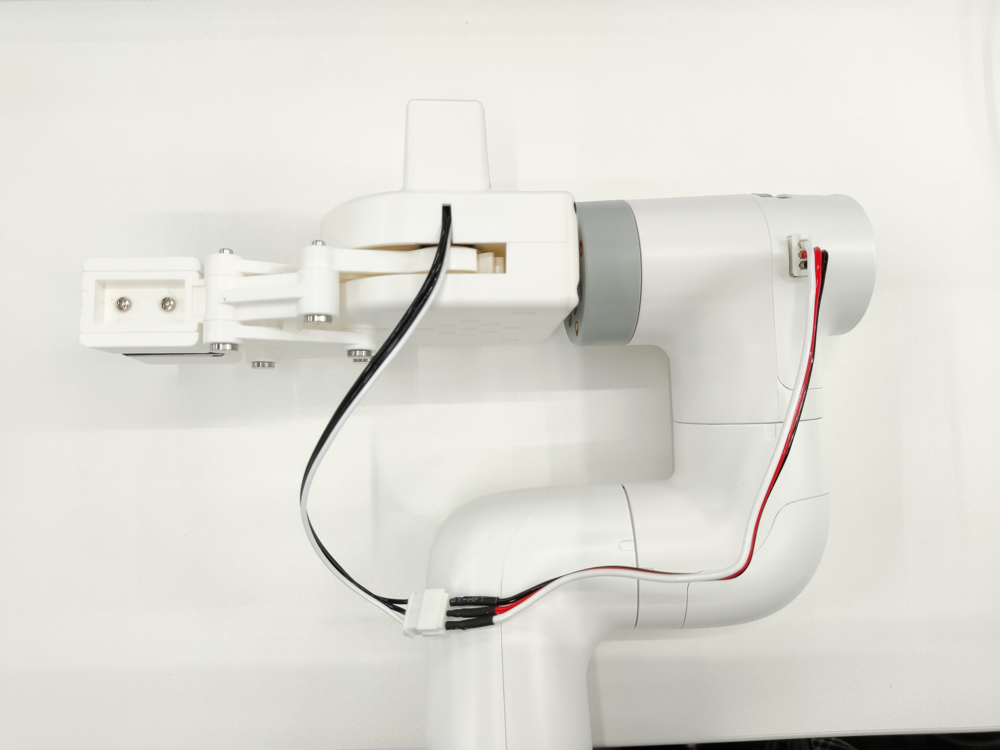

# 280AR remote control case

**Function description**: Use the game controller to control the robot to move coordinates and open and close the gripper

## 1 Gripper installation
Insert the Lego connector into the reserved socket of the gripper


Align the gripper with the connector inserted into the socket at the end of the robot arm and insert it


Connect the extension line to the gripper


Insert the robot arm control interface




## 2 Gripper test
```python
from pymycobot import MyCobot280,utils
import time
arm=MyCobot280(utils.get_port_list()[0], 115200) # The baud rate is 115200 by default, and some boards are 1000000, please modify it according to the actual situation
time.sleep(1.5)
    for i in range(2):
    arm.set_gripper_state(1,100)#Gripper clamped
    time.sleep(1)
    arm.set_gripper_state(0,100)#Gripper open
    time.sleep(1)

```

## 3 Handle function description
**Note**: The handle needs to be purchased separately, please consult the official customer service for details


Plug the receiver of the handle into the computer

|Button|Function|
|---|---|
|Press the direction key↑|RY positive movement|
|Press the direction key↓|RY negative movement|
|Press the direction key←|RX positive movement|
|Press the direction key→|RX negative movement|
|Push the left joystick↑|X positive movement|
|Push the left joystick↓|X negative movement|
|Push the left joystick←|Y positive movement|
|Push the left joystick→|Y negative movement|
|Push the right joystick↑|Z positive movement|
|Push the right joystick↓|Z negative movement|
|Push the right joystick←|RZ positive movement|
|Push the right joystick→|RZ negative movement|
|Press X key|Gripper opens|
|Press Y key|Gripper closes|
|Press A key|Start suction pump|
|Press B key|Stop suction pump|

**Note**: Some of the handle buttons are not used, so they will not have any effect on the robot arm; for more specific button usage, please refer to [Handle Control Usage](../3-FunctionsAndApplications/6.developmentGuide/python/9_HandleControl.md)

## 4 Installation of handle dependency library
Open the terminal and enter the following command to install the handle driver library
```bash
pip install pygame
```
## 5 Preparation
Before connecting to the 12V power supply, you can manually adjust the robot arm to the zero position shown in the figure below, and then enter the 12V power supply and communication data line. There should be no debris around the robot arm to avoid collision


Turn on the switch of the handle


Note whether the MODE LED of the handle is on


**Note**: The robot arm can only be controlled when the MODE LED is on. If the handle is not used for a long time, it will enter the standby state. You can press the START button on the handle to activate it.


## 6 Example program

```python
# coding:utf-8
import pygame
import sys
import time
from pymycobot import MyCobot280
import platform
import threading

if "linux" in platform.platform().lower():
    import RPi.GPIO as GPIO

    # Set GPIO mode
    GPIO.setmode(GPIO.BCM)
    # Set pin 20 (electromagnetic valve) and pin 21 (release valve) as output
    GPIO.setup(20, GPIO.OUT)
    GPIO.setup(21, GPIO.OUT)

# Initialize MyCobot280 with serial port and baud rate
mc = MyCobot280('com3', 115200) # The baud rate is 115200 by default, and some boards are 1000000, please modify it according to the actual situation

init_angles = [0, 0, -90, 0, 0, 0]
go_home = [0, 0, 0, 0, 0, 0]

# Initialize Pygame and joystick modules
pygame.init()
pygame.joystick.init()
button_pressed = False
hat_pressed = False
previous_state = [0, 0, 0, 0, 0, 0]


# Function to turn on the vacuum pump (electromagnetic valve)
def pump_on():
    # 打开电磁阀
    if platform.system() == "Linux":
        GPIO.output(20, 0)
    elif platform.system() == "Windows":
        mc.set_digital_output(33, 0)
        time.sleep(0.05)


# Function to turn off the vacuum pump (close electromagnetic valve and open release)
def pump_off():
    if platform.system() == "Linux":
        # Close valve
        GPIO.output(20, 1)
        time.sleep(0.05)
        # Open release valve
        GPIO.output(21, 0)
        time.sleep(1)
        GPIO.output(21, 1)
        time.sleep(0.05)
    elif platform.system() == "Windows":
        # Close valve
        mc.set_digital_output(33, 1)
        time.sleep(0.05)
        # Open release valve
        mc.set_digital_output(23, 0)
        time.sleep(1)
        mc.set_digital_output(23, 1)
        time.sleep(0.05)


# Function to safely stop the robot (used in a thread)
def safe_stop():
    try:
        mc.stop()
        time.sleep(0.02)
    except Exception as e:
        print("stop error", e)
        previous_state[axis] = 0


# Handler for joystick input events
def joy_handler():
    global button_pressed
    global hat_pressed
    global previous_state
    # Joystick axis movement (analog stick)
    if event.type == pygame.JOYAXISMOTION:
        axis = event.axis
        value = round(event.value, 2)
        if abs(value) > 0.1:
            flag = True
            previous_state[axis] = value
            # jog_coord(index, direction, speed)
            # direction: 0 = negative direction, 1 = positive direction
            if axis == 0 and value == -1.00:
                mc.jog_coord(2, 1, 50)
            elif axis == 0 and value == 1.00:
                mc.jog_coord(2, 0, 50)
            if axis == 1 and value == 1.00:
                mc.jog_coord(1, 0, 50)
            elif axis == 1 and value == -1.00:
                mc.jog_coord(1, 1, 50)
            if axis == 3 and value == 1.00:
                mc.jog_coord(6, 1, 50)
            elif axis == 3 and value == -1.00:
                mc.jog_coord(6, 0, 50)
            if axis == 4 and value == 1.00:
                mc.jog_coord(3, 0, 50)
            elif axis == 4 and value == -1.00:
                mc.jog_coord(3, 1, 50)
            # Axis 2 for servo release
            elif axis == 2 and value == 1.00:
                mc.release_all_servos()
                time.sleep(0.03)
            # Axis 5 to power on
            elif axis == 5 and value == 1.00:
                mc.power_on()
                time.sleep(0.03)
        else:
            if previous_state[axis] != 0:
                # mc.stop()
                threading.Thread(target=safe_stop).start()
                previous_state[axis] = 0
    # Joystick button pressed
    elif event.type == pygame.JOYBUTTONDOWN:
        if joystick.get_button(2) == 1:
            mc.set_gripper_state(0, 100)
        elif joystick.get_button(3) == 1:
            mc.set_gripper_state(1, 100)
        elif joystick.get_button(0) == 1:
            pump_on()
        elif joystick.get_button(1) == 1:
            pump_off()
        elif joystick.get_button(5) == 1:
            mc.send_angles(init_angles, 50)
            time.sleep(2)
        elif joystick.get_button(4) == 1:
            mc.send_angles(go_home, 50)
            time.sleep(3)
    # D-Pad (HAT) movement
    elif event.type == pygame.JOYHATMOTION:
        hat_value = joystick.get_hat(0)
        if hat_value == (0, -1):
            mc.jog_coord(4, 0, 50)
        elif hat_value == (0, 1):
            mc.jog_coord(4, 1, 50)
        elif hat_value == (-1, 0):
            mc.jog_coord(5, 0, 50)
        elif hat_value == (1, 0):
            mc.jog_coord(5, 1, 50)
        if hat_value != (0, 0):
            hat_pressed = True
        else:
            if hat_pressed:
                # mc.stop()
                threading.Thread(target=safe_stop).start()
                hat_pressed = False


# Initialize joystick if detected
if pygame.joystick.get_count() > 0:
    joystick = pygame.joystick.Joystick(0)
    joystick.init()
else:
    print("Not handle detected")
    pygame.quit()
    sys.exit()
# Main loop to process events
running = True
while running:
    for event in pygame.event.get():
        if event.type == pygame.QUIT:
            running = False
        joy_handler()
pygame.quit()
```

## 7 Effect display

