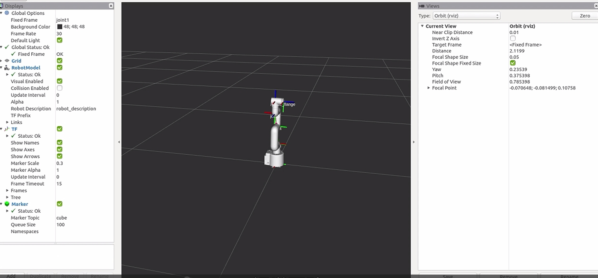

# Robot ROS STAG code visual tracking

## 1 Equipment environment description

myCobot 280 Arduino + Raspberry Pi 4B development board + myCobot camera module + ROS Noetic

## 2 Hardware installation

> Install the camera at the end of mycobot. This visual part uses the eye-in-hand method. After reinstalling the camera, a hand-eye calibration is required.

<video id="my-video" class="video-js" controls preload="auto" width="100%"
poster="" data-setup='{"aspectRatio":"16:9"}'>
  <source src="./img/RASPI4B_Hardware_Installation.mp4" type='video/mp4' >
</video>

## 3 mycobot_ros installation

`mycobot_ros` is a ROS1 package for the mycobot series of desktop six-axis robotic arms launched by Elephant Robotics.

ROS1 project address: [http://github.com/elephantrobotics/mycobot_ros](http://github.com/elephantrobotics/mycobot_ros)

Robot arm API driver library address: [https://github.com/elephantrobotics/pymycobot](https://github.com/elephantrobotics/pymycobot)

In order to ensure that users can use the latest official package in time, you can go to the `/home/er/catkin_ws/src` folder through the file manager, open the console terminal (shortcut key <kbd>Ctrl</kbd>+<kbd>Alt</kbd>+<kbd>T</kbd>), and enter the following command to update:

```bash
# Clone the code on github
cd ~/catkin_ws/src
git clone https://github.com/elephantrobotics/mycobot_ros.git # Before deciding whether to execute this command, please check the following note
cd .. # Return to the workspace
catkin_make # Build code in the workspace
source devel/setup.bash # Add environment variables
```

**Note:** If the `mycobot_ros` folder already exists in the `/home/er/catkin_ws/src (equivalent to ~/catkin_ws/src)` directory, you need to delete the original `mycobot_ros` first, and then execute the above command. Among them, `er` in the directory path is the system user name. If there is any inconsistency, please modify it.

At this point, the ROS1 environment is set up.

## 4 Prerequisites for use

### Python dependency library

Use pip to install the following python libraries

```bash
pip install stag-python

pip install opencv-python

pip install scipy

pip install numpy

pip install pymycobot
```

### Stag code

This article uses stag code for QR code tracking. It is recommended to use color printing. The recognition rate of black and white printing is low.


Download address: [Stag code download](https://drive.google.com/drive/folders/0ByNTNYCAhWbILXd2SE5FY1c3WXM?resourcekey=0-nWeENtNZql2j9AF32Ud8sQ)

**Note**: The upper left corner of the stag code is the number, which can be identified using the opencv stag recognition library. You can design different behavior logic for different numbers, such as 00 is set for position tracking, 01 is set for posture tracking, and 02 is set for returning to the observation point.

## 5 Principle Description

① **Eye-in-Hand visual mode:**

The camera is installed at the end of the robot arm to realize the visual observation mode of "eye following hand". This structure makes it easy for the camera to always face the target and improve the recognition accuracy.

② **STAG code recognition and numbering logic:**

The position and number of the STAG code are recognized in real time through stag-python + OpenCV. Different numbers represent different task instructions (such as: number 00 tracks the object, number 01 returns to the observation point, etc.).

③ **Hand-eye calibration and coordinate transformation:**

In the program initialization stage, hand-eye calibration is completed first, and a 4×4 homogeneous transformation matrix between the camera coordinate system and the robot arm coordinate system is established.

Once the STAG code is recognized, its position can be converted to the coordinate system of the robot arm through matrix transformation to achieve precise positioning.

④ **Target pose calculation and motion control:**

The program calculates the target position based on the recognized STAG code coordinates and the current robot arm pose. Through the topic communication mechanism (Topic) of ROS, motion instructions are issued to control the robot arm to reach the specified position.

⑤ **Behavior control logic:**

According to the number of the STAG code, the program can execute different strategies:

No. 00: Enter the continuous tracking mode, and the robot arm continuously adjusts its position to align with the QR code.

No. 01: Return to the initial observation posture for re-identification.

## 6 Hand-eye calibration

### Hand-eye matrix principle

Hand-eye calibration is an essential part of visual tracking. Its function is to obtain the relative relationship between the robot arm coordinate system (hand) and the camera coordinate system (eye). We use a 4*4 hand-eye matrix to represent this relative relationship. For the specific principle, please refer to: [Hand-eye matrix principle](https://blog.csdn.net/weixin_45844515/article/details/125571550)

### Hand-eye calibration method

> **Note:** After reinstalling the camera, a hand-eye calibration is required.

Install the camera on the robot arm (usually at the end of the robot arm), and connect the robot arm to be controlled

Command line run:

```python
cd ~/mycobot_ros/mycobot_280arduino/mycobot_280arduino/camera_calibration # Switch the terminal to the target path
python3 camera_calibration.py # Camera id, default is 0.
```

[camera_calibration.py](https://github.com/elephantrobotics/mycobot_ros/blob/noetic/mycobot_280/mycobot_280arduino/camera_calibration/camera_calibration.py) ： Implement hand-eye calibration and obtain the transformation matrix from camera to robot arm coordinates

At this time, the robot arm will first move to the observation posture

```python
self.origin_mycbot_level = [-90, 5, -104, 14, 0, 0]
def Matrix_identify(self, ml):
    ml.send_angles(self.origin_mycbot_level, 50)  # Move to observation point
    self.wait()
    ...
```

**Note**: Users can modify the observation point by themselves, such as rotating the 6 joints to put the camera in a more suitable position.

1. After moving to the observation posture, the terminal will pop up the following prompt. Place the stag code in the camera's field of view and enter any key to continue recognition

```bash
make sure camera can observe the stag, enter any key quit
```

If the camera recognizes the stag code, it will automatically enter the next step of recognition. The robot arm moves and captures the position information of the robot arm and camera

2. The terminal will pop up a prompt. After entering any key, the robot arm will relax. According to the prompt, move the end of the robot arm to close to the QR code (see the video for details)

```bash
Move the end of the robot arm to the calibration point, press any key to release servo
```

3. After sticking, according to the prompt, enter any key to complete the hand-eye calibration

```bash
focus servo and get current coords
```

4. At this time, the save successe, wait to verify message will be printed, and the program will automatically enter the verification phase.

**Verification stage:** After completing the calibration, the robot arm will return to the observation posture of the hand-eye calibration. At this time, it will repeatedly identify and verify whether the calibration parameters are correct. Please ensure that the stag code is still within the camera's field of view. If "matrix error" is displayed at this time, it means that the verification has not passed and the calibration program needs to be re-run!

5. At this time, the EyesInHand_matrix information will be printed, which is considered to be completed. The "EyesInHand_matrix.json configuration file is generated. After the calibration is successful, there is no need to repeat the operation!

For specific effects, please refer to the following video:

<video id="my-video" class="video-js" controls preload="auto" width="100%"
poster="" data-setup='{"aspectRatio":"16:9"}'>
  <source src="./img/RASPI4B_Hand_eye_Calibration.mp4" type='video/mp4' >
</video>

**Note**: **Hand-eye calibration may have errors due to improper operation, machine virtual position, etc. When the visual tracking effect is not good, hand-eye calibration needs to be re-performed**

## 7 Program running

>> The control method of the robot arm in this case: Use the topic in ROS for communication.
USB camera startup method: Use the camera usb_cam node in ROS to start.

usb_cam installation command:

```bash
# Ubuntu 20.04 
sudo apt install ros-noetic-usb-cam   
```

Mainly involved code files:

[1. communication_topic.launch](https://github.com/elephantrobotics/mycobot_ros/blob/noetic/mycobot_communication/launch/communication_topic.launch) ： 启动机械臂通信节点（话题模式）

[2. mycobot_topics.py](https://github.com/elephantrobotics/mycobot_ros/blob/noetic/mycobot_communication/scripts/mycobot_topics.py) ： 将 pymycobot 封装为 ROS topic 通信接口

[3. open_camera.launch](https://github.com/elephantrobotics/mycobot_ros/blob/noetic/mycobot_280/mycobot_280arduino/launch/open_camera.launch) ： 启动 USB 相机驱动

[4. listen_real_of_topic.py](https://github.com/elephantrobotics/mycobot_ros/blob/noetic/mycobot_280/mycobot_280arduino/scripts/listen_real_of_topic.py) ： 监听并打印机械臂状态

[5. detect_marker_with_topic.launch](https://github.com/elephantrobotics/mycobot_ros/blob/noetic/mycobot_280/mycobot_280arduino/launch/detect_marker_with_topic.launch) ：一键启动通信+相机，程序初始化入口

[6. detect_stag.py](https://github.com/elephantrobotics/mycobot_ros/blob/noetic/mycobot_280/mycobot_280arduino/scripts/detect_stag.py) ：主控制脚本，识别二维码并驱动机械臂响应

The default camera device parameter in the camera file `open_camera.launch` is `/dev/video0`.

```bash
<!-- //Specify the device file name, the default is /dev/video0 -->
    <param name="video_device" value="/dev/video0" />
```

Run the command line:

```bash
cd ~/catkin_ws
source devel/setup.bash

roslaunch mycobot_280arduino detect_marker_with_topic.launch port:=/dev/ttyAMA0 baud:=1000000
```

+ port: serial port string
+ baud: baud rate

The status of mycobot will be displayed in real time.



Then run the stag recognition and tracking script. Open a new command line:

```bash
cd ~/catkin_ws
source devel/setup.bash
rosrun mycobot_280arduino detect_stag.py
```

After startup, the robot arm will move to the observation point

```python
self.origin_mycbot_horizontal = [-90, -35.85, -52.91, 88.59, 0, 0.0]
ml.send_angles(self.origin_mycbot_horizontal, 50) # Move to the observation point
time.sleep(3)
...

```

Users can modify the observation point by themselves:

```python
def vision_trace_loop(self, ml):
    mc.set_fresh_mode(1)
    time.sleep(1)

    ml.send_angles(self.origin_mycbot_horizontal, 50)  # Move to observation point
    self.wait()
    origin = ml.get_coords()
    while origin is None:
        origin = ml.get_coords()
    time.sleep(1)
    while 1:
        _ ,ids = self.stag_identify()
        if ids[0] == 0:
            self.camera.update_frame()  # Refresh the camera interface
            frame = self.camera.color_frame()  # Get the current frame
            cv2.imshow("Enter any key to exit", frame)

            target_coords,_ = self.stag_robot_identify(ml)
            self.coord_limit(target_coords)
            print(target_coords)
            for i in range(3):
                target_coords[i+3] = origin[i+3]
            ml.send_coords(target_coords, 30)  # The robotic arm moves to the front of the QR code
            # time.sleep(0.5)
        elif ids[0] == 1:
            ml.send_angles(self.origin_mycbot_horizontal, 50)  # Move to observation point
```

- `_ ,ids = self.stag_identify()`

    Here, the stag code ids number is identified, and different behavior logic is set for different numbers, where 0 means tracking and 1 means returning to the observation posture.

- `target_coords = self.stag_robot_identify(ml)`

    target_coords is the calculated stag code coordinates based on the robot coordinate system

- `self.coord_limit(target_coords)`

    The range of motion of the robot arm is limited here, and the user can modify the range of motion by himself

- Since we added a 300mm tool offset to the hand-eye matrix, the calculated target_coords now deviates by 300mm from the actual position of the object. This deviation helps maintain the camera’s observation distance.
  
  ```bash
  self.IDENTIFY_LEN = 300  # To maintain identification distance
  ```

## 8 Effect display

<video id="my-video" class="video-js" controls preload="auto" width="100%"
poster="" data-setup='{"aspectRatio":"16:9"}'>
  <source src="./img/RASPI4B_STAG_Effect.mp4" type='video/mp4' >
</video>
