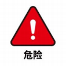
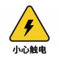

# 用户须知

> 第三章《用户须知》是为了确保用户在使用产品时能够达到既定的安全标准和效率，因此对每个用户而言都是必读的。本章节不仅提供了有关产品使用、运输、储存和维护的基本信息，以确保产品的安全运行和效率最大化，还详细阐述了因不遵守这些准则而可能导致的产品故障或损坏的责任问题。

---

## 1.安全说明

### 简介

本章详细介绍了有关对大象机器人执行安装、维护和维修工作的人员的常规安全信息。请在搬运、安装和使用前，先充分阅读和理解本章节的内容与注意事项。

### 危险识别

协作机器人的安全性建立在正确配置和使用机器人的前提上。并且，即使遵守所有的安全指示，操作者所造成的伤害或损伤依然有可能发生。因此，了解机器人使用的安全隐患是非常重要的，有利于防患于未然。

以下表 1-1~3 是使用机器人的情境下可能存在的常见安全隐患 ∶

**
表 1-1 危险级安全隐患
**

|   |
| :----------------------------------------------------------------------------------------------------------------------------------------- |
| 1 机器人搬运过程中的错误操作导致的人身伤害或者机器人损伤。                                                                                 |
| 2 未按要求固定机器人，例如螺钉缺少或螺钉未上紧、底座锁付能力不足以稳定支撑机器人进行高速运动等造成机器人倾倒，导致人身伤害或者机器人损伤。 |
| 3 未进行机器人的正确安全功能配置，或者少安装了安全防护工具等，造成机器人安全功能未能发挥作用，从而引起危险。                               |

**
表 1-2 警告级安全隐患
**

|                   |
| :----------------------------------------------------------------------------------------------------------------------------------------------------------- |
| 1 调试程序时请勿在机器人运动范围内逗留，不合适的安全配置可能无法避免可能造成人身伤害的碰撞。                                                                 |
| 2 机器人与其他设备连接可能引发新的危险，需要重新进行全面的风险评估。                                                                                         |
| 3 因工作环境中的其他设备或者机器人末端执行器等尖锐表面造成刮伤、刺伤。                                                                                       |
| 4 机器人是精密机械，踩踏可能造成机器人损伤。                                                                                                                 |
| 5 夹持不到位或关闭机器人电源、气源前（未确定末端执行器是否牢固夹持物因为失去动力而掉下）未将夹持的物体取下，可能会引起危险，例如末端执行器损坏、人被砸伤等。 |
| 6 机器人存在意外移动的风险，在任何情况下，切勿站在机器人任何轴的下方！                                                                                       |
| 7 机器人是精密机械，搬运时不能平稳放置可能会引起振动，可能会引起机器人内部部件的损伤。                                                                       |
| 8 机器人与普通机械设备相比自由度更多、运动范围更大，不满足运动范围可能会引起意外的碰撞。                                                                     |

**
表 1-3 有可能导致触电的安全隐患
**

|          |
| :-------------------------------------------------------------------------------------------------------------------------------------- |
| 1 使用非原装电缆可能会引发未知危险。                                                                                                    |
| 2 用电设备接触液体可能导致漏电危险。                                                                                                    |
| 3 电气连接错误时可能存在触电隐患。                                                                                                      |
| 4 请务必在关闭控制器与相关装置电源并拔出电源插头之后进行更换作业。如果在通电的状态下进行作业，则可能会导致触电或故障。                  |

### 安全注意事项

**使用机械臂时应遵循如下安全规则：**

- 机械臂属于带电设备，非专业人士不得随意更改线路，否则容易给设备或者人身带来伤害。
- 操作机械臂时，应当严格遵守当地的法规和规范，手册中所描述的安全注意事项及描述的“危险”、 “警告”和“注意”事项仅作为当地安全规范的补充。
- 请在规定环境范围内使用机械臂，超出机械臂规格及负载条件会缩短产品的使用寿命甚至损坏设备。
- 负责安装、操作、维护 myCobot 机械臂的人员必须先经过严格培训，了解各种安全注意事项，掌握 正确的操作和维护方法之后，才能操作和维护机器人。
- 请勿长时间在潮湿环境下使用本产品。本产品为精密电子元器件，长时间潮湿环境工作会损坏设备。
- 请勿在高温环境下使用本设备。本设备外表面是由光敏树脂为原料制造而成，较高的温度会损坏设备的外壳，导致设备故障。
- 高腐蚀性清洁不适用于机械臂的清洁，阳极氧化的部件不适用于浸没清洁。
- 请勿在未安装底座时使用本产品以避免损伤本设备或意外发生，本产品应在固定且周围无障碍物的环境下使用。
- 请勿使用其他电源适配器供电。如因使用不符合标准的适配器导致设备损坏将不在售后服务内。
- 请勿拆解，拆开，拧开机械臂的螺丝或外壳等。如若拆开，则无法提供保修服务。
- 未经专业培训人员不得擅自维修故障产品，不得擅自拆卸机械臂，若产品出现故障，请及时联系 myCobot 技术支持工程师。
- 若该产品报废，请遵守相关法律正确处理工业废料，保护环境。
- 儿童使用过程中必须有人在旁边监控，运行完成时及时关闭设备。
- 机器人在运动过程中，请勿将手伸入机械臂运动范围，当心碰伤。
- 严禁更改或者去除和修改机械臂以及相关设备的铭牌、说明、图标和标记。
- 搬运、安装过程中请务必小心，应按包装箱上的提示注意轻放、按箭头方向正确放置机器人，否则容易损坏机器。
- **请勿擅自烧录其他产品驱动、或使用非官方推荐方式烧录固件。**如因用户个人烧录其他固件导致设备损坏将不在售后服务内。

**如果您对本手册的内容有任何疑问或建议，请登录大象机器人官方网站提交相关信息：**

https://www.elephantrobotics.com

**请勿将机械臂用于以下用途：**

- 医疗与生命攸关的应用中。
- 可能会引起爆炸的环境中。
- 未经过风险评估直接使用。
- 安全功能等级不够的使用。
- 不符合的机器人性能参数的使用。

---
## 2.运输和储存

### 装箱打包

&emsp;&emsp;在机器人产品进行装箱打包时，请确保使用专为其设计的包装材料和箱体，这些材料能够提供足够的缓冲和支撑，防止运输过程中的撞击和震动。务必检查所有零部件是否已正确固定，避免松动导致损坏。对于易碎或敏感部件，应额外使用防震保护材料进行加固。最后，确保包装箱外标有清晰的搬运和警告标签，指示正确的搬运方式和存放方向。

### 物流运输

&emsp;&emsp;在运输过程中，应使用原始包装运输机器人产品。在运输过程中，应确保机器人产品在包装箱内作为一个整体是稳定的，并通过适当的措施加以保护。在运输和长期储存过程中，环境温度应保持在-20 至+55°C 的范围内，湿度 ≤95%且无凝露。

&emsp;&emsp;由于机器人是精密机械，从包装中取出机器人产品时，应小心处理。在运输过程中，如果不能稳定放置，可能会引起振动并损坏机器人的内部部件。

### 设备储藏

&emsp;&emsp;运输完成后，原包装应妥善存放在干燥的地方，环境温度应保持在-20 至+55°C 的范围内，湿度 ≤95%且无凝露，以备将来重新包装和运输需要。不要将其他物品堆放到机械臂的原包装箱上，防止包装箱变形和机械臂损坏。

---
## 3.维护和保养

作为一家机器人制造商，我们重视确保客户能够正确、安全地维护和升级他们的机器人设备。为此，我们提供以下详细的维护和保养指南，包括常见维护项目及维修或升级硬件的部分，请您认真阅读:

### 常见维护项目及推荐周期

| **维护项目**       | **描述**                                                         | **推荐周期** |
| ------------------ | ---------------------------------------------------------------- | ------------ |
| 视觉检查           | 检查机器人有无明显的损坏、异物堆积或磨损。                       | 日常         |
| 结构清洁           | 使用干净、干燥的布料清洁机器人结构部件。避免水分和侵蚀性清洁剂。 | 日常         |
| 紧固件检查         | 检查并紧固所有螺栓和连接件。                                     | 日常         |
| 润滑               | 对关节和移动部件进行润滑，使用制造商推荐的润滑油。               | 每 3 个月    |
| 电缆和接线检查     | 检查电缆和接线，确保无损坏或磨损。                               | 每月         |
| 电气连接检查       | 确保所有电气连接牢固，无腐蚀或损坏。                             | 每月         |
| 软件更新           | 检查并更新控制软件和应用程序。                                   | 每次有更新时 |
| 软件数据备份       | 定期备份关键软件配置和数据。                                     | 每季度       |
| 固件更新           | 定期检查并更新固件，以获取最新的功能和安全补丁。                 | 每次有更新时 |
| 传感器和器件检查   | 检查传感器和其他关键器件，确保正常工作。                         | 每月         |
| 紧急停止功能测试   | 定期测试紧急停止功能，确保其可靠性。                             | 每月         |
| 环境条件监控       | 监控工作环境的温度、湿度、灰尘等，确保符合机器人的操作规格。     | 持续监控     |
| 安全配置复查       | 定期检查和确认机器人的安全配置，如限速和工作范围设定。           | 每月         |
| 预防性维护计划执行 | 按制造商的维护计划执行定期检查和维护。                           | 按制造商指南 |

### 独立更改机器人硬件的指南

我们理解客户可能会有自行升级或维修机器人硬件的需求。在进行任何升级操作之前，请务必详细阅读产品的相关参数，并与我们的官方人员确认是否被允许进行此类操作。未经官方允许的操作可能导致产品故障，且不在保修范围内。

**物料要求**

官方制造或推荐的物料：所有维修和升级所需的配件和组件必须是由我们官方制造或明确推荐的。这包括但不限于电子组件、传感器、电机、连接件和任何其他可更换部件。

物料获取：客户可通过我们的官方渠道购买所需的维修和升级物料。这确保了配件的质量和兼容性。

**维修或升级流程**

客户自行维修：客户应负责完成维修工作。我们将提供详细的维修指导和手册，以指导客户完成维修步骤。

遵循官方指导：维修操作应严格遵循我们提供的官方指导。任何偏离官方指导的操作都可能导致设备损坏。

**责任和保修政策**

- 责任划分：  
  制造商：提供维修和升级的官方指导、官方制造或推荐的物料，并处理由制造缺陷导致的问题。
  客户：负责按照官方指导完成维修，使用官方配件。

- 保修政策：
  保修有效：只有当维修操作完全遵循我们的指导，且使用官方配件时，保修才有效。
  保修无效：若客户未按官方指导操作，或使用非官方配件进行维修或升级，导致的任何损坏都将不在保修范围内。

**注意事项**

- 安全第一：在进行任何维修或升级操作前，请确保遵循所有安全指南，包括断电和使用适当的防护装备。
- 技术支持：如在维修过程中遇到问题，建议停止操作并联系我们的技术支持团队寻求帮助。

我们强烈建议客户严格遵循这些指南，以确保机器人设备的安全、有效运行。不当的维修操作可能导致设备损坏并影响保修状态。如需进一步的指导或支持，请及时联系我们的专业技术团队。

如果您已经阅读了本章的所有内容，请继续阅读下一章。  
[← 上一章](../../2-ProductInformation/2-ProductParameters/2-ProductParameters.md) | [下一章 →](../4-FirstTimeInstallation/4-FirstTimeInstallation.md)
