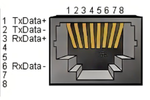
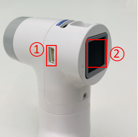
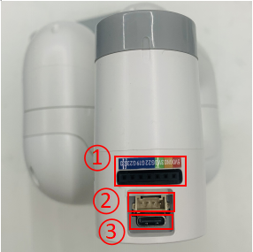
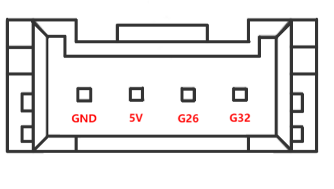
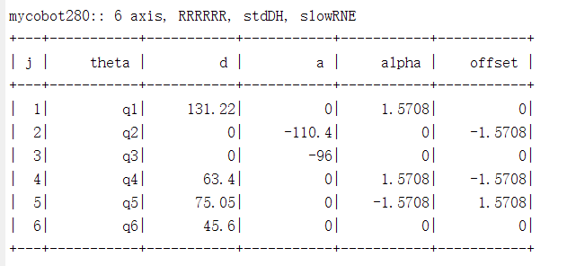

# 第二章 机器人参数说明

> 第一章中，我们探讨了产品的卖点及其设计理念，为您提供了对产品高层次理解的全景视角。现在，让我们进入第二章——机器人参数说明。这一章节将是您理解产品技术细节的关键。详细了解这些技术参数，不仅可以帮助您充分认识到我们产品的先进性和实用性，而且还能够确保您能够更有效地利用这些技术来满足您的具体需求。

## 1机器人规格参数

### 1.1机械臂参数

| 指标       | 参数 |
| :-----------: | :---------: |
| 名称         | 小象协作机械臂 |
| 型号         | myCobot 280 for Jetson Nano 2023 |
| 自由度       | 6          |
| 有效负载     | 250g       |
| 工作半径     | 280mm      |
| 重复定位精度 | ±0.5mm  |
| 重量         | 1030g   |
| 电源输入     | 8-12V   |
| 工作温度     | -5-45℃     |
| 通信         | Type-C     |

## 2.控制核心参数

| 指标       | 参数 |
| :---------: | :------------: |
| 电源接口 | DC 8.4 v -14 v |
| 辅控 | ESP32×1 |
| 核心参数 | 240 MHz dual core. 600 DMIPS, 520KB SRAM. Wi-Fi dual mode Bluetooth |
| 核心Flash | 4MB |
| 核心IO | G19、G21、G22、G23、G25、G33 |
| 主控 | JetsonNano2G |
| SOC        | Broadcom BCM2711     |
| 核心CPU      | Quad-core ARM®A57 @1.43 GHz |
| 核心GPU | 128-core  NVIDIA Maxwell™ |
| 核心Memory | 2 GB 64-bit LPDDR4 25.6 GB/s |
| 核心蓝牙 | 2.4G/5G            |
| 核心网口 | ×1 |
| 核心无线 | 802.11ac |
| 核心视频接口 | HDMI×1 |
| 音频接口 | 3.5mm接口 |
| USB        | USB 3.0×1 USB 2.0×2 |
| IO接口     | 2,3,4,5,6,7,9,11,12,13,16,17,18,19,20,21,22,23,24,25,26,27  |

## 3.结构尺寸参数
### 3.1工作空间

### 3.2规格尺寸

### 3.3关节运动范围

>> **注意**：⚠ 该关节限位信息功能仅在 Atom 固件 ≥ 7.3 且 pymycobot 库 ≥ 4.0.2 时可用。

| 关节       | 范围 |
| :--------: | :----------:|
| J1        | -168 ~ +168     |
| J2        | -140 ~ +140      |
| J3  | -150 ~ +150                   |
| J4        | -150 ~ +150 |
| J5   | -155 ~ +160                   |
| J6   | -180 ~ +180         |

### 3.4孔位安装

- 机器人底座安装法兰，底座同时兼容乐高科技件安装方式和M4螺丝安装方式。

- 机器人末端安装法兰，机械臂末端同时兼容乐高科技件孔与螺丝螺纹孔。

## 4.电气特性参数
## 4.1机械臂底座电气接口

### 底座介绍

A. 底座接口如下图1 所示：

  

  图 1 底座接口
  - ① 开关按钮
  - ② 电源DC接口
  - ③ 功能接口组一
  - ④ Type C
  - ⑤ HDMI
  - ⑥ USB3.0
  - ⑦ USB2.0 
  - ⑧ 网口
  - ⑨ Micro USB

### 底座接口说明

> **注意:** 功能接口组均为2.54mm杜邦接口，外部可使用2.54mm杜邦线。

* A. 底座功能接口组一的各个接口定义如表1 所示：

表 1

| 标签 | 信号名 | 类型 | 功能 | 备注 |
| :---: | :----: | :--: | :------: | :----: |
| GND | GND  | p | GND |  |
| 26 | GPIO26 | I/O | GPIO26 |  |
| 19 | GPIO19 | I/O | GPIO19 |  |
| 13 | GPIO13 | I/O | GPIO13 |  |
| 06 | GPIO6 | I/O | GPIO6 |  |
| 05 | GPIO5 | I/O | GPIO5 |  |
| 00 | GPIO0 | I/O | GPIO0 |  |
| GND | GND  | p | GND |  |
| 11 | GPIO11 | I/O | GPIO11 |  |
| 09 | GPIO9 | I/O | GPIO9 |  |
| 10 | GPIO10 | I/O | GPIO10 |  |
|3.3 | 3.3V | P | DC 3.3V |  |
| 22 | GPIO22 | I/O | GPIO22 |  |
| 27 | GPIO27 | I/O | GPIO27 |  |
| 17 | GPIO17 | I/O | GPIO17 | PAD 占用 |
| GND | GND  | p | GND |  |
| 04 | GPIO4 | I/O | GPIO4 |  |
| 03 | GPIO3 | I/O | GPIO3 | SCL I2C总线(串行时钟线)占用 |
| NC | NC | - | - | 暂不支持 |
|3.3 | 3.3V | P | DC 3.3V |  |
| 21 | GPIO21 | I/O | GPIO21 |  |
| 20 | GPIO20 | I/O | GPIO20 |  |
| 16 | GPIO16 | I/O | GPIO16 |  |
| GND | GND  | p | GND |  |
| 12 | GPIO12 | I/O | GPIO12 |  |
| GND | GND  | p | GND |  |
| 01 | GPIO1 | I/O | GPIO1 |  |
| 07 | GPIO7 | I/O | GPIO7 |  |
| 08 | GPIO8 | I/O | GPIO8 |  |
| 25 | GPIO25 | I/O | GPIO25 |  |
| GND | GND  | p | GND |  |
| 24  | GPIO24 | I/O | GPIO24 |  |
| 23 | GPIO23 | I/O | GPIO23 |  |
| GND | GND  | p | GND |  |
| 18 | GPIO18 | I/O | GPIO18 | PAD 占用 |
| NC | NC | - | - | 暂不支持 |
| NC | NC | - | - | 暂不支持 |
| GND | GND  | p | GND |  |
| 5V | 5V | P | DC 5V |  |
| 5V | 5V | P | DC 5V |  |

> **注意:** 
> 1. I: 仅作为输入。
> 
> 2. I/O: 该功能信号包含输入和输出组合。
> 
> 3. 当管角设置为输出端时，它将输出电压3.3V。
> 
> 4. 1、单个管角的拉电流随管脚数量增加而减小，从约40mA减小到29mA。
> 
> 5. 如果某个GPIO被设置为输出模式时，输出高电平信号，电路连接如图 2 所示，LED灯将点亮。
> 
> 
> 
> 图 2
> 
> 5. 关于功能接口的其他功能表如图3 所示,使用其他功能的情况下，IO功能不可用。
> 
> 
> 
> 图 3

* B. 电源DC接口：使用DC电源插座，外径6.5mm，内径2.0mm；可使用厂家配备的8.4V 5A  DC电源适配器给 myCobot 280 进行供电。

* C. 按键开关：按下后内部上电，按键亮白光；再次按下，白光熄灭，内部断电。
  
* D. Jetson nano 自带供电口，仅给Jetson nano自身供电，无法给整个机器供电，所以电源DC接口可以正常使用的时候无需接此接口。

* E. HDMI ：该接口为HDMI A型接口，如需显示机器人操作界面，用户可以通过连接HDMI显示接口，将操作页面显示到其他设备终端。

* F. USB2.0：以串口总线标准2.0进行数据连接的接口；用户可以使用USB接口拷贝程序文件，也可以使用USB接口连接鼠标、键盘等外设。

* G. USB3.0：以串口总线标准3.0进行数据连接的接口；用户可以使用USB接口拷贝程序文件，也可以使用USB接口连接鼠标、键盘等外设。

   

  图 4

* H. 网口：网络数据连接的端口，用户使用Ethernet接口可以用于PC端与机器人系统的通信交互，也可以用于与其他设备进行以太网通信。

  

  图 5

* I. Micro USB：以串口总线标准2.0进行数据连接的接口；用户可以使用安卓线拷贝程序文件。

## 4.2机械臂末端电气接口
### 机械臂末端介绍

* A. 机械臂末端如图 6 和图7 所示:

   

  图 6 机械臂末端
  - ① 舵机接口
  - ② Atom

  	

  图7 机械臂末端
  - ① 功能接口组二
  - ② Grove
  - ③ Type C

### 末端接口说明

* A. 功能接口组二各个接口的定义如表2 所示:
  

表2

| 标签 | 信号名 | 类型 | 功能 | 备注 |
| :---: | :----: | :--: | :------: | :----: |
| 5V | 5V | P | DC 5V |  |
| GND | GND | P | GND |  |
| 3V3 | 3V3 | P | DC 3.3V |  |
| G22 | G22 | I/O | GPIO22 |  |
| G19 | G19 | I/O | GPIO19 |  |
| G23 | G23 | I/O | GPIO23 |  |
| G33 | G33 | I/O | GPIO33 |  |

> **注意:** 
> 1. I: 仅作为输入。
> 
> 2. I/O: 该功能信号包含输入和输出组合。
> 
> 3. 当管角设置为输出端时，它将输出电压3.3V。
> 
> 4. 1、单个管角的拉电流随管脚数量增加而减小，从约40mA减小到29mA。
> 
> 5. 如果某个GPIO被设置为输出模式时，输出高电平信号，电路连接如图 8 所示，LED灯将点亮。
> 
>  
> 
> 图 8

* B. Type C：可用于和PC端连接通讯，更新固件使用。

* C. Grove : 定义如图 9 所示
  
   

  图 9 Grove 

* D. 舵机接口：用于末端拓展夹爪时使用，当前支持配套的自适应夹爪使用。

* E. Atom：用于 5X5 RGB LED（G27）显示和按键功能（G39）

## 5.DH参数

SDH参数表：

---

[← 上一章](../1.ProductIntroduction/1-ProductIntroduction.md) | [下一章 →](../../2-BasicSettings/3.UserNotice/3-UserInstructions.md)
