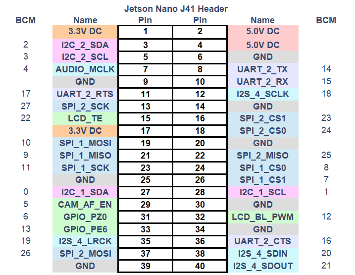
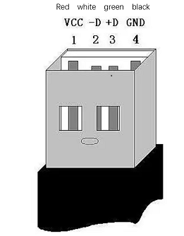

## Jetson nano版本设备使用

### 1 硬件接口使用

### 1.1 40PIN GPIO

- **简介**

  - GPIO全称：通用型输入输出端口（General-purpose input/output）
  
  - 目前我司所有的Jetson nano GPIO与树莓派主板上基本一致，都有一个40针的GPIO头

> 注意：下文都是BCM模式下的GPIO


- **电压说明**

  - 电路板上有两个5V引脚和两个3.3V引脚，以及多个接地引脚(0V)，这些引脚是不可配置的。其余引脚都是通用3.3V引脚，这意味着输出设置为3.3V，输入允许3.3V
  
- **IO输出**
  
  - 指定为输出引脚的GPIO引脚可以设置为高电平(3.3V)或低电平(0V)
  
- **IO输入**
  
  - 指定为输入引脚的GPIO引脚可以读取为高(3.3V)或低(0V)。这是更容易使用内部上拉或下拉电阻。引脚GPIO2和GPIO3有固定的上拉电阻，但对于其他引脚，这可以在软件中配置
  
- **PWM(脉冲宽度调制)**
  
  - 所有引脚均可使用软件控制PWM
  
  - GPIO12, GPIO13可使用硬件控制PWM
  
- **SPI**
  
  - SPI全称为串行外设接口（Serial Peripheral Interface），其是一种高速的，全双工，同步通信总线
  
  - SPI0: MOSI (GPIO10); MISO (GPIO9); SCLK (GPIO11); CS0 (GPIO8), CS1 (GPIO7)
  
  - SPI1: MOSI (GPIO26); MISO (GPIO25); SCLK (GPIO27); CS0 (GPIO24); CS1 (GPIO23);
  
- **IIC**
  
  - I2C，中文全称为集成电路总线，是一种串行通信总线，使用多主从架构
  
  - 数据(GPI02)，时钟(GPI03)
  
  - EEPROM数据：(GPIO0)，EEPROM时钟(GPI01)
  
- **Serial**
  
  - 串口是串行接口（serial port）的简称，也称为串行通信接口或COM接口
  
  - TX (GPIO14)，RX (GPIO15)
  
- **python 控制引脚输出**
  
    ```python      
      import RPi.GPIO as GPIO
      import time
            
      # 初始化
      GPIO.setmode(GPIO.BCM)
      GPIO.setup(20, GPIO.OUT)
      GPIO.setup(21, GPIO.OUT)
      # 高电平
      GPIO.output(20, 0)
      GPIO.output(21, 0)
      # 等待2秒
      time.sleep(2)
      # 低电平
      GPIO.output(20, 1)
      GPIO.output(21, 1)      
    ```
    
- **GPIO的各个接口定义如下表所示：

<center>表 3.5.3.1-1</center>

| 标签 | 信号名 | 类型 | 功能 | 备注 |
| :---: | :----: | :--: | :------: | :----: |
| GND | GND  | p | GND |  |
| 26 | GPIO26 | I/O | GPIO26 |  |
| 19 | GPIO19 | I/O | GPIO19 |  |
| 13 | GPIO13 | I/O | GPIO13 |  |
| 06 | GPIO6 | I/O | GPIO6 |  |
| 05 | GPIO5 | I/O | GPIO5 |  |
| 00 | GPIO0 | I/O | GPIO0 |  |
| GND | GND  | p | GND |  |
| 11 | GPIO11 | I/O | GPIO11 |  |
| 09 | GPIO9 | I/O | GPIO9 |  |
| 10 | GPIO10 | I/O | GPIO10 |  |
|3.3 | 3.3V | P | DC 3.3V |  |
| 22 | GPIO22 | I/O | GPIO22 |  |
| 27 | GPIO27 | I/O | GPIO27 |  |
| 17 | GPIO17 | I/O | GPIO17 | PAD 占用 |
| GND | GND  | p | GND |  |
| 04 | GPIO4 | I/O | GPIO4 |  |
| 03 | GPIO3 | I/O | GPIO3 | SCL I2C总线(串行时钟线)占用 |
| NC | NC | - | - | 暂不支持 |
|3.3 | 3.3V | P | DC 3.3V |  |
| 21 | GPIO21 | I/O | GPIO21 |  |
| 20 | GPIO20 | I/O | GPIO20 |  |
| 16 | GPIO16 | I/O | GPIO16 |  |
| GND | GND  | p | GND |  |
| 12 | GPIO12 | I/O | GPIO12 |  |
| GND | GND  | p | GND |  |
| 01 | GPIO1 | I/O | GPIO1 |  |
| 07 | GPIO7 | I/O | GPIO7 |  |
| 08 | GPIO8 | I/O | GPIO8 |  |
| 25 | GPIO25 | I/O | GPIO25 |  |
| GND | GND  | p | GND |  |
| 24  | GPIO24 | I/O | GPIO24 |  |
| 23 | GPIO23 | I/O | GPIO23 |  |
| GND | GND  | p | GND |  |
| 18 | GPIO18 | I/O | GPIO18 | PAD 占用 |
| NC | NC | - | - | 暂不支持 |
| NC | NC | - | - | 暂不支持 |
| GND | GND  | p | GND |  |
| 5V | 5V | P | DC 5V |  |
| 5V | 5V | P | DC 5V |  |

> **注意:** 
> 1. I: 仅作为输入。
> 
> 2. I/O: 该功能信号包含输入和输出组合。
> 
> 3. 当管角设置为输出端时，它将输出电压3.3V。
> 
> 4. 单个管角的拉电流随管脚数量增加而减小，从约40mA减小到29mA。
> 
> 5. 如果某个GPIO被设置为输出模式时，输出高电平信号，电路连接如图 2.1.5.2-3 所示，LED灯将点亮。
> 
>  
> 
> 6. 关于功能接口的其他功能表如图 3.5.3-1 所示,使用其他功能的情况下，IO功能不可用。
> 
>  


### 1.2 机械臂底座介绍

* A. 底座接口如图 3.5.3-2 所示：

  

  图 3.5.3-2 底座接口
  - ① 开关按钮
  - ② 电源DC接口
  - ③ 功能接口组一
  - ④ Type C
  - ⑤ HDMI
  - ⑥ USB3.0
  - ⑦ USB2.0 
  - ⑧ 网口
  - ⑨ Micro USB


### 1.2 底座接口说明

* A. 电源DC接口：使用DC电源插座，外径6.5mm，内径2.0mm；可使用厂家配备的12V 5A  DC电源适配器给 myCobot 280 进行供电。

* B. 按键开关：按下后内部上电，按键亮白光；再次按下，白光熄灭，内部断电。
  
* C. Type C ：Jetson nano 自带供电口，仅给Jetson nano自身供电，无法给整个机器供电，所以电源DC接口可以正常使用的时候无需接此接口。

* D. HDMI ：该接口为HDMI A型接口，如需显示机器人操作界面，用户可以通过连接HDMI显示接口，将操作页面显示到其他设备终端。

* E. USB2.0：以串口总线标准2.0进行数据连接的接口；用户可以使用USB接口拷贝程序文件，也可以使用USB接口连接鼠标、键盘等外设。


* F. USB3.0：以串口总线标准3.0进行数据连接的接口；用户可以使用USB接口拷贝程序文件，也可以使用USB接口连接鼠标、键盘等外设。

   

* G. 网口：网络数据连接的端口，用户使用Ethernet接口可以用于PC端与机器人系统的通信交互，也可以用于与其他设备进行以太网通信，**由于Jetson nano本身是没有网卡的，所以Jetson nano只能通过网线连接此网口才能上网**。

  

[Jetson nano官方文档](https://developer.nvidia.com/embedded/learn/jetson-nano-2gb-devkit-user-guide#id-.JetsonNano2GBDeveloperKitUserGuidevbatuu_v1.0-Introduction)
