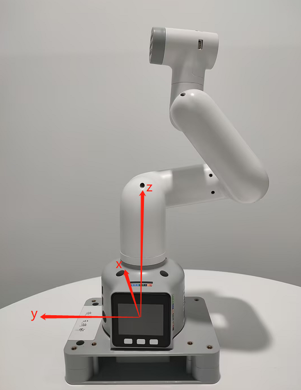
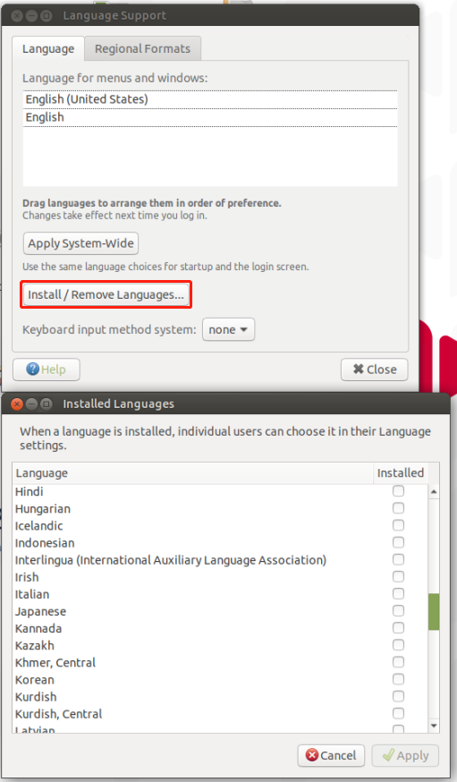

# 其他

**Q：如何彻底关闭热点自启动？**

- A：如果想要彻底关闭开机自启动热点功能，可以将~/.config/autostart/文件夹下的hotspot_on.desktop文件夹移动到其他的文件夹目录，重启机器就可以

**Q：树莓派或者jetson nano中提到需要密码，这个密码是什么？**

- A: 可以尝试以下密码：
    ```bash
    Elephant
    elephant
    aibot1234
    123
    123456
    123321
    aaa
    ```
如果以上密码都无效，那么密码应该不是我们设置的密码，您需要尝试考虑重置系统重置密码，重置方法请参考gitbook第5节。


**Q：mycobot test tool怎么用？**

mycobot test tool这个工具是出厂使用的，不建议用户使用，使用后可能会导致零位或者pid异常的情况，造成机器损坏，请直接删除此工具。
如果已经使用此工具导致机械臂运动异常，请参考下文重新调整pid及零位，并在后续使用过程禁止继续使用此出厂测试工具。
重置pid方法参考链接：
https://drive.google.com/file/d/1UWhaaSTuwLFImuEGY1J2tvgxTQDwWxK_/view?usp=sharing 
零位校准方法参考链接：
https://drive.google.com/file/d/1XtKH-ykKWPH0q9Z_YHwzkgwNKRhstHhi/view?usp=sharing 

**Q：机器异常时如何重置成出厂设置？**

恢复成出厂设置主要在于固件、镜像、pid及零位的重置。以下为重置方案：
- **关于重置固件**：建议务必确保将mystudio更新最新版本，然后下载对应的最新Atom版本固件、minirobot固件（仅存在于M5系列机器）及pico固件（仅存在于320系列机型）重置固件的方法请参考gitbook的mystudio章节
  
- **关于重置镜像**：重置镜像时将清空原系统中的所有内容，如有重要文件，请注意提前保存，重置镜像的方法参考gitbook系统使用章节

- **关于重置pid**：一般情况下当机器出现关节严重抖动，关节动作速度异常，关节蜷缩在一起的情况下可重置pid，重置方法参考：https://drive.google.com/file/d/1UWhaaSTuwLFImuEGY1J2tvgxTQDwWxK_/view?usp=sharing 

- **关于重置零位**：一般情况下当机器出现零位不正确，关节限位异常可重新零位校准，重置方法参考：https://drive.google.com/file/d/1XtKH-ykKWPH0q9Z_YHwzkgwNKRhstHhi/view?usp=sharing 

**Q：使用HDMI线或usb将树莓派或者jetson nano接在个人电脑上，为什么看不到对应的树莓派或者jetson nano系统界面？**

- A：由于树莓派系列机器是自带出厂系统的设备，相当于是一个微型电脑，所以通过HDMI或者USB将两个电脑连接起来的情况下，是只会显示当前电脑的系统界面，而不会显示树莓派系统界面，这是正常现象。
关于如何正确进入树莓派系统，你需要准备一个HDMI屏幕，通过一根HDMI线将HDMI屏幕与树莓派的HDMI接口进行连接，这样才能看到树莓派系统界面。
如果你后续想在电脑上远程树莓派，这也是可行的，你可以查看VNC远程工具，具体使用方法请参考gitbook系统使用资料。


**Q：urdf文件下载路径在哪里？**

- A：请参考以下路径，所有mycobot机型的urdf都在此路径中：https://github.com/elephantrobotics/mycobot_ros/tree/noetic/mycobot_description/urdf 

**Q：树莓派无法开机进入系统怎么处理？**

- A：请按照以下步骤进行检查：

1. 检查HDMI接口线是否有松动，建议让HDMI线拉直，弯曲状态会影响信号传输。


2. 尝试更换一条HDMI线或者HDMI接口测试（树莓派4b上有两个HDMI口，分别是HDMI0及HDMI1。


3. 确认是否是HDMI屏幕（推荐使用1080p），VGA屏幕会出现不兼容，有时无法显示树莓派的画面，建议尝试更换一个HDMI屏幕，测试是否有画面显示。
4. 先完成HDMI接线，再多重启几次机器，重启间隔及开机等待时间建议为3-5分钟
5. 查看gitbook第5章节，重新刷对应的镜像文件。
6. 如果烧录镜像之后仍然无法开机，如过你有网线和路由器，请在机械臂开机状态下，接网线到树莓派的网口，登录路由看下是否有树莓派设备IP，如果没有树莓派的IP，那么这个树莓派损坏了。

**Q：通过串口或socket通讯，经过机器人的控制器控制电机，指令传输延时多大？有通讯时序图吗？实时性如何？**

这边没有串口或socket通讯的延时测试数据，据我们这边开发使用反馈来看，实时性还是挺高的，不会出现很滞后的情况

**Q：280M5机械臂基座标系是怎么样的？**



**Q：280的关节是串口总线的控制方式吗？**

A:是的

**Q: 关于坐标的理解有更多的解释吗？**

A：控制坐标运动的API是send_coords([x,y,z,rx,ry,rz], speed)
**x、y、z 坐标：** 控制了机械臂末端执行器在空间中的位置。改变这些坐标值将使机械臂移动到不同的空间位置，从而实现在三维空间中的定位。
**rx、ry、rz 姿态角度：** 控制了机械臂末端执行器的姿态或朝向。这些值通常以欧拉角的形式给出，描述了机械臂末端执行器相对于基坐标系的旋转，欧拉角顺序是zyx。改变这些值将使机械臂的末端执行器旋转到不同的角度或方向。
例如：
当你调整 +X 时，这表示在当前机械臂末端执行器的位置沿着当前末端执行器的 X 轴正方向移动一定的距离。这个动作会导致机械臂整体向某个方向移动。而当你调整 RX 时，这表示在当前机械臂末端执行器的姿态绕当前末端执行器的 X 轴旋转一定的角度。这个动作会导致机械臂整体发生旋转，末端执行器的方向会发生改变。
综合来看，+X 和 RX 的调整都会直接影响机械臂的运动状态，+X 控制位置的移动，而 RX 控制姿态的变化。
如果你更直观的看到变化，我们建议你使用myblockly的串口控制工具，单次调整一个参数，观察其在坐标系中的变化，请注意在观察rx、ry、rz 的时候如果想更加直观，请注意调整J1关节为0的时候调整x，ry，在关节为90时，调整y和rx
你可以参考下文的坐标系图示：


**Q：280JN-aikit带圾箱的是哪个组或者用哪个urdf呀？**

- A: 目前只有PI版本有带套装内容的urdf，其他机器没有，PI版本的路径参考下图


**Q: 在树莓派上使用vscode，很卡怎么解决？**

- A：参考链接：https://blog.csdn.net/u011296285/article/details/121121118 
参考链接(En)：https://ratticon.com/how-to-fix-slow-visual-studio-code-on-raspberry-pi-4/ 

**Q：PI/JN系列机械臂串口协议如何使用？**

- A:在python代码中可以直接发送串口指令控制关节，不需要外接设备
   
    ```python
    from pymycobot import MyCobot280
    import serial
    import time

    ser=serial.Serial("/dev/ttyAMA0", 1000000)

    command1=bytes.fromhex('FE FE 06 21 01 23 28 14 FA')#J1:90
    command2=bytes.fromhex('FE FE 06 21 01 00 00 14 FA')#J1:0

    ser.write(command1)
    time.sleep(3)
    ser.write(command2)
    ser.close()
    ```


**Q: 关于DH参数的Offset 有更多的解释吗？Offset 是绕z旋转吗?**

A:DH参数描述了机械臂中相邻连杆之间的几何和运动关系。
在DH参数表中，Offset参数表示前一个连杆绕其z轴旋转对下一个连杆位置的影响，即连接两个连杆时的偏移量。对于机械臂中的Offset参数，一般表示上一个连杆绕自己的z轴旋转对下一个连杆位置的影响，而不是绕下一个连杆的z轴旋转。因此Offset不是绕z旋转，而是表示连接两个连杆时的位移。

**Q：系统能添加其他语言吗，比如韩语？**

A：可以，下载语言安装包并应用即可




**Q：能使用mind+控制机械臂吗？**

A：不能，目前没有适配mind+，所以它不能用于控制机械臂，目前推荐用于控制机械臂的方式是myblockly、python及ros，如果你希望使用图形编程，myblockly可以满足你的需求


**Q: 280机械臂供电的电压区间范围是多少?瞬间电流有多大?**
A: 12V  正负10%，5A

**Q: 这些是量化的还是有单位mm/s?**


A:是百分比，100表示最大


**Q: 有做轨迹规划的API是哪个？**

A:请参考设置坐标和关节的API：send_coords()，send_angles()，自带运动规划

**Q: 如果机械臂调用控制坐标的API，会不会出现多解的情况？**

A:因为逆运动学有多解的情况，同一个坐标位置可能以不同的关节角度抵达，是会出现的。

**Q：请问如果对各轴舵机进行角度控制和反馈获取，最短的通讯周期可以做到多少？**

A：这个需要根据速度决定间隔时间，最低响应时间是50ms

**Q：mycobot系列机器有碰撞检测吗？**

A：280带算法碰撞自干涉，已经集成到设置关节角度及坐标的API里了

**Q:Atom的usb接口输入参数是多少？**

A:5V @ 500mA


**Q:vnc拖拽卡顿怎么处理？**

A: 如果是由于在vnc中拖动任何窗口造成的卡顿断连，可以按照下面的图片做一些配置，选项需要与下面的图片一致。成功设置后，将解决由于拖动窗口导致VNC断开的问题。


**Q:树莓派版机械臂如何验证摄像头是否能正常工作？**

A：参考此进行验证：https://blog.csdn.net/Mark_md/article/details/107494841 

**Q:关节扭矩信息提供吗？**

A:我们的机器都只提供整体关节的整体信息，不提供舵机、电机执行单元的内部扭矩、电压电流等参数信息，公开的是机械臂整体参数，如重复定位精度，电源电压等等

**Q:下图中的查看看两坐标之间的关系怎么理解？**


A: 指的是如果你想查看名为 "turtle1" 的坐标系相对于名为 "turtle2" 的坐标系的变换关系，可以使用这个指令，通俗一点来说就是当你运行这个命令时，它会告诉你一个物体（"turtle1"）相对于另一个物体（"turtle2"）的位置和方向信息。就像在地图上你可以知道一个城市相对于另一个城市的位置一样

**Q:ROS2的环境被不小心改动，我可以直接删掉280pi的ROS，自己重新安装吗？**
A:关于ROS重新安装这个问题，我们不建议用户自己重新安装，因为ROS环境的搭建会相对复杂，容易出错，如果需要重置ROS环镜，我们建议用户重新刷写系统镜像，具体方法请参考 [基于ROS开发使用](https://docs.elephantrobotics.com/docs/mycobot-pi-cn/12-ApplicationBaseROS/)

**Q:同一个位置，机械臂到位以后，重复定位偏差过大怎么解决？**

新旧机器都可以通过调pid，尽可能减少偏差，

附：https://docs.qq.com/doc/DU0VhT2JNVUdNUEJS，https://drive.google.com/file/d/1UWhaaSTuwLFImuEGY1J2tvgxTQDwWxK_/view?usp=sharing
但是旧版机器因为机械臂的2、4关节存在齿轮间隙，容易在重力的作用下产生关节偏差，最终影响末端精度，这四组关节值中2、4关节的受力不一致，所以精度也不太一样。目前建议通过程序进行调整，当机器到达点位后，可以在此点位再读一次点位，检查如果存在偏差，在此基础上再单关节调整具体偏差值，以达到到达指定点位的效果。

**Q:API和串口指令直接控制关节有什么区别？**

A:
1. 串口指令：
     - a.串口指令是以原始的二进制数据形式发送到机械臂控制器的。
     - b.通常需要对每个关节的角度、速度、加速度等参数进行手动编码，然后将其转换为十六进制形式发送。
     - c.需要了解每个指令的格式和含义，并确保正确地发送到控制器。
     - d.直接发送串口指令更加灵活，但也更加复杂，需要对机械臂控制器的通信协议有深入的理解。
2. API控制：
   - a.API提供了高级的函数接口，可以更方便地控制机械臂的运动。
   - b.不需要手动编码二进制指令，而是调用API函数，将所需的参数传递给函数即可。
   - c.API通常会隐藏底层通信细节，提供更简洁、易于使用的接口，降低了使用的复杂度。
   - d.通常会提供各种方便的功能，如路径规划、运动插补等，使得控制更加灵活和高效。

总得来说：
使用串口指令直接控制机械臂更加灵活，但也更加复杂，需要对通信协议有深入的了解；而使用API控制更加简单方便，但可能会受限于API提供的功能和性能。

**Q:点击打开某程序或应用提示密码，这个密码是多少？**


A：密码：aibot1234

**Q：pi如何固定机械臂的ip？**

A : 固定ip： 使用终端输入： sudo nano /etc/dhcpcd.conf


然后自己配置一下网络信息即可。

**Q：MDI和JOG的区别是什么？**

A: MDI（Manual Data Input）称为设定值直接给定运行方式。即上位控制器直接设 置目标位置、速度、加减速度后，轴自动移动到目标位置的定位方式。MDI 也是 实际应用中最常使用的一种定位功能。
JOG朝某一方向连续移动。


**Q:各个机型pymycobot的最新支持版本是什么？**


**Q: DH表 如何区分标准和改进**

sdh，std，标准   mdh，modify，改进
我们提供的是标准DH表，客户如果需要可以自己去转化，只是两种不同的描述方式。


**Q:报错缺少opencv_camera,如何处理？**


A:报错是显示缺少可执行权限，可能需要添加权限


改为用mycobot_280的，不需要用pi本身的了，因为m5那边占用有文件了，两边不能同时占有，否则会造成后面的编译失败。


**Q:适配器指示灯不亮**

A:有可能是短路后适配器自我保护断电了，适配器断开几分钟再使用。几分钟不行就再久一点15分钟后单独给适配器上电看亮不亮。

**Q：末端零位异常**

A:长时间使用自适应夹爪夹取物品后会出现夹爪和末端零位异常的现象，需要将夹爪静止。

**Q：什么的是正向运动学和逆向运动学？**

A：正向运动学（Forward Kinematics）是指已知机器人各个关节的角度（或位移），求解机器人末端执行器（如机械臂的手爪）在笛卡尔空间中的位置和姿态。get_coords()的API中实现了，但是具体的算法不公开。
逆运动学（Inverse Kinematics）与正向运动学相反，它是指已知机器人末端执行器在笛卡尔空间中的位置和姿态，求解机器人各个关节的角度（或位移）write_coords()、send_coords()
