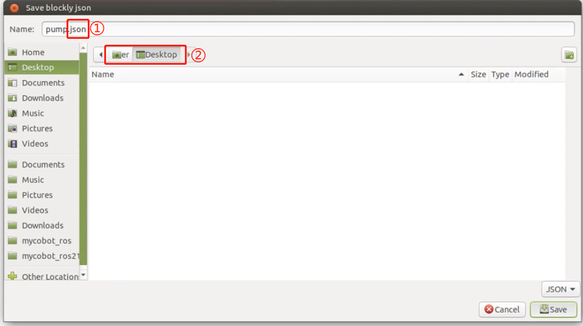
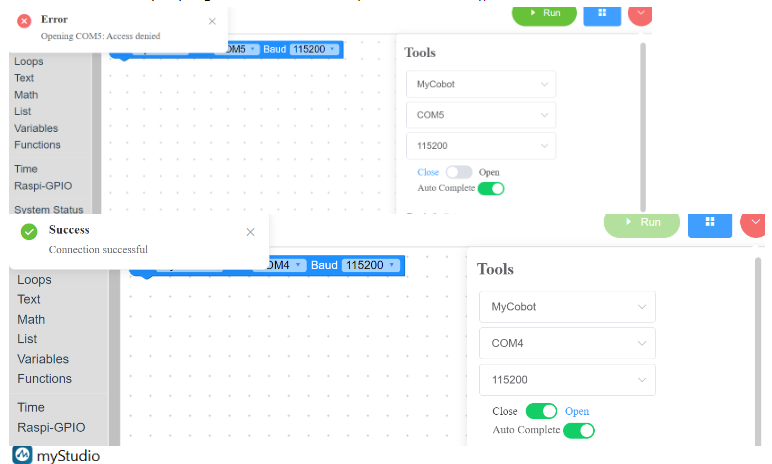

# 软件问题

## 1 myStudio相关

**Q：myStudio是什么？**
- A: 是我们公司自研软件。它是一款给我们公司推出的现有机械臂进行固件烧录或修改的工具。


**Q：minirobot、Atom、PICO固件下载异常排查方法是什么？**

1. 检查网络连接是否正常，下载固件的过程中是需要连接网络先下载固件的。
   
2. 检查线路是否已经连接完成，细节如下：
   在PI/JN系列机器中，烧录Atom时需要使用`USB线将末端的Atom接口与树莓派usb口连接`；

例如：
280pi烧录Atom的视频：https://drive.google.com/file/d/1ErsdxNe-VT9_n34Gf-5yLK1DDQvCWgbq/view?usp=sharing 

3. 选择对应机型的固件，不要选错其他机型的。
   
4. 下载并安装驱动，如果下载驱动后仍然无法识别，可尝试更换最新的 [ch340驱动](https://www.wch.cn/download/CH341SER_EXE.html) ，如果安装了驱动之后仍然无法显示端口号且系统为win11机型，可尝试 [Win11系统装CH340驱动方法](https://blog.csdn.net/m0_52242552/article/details/126219464)。
   
5. 尝试换一个usb线缆、usb端口或者电脑下载试试，避免线缆不具备数据传输功能导致固件下载异常。
   
6. 卸载mystudio，重新将mystudio安装在非C盘位置试试，例如将mystudio安装在D盘。在mystudio安装在C盘时，对文件权限要求相对苛刻，可能会出现固件无法烧录的情况。


**Q：为什么我对ATOM终端烧录固件后设备无法正常运转？**
- A：ATOM终端的固件需要使用我们出厂固件，使用中不能更改其他非官方固件，设备如意外烧录其他固件，可以使用“myCobot固件烧录器”选择ATOM终端-选择串口-选择ATOMMAIN固件对ATOM终端进行烧录。


**Q：固件中的拖动示教是否可以记录夹爪动作？**
- A：暂时无法实现使用拖动示教记录夹爪动作，因为夹爪属于编号7关节，我们的拖动示教只能做到对编号1-6关节的运动记录与播放。


**Q：烧录了minirobot固件之后仍然无法拖动示教是为什么？**
- A：首先检查一下是否M5Stack-basic固件与atom固件都烧录了，烧录的固件是否对应所要实现的需求以及烧录的是否是最新版本的固件。
- 这里推荐将minirobot固件烧录至v2.1版本，顶部atommain固件烧录至v4.1版本及以上（需要支持mystudio版本在v4.3.1及以上）。

**Q：mystudio上识别不到mycobot的串口怎么办？**
- A：如果您的电脑设备对连接的机械臂不提示，请先安装串口驱动。
- 另外需要注意的是，树莓派、Arduino和Jetson nano系列机械臂是**无法使用数据线连接到笔记本电脑的**，需要在内置的系统中使用mystudio进行固件烧录。

**Q：拖动示教录制轨迹，能否存到卡里？**

- A：目前无法存到内存卡中。并且拖动示教只能一次存一条路径，下一次录制会覆盖之前的动作。

## 2 myblockly相关

**Q: 遇到报错信息：ModuleNotFoundError: No module named “pymycobot”，如何处理？**


- A: 报错提示缺少pymycobot文件的包括原因及解决方法参考下文3点：
①没有安装pymycobot或者pymycobot出错，对应的解决方法是重新安装pymycobot，指令是pip3 install pymycobot --upgrade --user

**Q:  myblockly的快递移动工具无法显示实时角度怎么处理？**

- A:这个一般是由于设备串口信息选择错误、pymycobot异常导致的，建议根据本文的"首次使用自查"方案进行排查，如未能正常控制机械臂，请尝试更新pymycobot，对应更新方案是在cmd或者终端中输入指令`pip install pymycobot --upgrade --user`
最后如果仍然无法正常控制，请尝试更新myblockly软件，更新方法请参考下面的链接：
https://drive.google.com/file/d/1yBWzhbSBUYsZPBl7PBdZKRwk3al71Dc7/view?usp=sharing 

**Q：运行程序结果显示 child process exited with code 1，正常吗？**

- A: 这个不是报错。是全部的程序都运行结束返回了二进制数字1。代表已经全部顺利运行完成。

**Q：在PI或JN中保存myblockly程序怎么不生效或者找不到文件？**

①需要在保存文件后缀名应该是添加“.json”，例如：“pump.json”
②需要确认保存的路径，在保存的路径下寻找保存后的文件

可以参考视频：https://drive.google.com/file/d/1g_dd933TK1tptnisUad4PBfwSRsWWFeQ/view?usp=sharing 



**Q：如何在myblockly中预设代码块内容，包括进入系统后机型、波特率等信息都是对应接入的机型的？**

A：目前在myblockly中初次启动默认的机型是mycobot、波特率115200，暂时没有更改初始波特率的方法，但是你可以自己制作保存一个初始化的json文件，下次进入myblockly后加载此文件可得到预设的代码块。
制作及保存json文件的方法请参考下文：https://drive.google.com/file/d/1g_dd933TK1tptnisUad4PBfwSRsWWFeQ/view?usp=sharing 

**Q：为什么选择某个com口的时候会被拒绝连接？或者说怎么找到对应的com口是什么？**



被拒绝连接的原因是由于com口选择错误，当你有多个设备连接在电脑usb上的时候，在myblockly中也会显示有多个串口，比如上图的com4和com5，但是其中只有一个是机械臂的，需要选择机械臂的串口才能正常连接使用机械臂，显然能正常连接的com4是当前的机械臂对应串口号。
关于如何在多个串口中找到机械臂对应的串口，对应的方法是：尝试拔插与机械臂连接的串口线，查看是哪个串口号在断开机械臂与电脑的usb连接之后也消失在myblockly的串口号选项中，当重新使用usb连接机械臂与电脑之后，这个串口号又出现在myblockly的串口号选项中，这个伴随机械臂与电脑的断开及连接而同步消失及再现在myblockly中的串口号就是机械臂对应的串口号。
注意机械臂com口数字的选项并不是一直固定的，接在不同电脑的usb端口或者同一电脑的不同usb端口上，都有可能发生变化，建议以上述方法查看实时的com口号。

**Q：报错 MyCobot._int_() takes 2 positional arguments but 3 were given.**

这个报错会在旧版本的myblockly中出现。原因是因为myblockly和pymycobot的版本对不上。
可通过更新一下myblockly以及pymycobot驱动库的版本解决。
M5版本机器直接在官网软件下载页最新myblockly；pi及jn版本的机器myblockly的更新请参考链接：https://drive.google.com/file/d/1yBWzhbSBUYsZPBl7PBdZKRwk3al71Dc7/view?usp=sharing 
pymycobo更新指令是`pip3 install pymycobot --upgrade --user`

## 3 RoboFlow相关

**Q：无法下载Roboflow软件，Roboflow无法正常控制机器如何处理？**

- A：目前Roboflow软件仅支持600/630这两款Pro 专业协作，不再支持mycobot协作型或其他型号机器，mycobot系列机器建议使用的控制方式是myblockly、python及ros，值得一提的是，myblockly是一款与Roboflow图形化界面相似的软件，如果您需要使用可视化图形编程可优先考虑使用myblockly软件。
  ​				
## 4 Python相关

**Q：运行提示缺少库文件Q:遇到报错信息：ModuleNotFoundError: No module named “pymycobot”，如何处理？**

- A1：没有安装pymycobot，对应的解决方法是重新安装pymycobot，指令是`pip3 install pymycobot --upgrade --user`

**Q：send_coords(coords, speed, mode)中的mode有没有通俗一点的解释？**

- A：线性1代表机械臂末端以直线的方式抵达目标位置，如果因为限位、结构等原因无法走直线，那指令就不会完全执行；
线性0表示末端以任意姿态抵达目标位置，由于没有直线的限制，不容易出现指令不执行的现象。

**Q：set_fresh_mode(mode) 的插补和刷新模式有什么区别？**

- A: 插补0是指起始点和终止点之间规划了很多密集的点位，从而达到控制中间段轨迹的效果。
如何达到程序并行的效果：非插补1就是没有中间段的规划，控制不了轨迹，但是运动会相对平滑。

**Q：在仅改变Z轴的情况下，轨迹不是直上直下的，但是最后落点是只改了Z轴，这个正常吗，如何确保中间轨迹也是直线？**


- 开插补走直线就能确保轨迹了
  ```python
  set_fresh_mode(0) # 开插补
  send_coords(coords, speed, mode=1) # 走直线
  ```

注意一定要开插补之后，在send_coords设置的智能规划路线才有用。
插补是指起始点和终止点之间规划了很多密集的点位，从而达到控制中间段轨迹的效果。
非插补就是没有中间段的规划，控制不了轨迹。

**Q：get_error_information()的返回值为-1是什么意思？**

- A：`get_error_information()`的返回值为-1，表示无法正常通讯，你需要检查电源适配器及usb线是否连接，检查LCD屏幕是否停留Atom：ok界面，如果线路未连接成功，且未显示ok均会出现通讯异常的情况，需要重新连接再测试。

**Q：280JN无法使用拖动示教功能怎么处理？**

1. 请从github上下载最新的源码，不要直接使用系统自带的源码文件
2. 需要将pymycobot更新到3.2.8，pip install pymycobot==3.2.8
3. 注意先按f释放关节后再按r才能录制，直接按r处于锁住的状态是无法拖动的


**Q：用280机器的绘制案例是发现形状轨迹不是很直，能优化吗？**


- A1：使用签字笔硬质文具等来用这个绘制案例，得到轨迹有偏差这是正常 的。这种偏差主要有2个原因造成，一是由于mycobot使用的是伺服舵机，有一定的精度偏差（如果是使用时间较长的机器，由于关节老化，其关节的偏差会更大），二是在使用硬笔在绘画时跟桌面接触距离比较苛刻，距离过高轨迹容易产生轨迹中断，距离过低会出现笔尖阻力过大卡顿的问题，所以绘制出来的效果并不理想。目前建议使用软质文具进行绘画，例如毛笔毛刷等工具，这对改善绘画效果有一定帮助。

- A2：另外，你可以将机械臂的运动模式更改成插补模式，这样运动轨迹会相对平直。

  ```python
  set_fresh_mode(0) # 开插补
  send_coords(coords, speed, mode=1) # 走直线
  ```

  注意一定要开插补之后，在send_coords设置的智能规划路线才有用。
插补是指起始点和终止点之间规划了很多密集的点位，从而达到控制中间段轨迹的效果。

**Q：更新pandas遇到报错如何处理？**

A：如果在尝试将 pandas 安装到 Python 时遇到 "没有找到合适的发行版 "的错误，有几个步骤可以尝试解决这个问题：
更新 pip： 确保已安装最新版本的 pip，运行
```bash
pip install --upgrade pip
```
 使用最新版本的 Pandas，因为它们通常包含最新功能并修复了已知错误。
 ```bash
pip install pandas --upgrade
```
使用特定版本： 与其安装最新版本，不如尝试安装已知与您的 Python 版本兼容的特定 pandas 版本。例如
```bash
pip install pandas==1.1.5
```
使用虚拟环境： 为项目创建一个虚拟环境，并尝试在该环境中安装 pandas。这有助于隔离依赖关系，避免与其他软件包冲突。
```bash
python -m venv myenv
source myenv/bin/activate # 在 Unix/Linux 上激活虚拟环境
myenv\Scripts\activate # 在 Windows 上激活虚拟环境
pip install pandas
```

请注意，你应该检查网络连接和版本库： 确保网络连接稳定，并能访问 pandas 所在的 Python Package Index (PyPI) 软件源。


**Q:识别到的目标位置，末端无法到达，怎么判断这个坐标是否可以到达然后处理？**

- A：solve inv kinematics(target coords, current_angles)用这个接口看是否有解就可以了。
  solve_inv_kinematics(target_coords, current_angles)
  - 功能 : 将坐标转为角度。
  - 参数：
    - target_coords: list 所有坐标的浮点列表。
    - current_angles: list 所有角度的浮点列表，机械臂当前角度
  - 返回值: list 所有角度的浮点列表。

**Q：280jn使用socket在机械臂操作系统建立客户端脚本，脚本报错This module can only be run on a Raspberry Pi**

A:需要把关于树莓派的指令全部注释掉，底层驱动库不一样，有GPIO的都注释


## 5 ROS相关

**Q：如何重新下载ROS源码包？**

- A：使用指令拉取：
  
  ```bash
  git clone https://github.com/elephantrobotics/mycobot_ros.git
  ```

  或着手动下载，下载方法进入到ROS源码包地址按照下图进行操作，源码包地址：https://github.com/elephantrobotics/mycobot_ros

  


**Q: 运行ROS moveit案例发现报错ImprotError：No module named yaml咋办？**


- A：在这个脚本开头第一行，把Python解释器改为python3

**Q:使用基于mujoco的环境进行仿真训练，因此需要机器人的xml文件**

- A:目前GitHub上只有280JN的xml文件：[280JN](https://github.com/elephantrobotics/mycobot_mujoco) 
- 提供给客户如何将dae、urdf类型的文件转换成xml文件的方法给客户，让客户用[meshlab自行转换]([https://blog.csdn.net/qq_43309940/article/details/128292151?spm=1001.2101.3001.6650.1&utm_medium=distribute.pc_relevant.none-task-blog-2defaultCTRLISTRate-1-128292151-blog-131092562.235^v38^pc_relevant_yljh&depth_1-utm_source=distribute.pc_relevant.none-task-blog-2defaultCTRLISTRate-1-128292151-blog-131092562.235^v38^pc_relevant_yljh&utm_relevant_index=2)。

**Q：终端切换到~/catkin_ws/src中使用git安装并更新mycobot_ros时，出现目标路径"mycobot_ros"已经存在，原因是什么？**
- A：说明`~/catkin_ws/src`中已经存在一个`mycobot_ros`程序包，需要提前将其删掉，再重新执行git操作即可。

**Q：编译完成后，新开终端运行launch指令时，为什么会出现下面的错误？**

   


 - A1：系统没有添加ros环境变量，所以每次开启新终端都要source：

```bash
cd ~/catkin_ws/
source devel/setup.bash
```

- A2：系统添加ros环境变量，每次开启新终端后无需执行source：

```bash
# noetic为Ubuntu20.04系统
echo "source /opt/ros/noetic/setup.bash" >> ~/.bashrc
source ~/.bashrc
```

- A3：可能是指令中的文件名与实际中mycobot_ros包里面的文件名不一致，请仔细检查指令是否有误。

## 6 C++相关

**Q：找不到各种dll文件怎么处理？**

- A1：如果myCobotCpp.dll缺失，将之前放到lib目录下的myCobotCpp.dl放到mycobotcppexample.exe所在目录下.
- A2: 如果报缺少QT5Core.dll，打开qt command (菜单栏搜索QT) ，选择msvc2017 64-bit，执行windeployqt--release myCobotCppExample.exe所在目录(如: windeployqt --release D:lvs2019myCobotCpploutlbuildlx64-Releaselbin) 此处执行命令后如果报找不到vs安装路径，请检查vs环境变量的设置.

以上步骤执行后，如果报缺少qt5serialport.dll文件，将gt安装目录处的此文件(路径如: D:lgt5.12.1015.12.10msvc2017 64bin)，拷贝到myCobotCppExample.exe所在目录

**Q：生成myCobotCppExample.exe可执行文件，这个有可能是什么问题？**

选择下图中的启动

