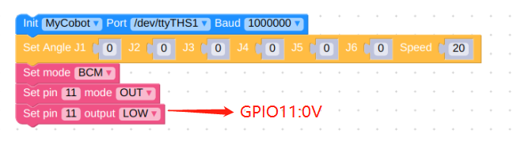

# 硬件问题

**Q: 关节抖动、关节角度偏差过大或关节无力下坠如何优化？**

1. 参考机器人参数介绍章节，检查实际负载是否在机械臂有效负载范围内，负载过大会导致关节抖动，可适当减轻实际关节的负载

2. 将运动模式更改成刷新模式，这样会机械臂的运行轨迹会相对平滑，具体的API，请参考
set_fresh_mode(1)

1. 查看以下链接内容调整pid：https://drive.google.com/file/d/1UWhaaSTuwLFImuEGY1J2tvgxTQDwWxK_/view?usp=sharing
2. 查看gitbook章节，使用mystudio下载对应版本的Atom固件，建议下载最新的
3. 查看gitbook第5章节，对机械臂进行零位校准，也可参考下面链接的校准步骤：https://drive.google.com/file/d/1XtKH-ykKWPH0q9Z_YHwzkgwNKRhstHhi/view?usp=sharing
4. 使用时间较长的机器(3个月以上)可能会出现关节老化产生关节间隙的情况，可按照以下视频，手动掰动关节，查看是否存在关节虚位：https://drive.google.com/file/d/1tXDUALmfw1z0u6lM9uH5hOHivjbRoWxW/view?usp=sharing
5. 如果存在关节老化虚位问题，这种抖动则属于机器自然老化无法避免。

**Q: 什么是关节零位点？**

以下图为例，关节与关节外壳边缘之前会设计有一个拱形槽，这个就是关节零位点

一般校准后零点姿态如下：

特别注意270的关节零位姿态如下：

**Q：有没有零位校准的方法？**

请参考gitbook第5章节或者下面这个链接：

https://drive.google.com/file/d/1XtKH-ykKWPH0q9Z_YHwzkgwNKRhstHhi/view?usp=sharing

**Q:mycobot260/270/280系列PI/JN机器的GPIO如何使用？**

A：以280JN为例，请参考下图源码，其他机型注意更改设备串口信息。

且注意切勿使用被占用的引脚，如280JN被占用的引脚有GPIO0,1,3等，具体请参考对应机械臂gitbook资料的GPIO说明

**注意：转动机械臂时应小角度、轻轻地转动，到达限位后就不可用力继续转动。**

**Q：atom在机械臂中的作用是什么？**

- A：atom在机械臂中主要进行机械臂的运动学算法控制：包括了正逆运动学，选解，加减速，速度同步，多次方插补，坐标转换等，需要的实时控制与多线程等。atom的相关程序暂不开源。

**Q：不同版本的机械臂支持什么通信接口？**

- A：基于微处理器的机械臂支持socket通信TCP；基于微控制器的机械臂可以USB转串口通信。

**Q：电机使用过程中自动断电，是为什么？**

- A：使用时间较长电机过热保护。此现象是正常现象，等待几分钟后即可继续使用。

