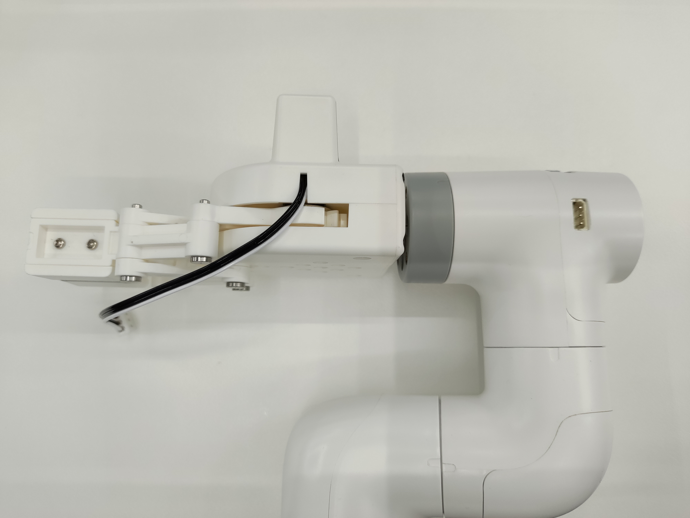
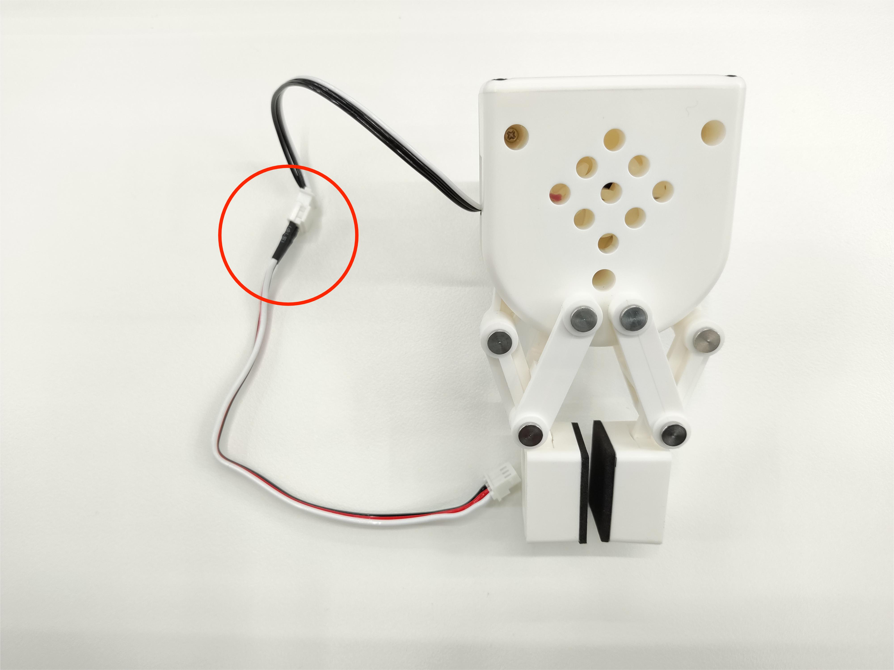
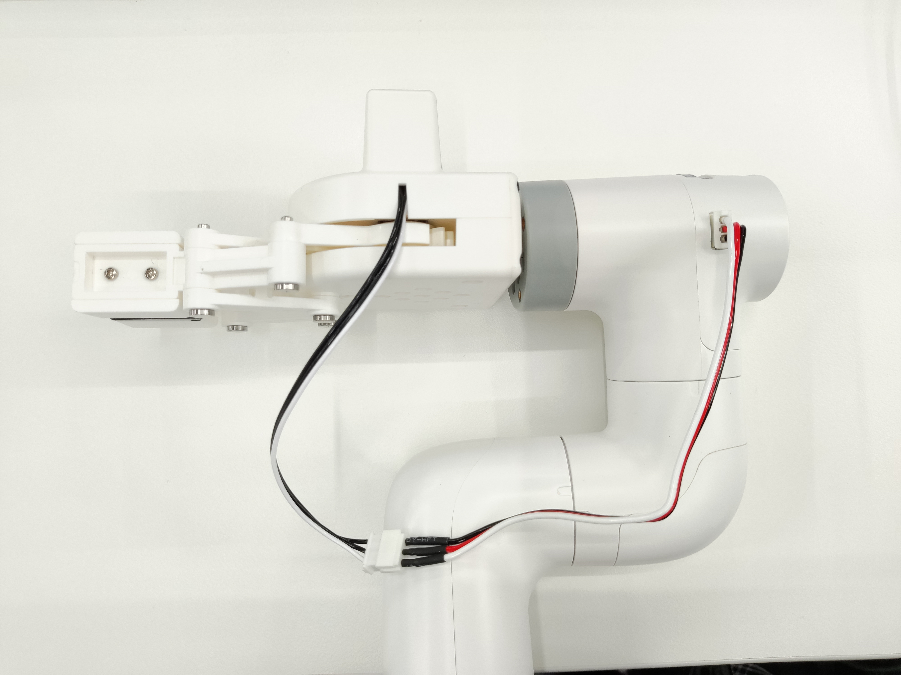

# 机器人夹爪搬运木块案例

## 1 功能说明
机器人会使用夹爪将木块从A点搬运到B点

## 2 硬件安装
将乐高连接件插入夹爪预留的插孔中


将插好连接件的夹爪对准机械臂末端插孔插入


将延长线与夹爪连接



插入机械臂控制接口




## 3 夹爪测试
运行下面程序，夹爪会重复2次闭合张开的动作
```python
from pymycobot import MyCobot
import time

arm=MyCobot("/dev/ttyTHS1", 1000000)
for i in range(2):
    arm.set_gripper_state(1,100)
    time.sleep(1)
    arm.set_gripper_state(1,100)
    time.sleep(1)
```
## 4 软件使用
利用myblockly的快速移动功能，对木块的抓取点和放置点进行示教，并且记录下位置信息,示教完后，需要断开串口的连接，否则会在运行python脚本时，报串口被占用的错误


## 5 复合应用
```python
from pymycobot import MyCobot
import time

init_angles=[18.36, 6.5, -124.45, 26.54, -1.84, -110.47]#初始位置的6个关节角度
grab_point=[158.4, -66.9, 77.9, 179.01, 0.88, 52.41]#抓取点的坐标
place_point=[158.4, 36.9, 77.9, 179.01, 0.88, 52.41]#放置点的坐标

arm=MyCobot("/dev/ttyTHS1", 1000000)
if __name__=="__main__":    
    arm.set_gripper_state(0,100)#夹爪先张开  
    time.sleep(1)  
    arm.send_angles(init_angles,100)#运动初始位置
    time.sleep(2)
    arm.send_coords([grab_point[0],grab_point[1],grab_point[2]+70,grab_point[3],grab_point[4],grab_point[5]],100,1)#运动到抓取点上方70mm
    time.sleep(2)
    arm.send_coords([grab_point[0],grab_point[1],grab_point[2],grab_point[3],grab_point[4],grab_point[5]],100,1)#运动到抓取点
    time.sleep(2)
    arm.set_gripper_state(1,100)#夹爪闭合
    time.sleep(1)
    arm.send_coords([grab_point[0],grab_point[1],grab_point[2]+70,grab_point[3],grab_point[4],grab_point[5]],100,1)#运动到抓取点上方70mm
    time.sleep(2)

    arm.send_coords([place_point[0],place_point[1],place_point[2]+70,place_point[3],place_point[4],place_point[5]],100,1)#运动到放置点上方70mm
    time.sleep(2)
    arm.send_coords([place_point[0],place_point[1],place_point[2],place_point[3],place_point[4],place_point[5]],100,1)#运动到放置点
    time.sleep(2)
    arm.set_gripper_state(0,100)#夹爪张开
    time.sleep(1)
    arm.send_coords([place_point[0],place_point[1],place_point[2]+70,place_point[3],place_point[4],place_point[5]],100,1)#运动到放置点上方70mm
    time.sleep(2)
```
## 6 效果展示

