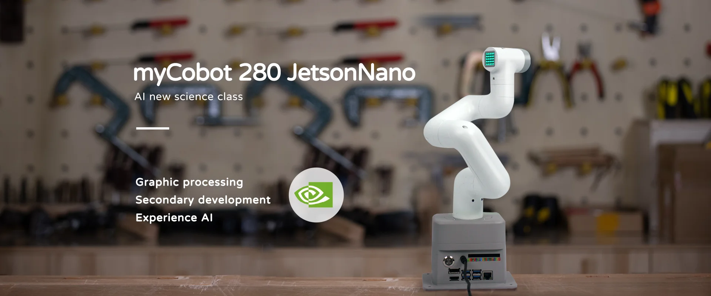
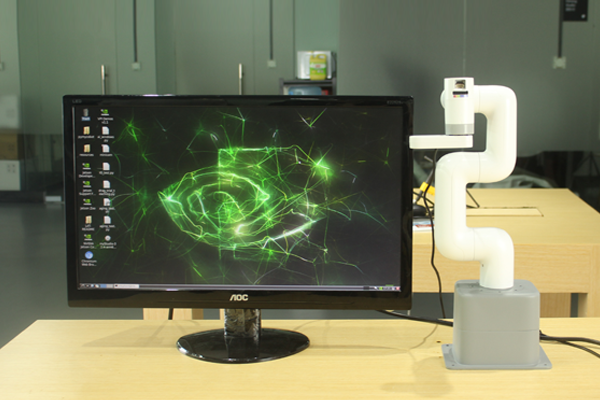

# Chapter 1 Product Introduction
## 1. Product Overview

##### ER myCobot 280 Jetson Nano

##### AI Artificial Intelligence New Science Classroom

### Product Introduction

myCobot 280 for Jetson Nano 2023 six-axis collaborative robot is a robot arm developed based on the mycobot 280 collaborative robot arm series, **NVIDIA** official cooperation product, using **JETSONNANO** + **ATOM** dual-core main control.

myCobot 280 for Jetson Nano six-axis collaborative robot has a self-weight of **1030g**, a payload of **250g**, and an arm span of **280mm**. It is small in size but powerful in function. It has a rich software and hardware interaction mode and a variety of compatible expansion interfaces. It supports secondary development of multiple platforms and effectively helps users realize multi-scenario application development.

### Design Concept

ER myCobot 280 Jetson Nano uses NVIDIA® Jetson Nano™ core development version as the main control, with built-in Ubuntu Mate 20.04 operating system. It does not need to be equipped with an additional PC main control. It can be used by directly connecting the monitor, keyboard, and mouse. It is the preferred assistant for quickly building robot arm machine vision and robot applications, control logic development, robot fusion development, and ROS simulation experiment classroom, helping you quickly start learning and applying six-axis robot arms

### Design Goal

| Design Goal | Description | Application Scenarios and Features |
| ---------------------- | ------------------------------------------------------------ | ------------------------------------------------------------ |
| **General Multi-Function Platform** | myCobot 280 JN is suitable for a variety of application scenarios such as education, research and commercial display, maker development, etc. | Its six degrees of freedom and 280mm arm span support complex motion control in various working environments. It can be equipped with a variety of end accessories such as grippers and suction pumps to meet various scenarios. |
| **Educational support** | myCobot 280 JN supports drag-and-drop programming language and interactive drag-and-drop teaching, which is convenient for intuitively demonstrating how the robot arm works. | The product supports the myblocky graphical programming tool. Programming by dragging and combining different modules helps beginners intuitively experience robot applications. |
| **Programmability and scalability** | The high programmability of myCobot 280 JN allows users to customize and program according to emerging technologies to meet the needs of future technologies. | Through user-defined programming, the device can optimize operations and experimental results to meet the continuous changes in research and development. |
| **Technology innovation and knowledge dissemination** | myCobot 280 JN can be used as a platform to showcase the latest scientific and technological achievements in commercial exhibitions, aiming to enhance the public's understanding and interest in science and technology and promote the commercialization of scientific and technological innovation. | By displaying and demonstrating the latest scientific and technological achievements, it increases public participation, promotes the popularization of scientific and technological knowledge and the market acceptance of scientific and technological products. |

### Product Features

| | |
| --------------------------------------------------- | ------------------------------------------------------------ |
| **Official NVIDIA cooperation product, JETSONNANO + ATOM dual-core master control** | Jetson Nano, 1.5GHz 4-core microprocessor, running Ubuntu platform. Open angle, coordinates, speed, current, voltage, IO and other control interfaces |
| **Built-in Ubuntu Mate 20.04 operating system, specially developed for robots** | Built-in multiple development software, such as: myStudio, myBlockly, etc. Built-in multiple development environments, such as: ROS, Python, etc. Built-in a lot of extended applications, support visual development, front-end interface development, etc. Open system underlying operation permissions, support user customized development |
| **Support ROS1+ROS2 and graphical programming** | Support ROS1+ROS2 multi-version applications, so that development is no longer restricted. Supports graphical programming software, making robot programming applications within reach. |
| **Image recognition, rich accessories, wide application** | With built-in image recognition algorithm, any camera can be selected. Independent matching of different accessories such as display, gripper suction pump, etc. to achieve more application scenarios. |
| **Unique industrial design, extremely compact** | Integrated design, compact overall body structure, net weight of only 1030g, very easy to carry. Modular design, few spare parts, low maintenance cost, can be quickly disassembled and replaced, and plug-and-play can be achieved. |
| **High configuration, with Lego interface** | Contains 6 high-performance servo motors, fast response, small inertia, and smooth rotation. The base and end are equipped with Lego technology parts interface, suitable for the development of various micro embedded devices. |

## 2. Product Application

### User Group

| | |
| ---------------------------- | ------------------------------------------------------------ |
| **Educational Institutions** | myCobot 280 JN has a robot motion control algorithm independently developed by Elephant Robotics, supporting multiple control modes such as angle, coordinate, potential value, and radian value, making it easier for users to understand the complex working principles of robots and the application principles of robots. It can effectively support complex data analysis, algorithm development, and verification activities, significantly improving research quality and educational effects. |
| **Technical Developers and Engineers** | Using NVIDIA® Jetson Nano™ Core Development Edition as the main control, there is no need to use an additional PC main control, and it can be used by directly connecting to a monitor, keyboard, and mouse. It can help engineers quickly start robot integration development. |
| **Commercial display and public exhibition organizers** | With its precision operation display advantage, myCobot 280 JN has become the preferred equipment for technology display and product demonstration. Dynamic demonstration not only attracts the audience, but also enhances the sense of participation, effectively promoting technological innovation and products. |
| **Geek development enthusiasts** | myCobot 280 JN has built-in Ubuntu Mate 20.04 operating system and myBlockly visual programming software, integrating myBlockly, Python, ROS 1, 2 and other development control environments. It greatly meets the development needs of geek enthusiasts. |

### Application scenarios

| **User groups** | **Application scenarios** | **Advantage targets** |
| -------------------------- | ------------------------------------------------------------ | ------------------------------------------------------------ |
| **Teachers and students in the field of education** | - STEM education - Robotics projects - Interdisciplinary research projects - Education and research | - Improve students' interest in science and technology - Enhance hands-on skills and problem-solving skills - Promote innovative thinking and teamwork - Provide a practical platform for data collection and robotics |
| **Makers and technical developers** | - Prototype development - Experimental research - Algorithm testing and verification - Robot trial teaching | - Accelerate research progress - Connect theory and practice - Promote technological innovation - Support multiple programming languages ​​and development environments |
| **Business Presentation and Marketing Professionals** | - Exhibition Display - Technology Demonstration - Brand Promotion | - Attract Potential Customers and Investors - Showcase Company's Technical Strength and Innovative Products - Enhance Brand Influence |

---

## 3. Supported Extension Development

The mycobot series of robotic arms are extremely valuable in the fields of education and scientific research, especially in Python and ROS (Robot Operating System), two widely used development environments. These environments provide strong support, allowing the mycobot series of products to be widely used in machine learning, artificial intelligence research, complex motion control, and visual processing tasks. At the same time, with dozens of accessories such as adaptive grippers, camera flanges, suction pumps, etc., you can give full play to myCobot's creative ideas. Mobile chassis + robotic arm development, low-cost start robot collaboration, SLAM mapping, autonomous navigation, ROS development environment, six-axis collaborative robot control, visual recognition, inter-device communication and other development content.

| | |
| ------------------------------------------------------------ | ------------------------------------------------------------ |
| **Python** | The robot supports Python and has a complete Python API library. The robot's joint angles, coordinates, grippers, etc. can be controlled by Python. |
| **ROS** | Supports ROS1 and ROS2 dual versions, and provides RVIZ simulation environment support.   Allows users to display the robot arm in real time and collect the status information of the robot arm, making mycobot 280 JN suitable for ROS beginners and educational purposes. |
| **Hardware interface** | Including IO, USB, etc., to facilitate the connection of various sensors and actuators. |
| **Software Library** | Provides a rich set of open source libraries and APIs to simplify the development process. |
| **myBlockly** | It is both a graphical programming software and a visualization tool. Users can drag and drop modules to create programs, which is very similar to building blocks, which is convenient, fast and easy to use. |

---

## 4. Where to buy

If you are interested in purchasing the device, please click on the link below: 
Taobao: [https://shop504055678.taobao.com](https://shop504055678.taobao.com) 
Shopify: [https://shop.elephantrobotics.com/](https://shop.elephantrobotics.com/) 
AliExpress: [https://elephantrobotics.aliexpress.com/store/1101941423] (https://elephantrobotics.aliexpress.com/store/1101941423) 

---

[Next Chapter →](../2.ProductParameter/2-ProductParameters.md)