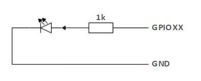

# Chapter 2 Robot Parameters

> In Chapter 1, we explored the product's selling points and design concepts, providing you with a panoramic view of the product's high-level understanding. Now, let's move on to Chapter 2 - Robot Parameters. This chapter will be the key to your understanding of the product's technical details. A detailed understanding of these technical parameters will not only help you fully realize the advancement and practicality of our products, but also ensure that you can use these technologies more effectively to meet your specific needs.

## 1 Robot Specifications

### 1.1 Robot Arm Parameters

| Indicators | Parameters |
| :-----------: | :---------: |
| Name | Little Elephant Collaborative Robot Arm |
| Model | myCobot 280 for Jetson Nano 2020 |
| Degrees of Freedom | 6 |
| Payload | 250g |
| Working Radius | 280mm |
| Repeat Positioning Accuracy | ±0.5mm |
| Weight | 1030g |
| Power Input | 8-12V |
| Operating Temperature | -5-45℃ |
| Communication | Type-C |

## 2. Control Core Parameters

| Indicators | Parameters |
| :---------: | :------------: |
| Power interface | DC 8.4 v -14 v |
| Auxiliary control | ESP32×1 |
| Core parameters | 240 MHz dual core. 600 DMIPS, 520KB SRAM. Wi-Fi dual mode Bluetooth |
| Core Flash | 4MB |
| Core IO | G19, G21, G22, G23, G25, G33 |
| Main control | JetsonNano2G |
| SOC | Broadcom BCM2711 |
| Core CPU | Quad-core ARM®A57 @1.43 GHz |
| Core GPU | 128-core NVIDIA Maxwell™ |
| Core Memory | 2 GB 64-bit LPDDR4 25.6 GB/s |
| Core Bluetooth | 2.4G/5G |
| Core network port | ×1 |
| Core wireless | 802.11ac |
| Core video interface | HDMI×1 |
| Audio interface | 3.5mm interface |
| USB | USB 3.0×1 USB 2.0×2 |
| IO interface | 2,3,4,5,6,7,9,11,12,13,16,17,18,19,20,21,22,23,24,25,26,27 |

## 3. Structural size parameters
### 3.1 Workspace

### 3.2 Specifications and dimensions

### 3.3 Joint range of motion

| Joint | Range |
| :--------: | :----------:|
| J1 | -168 ~ +168 |
| J2 | -135 ~ +135 |
| J3 | -150 ~ +150 |
| J4 | -145 ~ +145 |
| J5 | -165 ~ +165 |
| J6 | -180 ~ +180 |

### 3.4 Hole installation

- The robot base is mounted with a flange. The base is compatible with both LEGO technology and M4 screw installation.

- The robot end is mounted with a flange. The end of the robot arm is compatible with both LEGO technology holes and screw threaded holes.

## 4. Electrical characteristic parameters
## 4.1 Electrical interface of the robot base

### Base introduction

A. The base interface is shown in Figure 1 below:

Figure 1 Base interface
- ① Switch button
- ② Power DC interface
- ③ Function interface group 1
- ④ Type C
- ⑤ HDMI
- ⑥ USB3.0
- ⑦ USB2.0
- ⑧ Network port
- ⑨ Micro USB

### Base interface description

> **Note:** The functional interface groups are all 2.54mm DuPont interfaces, and 2.54mm DuPont wires can be used externally.

* A. The definitions of each interface of the base function interface group 1 are shown in Table 1:

Table 1

| tag | sign | species | function | remark |
| :---: | :----: | :--: | :------: | :----: |
| GND | GND  | p | GND |  |
| 26 | GPIO26 | I/O | GPIO26 |  |
| 19 | GPIO19 | I/O | GPIO19 |  |
| 13 | GPIO13 | I/O | GPIO13 |  |
| 06 | GPIO6 | I/O | GPIO6 |  |
| 05 | GPIO5 | I/O | GPIO5 |  |
| 00 | GPIO0 | I/O | GPIO0 |  |
| GND | GND  | p | GND |  |
| 11 | GPIO11 | I/O | GPIO11 |  |
| 09 | GPIO9 | I/O | GPIO9 |  |
| 10 | GPIO10 | I/O | GPIO10 |  |
|3.3 | 3.3V | P | DC 3.3V |  |
| 22 | GPIO22 | I/O | GPIO22 |  |
| 27 | GPIO27 | I/O | GPIO27 |  |
| 17 | GPIO17 | I/O | GPIO17 | PAD occupancy |
| GND | GND  | p | GND |  |
| 04 | GPIO4 | I/O | GPIO4 |  |
| 03 | GPIO3 | I/O | GPIO3 | SCL I2C bus (serial clock line) occupied |
| NC | NC | - | - | nonsupport |
|3.3 | 3.3V | P | DC 3.3V |  |
| 21 | GPIO21 | I/O | GPIO21 |  |
| 20 | GPIO20 | I/O | GPIO20 |  |
| 16 | GPIO16 | I/O | GPIO16 |  |
| GND | GND  | p | GND |  |
| 12 | GPIO12 | I/O | GPIO12 |  |
| GND | GND  | p | GND |  |
| 01 | GPIO1 | I/O | GPIO1 |  |
| 07 | GPIO7 | I/O | GPIO7 |  |
| 08 | GPIO8 | I/O | GPIO8 |  |
| 25 | GPIO25 | I/O | GPIO25 |  |
| GND | GND  | p | GND |  |
| 24  | GPIO24 | I/O | GPIO24 |  |
| 23 | GPIO23 | I/O | GPIO23 |  |
| GND | GND  | p | GND |  |
| 18 | GPIO18 | I/O | GPIO18 | PAD occupancy |
| NC | NC | - | - | nonsupport |
| NC | NC | - | - | nonsupport |
| GND | GND  | p | GND |  |
| 5V | 5V | P | DC 5V |  |
| 5V | 5V | P | DC 5V |  |

> **Note:**
> 1. I: Only as input.
>
> 2. I/O: This function signal contains input and output combination.
>
> 3. When the tube angle is set as the output terminal, it will output a voltage of 3.3V.
>
> 4. 1. The pull current of a single pin decreases as the number of pins increases, from about 40mA to 29mA.
>
> 5. If a GPIO is set to output mode, it outputs a high-level signal, and the circuit connection is shown in Figure 2, and the LED light will light up.
>
> 
>
> Figure 2
>
> 5. The other function tables of the function interface are shown in Figure 3. When other functions are used, the IO function is not available.
>
> 
>
> Figure 3

* B. Power DC interface: Use a DC power socket with an outer diameter of 6.5mm and an inner diameter of 2.0mm; use the 8.4V 5A DC power adapter provided by the manufacturer to power myCobot 280.

* C. Button switch: Press it to power on the inside, and the button will light up in white; press it again, the white light will go out, and the internal power will be cut off.

* D. Jetson nano has its own power supply port, which only powers Jetson nano itself, not the entire machine, so there is no need to connect this port when the power DC interface can be used normally.

* E. HDMI: This interface is an HDMI A-type interface. If you need to display the robot operation interface, you can connect the HDMI display interface to display the operation page to other device terminals.

* F. USB2.0: An interface for data connection based on the serial bus standard 2.0; users can use the USB interface to copy program files, or use the USB interface to connect peripherals such as a mouse and keyboard.

* G. USB3.0: An interface for data connection based on the serial bus standard 3.0; users can use the USB interface to copy program files, or use the USB interface to connect peripherals such as a mouse and keyboard.

Figure 4

* H. Network port: A port for network data connection. Users can use the Ethernet interface for communication and interaction between the PC and the robot system, or for Ethernet communication with other devices.

Figure 5

* I. Micro USB: An interface for data connection based on the serial bus standard 3.0; users can use the USB interface to copy program files, or use the USB interface to connect peripherals such as a mouse and keyboard.The interface uses the Android standard 2.0 for data connection; users can use the Android cable to copy program files.

## 4.2 Electrical interface of the end of the robot
### Introduction to the end of the robot

* A. The end of the robot is shown in Figure 6 and Figure 7:

Figure 6 End of the robot
- ① Servo interface
- ② Atom

Figure 7 End of the robot
- ① Function interface group 2
- ② Grove
- ③ Type C

### End interface description

* A. The definition of each interface of the function interface group 2 is shown in Table 2:

Table 2

| Label | Signal name | Type | Function | Remarks |
| :---: | :----: | :--: | :------: | :----: |
| 5V | 5V | P | DC 5V | |
| GND | GND | P | GND | |
| 3V3 | 3V3 | P | DC 3.3V | |
| G22 | G22 | I/O | GPIO22 | |
| G19 | G19 | I/O | GPIO19 | |
| G23 | G23 | I/O | GPIO23 | |
| G33 | G33 | I/O | GPIO33 | |

> **Note:**
> 1. I: Input only.
>
> 2. I/O: This function signal contains input and output combination.
>
> 3. When the tube angle is set as output terminal, it will output voltage 3.3V.
>
> 4. 1. The pull current of a single pin decreases as the number of pins increases, from about 40mA to 29mA.
>
> 5. If a GPIO is set to output mode, it outputs a high-level signal, and the circuit connection is shown in Figure 8, and the LED light will light up.
>
> 
>
> Figure 8

* B. Type C: can be used to connect and communicate with the PC and update the firmware.

* C. Grove: The definition is shown in Figure 9

Figure 9 Grove

* D. Servo interface: used for the end extension gripper, currently supports the matching adaptive gripper.

* E. Atom: for 5X5 RGB LED (G27) display and key function (G39)

## 5.DH parameters

SDH parameter table:

---

[← Previous chapter](../1.ProductIntroduction/1-ProductIntroduction.md) | [Next chapter →](../../2-BasicSettings/3.UserNotice/3-UserInstructions.md)