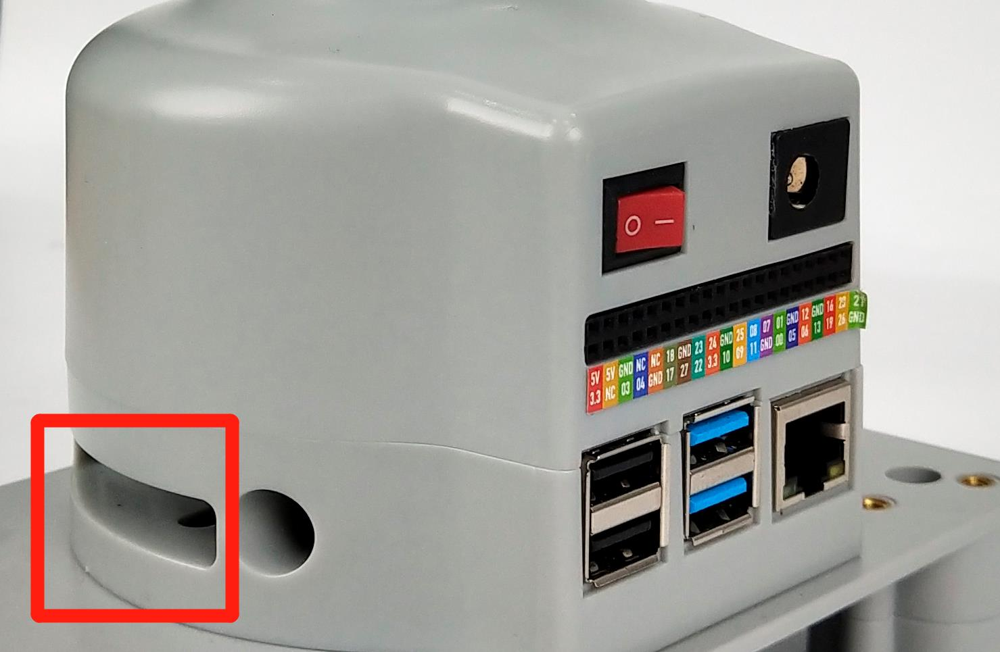
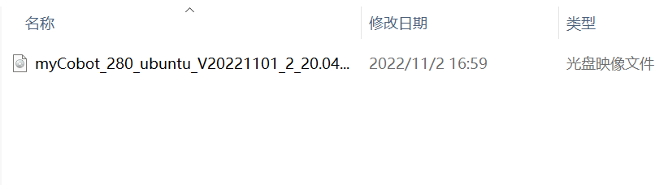
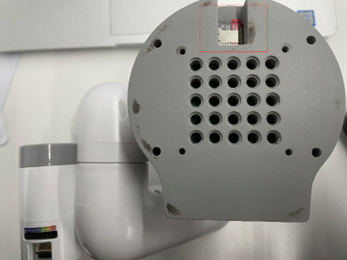
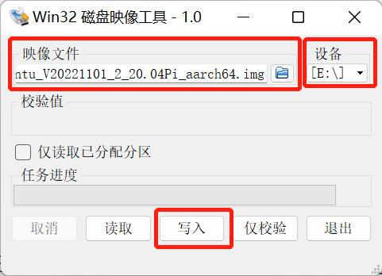
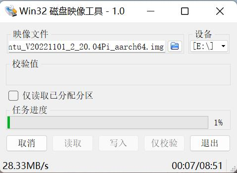
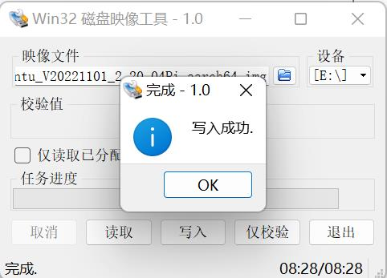

### PI版本机器人入门  

### 1.1 开始使用你的设备

- **连接外部设备**
  
  - PI版本机器无需搭配PC、笔记本等设备，连接显示器即可进行应用开发（**提示⚠：请使用配套发货的HDMI线连接显示器，使用内置系统进行开发**）
  
  - 先将HDMI线插入显示器的HDMI接口
  

  - 再将另一头插入机械臂的HDMI接口即可
  

  
  
  

- **系统卡说明**
  
  - 32G TF卡，内置Ubuntu20.04 系统，已安装**myStudio 固件烧录软件**，**myBlockly 图形化编程软件**，且已适配**python ROS**开发环境
  
- **可选项目**
  
  - 将树莓派连接到本地网络和Internet的网络(以太网)电缆

  - 如果你没有使用带扬声器的HDMI显示器，你可能还需要一些声音硬件。音频可以通过扬声器或耳机连接到AV插孔来播放(树莓派400上没有)。然而，扬声器必须有自己的放大器，因为树莓派的输出不够强大，无法直接驱动它们

- **故障排除**
  
  - 确保你使用的是质量好的电源，我们建议使用官方提供电源

  - 在关闭机械臂之前，请确保正确关闭了操作系统

  - 您可以在我们的gitbook上获得有关使用机械臂的帮助，如需进一步了解请联系官方客服
  
  
### 1.2 操作系统的更新升级

- **什么是镜像**
  
  
  
  - 镜像（Mirroring）是一种文件存储形式。一个磁盘上的数据在另一个磁盘上存在一个完全相同的副本即为镜像。常见的镜像文件格式有ISO、BIN、IMG、TAO、DAO、CIF、FCD。所谓镜像文件其实和ZIP压缩包类似，它将特定的一系列文件按照一定的格式制作成单一的文件，以方便用户下载和使用，例如一个测试版的操作系统、游戏等。镜像文件不仅具有ZIP压缩包的“合成”功能，它最重要的特点是可以被特定的软件识别并可直接刻录到光盘上。其实通常意义上的镜像文件可以再扩展一下，在镜像文件中可以包含更多的信息。比如说系统文件、引导文件、分区表)信息等，这样镜像文件就可以包含一个分区甚至是一块硬盘的所有信息。使用这类镜像文件的经典软件就是Ghost，它同样具备刻录功能，不过它的刻录仅仅是将镜像文件本身保存在光盘上，而通常意义上的刻录软件都可以直接将支持的镜像文件所包含的内容刻录到光盘上。
  
- **下载系统镜像文件**
  
  - 下载链接
    
    <table>
    <tr>
        <td>产品名称</td>
        <td>系统版本</td>
        <td>下载链接</td>
        <td>SHA256 Hash</td>
    </tr>
    <tr>
        <td>AI Kit 280</td>
        <td>ubuntu 18.04</td>
        <td>
            <a href="https://download-elephantrobotics.oss-cn-shenzhen.aliyuncs.com/Product_software/iMage-ISO/AI_Kit/AI_myCobot_280_ubuntu_V20221030-shrink.zip">点击下载</a>
        </td>
        <td>d44439be351a52decdb4470cb623a032047e223ffce73477d29aa973bb9100e1</td>
    </tr>
    <tr>
        <td rowspan='2'>myCobot 280 PI</td>
        <td>ubuntu 18.04</td>
        <td>
            <a href="https://download-elephantrobotics.oss-cn-shenzhen.aliyuncs.com/Product_software/iMage-ISO/myCobot-280/myCobot_280_ubuntu_V20221030-shrink.zip">点击下载</a></td>
        <td>04e40af5b637ec003a8b23ef9012e353361fd336db4e17cf9a65feb75e92927e</td>
    </tr>
    <tr>
        <td>ubuntu 20.04</td>
        <td> 
            <a href="https://download-elephantrobotics.oss-cn-shenzhen.aliyuncs.com/Product_software/iMage-ISO/myCobot-280/myCobot_280_ubuntu_V20230222_20.04Pi_aarch64_shrunk.img.gz">点击下载</a>
        </td>
        <td>ce666e6c1047c512fe6b270336d472e48f231be12808729ed57f743f9d284397</td>
    </tr>
    <tr>
        <td>myCobot 280 JetsonNano</td>
        <td>ubuntu 18.04</td>
        <td>
            <a href="https://download-elephantrobotics.oss-cn-shenzhen.aliyuncs.com/Product_software/iMage-ISO/myCobot-280JetsonNano/myCobot_280_Jetsonnano_V221101-shrink.zip">点击下载</a>
        </td>
        <td>2f1e40c1480b077bcc83abd3b79ac175f25d21e9cc344a014636167ee2eb087c</td>
    </tr>
    <tr>
        <td rowspan='2'>myCobot 320 PI</td>
        <td>ubuntu 18.04</td>
        <td>
            <a href="https://download-elephantrobotics.oss-cn-shenzhen.aliyuncs.com/Product_software/iMage-ISO/myCobot-320/myCobot_320_ubuntu_V20220805-2.zip">点击下载</a>
        </td>
        <td>bc2ed6ef8d51a885f45379392b71e35420638a427d5b4b3a3c9d1803d7e589eb</td>
    </tr>
    <tr>
        <td>ubuntu 20.04</td>
        <td><a href="https://download-elephantrobotics.oss-cn-shenzhen.aliyuncs.com/Product_software/iMage-ISO/myCobot-320/myCobot_320_ubuntu_V20221101_20.04Pi_aarch64-shrink.zip">点击下载</a>
        </td>
        <td>c95633bfd49246254f2be4783c6a91a15212422219157962c93125092aff6b34</td>
    </tr>
    <tr>
        <td rowspan='2'>mechArm 270</td>
        <td>ubuntu 18.04</td>
        <td><a href="https://download-elephantrobotics.oss-cn-shenzhen.aliyuncs.com/Product_software/iMage-ISO/mechArm-270/mechArm270_V221030-shrink.zip">点击下载</a>
        </td>
        <td>9af1fcbf9c608eda269dc395a8d68ea0a270008a88ec8ec3cf97758371a11178<td>
    </tr>
    <tr>
    ​	<td>镜像已知问题</td>
    ​	<td>无法使用moveit</td>
    ​	<td>
        解决方法：
      执行moveit会出现以下提示，说明没有赋予权限:
     
      进入如图所示路径，赋予该py文件可执行权限即可
     
      执行moveit会出现以下提示，说明代码内编码格式错误: 
     
      进入如图所示路径，打开该py文件在顶部输入：#coding=utf8 保存即可
     
       </td>
    </tr>
    <tr>
    ​	<td rowspan='2'>myPalletizer 260</td>
    ​	<td>ubuntu 18.04</td>
    ​	<td><a href="https://download-elephantrobotics.oss-cn-shenzhen.aliyuncs.com/Product_software/iMage-ISO/myCobot-280/myCobot_280_ubuntu_V20221030-shrink.zip">点击下载</a>
    ​    </td>
    ​	<td>f6fe999519146428e4c60960b242f647ae5c73c704852d686b28580b3a3f695d</td>
    </tr>
    <tr>
    ​	<td>ubuntu 20.04</td>
    ​	<td>-</td>
    ​	<td>-</td>
    </tr>
    <tr>
    ​    <td>myCobot Pro 600</td>
    ​    <td>Raspberry Debian</td>
    ​    <td>
    ​        <a href="https://download-elephantrobotics.oss-cn-shenzhen.aliyuncs.com/Product_software/iMage-ISO/myCobot-Pro-600/myCobot_Pro_600_bebian_V20221021.zip">点击下载</a>
    ​    </td>
    ​    <td>2e73aaa153bddbf0a49d18669a254b27403f17f8e989c05d13836d7c1f8bd4d9</td>
    </tr>
    <tr>
    ​    <td>myBuddy 280</td>
    ​    <td>ubuntu 20.04</td>
    ​    <td>
    ​        <a href="https://download-elephantrobotics.oss-cn-shenzhen.aliyuncs.com/Product_software/iMage-ISO/myBuddy-280/myBuddy_280_ubuntu_V20221028_20.04Pi_aarch64_shrunk.img.gz">点击下载</a>
    ​    </td>
    ​    <td>2b5452f665bcb999faf1727b2103dc1e5745705f5706728e140d62906b099920</td>
    </tr>
    <tr>
    ​    <td>myAGV</td>
    ​    <td>ubuntu 18.04</td>
    ​    <td>
    ​        <a href="https://download-elephantrobotics.oss-cn-shenzhen.aliyuncs.com/Product_software/iMage-ISO/myAGV/myAGV_ubuntu18.04_20221028-shrink.zip">点击下载</a>
    ​     </td>
    <td>bedad7d9769cb69380c6a4b9742ba7aefc21db41ab239172b7a5a7b632453baa</td>
    </tr>
    <tr>
    ​    <td>marsCat</td>
    ​    <td>-</td>
    ​    <td>-</td>
    ​    <td>-</td>
    </tr>
    </table>
  
- **如何烧录镜像系统**
  
  **Step 1:** 下载后解压文件。可以看到一个光盘映像文件。

  

  **Step 2:** 下载Win32DiskImager软件。

  下载地址：[Win32DiskImager](https://sourceforge.net/projects/win32diskimager/)

  

  **Step 3:** 取下机械臂底部的SD卡，使用读卡器将SD卡插入电脑。

  

  **Step 4:** 打开Win32DiskImager烧录软件。

  

  **Step 5:** 选择E盘和光盘映像文件，然后点击“写入”，即可开始写入。

  

  

  **Step 6:** 写入成功后会有提示。

  

  
  
  
