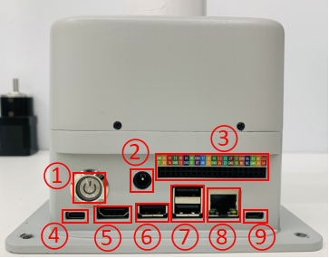

## Jetson nano version device usage

### 1 Hardware interface usage

### 1.1 40PIN GPIO

- **Introduction**

- GPIO full name: General-purpose input/output port

- Currently all of our Jetson nano GPIOs are basically the same as those on the Raspberry Pi motherboard, and have a 40-pin GPIO header

> Note: The following are all GPIOs in BCM mode

- **Voltage Description**

- There are two 5V pins and two 3.3V pins on the board, as well as multiple ground pins (0V), which are not configurable. The remaining pins are general 3.3V pins, which means that the output is set to 3.3V and the input allows 3.3V

- **IO output**

- GPIO pins designated as output pins can be set to high (3.3V) or low (0V)

- **IO input**

- GPIO pins designated as input pins can be read as high (3.3V) or low (0V). It is easier to use internal pull-up or pull-down resistors. Pins GPIO2 and GPIO3 have fixed pull-up resistors, but for other pins this can be configured in software

- **PWM (Pulse Width Modulation)**

- All pins can use software-controlled PWM

- GPIO12, GPIO13 can use hardware-controlled PWM

- **SPI**

- SPI stands for Serial Peripheral Interface, which is a high-speed, full-duplex, synchronous communication bus

- SPI0: MOSI (GPIO10); MISO (GPIO9); SCLK (GPIO11); CS0 (GPIO8), CS1 (GPIO7)

- SPI1: MOSI (GPIO26); MISO (GPIO25); SCLK (GPIO27); CS0 (GPIO24); CS1 (GPIO23);

- **IIC**

- I2C, the full name of the Chinese integrated circuit bus, is a serial communication bus that uses a multi-master-slave architecture

- Data (GPI02), clock (GPI03)

- EEPROM data: (GPIO0), EEPROM clock (GPI01)

- **Serial**

- Serial port is the abbreviation of serial port, also known as serial communication interface or COM interface

- TX (GPIO14), RX (GPIO15)

- **python control pin output**

```python
import RPi.GPIO as GPIO
import time

# Initialization
GPIO.setmode(GPIO.BCM)
GPIO.setup(20, GPIO.OUT)
GPIO.setup(21, GPIO.OUT)
# High level
GPIO.output(20, 0)
GPIO.output(21, 0)
# Wait for 2 seconds
time.sleep(2)
# Low level
GPIO.output(20, 1)
GPIO.output(21, 1)
```

- **The definitions of the various GPIO interfaces are shown in the following table:

<center>Table 3.5.3.1-1</center>

| Label | Signal Name | Type | Function | Remarks |
| :---: | :----: | :--: | :------: | :----: |
| GND | GND | p | GND | |
| 26 | GPIO26 | I/O | GPIO26 | |
| 19 | GPIO19 | I/O | GPIO19 | |
| 13 | GPIO13 | I/O | GPIO13 | |
| 06 | GPIO6 | I/O | GPIO6 | |
| 05 | GPIO5 | I/O | GPIO5 | |
| 00 | GPIO0 | I/O | GPIO0 | |
| GND | GND | p | GND | |
| 11 | GPIO11 | I/O | GPIO11 | |
| 09 | GPIO9 | I/O | GPIO9 | |
| 10 | GPIO10 | I/O | GPIO10 | |
|3.3 | 3.3V | P | DC 3.3V | |
| 22 | GPIO22 | I/O | GPIO22 | |
| 27 | GPIO27 | I/O | GPIO27 | |
| 17 | GPIO17 | I/O | GPIO17 | PAD occupation |
| GND | GND | p | GND | |
| 04 | GPIO4 | I/O | GPIO4 | |
| 03 | GPIO3 | I/O | GPIO3 | SCL I2C bus (serial clock line) occupation | | NC | NC | - | - | Not supported | |3.3 | 3.3V | P | DC 3.3V | | | 21 | GPIO21 | I/O | GPIO21 | GPIO12 | | | GND | GND | p | GND | | | 01 | GPIO1 | I/O | GPIO1 | | | 07 | GPIO7 | I/O | GPIO7 | | |
| GND | GND | p | GND | |
| 24 | GPIO24 | I/O | GPIO24 | |
| 23 | GPIO23 | I/O | GPIO23 | |
| GND | GND | p | GND | |
| 18 | GPIO18 | I/O | GPIO18 | PAD occupation |
| NC | NC | - | - | Not supported yet |
| NC | NC | - | - | Not supported yet |
| GND | GND | p | GND | |
| 5V | 5V | P | DC 5V | |
| 5V | 5V | P | DC 5V | |

> **Note:**
> 1. I: Input only.
>
> 2. I/O: This function signal includes input and output combinations.
>
> 3. When the pin is set as an output, it will output a voltage of 3.3V.
>
> 4. The pull current of a single pin decreases as the number of pins increases, from about 40mA to 29mA.
>
> 5. If a GPIO is set to output mode, it outputs a high-level signal, and the circuit connection is shown in Figure 2.1.5.2-3, and the LED light will light up.
>
> 
>
> 6. The other function tables of the function interface are shown in Figure 3.5.3-1. When other functions are used, the IO function is not available.
>
> 

### 1.2 Introduction to the Robot Arm Base

* A. The base interface is shown in Figure 3.5.3-2:



Figure 3.5.3-2 Base Interface
- ① Switch button
- ② Power DC interface
- ③ Function interface group 1
- ④ Type C
- ⑤ HDMI
- ⑥ USB3.0
- ⑦ USB2.0
- ⑧ Ethernet port
- ⑨ Micro USB

### 1.3 Base interface description

* A. Power DC interface: Use a DC power socket with an outer diameter of 6.5mm and an inner diameter of 2.0mm; use the 12V 5A DC power adapter provided by the manufacturer to power myCobot 280.

* B. Button switch: Press it to power on the inside, and the button will light up in white; press it again, the white light will go out, and the internal power will be cut off.

* C. Type C: Jetson nano has its own power supply port, which only powers Jetson nano itself, not the entire machine. Therefore, when the power DC interface can be used normally, there is no need to connect this interface.

* D. HDMI: This interface is an HDMI A-type interface. If you need to display the robot operation interface, the user can display the operation page to other device terminals by connecting the HDMI display interface.

* E. USB2.0: An interface that uses the serial bus standard 2.0 for data connection; users can use the USB interface to copy program files, or use the USB interface to connect peripherals such as a mouse and keyboard.

* F. USB3.0: An interface that uses the serial bus standard 3.0 for data connection; users can use the USB interface to copy program files, or use the USB interface to connect peripherals such as a mouse and keyboard.


* G. Network port: A port for network data connection. Users can use the Ethernet interface for communication and interaction between the PC and the robot system, or for Ethernet communication with other devices. **Since Jetson nano itself does not have a network card, Jetson nano can only access the Internet by connecting to this network port through a network cable**.


[Jetson nano official document](https://developer.nvidia.com/embedded/learn/jetson-nano-2gb-devkit-user-guide#id-.JetsonNano2GBDeveloperKitUserGuidevbatuu_v1.0-Introduction)