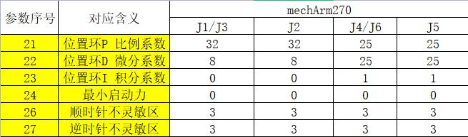
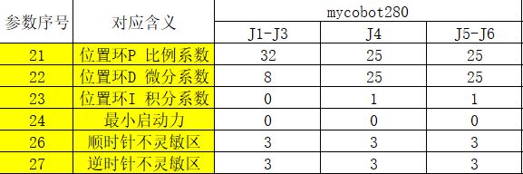
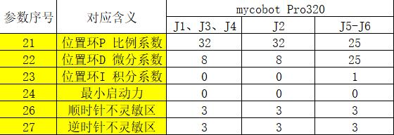

# Hardware Problem

## 1 About Structure

**Q: How to solve the problem of arm shaking? **
- A: Enter mystudio and burn the latest version of atommain firmware to the ATOM of the robot arm.
Then update the pymycobot version (Win+R and enter cmd to open the terminal), and use pip to update pymycobot.
(Here enter pip install pymycobot --upgrade --user and press Enter to run).
Finally, find the pid_read_write.py file in github, download and save it to your computer or Raspberry Pi system.
Follow the prompts in the code to modify each parameter configuration of the corresponding servo number. The parameter serial number corresponds to the serial number shown in the picture one by one, and you can run it after modification.

It should be noted that all joint parameters of each robot arm are not uniform, and they need to be compared and modified according to the robot arm model corresponding to the figure below.

pid_read_write.py file corresponding github link: https://github.com/elephantrobotics/pymycobot/tree/main/demo

**Q: What are the limits of myCobot's joints? **
- A: One axis and five axes have limits, one axis is about 160° clockwise and about 160° counterclockwise. The five axes can rotate clockwise and counterclockwise about 160°

**Note: When rotating the robot arm, it should be rotated at a small angle and gently. After reaching the limit, it cannot be rotated forcefully. **

**Q: What controls the six servos? **

- A: The servos are controlled by the atom on the top.

**Q: What is the role of the atom in the robot arm? **

- A: The atom in the robot arm mainly controls the kinematic algorithm of the robot arm: including forward and inverse kinematics, solution selection, acceleration and deceleration, speed synchronization, multi-square interpolation, coordinate conversion, etc., and requires real-time control and multi-threading. The related programs of atom are not open source yet.

**Q: Why is there no display on the display when the microprocessor-based robot arm is connected to the HDMI interface? Do you need to download the serial port driver? **
- A: Check whether the wiring is correct and whether the power switch is turned on. Try to replace the HDMI interface. There are two HDMI interfaces on the robot arm. The interface part should be firmly inserted. No need to download the serial port driver.
- There is another situation that you may have powered on the robot arm first and then connected the HDMI cable. This will also cause the monitor to have no input signal. You need to fully connect the HDMI cable before connecting the adapter (or turn on the switch after the adapter is connected) when the robot arm is not powered on.

**Q: What communication interfaces do different versions of the robot arm support? **

- A: Microprocessor-based robot arms support socket communication TCP; microcontroller-based robot arms can use USB to serial communication.

**Q: Why does the motor automatically power off during use? **

- A: The motor overheats after a long period of use. This phenomenon is normal and you can continue to use it after waiting for a few minutes.

**Q: Does the robot arm support Android development? **

- A: We do not have a direct Android development environment for the time being, and you need to develop it yourself. We provide serial port protocols, and the serial port can be developed again.

**Q: What is the function of the USB interface of the Raspberry Pi? **

- A: The Raspberry Pi 4B comes with a USB socket, which can power the Raspberry Pi. It has no other special functions for the time being and cannot be used as a communication interface to connect to a laptop or PC host for communication.

## 2 About parameters

**Q: What is the speed unit of the robot arm? **
- A: The operating speed is 180 degrees/second.

**Q: What is the communication frequency of mycobot280-M5? **

- A: 10-20Hz.

## 3 About the end gripper

**Q: Can the adaptive gripper not be completely closed? **
- A: There will be a certain gap between the grippers themselves, and it is not completely closed. You can adjust it by increasing the thickness of the gasket between them.

**Q: What communication does the mycobot280 adaptive gripper use? **

- A: The mycobot280 adaptive gripper uses ttl communication.

**Q: What communication does the mycobot320 end provide? **

- A: The mycobot320 end provides a 485 communication interface.

**Q: How to fix the USB camera to the end of the robot arm? **

- A: It needs to be fixed with a flange, which can be purchased independently.