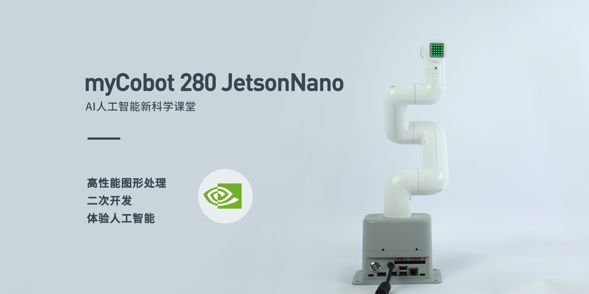
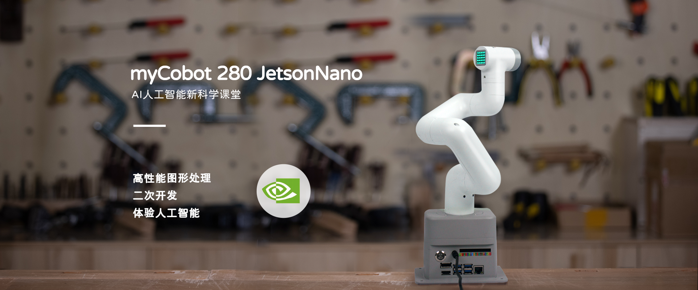
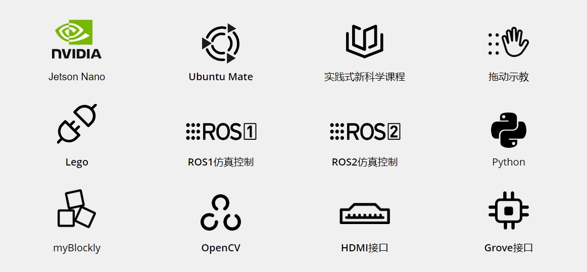
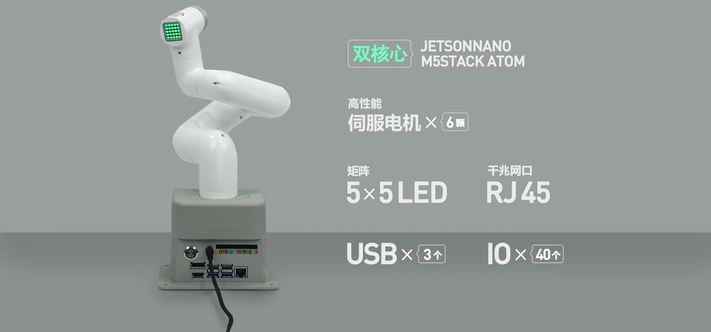
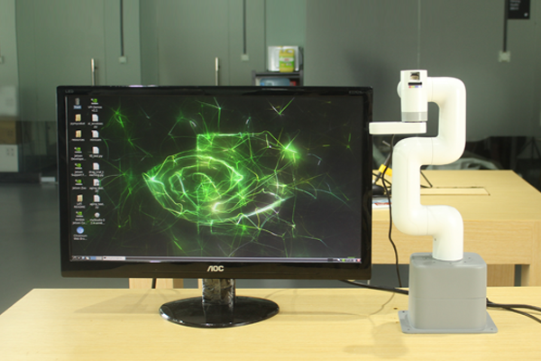
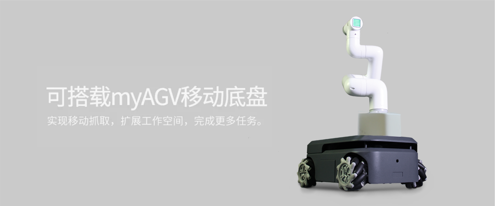

# 第一章 产品简介
## 1.产品概述

##### ER myCobot 280 Jetson Nano

##### AI人工智能新科学课堂

### 产品简介

myCobot 280 for Jetson Nano 2023 六轴协作机器人是机械臂基于mycobot 280协作机械臂系列开发，**英伟达**官方合作产品，采用**JETSONNANO** + **ATOM**双核心主控。

myCobot 280 for Jetson Nano 六轴协作机器人自重**1030g**，有效载荷**250g**，臂展**280mm**，体积小巧但功能强大，具备丰富的软硬件交互方式及多样化兼容拓展接口，支持多平台的二次开发，有效帮助用户实现多场景的应用开发。

### 设计理念

ER myCobot 280 Jetson Nano 采用 NVIDIA® Jetson Nano™ 核心开发版作为主控，内置Ubuntu Mate 20.04 操作系统，无需额外搭配PC主控，直接链接显示器、键盘、鼠标即可使用，是快速构建机械臂 机器视觉与机器人应用、控制逻辑开发、机器人融合开发、ROS仿真实验课堂的首选助手，帮助您快速开始六轴机械臂学习与应用

### 设计目标

| 设计目标               | 描述                                                         | 应用场景及特点                                               |
| ---------------------- | ------------------------------------------------------------ | ------------------------------------------------------------ |
| **通用多功能平台**     | myCobot 280 JN适用于教育、研究和商业展示、创客开发等多种应用场景。 | 其六自由度和 280mm 的臂展支持在各种工作环境中执行复杂的运动控制，可搭配夹爪、吸泵多种末端配件，满足各类场景应用。 |
| **教育支持**           | myCobot 280 JN支持拖曳式编程语言，按键交互式拖动示教，便于直观展示机械臂工作方式。 | 产品支持myblocky图形化编程工具。通过拖拽和组合不同模块进行编程，帮助初学者直观感受机器人应用。 |
| **可编程性与扩展性**   | myCobot 280 JN的高度可编程性允许用户根据新兴技术自定义和编程，以适应未来技术的需求。 | 通过用户自定义编程，设备能实现优化操作和实验结果，满足研究与发展的不断变化。 |
| **技术创新与知识传播** | myCobot 280 JN在商业展示中可以作为展示最新科技成果的平台，旨在提高公众对科技的理解和兴趣，并推动科技创新向商业化转化。 | 通过展示和演示最新的科技成果，增加公众参与度，促进科技知识的普及和科技产品的市场接受度。 |

### 产品特点

|                                                     |                                                              |
| --------------------------------------------------- | ------------------------------------------------------------ |
| **英伟达官方合作产品，JETSONNANO + ATOM双核心主控** | Jetson Nano，1.5GHz 4核微处理器，运行Ubuntu平台。 开放角度、坐标、速度、电流、电压、IO等多种控制接口 |
| **内置Ubuntu Mate 20.04操作系统，专为机器人开发**   | 内置多种开发软件，如：myStudio、myBlockly等。 内置多种开发环境，如：ROS、Python等。 内置超多扩展应用，支持可视化开发、前端界面开发等。 开放系统底层操作权限，支持用户定制化开发 |
| **支持ROS1+ROS2和图形化编程**                       | 支持ROS1+ROS2多版本应用，让开发不再受限。 支持图形化编程软件，让机器人编程应用触手可及。 |
| **图像识别 丰富配件 应用广泛**                      | 自带图像识别算法，可选配任意摄像头。 自主搭配显示器、夹爪吸泵等不同配件，实现更多应用化场景。 |
| **独特工业设计，极致小巧**                          | 一体化设计，整体机身结构紧凑，净重仅1030g，十分便于携带。 模块化设计，备件少、维护成本低，可快速拆卸更换，实现即插即用。 |
| **高配置，搭配Lego接口**                            | 内含6个高性能伺服电机，响应快，惯量小，转动平滑。 底座及末端带有乐高科技件接口，适用于各项微型嵌入式设备开发。 |

## 2.产品应用

### 用户群体

|                              |                                                              |
| ---------------------------- | ------------------------------------------------------------ |
| **教育机构**                 | myCobot 280 JN内置大象机器人自主研发的机器人运动控制算法，支持角度、坐标、电位值、 弧度值多种控制模式，便于⽤户理解机器人复杂的工作原理和机器⼈应用原理。能有效支持复杂数据分析、算法开发和验证活动，显著提升研究质量和教育效果。 |
| **技术开发者和工程师**       | 采用 NVIDIA® Jetson Nano™ 核心开发版作为主控，无需额外搭配PC主控，直接链接显示器、键盘、鼠标即可使用。可帮助工程师快速开始机器人融合开发。 |
| **商业展示和公共展览组织者** | myCobot 280 JN以其精密操作展示优势，成为科技展示和产品演示的首选设备。动态演示不仅吸引观众，还增强参与感，有效推广科技创新和产品。 |
| **极客开发爱好者**           | myCobot 280 JN内置Ubuntu Mate 20.04 操作系统 采用 myBlockly 可视化编程软件，集成 myBlockly、Python、ROS 1、2等多种开发控制环境。极大满足极客爱好者的开发需求。 |

### 应用场景

| **用户组**                 | **应用场景**                                                 | **优势目标**                                                 |
| -------------------------- | ------------------------------------------------------------ | ------------------------------------------------------------ |
| **教育领域的教师和学生**   | - STEM 教育 - 机器人项目 - 跨学科研究项目 - 教育与研究 | - 提高学生对科技的兴趣 - 增强动手能力和解决问题的能力 - 促进创新思维和团队合作 - 为数据收集和机器人学提供实践平台 |
| **创客和技术开发者**       | - 原型开发 - 实验研究 - 算法测试和验证 - 机器人试教 | - 加速研究进展 - 连接理论与实践 - 推进技术创新 - 支持多种编程语言与开发环境 |
| **商业演示和营销专业人士** | - 展览展示 - 技术演示 - 品牌推广                       | - 吸引潜在客户和投资者 - 展示公司技术实力和创新产品 - 提升品牌影响力 |

---

## 3. 支持的扩展开发

mycobot 系列机械臂在教育和科研领域中极具价值，特别是在 Python 和 ROS（Robot Operating System)这两个广泛使用的开发环境中。这些环境提供了强大的支持，使得 mycobot  系列产品能够广泛应用于机器学习、人工智能研究、复杂运动控制以及视觉处理任务中。同时搭配自适应夹爪、摄像头法兰、吸泵等数十种配件，可以尽情发挥myCobot的创意想法。移动底盘+机械手臂 搭配开发，低成本开始机器人协作、SLAM建图、自主导航、ROS开发环境、六轴协作机器人控制、视觉识别、设备间通信等多种开发内容。

|   |  |
| ------------------------------------------------------------ | ------------------------------------------------------------ |
| **Python**                                                   | 机器人支持Python，具备完善的Python API库。 可通过Python控制机器人的关节角度、坐标、夹持器等。 |
| **ROS**                                                      | 支持 ROS1 和 ROS2 双版本，提供 RVIZ 仿真环境支持。 允许用户实时显示机械臂和采集机械臂的状态信息，使得mycobot 280 JN适合 ROS 初学者和教育用途。 |
| **硬件接口**                                                 | 包括 IO、USB 等，方便连接各种传感器和执行器。              |
| **软件库**                                                   | 提供丰富的开源库和 API 来简化开发过程。                    |
| **myBlockly** | 既是图形化编程软件又是可视化工具。 用户可以拖拽模块创建程序，这个过程非常类似于搭积木，方便快捷易上手。 |

---

## 4. 购买地址

如果您有兴趣购买该设备，请点击下面的链接：  
淘宝：[https://shop504055678.taobao.com](https://shop504055678.taobao.com)  
Shopify：[https://shop.elephantrobotics.com/](https://shop.elephantrobotics.com/)  
速卖通：[https://elephantrobotics.aliexpress.com/store/1101941423](https://elephantrobotics.aliexpress.com/store/1101941423)

---

[下一章 →](../2.ProductParameter/2-ProductParameters.md)