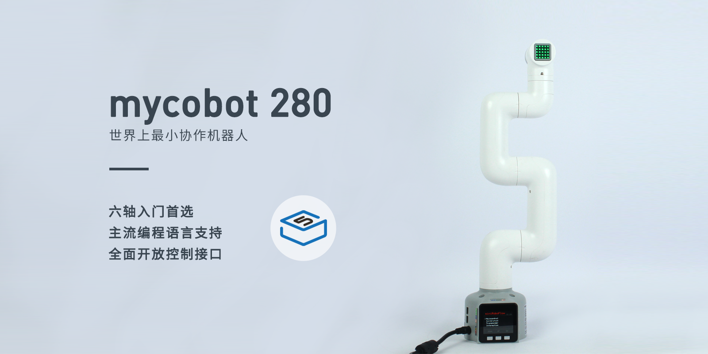
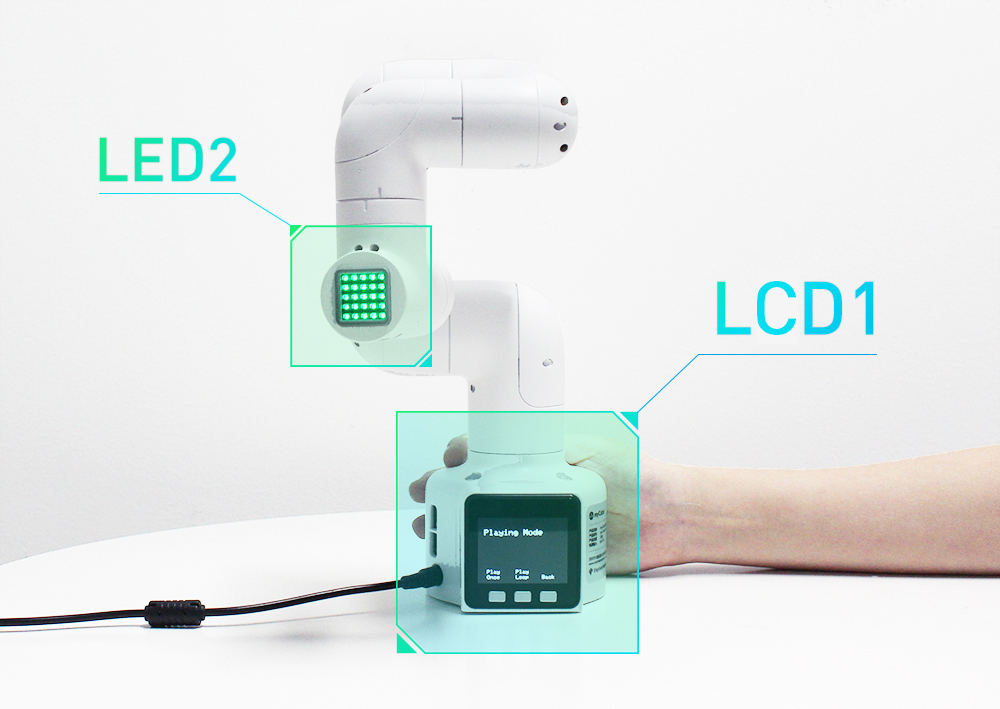
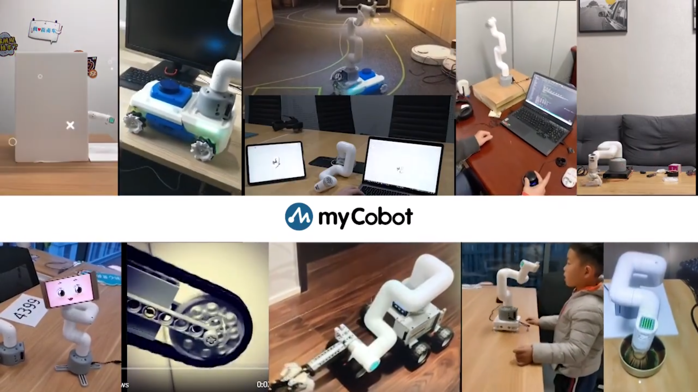
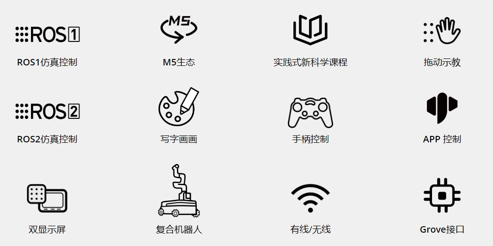

## 1. 产品概述

##### myCobot 280 M5

##### 世界最小最轻的六轴协作机器人

### 产品简介

myCobot 由**大象机器人**和**M5stack**联合出品，是**世界最小最轻的六轴协作机器人**，可根据用户的需求进行二次开发，实现用户个性化定制，是生产力工具也是想象力边界的拓展工具。

myCobot 自重850g，有效载荷250g，有效工作半径280mm；体积小巧但功能强大，既可搭配多种末端执行器适配多种应用场景，也可支持多平台软件的二次开发，满足**科研教育、智能家居，商业探索**等各种场景需求。

### 设计理念

myCobot 280 系列机械臂是大象机器人专为：科研教育、创科应⽤、商业展示等场景开发的六自由度协作机器人。机械臂外观结构设计小巧精致，⼀体式全包裹的机 身设计，无任何外漏线缆。内置大象机器人自主研发的机器⼈运动控制算法，支持角度、坐标、电位值、 弧度值多种控制模式，便于用户理解机器⼈复杂的⼯作原理和机器人应用原理。支持开发应用配合，可以扩展多种如 PC、工控机、嵌入式设备主控，适合多种应用场景。

### 设计目标

| 设计目标               | 描述                                                         | 应用场景及特点                                               |
| ---------------------- | ------------------------------------------------------------ | ------------------------------------------------------------ |
| **通用多功能平台**     | myCobot 280适用于教育、研究和商业展示等多种应用场景。        | 其六自由度和 750mm 的臂展支持在各种工作环境中执行复杂的运动控制，如精准定位和路径规划。 |
| **科研和教育支持**     | myCobot 280特别适合机器学习和人工智能研究，能执行高精度的实验和技术演示。 | 支持端到端数据训练与复现，以及基础的视觉任务，是实验室中的理想设备。 |
| **可编程性与扩展性**   | myCobot 280 的高度可编程性允许用户根据新兴技术自定义和编程，以适应未来技术的需求。 | 通过用户自定义编程，设备能实现优化操作和实验结果，满足研究与发展的不断变化。 |
| **技术创新与知识传播** | myCobot 280在商业展示中可以作为展示最新科技成果的平台，旨在提高公众对科技的理解和兴趣，并推动科技创新向商业化转化。 | 通过展示和演示最新的科技成果，增加公众参与度，促进科技知识的普及和科技产品的市场接受度。 |

### 产品特点

|                                    |                                                              |
| ---------------------------------- | ------------------------------------------------------------ |
| **独特工业设计，极致小巧**         | 一体化设计，整体机身结构紧凑，净重仅850g，十分便于携带。 模块化设计，备件少、维护成本低，可快速拆卸更换，实现即插即用 |
| **高配置，搭载两块显示屏**         | 内含6个高性能伺服电机，响应快，惯量小，转动平滑。 机身携带两块显示屏，支持 fastLED库，便于拓展应用交互输出。 |
| **乐高接头，M5数千应用生态**       | 底座以 M5Stack-basic 作为主控，数千应用案例可直接使用。 底座及末端带有乐高科技件接口，适用于各项微型嵌入式设备开发。 |
| **图形化编程，支持工业机器人软件** | 采用 myBlockly 可视化编程软件，掌上自如编程，操作简单易上手。 支持 Arduino + ROS 开源系统。 |
| **轨迹录入，点位保存**             | myCobot 支持拖动示教，可记录已存入的路径。 摆脱传统的路径点存模式，可保存最多60mins不同的路径 |

## 2. 产品应用

### 用户群体

|                              |                                                              |
| ---------------------------- | ------------------------------------------------------------ |
| **高等教育机构和研究实验室** | myCobot 280是专为机器人实验和技术演示而设计的教学与科研工具。它能有效支持复杂数据分析、算法开发和验证活动，显著提升研究质量和教育效果。 |
| **技术开发者和工程师**       | 支持 Python、ROS等多种开发环境，myCobot 280 适合需要个性化编程和系统集成的专业人员。其模块化设计和高度可编程性使其成为开发和测试新控制算法或机器人应用的理想平台。 |
| **商业展示和公共展览组织者** | myCobot 280 以其精密操作展示优势，成为科技展示和产品演示的首选设备。动态演示不仅吸引观众，还增强参与感，有效推广科技创新和产品。 |
| **极客开发爱好者**           | myCobot 280  采用 myBlockly 可视化编程软件，掌上自如编程，操作简单易上手。 支持 Arduino + ROS 开源系统，满足爱好者的各类创意。 |

### 应用场景

| **用户组**                 | **应用场景**                                                 | **优势目标**                                                 |
| -------------------------- | ------------------------------------------------------------ | ------------------------------------------------------------ |
| **教育领域的教师和学生**   | - STEM 教育 - 机器人项目 - 跨学科研究项目 - 教育与研究 | - 提高学生对科技的兴趣 - 增强动手能力和解决问题的能力 - 促进创新思维和团队合作 - 为数据收集和机器人学提供实践平台 |
| **研究人员和技术开发者**   | - 原型开发 - 实验研究 - 算法测试和验证 - 端到端 AI 数据搜集 - 机器人试教 | - 加速研究进展 - 连接理论与实践 - 推进技术创新 - 支持复杂数据分析和高精度实验需求 |
| **商业演示和营销专业人士** | - 展览展示 - 技术演示 - 品牌推广                       | - 吸引潜在客户和投资者 - 展示公司技术实力和创新产品 - 提升品牌影响力 |

---

## 3. 支持的扩展开发

mycobot 系列机械臂在教育和科研领域中极具价值，特别是在 Python 和 ROS（Robot Operating System)这两个广泛使用的开发环境中。这些环境提供了强大的支持，使得 mycobot  系列产品能够广泛应用于机器学习、人工智能研究、复杂运动控制以及视觉处理任务中。同时搭配自适应夹爪、摄像头法兰、吸泵等数十种配件，可以尽情发挥myCobot的创意想法。

|   |  |
| ------------------------------------------------------------ | ------------------------------------------------------------ |
| **Python**                                                   | 机器人支持Python，Python API库的开发也越来越完善。 可以通过Python控制机器人的关节角度、坐标、夹持器等方面。 |
| **ROS**                                                      | - 支持 ROS1 和 ROS2 双版本，提供 RVIZ 仿真环境支持。 - 允许用户实时显示机械臂和采集机械臂的状态信息，使得 C650 适合 ROS 初学者和教育用途。 |
| **硬件接口**                                                 | - 包括 IO、USB 等，方便连接各种传感器和执行器。              |
| **软件库**                                                   | - 提供丰富的开源库和 API 来简化开发过程。                    |
| **系统兼容性**                                               | - 兼容 Windows、Linux、MacOS，适应多种开发环境。             |
| **C++** | 使用c++语言，您可以通过我们公司开发的c++动态库，进行自由开发（坐标控制、角度控制、io控制、夹爪控制等），控制我们公司已经研发出来的部分机器人。 |
| **C#** | 使用c#语言，您可以通过我们公司提供的c#动态库，进行自由开发(坐标控制、角度控制、io控制、夹爪控制等），控制我们公司已经研发出来的部分机器人。 |
| **Arduino** | 提供开源程序MyCobotBasic示例程序。同时用户也可以根据自身需要，对开源程序进行修改。 |
| **JavaScript** | 机器人可以通过公司的JavaScript语言生态库进行控制。 |
| **myBlockly** | 既是图形化编程软件又是可视化工具。 用户可以拖拽模块创建程序，这个过程非常类似于搭积木，方便快捷易上手。 |
---

## 4. 购买地址

如果您有兴趣购买该设备，请点击下面的链接：  
淘宝：[https://shop504055678.taobao.com](https://shop504055678.taobao.com)  
Shopify：[https://shop.elephantrobotics.com/](https://shop.elephantrobotics.com/)  
速卖通：[https://elephantrobotics.aliexpress.com/store/1101941423](https://elephantrobotics.aliexpress.com/store/1101941423)

---

[下一章 →](../2-ProductParameters/2-ProductParameters.md)