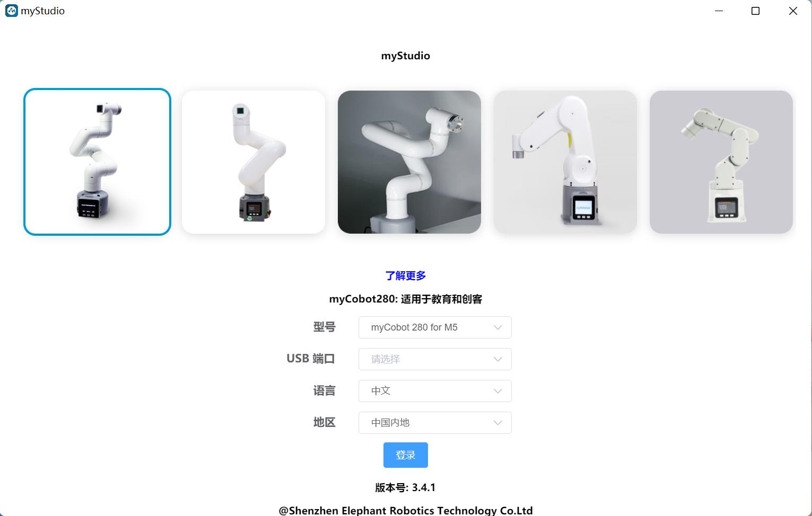

# myStudio

## 1 myStudio设计初衷

- myStudio是一个一站式的myRobot/myCobot等机器人的使用平台。

- 方便用户根据自己的使用场景，选择不同的固件并进行下载，同时学习相关的教材，在线浏览教程视频。

## 2 myStudio最新版本与支持平台

- 最新版本：V3.5.8

- 适用于：Windows、Mac、Linux

## 3 myStudio功能

- 烧录、更新固件
- 提供机器人使用教程，如用户手册、视频教程、Q&A等
- 维护和维修方面的信息

## 4 myStudio适用设备

- myCobot 280
  - myCobot 280 M5
  - myCobot 280 PI
  - myCobot 280 Jetson Nano
  - myCobot 280 for Arduino 
- myCobot 320
  - myCobot 320 M5
  - myCobot 320 PI 
- myPalletizer 260
  - myPalletizer 260 M5
  - myPalletizer 260 PI 
- mechArm 270
  - mechArm 270 M5
  - mechArm 270 Pi
- myCobot Pro 600 
- myBuddy 280

## 5 固件版本推荐

不同型号机械臂所需烧录的固件不同，以下是不同型号机械臂推荐烧录的固件版本。

**myCobot 280系列**

myCobot 280系列共4个版本：M5版本、PI版本、ardunio版本以及jetsonnano版本。不同版本核心型号不同，所需烧录的固件及其版本也不同。

<table>
<tr>
	<td>机械臂版本号</td>
    <td>核心</td>
    <td>所需烧录固件</td>
    <td>推荐固件及其版本</td>
</tr>
<tr>
	<td rowspan='2'>M5版本</td>
    <td>M5Stack-Basic</td>
    <td>miniRobot固件</td>
    <td>推荐烧录v2.1版本，可以使用拖动示教、wifi、蓝牙等功能</td>
</tr>
<tr>
	<td>Atom</td>
    <td>atomMain固件</td>
    <td>产品序列号为ER28001202200415及之前，或者产品无序列号，推荐烧录v4.1版本；序列号为ER28001202200416及之后，推荐烧录v5.1版本</td>
</tr>
<tr>
	<td rowspan='2'>PI版本</td>
	<td>RaspberryPI 4B</td>
	<td>ubuntu固件</td>
	<td>推荐烧录V18.04.版本</td>
</tr>
<tr>
	<td>Atom</td>
	<td>atomMain固件</td>
	<td>产品序列号为ER28001202200415及之前，或者产品无序列号，推荐烧录v4.1版本；序列号为ER28001202200416及之后，推荐烧录v5.1版本</td>
</tr>
<tr>
	<td rowspan='3'>Arduino版本</td>
	<td>mega2560</td>
	<td>transponder固件</td>
	<td>推荐烧录v1.0版本</td>
</tr>
	<td>mkrwifi1010</td>
	<td>transponder固件</td>
	<td>推荐烧录v1.0版本</td>
</tr>
<tr>
	<td>Atom</td>
	<td>atomMain固件</td>
	<td>产品序列号为ER28001202200415及之前，或者产品无序列号，推荐烧录v4.1版本；序列号为ER28001202200416及之后，推荐烧录v5.1版本</td>
</tr>
<tr>
	<td rowspan='2'>Jetson nano版本</td>
	<td>JestonNano</td>
	<td>ubuntu固件</td>
	<td>推荐烧录V18.04.版本</td>
</tr>
<tr>
	<td>Atom</td>
	<td>atomMain固件</td>
	<td>产品序列号为ER28001202200415及之前，或者产品无序列号，推荐烧录v4.1版本；序列号为ER28001202200416及之后，推荐烧录v5.1版本</td>
</tr>
</table>
