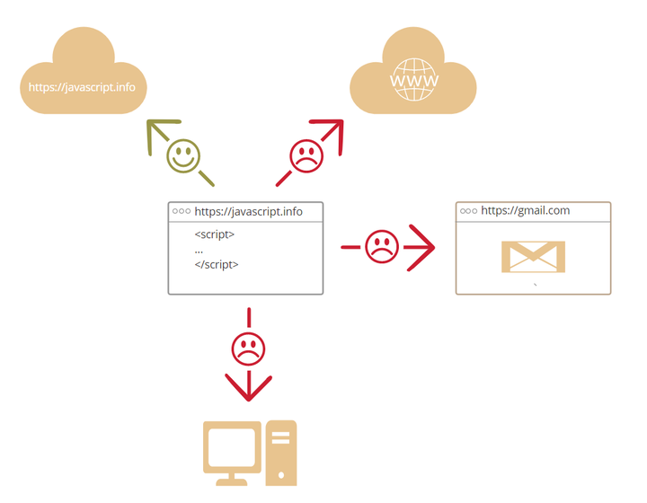

##### 什么是js

javaScript诞生最初的目的是为了“赋予网页生命”。

这种编程语言我们称之为脚本。它们可以写在 HTML 中，在页面加载的时候会自动执行。

脚本作为纯文本存在和执行。它们不需要特殊的准备或编译即可运行。

##### 浏览器中的 JavaScript 能做什么？

现代的 JavaScript 是一种“安全”语言。它不提供对内存或 CPU 的底层访问，因为它最初是为浏览器创建的，不需要这些功能。
JavaScript 的能力很大程度上依赖于它执行的环境。
例如：Node.js 允许 JavaScript 读写任意文件、执行网络请求等。浏览器中的 JavaScript 可以做与网页操作、用户交互和 Web 服务器相关的所有事情。
例如，浏览器中的 JavaScript 可以完成下面这些事：

- 在网页中插入新的 HTML，修改现有的网页内容和网页的样式。
- 响应用户的行为，响应鼠标的点击或移动、键盘的敲击。
- 向远程服务器发送网络请求，下载或上传文件（所谓 AJAX 和 COMET 技术）。
- 获取或修改 cookie，向访问者提出问题、发送消息。
- 记住客户端的数据（本地存储）。

##### 浏览器中的 JavaScript 不能做什么？

为了用户的（信息）安全，在浏览器中的 JavaScript 的能力是有限的。这样主要是为了阻止邪恶的网站获得或修改用户的私人数据。
这些限制的例子有：
- 网页中的 JavaScript 不能读、写、复制及执行用户磁盘上的文件或程序。它没有直接访问操作系统的功能。
现代浏览器允许 JavaScript 做一些文件相关的操作，但是这个操作是受到限制的。
仅当用户使用某个特定的动作，JavaScript 才能操作这个文件。
例如，把文件“拖”到浏览器中，或者通过input标签选择文件。JavaScript 有很多方式和照相机/麦克风或者其他设备进行交互，但是这些都需要提前获得用户的授权许可。
所以，启用了 JavaScript 的网页应该不会偷偷地启动网络摄像头观察你，并把你的信息发送到美国国家安全局。
- 不同的浏览器标签页之间基本彼此不相关。
有时候，也会有一些关系。例如，一个标签页通过 JavaScript 打开另外一个新的标签页。但即使在这种情况下，如果两个标签页打开的不是同一个网站（域名、协议或者端口任一不相同的网站），他们都不能够相互通信。
这就是“同源策略”。为了解决“同源策略”问题，两个标签页必须都包含一些处理这个问题的特殊的 JavaScript 代码，并均允许数据交换，这样才能够实现两个同源标签页的数据交换。
- JavaScript 通过互联网可以轻松地和当前网页域名的服务器进行通讯。
但是从其他网站/域名的服务器中获取数据的能力是受限的。
尽管这可以实现，但是需要来自远程服务器的明确协议（在 HTTP 头中）。
这也是为了用户的数据安全。

##### 是什么使得javascript显得与众不同

+ 和 HTML/CSS 完全的集成。
+ 使用简单的工具完成简单的任务。
+ 被所有的主流浏览器支持，并且默认开启。

满足这三条的浏览器技术也只有 JavaScript 了。

这就是为什么 JavaScript 与众不同！这也是为什么它是创建浏览器界面的最普遍的工具。

此外，JavaScript 还支持创建服务器，移动端应用程序等。
