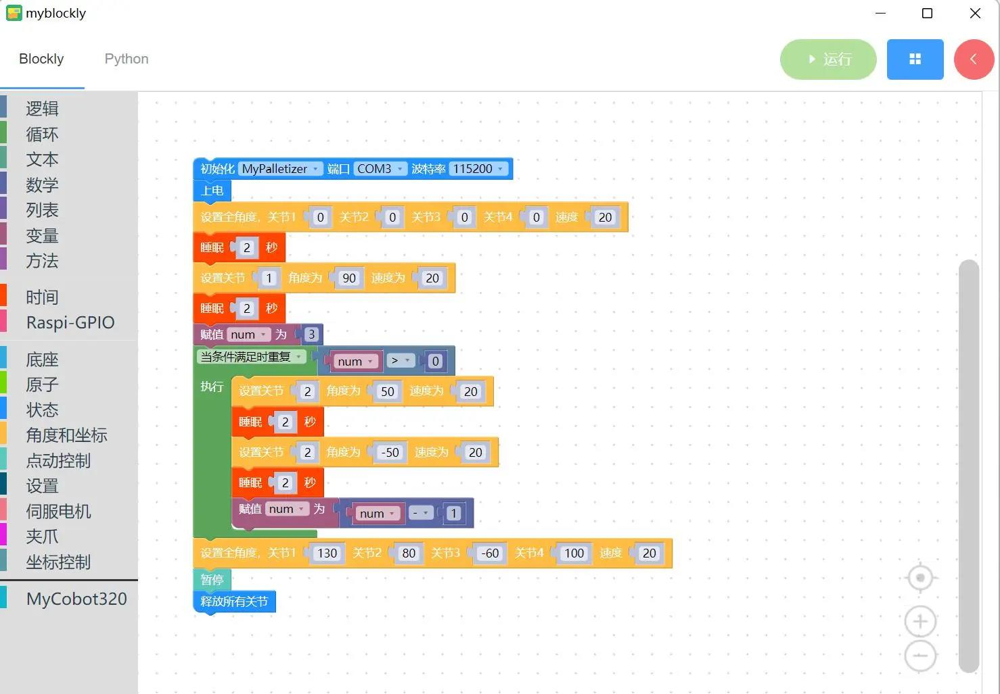

# 6 控制机械臂左右摆动

<i>开始前准备</i>

M5Stack系列：确保机械臂已经连接上电脑（具体信息请查阅**[5.1myBlockly](https://docs.elephantrobotics.com/docs/gitbook/5-ProgramingApplication-myblockly-uiflow-mind/5.1-myblockly/)**）

其他系列：确保机器正常

### 本章学习内容

如何使用myBlockly控制机械臂左右摆动

#### API展示

* 方法模块**1**：`上电`

  

* 适用范围：myCobot280系列，myCobot320系列，mechArm系列、myPalletizer系列

* 目的：启动系统

  

* 方法模块**2**：`释放关节`

  

* 适用范围：myCobot280系列，myCobot320系列，mechArm系列、myPalletizer系列

* 目的：停止机械臂运动，锁定各个关节

#### 简单演示

* 图形代码如下：

* 实现内容：

  给机械臂上电，控制机械臂运动回到原点，过两秒后，

  控制机械臂1关节，以速度20运行至角度50的位置，过两秒后，

  控制机械臂2关节，以速度20运行至角度20的位置，过两秒后，

  再次控制机械臂2关节，以速度20运行至角度-50的位置，过两秒后，

  循环两次对2关节的控制，循环结束之后，

  将1关节、2关节、3关节以及4关节以速度20分别运行至角度130、角度80、角度-60以及角度100，

  最后暂停机械臂运动，释放所有关节，程序运行结束。
