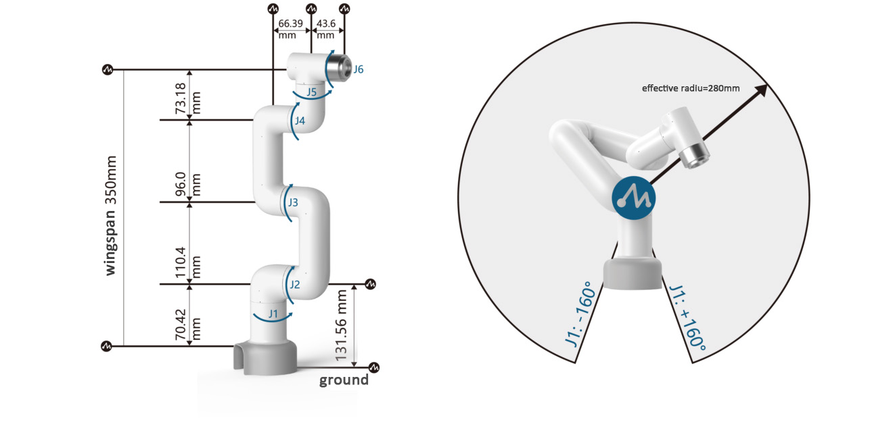
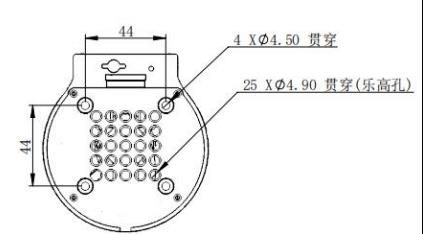
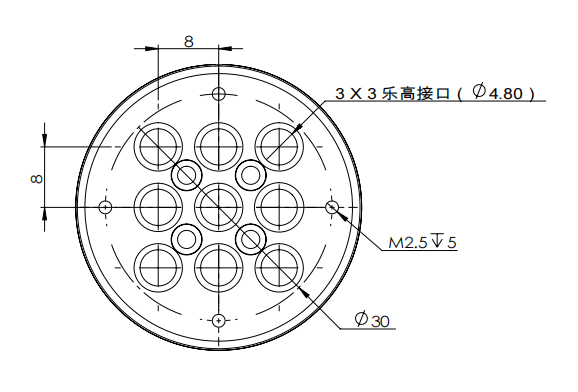
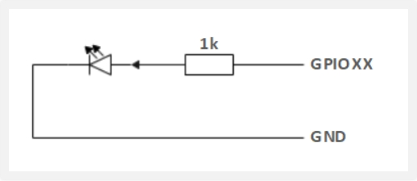
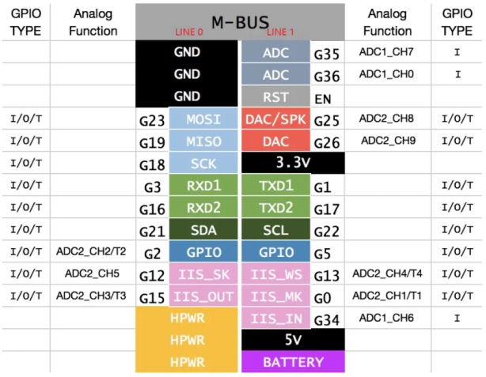
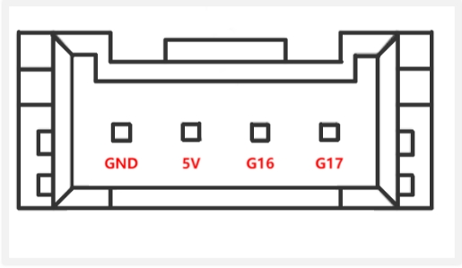
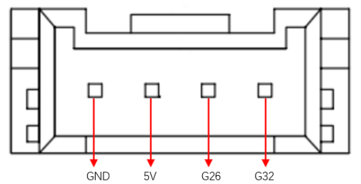

# 机器人参数说明

> 第一章中，我们探讨了产品的卖点及其设计理念，为您提供了对产品高层次理解的全景视角。现在，让我们进入第二章——机器人参数说明。这一章节将是您理解产品技术细节的关键。详细了解这些技术参数，不仅可以帮助您充分认识到我们产品的先进性和实用性，而且还能够确保您能够更有效地利用这些技术来满足您的具体需求。

## 1.机器人规格参数

| 指标       | 参数 |
| :-----------: | :---------: |
| 名称         | 小象协作机械臂 |
| 型号         | myCobot 280 for M5 |
| 自由度       | 6          |
| 有效负载     | 250g       |
| 工作半径     | 280mm      |
| 重复定位精度 | ±0.5mm  |
| 重量         | 800g       |
| 电源输入     | 12V，5A       |
| 工作温度     | -5-45℃     |
| 通信         | Type-C     |

## 2.控制核心参数

### 2.1主控制器规格表

| **指标** | **参数**                                                          |
| :------- | :---------------------------------------------------------------- |
| **主控制**   | M5Stack-basic                                                     |
| **主控型号** | ESP32                                                             |
| **CPU**      | 240MHz 双核心。  600 DMIPS、520KB SRAM。  Wi-Fi、双模式蓝牙 |
| **蓝牙**     | 2.4G/5G                                                           |
| **无线**     | 2.4G 3D Antenna                                                   |
| **输入**     | 1, 2, 3, 5, 18, 19, 21, 22, 23, 25, 26, 35, 36                    |
| **输出**     | 同输入共用                                                        |
| **LCD 显示器**         | 2.0" @ 320*240 ILI9342C IPS panel, maximum brightness 853nit         |
| **实体按键**           ||

### 2.2辅助控制器规格表

| **指标**           | **参数**                                                        |
| :----------------- | :-------------------------------------------------------------- |
| **辅助控制**            | Atom                                                            |
| **辅助控制型号**        | ESP32                                                           |
| **辅助控制器核心参数**  | 240MHz 双核。  600 DMIPS，520KB SRAM。  Wi-Fi、双模式蓝牙 |
| **辅助控制器闪光灯**    | 4MB                                                             |
| **LED矩阵**         | 5*5 LED灯矩阵                                         |
| **LCD 显示**           | 2.0"@320\*240 ILI9342C IPS 面板，  最大亮度 853nit           |
| **C 型**                | \*1                                                             |
| **辅控扩展IO**      | G19, G21, G22, G23, G25, G33                          |

---

## 3.结构尺寸参数
> ！本章以毫米为距离单位，以度为角度单位。

### 3.1产品尺寸和工作空间

### 3.2关节运动范围
| 关节       | 范围 |
| :--------: | :----------:|
| J1        | -168 ~ +168     |
| J2        | -135 ~ +135      |
| J3  | -150 ~ +150                   |
| J4        | -145 ~ +145 |
| J5   | -165 ~ +165                   |
| J6   | -180 ~ +180         |
### 3.3孔位安装
- 机器人底座安装法兰，底座同时兼容乐高科技件安装方式和M4螺丝安装方式。

- 机器人末端安装法兰，机械臂末端同时兼容乐高科技件孔与螺丝螺纹孔。

## 4.电气特性参数
### 4.1机械臂底座电气接口
### 底座介绍

* A. 底座的正面如下图所示：

  
  
  - ① 功能接口组一
  - ② Basic显示屏
  - ③ 按钮1 , 按钮2 , 按钮3
  
* B. 底座的左侧面如下图所示:

  

  - ① Grove 1 , Grove 2
  - ② 电源DC接口
  - ③ 功能接口组二
  - ④ 复位按钮
  - ⑤ Type C 接口
  - ⑥ Grove 3

* C. 底座的右侧面如下图所示:

 

 ① 功能接口组三

* D. 底座的底部接口面如下图所示:

 ① 功能接口组四

### 4.2底座接口说明

> **注意:** 功能接口组均为2.54mm杜邦接口，外部可使用2.54mm杜邦线。

* A. 功能接口组一与功能接口组四各个接口的定义一致，每个接口的定义如下表所示:
  
| 标签 | 信号名 | 类型 | 功能 | 备注 |
| :---: | :----: | :--: | :------: | :----: |
| 18 | G18 | I/O | GPIO18 | 在使用TF卡时不可用 |
| 19 | G19 | I/O | GPIO19 | 在使用TF卡时不可用 |
| 23 | G23 | I/O | GPIO23 | 在使用TF卡时不可用 |
| 22 | G22 | I/O | GPIO22 |  |
| 21 | G21 | I/O | GPIO21 |  |
| G | GND | P | GND |  |
| 3V3 | 3V3 | P | DC 3.3V |  |
| 5V | 5V | P | DC 5V |  |

* B. 功能接口组二与功能接口组三各个接口的定义一致，每个接口的定义如下表所示:

| 标签 | 信号名 | 类型 | 功能 | 备注 |
| :---: | :----: | :--: | :------: | :----: |
| 3 | G3 | I/O | GPIO3 | 在使用TypeC 或 Grove 2 时不可用 |
| 1 | G1 | I/O | GPIO1 | 在使用TypeC 或 Grove 2 时不可用 |
| 16 | G16 | I/O | GPIO16 | 暂不支持 |
| 17 | G17 | I/O | GPIO17 | 暂不支持 |
| 2 | G2 | I/O | GPIO2 |  |
| 5 | G5 | I/O | GPIO5 |  |
| 25 | G25 | I/O | GPIO25 | 暂不支持 |
| 26 | G26 | I/O | GPIO26 | 在使用Grove 1 时不可用 |
| 35 | G35 | I/O | GPIO35 | 暂不支持 |
| 36 | G36 | I/O | GPIO36 | 在使用Grove 1 时不可用 |
| RST | RST | - | Controller reset | 暂不支持 |
| BAT | BAT | - | BTTERY | 暂不支持 |
| 3V3 | 3V3 | P | DC 3.3V |  |
| 5V | 5V | P | DC 5V |  |
| G | GND | P | GND |  |

> **注意:** 
> 1. I: 仅作为输入。
> 
> 2. I/O: 该功能信号包含输入和输出组合。
> 
> 3. 当管角设置为输出端时，它将输出电压3.3V。
> 
> 4. 1、单个管角的拉电流随管脚数量增加而减小，从约40mA减小到29mA。
> 
> 5. 如果某个GPIO被设置为输出模式时，输出高电平信号，电路连接如图 2.1.1.2-5 所示，LED灯将点亮。
> 
>  
> 
> 6. 关于功能接口的其他功能表如下图所示,使用其他功能的情况下，IO功能不可用。
> 
>  
> 
> 

* C. 电源DC接口：使用DC电源插座，外径6.5mm，内径2.0mm；可使用厂家配备的8.4V 5A  DC电源适配器给 myCobot 280 进行供电。

* D. Grove接口：Grove接口定义图A、图 B、图C 所示
  

 

  图 A Grove 1 

 

  图 B Grove 2

 

  图 C Grove 3

* E. Type C 接口：可用于和PC端连接通讯，使用该接口时，G1、G3接口被占用。
  
* F. 复位按钮：用于主控系统复位时使用。

* G. 按钮A、按钮B和按钮C：配合显示屏进行功能操作使用。

* H. 显示屏：使用2 inch的IPS屏幕,可用于显示 myCobot 通讯状态/配合按钮校正机器人原点等功能。

## 4.3机械臂末端电气接口

### 机械臂末端介绍

* A. 机械臂末端如图 D和图 E 所示:

 

  图 D 机械臂末端
  - ① 舵机接口
  - ② Atom

 

  图 E 机械臂末端
  - ① 功能接口组五
  - ② Grove 4
  - ③ Type C

### 末端接口说明

* A. 功能接口组五各个接口的定义如下表所示:

| 标签 | 信号名 | 类型 | 功能 | 备注 |
| :---: | :----: | :--: | :------: | :----: |
| 5V | 5V | P | DC 5V |  |
| GND | GND | P | GND |  |
| 3V3 | 3V3 | P | DC 3.3V |  |
| G22 | G22 | I/O | GPIO22 |  |
| G19 | G19 | I/O | GPIO19 |  |
| G23 | G23 | I/O | GPIO23 |  |
| G33 | G33 | I/O | GPIO33 |  |

> **注意:** 
> 1. I: 仅作为输入。
> 
> 2. I/O: 该功能信号包含输入和输出组合。
> 
> 3. 当管角设置为输出端时，它将输出电压3.3V。
> 
> 4. 1、单个管角的拉电流随管脚数量增加而减小，从约40mA减小到29mA。
> 
> 5. 如果某个GPIO被设置为输出模式时，输出高电平信号，电路连接如下图 所示，LED灯将点亮。
> 
> 
> 

* B. Type C接口：可用于和PC端连接通讯，更新固件使用。

* C. Grove 4: 定义如图F 所示
   
  
  图 F Grove 4

* D. 舵机接口：用于末端拓展夹爪时使用，当前支持配套的自适应夹爪使用。

* E. Atom：用于 5X5 RGB LED（G27）显示和按键功能（G39）

## 5.笛卡尔坐标参数

---

[← 上一章](../1.ProductIntroduction/1-ProductIntroduction.md) | [下一章 →](../../2-BasicSettings/3.UserNotice/3-UserInstructions.md)
