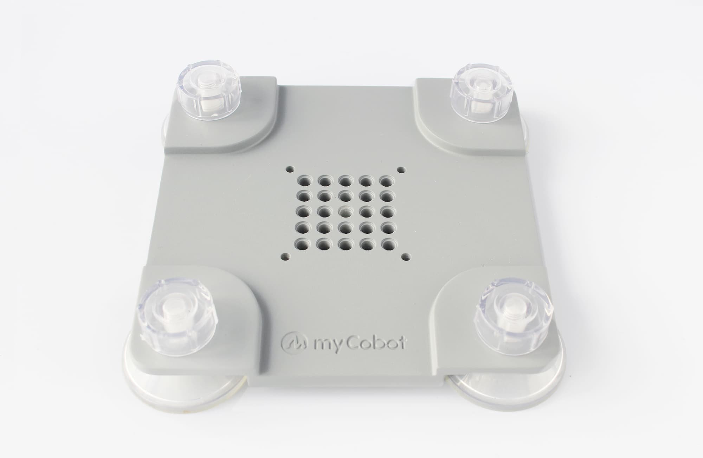
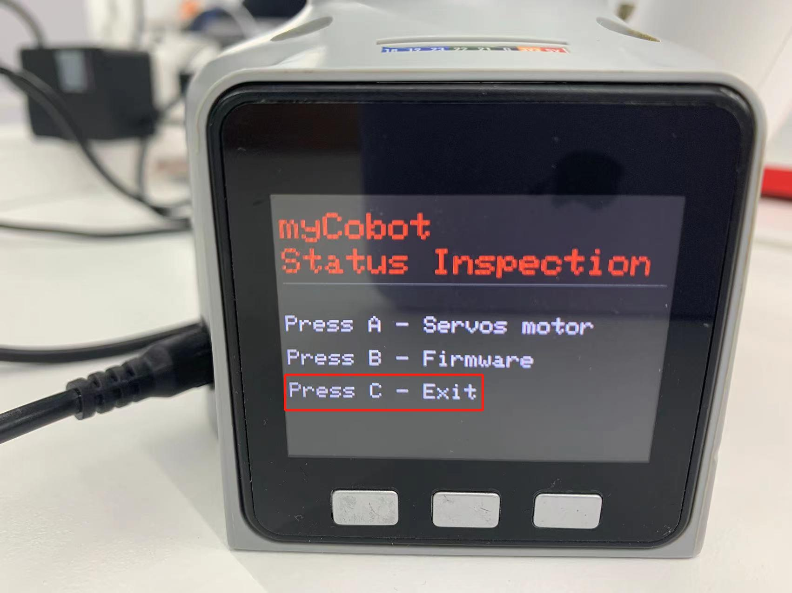

# 第四章 首次安装
## 1. 产品标准清单
## 产品列表图片
> 感谢您选择大象机器人myCobot 280 M5机械臂，本章节内容旨在帮助您轻松上手大象机器人产品，享受产品带来的每一个精彩瞬间。

## 产品标准清单对照表

| 序列号 | 产品                                  |
| :----: | :------------------------------------ |
|   1    | myCobot机械臂（型号myCobot-280 M5）   |
|   2    | myCobot机械臂-产品画册                |
|   3    | myCobot机械臂-配套电源                |
|   4    | USB-Type C                            |
|   5    | 跳线                                  |
|   6    | M4*35，杯头内六角，全螺纹，不锈钢螺丝 |
|   7    | 内六角扳手                            |

**注：** 包装箱到位后，请确认机器人包装完好无损。如有损坏，请及时联系物流公司和您所在地区的供应商。开箱后，请根据物品清单检查箱内的实际物品。

---
## 2. 产品开箱指南
## 产品开箱图文引导

**为什么需要按照步骤拆卸产品**

在本节中，我们强烈建议按照指定步骤拆卸产品。这不仅有助于确保产品在运输过程中不受损害，还能将意外故障的风险降至最低。请仔细阅读以下图解指南，以确保您的产品在开箱过程中的安全。

- **1** 检查包装箱是否损坏。如有损坏或配件缺失，请及时联系物流公司和您所在地区的供应商。

- **2** 打开包装盒，取出产品宣传册、海绵包装盖、myCobot 机器人手臂、配套电源、平板底座和附件包。

- **3** 确保每一步都完成后再进行下一步，以防止不必要的损坏或遗漏。

**注:** 取出产品后，请仔细检查每件物品的外观。请对照物品清单检查包装箱中的实际物品。

## 产品开箱视频引导

<video controls>
  <source src="../../resources/2-BasicSettings/4.FirstTimeInstallation/OpenGuide.mp4" type="video/mp4">
  您的浏览器不支持 HTML5 视频。
</video>

## 3. 开机检测指南

## 3.1 结构安装和固定

在 **机械臂** 的运动过程中，如果不将 myCobot 的**底面与桌面或其他底面相连**，仍然会造成 myCobot 的 **摇晃或倾覆**。

**常见的固定机械臂的方式有三种**：

1) 使用乐高插键固定在具有乐高接口的底座上
我们销售的底座有 2 种：平面吸盘底座与 G 型夹底座

​	平面底座 适配型号：myCobot 280

* 在底座的四角安装吸盘并拧紧。
* 用附带的乐高科技件，连接平面底座和机械臂底部。
* 将四个吸盘固定在平整光滑平面后方可开始使用。
* 技巧： 可以适当在吸盘下加入少量不导电液体，以填补吸盘与桌面的缝隙，以获得最佳吸附效果。

---

G型底座 适配型号：myCobot 280、myPalletizer 260

   - 用G形夹将底座固定在桌子边沿

   - 用附带的乐高科技件，连接底座和机械臂底部

   - 确定稳固后方可开始使用

2 myCobot 底座的螺丝孔位连接

需要将机器人固定在牢固机座上才可以正常使用。机座重量要求：固定式机座，或移动式机座。

请确定固定底座上有对应螺纹孔位，再进行安装。

正式进行安装前，请确认：

* 待安装环境符合以上《工作环境与条件》表格的要求。
*  安装位置不小于机器人工作范围，且留有足够大的安装、使用、维护、维修的空间。
*  将机座放置到合适位置。
*  安装相关工具已准备好，如螺丝、扳手等。
  **确认以上内容后**，请将机器人搬运至机座安装台面上，调整机器人位置，将机器人基座固定孔位与机座安装台面上的孔位对准。对准孔位后，将螺丝对准孔位，拧紧即可。

* 注意：在机座安装台面上调整机器人位置时，请尽量避免在机座安装台面上直接推拉机器人，以免产生划痕。人工移动机器人时请尽量避免对机器人本体脆弱部分施加外力，以免造成机器人不必要的损伤。

---
## 3.3 上电与初步检测

**myCobot 必须使用外部电源进行供电，以提供足够的电量：**
	Rated voltage: 12V
	Rated current: 3-5A
	Plug Type: DC 5.5mm x 2.1
**注意，不能仅仅使用插入M5Stack-basic的TypeC进行供电。使用官方适配的电源，以免对机械臂造成损害。**

### 图文引导

#### 3.3.1 连接电源

连接电源线之后即启动。

使用Type-C线连接到电脑和机械臂M5Stack-basic的对应USB接口，并进行连接检测。连接检测是一项用于机械臂中电机以及 **Atom** 连接状态的检测功能。这项功能便于客户排除设备故障

#### 3.3.2 链接检测

**Step 1:** **Atom**烧录最新版的**atomMain**。

**Step 2:** **M5Stack-basic**烧录**minirobot**，选择**Information**功能。

**Step 3**: 按下**A**键，开始连接检测。屏幕显示**Atom**以及六个电机连接状态。

如图所示即为电机链接状态良好
**Step 4**: 按下**B**键，开始检测版本信息。屏幕显示机器人版本以及**Basic**固件版本。

**Step 5**: 按下**C**键，退出此功能

即可完成开机检测。

## 4.常见问题解决
本小节旨在帮助用户解决在使用过程中所遇到的常见问题，涵盖硬件、软件、驱动以及如何在论坛中提问这几个方面，如您在使用机械臂的过程中遇到问题，请首先阅读本小节的内容来寻求解决办法。如果列举出的问题无法帮助您解决并且您有更多售后问题想要咨询请添加售后小管家微信。

[如何优雅的提问](../../4-SupportAndService/9.Troubleshooting/9.0-how_to_ask.md)

[常见的驱动问题以及解决方案](../../4-SupportAndService/9.Troubleshooting/9.1-driver.md)

[常见的软件问题以及解决方案](../../4-SupportAndService/9.Troubleshooting/9.2-software.md)

[常见的硬件问题以及解决方案](../../4-SupportAndService/9.Troubleshooting/9.3-hardware.md)

---

如果您已经阅读了本章的所有内容，请继续阅读下一章。  
[← 上一章](../3.UserNotice/3-UserInstructions.md) | [下一章 →](../../3-FunctionsAndApplications/5.BasicFunction/README.md)
