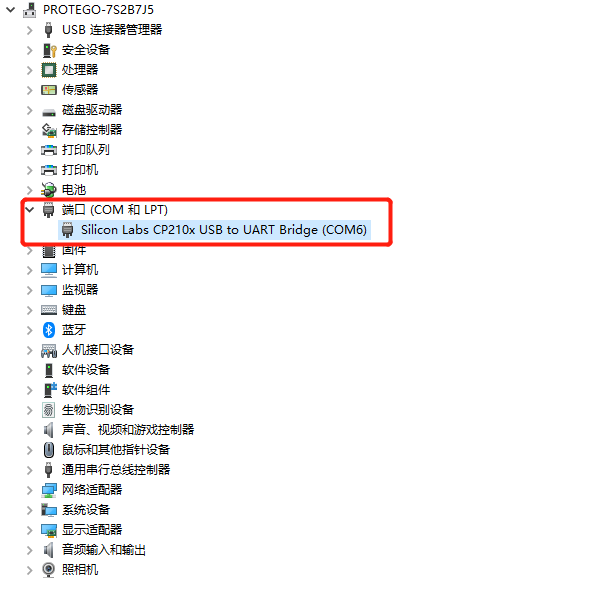
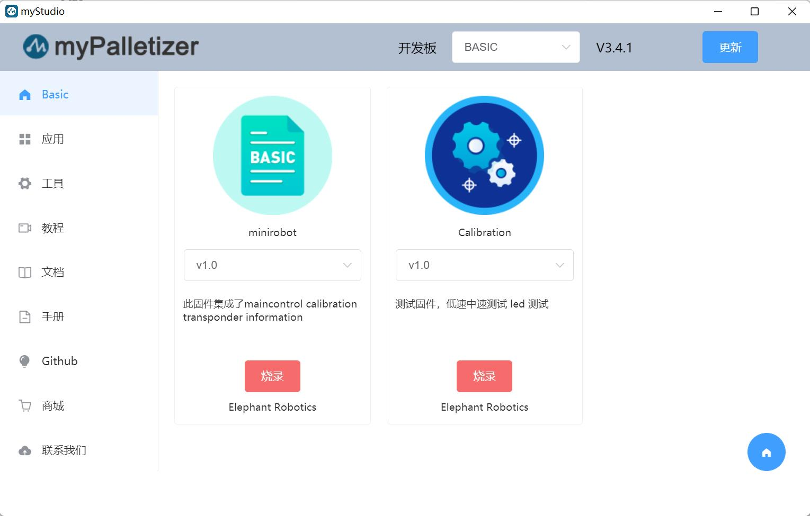

# myStudio

## myStudio设计初衷

- myStudio是一个一站式的myRobot/myCobot等机器人的使用平台。

- 方便用户根据自己的使用场景，选择不同的固件并进行下载，同时学习相关的教材，在线浏览教程视频。

## myStudio最新版本与支持平台

- 最新版本：V3.5.8

- 适用于：Windows、Mac、Linux

## myStudio功能

- 烧录、更新固件
- 提供机器人使用教程，如用户手册、视频教程、Q&A等
- 维护和维修方面的信息

## myStudio适用设备

- myCobot 280
  - **myCobot 280 M5**
  - myCobot 280 PI
  - myCobot 280 Jetson Nano
  - myCobot 280 for Arduino 

## 固件版本推荐

不同型号机械臂所需烧录的固件不同，以下是不同型号机械臂推荐烧录的固件版本。

**myCobot 280系列**

myCobot 280系列共4个版本：M5版本、PI版本、ardunio版本以及jetsonnano版本。不同版本核心型号不同，所需烧录的固件及其版本也不同。以下仅列出M5机械臂相关的固件。

<table>
  <tr>
    <td>机械臂版本号</td>
    <td>核心</td>
    <td>所需烧录固件</td>
    <td>推荐固件及其版本</td>
  </tr>
  <tr>
    <td rowspan="2">M5版本</td>
    <td>M5Stack-Basic</td>
    <td>miniRobot固件</td>
    <td>推荐烧录v2.1版本，可以使用拖动示教、wifi、蓝牙等功能</td>
  </tr>
  <tr>
    <td>Atom</td>
    <td>atomMain固件</td>
    <td>产品序列号为ER28001202200415及之前，或者产品无序列号，推荐烧录v4.1版本；序列号为ER28001202200416及之后，推荐烧录v5.1版本</td>
  </tr>
</table>

# myStudio环境搭建

## myStudio下载和安装

>注意：myStudio安装时的安装路径不能有任何空格

我们提供两种下载地址：

**1. [GitHub地址](https://github.com/elephantrobotics/myStudio)**

* 进入下载地址后，点击右侧`myStudio`，选择相应版本下载即可。

* 不同后缀代表了适用于不同的系统，请下载相应版本：
  * *.tra.xz —— Linux系统
  * *.dmg —— Mac 系统
  * *.exe —— Window 系统

**2. [官网地址](https://www.elephantrobotics.com/download/)**

依据电脑系统自行下载即可。

> **注意：**请下载最新版本。可以在下载好的myStudio界面中查看当前版本，并更新至最新版本。
>
>

## 安装驱动

用户可根据自己所使用的操作系统，点击下方按钮下载相应的 **CP210X** 或 **CP34X** 驱动程序压缩包，在解压压缩包后，选择对应操作系统位数的安装包进行安装。

目前存在两种驱动芯片版本， **CP210X** （适用于CP2104版本）以及**CP34X** （适用于CH9102版本）驱动程序压缩包。若您不确定您的设备所使用的USB芯片，可同时安装两种驱动。（ **CH9102_VCP_SER_MacOS** 在安装过程中，可能出现报错，但实际上已经完成安装，忽略即可。）

对于 Mac OS，在安装之前确保系统 "偏好设置->安全性和隐私->通用" ，并允许从 App Store 和被认可的开发者。

- 下载底部 **M5Stack-basic** 串口驱动程序
  
  - **CP210X**
    - [ **Windows10** ](https://download.elephantrobotics.com/software/drivers/CP210x_VCP_Windows.zip)
    - [ **MacOS** ](https://download.elephantrobotics.com/software/drivers/CP210x_VCP_MacOS.zip)
    - [ **Linux** ](https://download.elephantrobotics.com/software/drivers/CP210x_VCP_Linux.zip)
  
  
  * **CP34X**
  
    - [ **Windows10** ](https://download.elephantrobotics.com/software/drivers/CH9102_VCP_SER_Windows.exe)
  
    - [ **MacOS** ](https://download.elephantrobotics.com/software/drivers/CH9102_VCP_MacOS.zip)

- 下载末端 **Atom** 串口驱动程序 
  - [ **Windows10** ](https://download.elephantrobotics.com/software/drivers/CDM21228_Setup.zip)

## 如何区分CP210X和CP34X芯片

- 如下图所示，打开 **设备管理器** ，查看 **端口(COM和LPT)** 

  * 若 **端口(COM和LPT)** 显示 **USB-Enhanced-SERIAL CH9102**，则为 **CP34X芯片** 

  * 若 **端口(COM和LPT)** 显示 **Silicon Labs CP210x USB to UART Bridge**，则为 **CP210X芯片**

# 烧录与更新固件

**[myStudio视频教程](https://www.bilibili.com/video/BV1Qr4y1N7B5/)**

## 烧录M5Stack-Basic固件

> **注意：Pi系列机械臂无需烧录M5Stack-Basic固件。**

第一步: 与PC连接。M5Stack-Basic与PC连接方式如下图所示：

第二步：选择端口。连接之后，myStudio 的连接窗口的`USB端口`会显示出已连接的开发板（这里是以myPalletizer 260M5版本为例）：

第三步：点击`登录`->`M5Stack-basic`，即可烧录所需固件：

> **注意：**280 PI/Jetson nano/Arduino版本没有M5Stack-basic，因此连接到myStudio之后会显示“无数据”。

---

## 烧录 Atom 固件

第一步：与PC连接。用 USB 连接末端的Atom。

第二步：在`Board`一栏可以选择`ATOM`,侧边栏`Basic`就会出现 Atom 的固件。Atom 的固件就只有一个，点击烧入即可（下图以myCobot 280为例）。

烧录完固件后请跟随以下步骤对mycobot机械臂进行首次使用检测。

## 上电与初步检测

**myCobot 必须使用外部电源进行供电，以提供足够的电量：**
   Rated voltage: 12V 
   Rated current: 3-5A 
   Plug Type: DC 5.5mm x 2.1 
**注意，不能仅仅使用插入M5Stack-basic的TypeC进行供电。使用官方适配的电源，以免对机械臂造成损害。**

### 图文引导

#### 连接电源

连接电源线之后即启动。

使用Type-C线连接到电脑和机械臂M5Stack-basic的对应USB接口，并进行连接检测。连接检测是一项用于机械臂中电机以及 **Atom** 连接状态的检测功能。这项功能便于客户排除设备故障

#### 链接检测

**Step 1:** **Atom**烧录最新版的**atomMain**。

**Step 2:** **M5Stack-basic**烧录**minirobot**，选择**Information**功能。

**Step 3**: 按下**A**键，开始连接检测。屏幕显示**Atom**以及六个电机连接状态。

如图所示即为电机链接状态良好 
**Step 4**: 按下**B**键，开始检测版本信息。屏幕显示机器人版本以及**Basic**固件版本。

**Step 5**: 按下**C**键，退出此功能

即可完成开机检测。