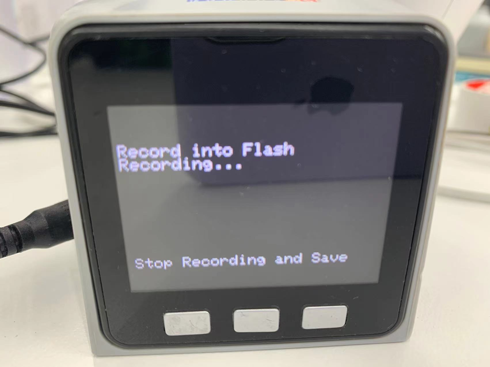
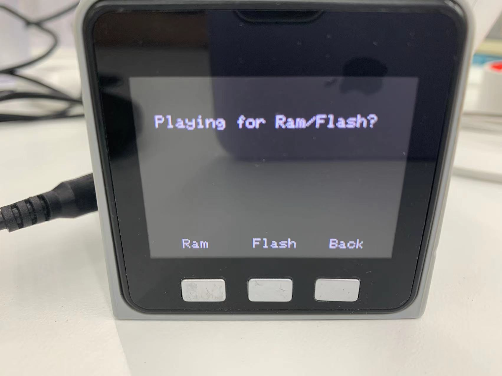
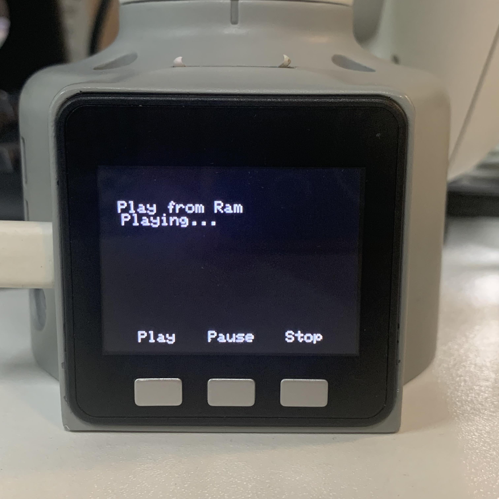

# 实现拖动示教

## 拖动示教

机器人拖动示教，就是操作员可以直接拖动着机器人各关节，运动到理想的姿态，记录下来。

协作机器人是较早具有该功能的系统。这种示教方式可以避免传统示教的各种缺点，是机器人中一项很有应用前景的技术。

**设备类型不同，操作方式也有所不同**，大概步骤如下：
- **Atom** 烧录最新版的 **atomMain**
- **M5Stack-basic**烧录 **minirobot**，选择 **Maincontrol** 功能，微处理器类设备无需烧录**M5Stack-basic**
- 按下录制按钮/键盘按键
- 选择储存路径，微处理类设备无此步骤
- 可直接拖动机械臂各关节，移动至您预想的位置，完成一组运动
- 按下指定按钮/键盘按键进行保存
- 按下播放按钮/键盘按键/键盘按键
- 选择相对于的储存路径，机械臂开始运动 
- 按下退出按钮/键盘按键，退出此功能

本节我们将教您如何简单上手，体验协作机器人拖动示教的乐趣

## 1 适用设备
- myCobot 280 M5
- myCobot 320 M5
- myPalletizer 260 M5
- mechArm 270 M5

## 操作步骤

**Step 1:** Atom烧录最新版的atomMain。

**Step 2:** M5Stack-basic烧录minirobot，选择Maincontrol功能。

**Step 3:** 按下录制按钮Record。 

**Step 4:** 选择储存路径，按下Ram或者Flash。

**Step 5:** 拖动机械臂各关节，移动至您预想的位置，完成一组运动。

**Step 6:** 按下任意键停止录制，保存记录

**Step 7:** 按下播放按钮Play。

**Step 8:** 点击刚才选择的储存路径，按下Ram/Flash， 机械臂开始播放已保存的记录。

**Step 9:** 按下Pause可暂停运动，按下Stop可停止运动，按下Play可恢复运动。 

## 视频教程

教程视频地址：[https://www.bilibili.com/video/BV16t4y167vw/](https://www.bilibili.com/video/BV16t4y167vw/)

