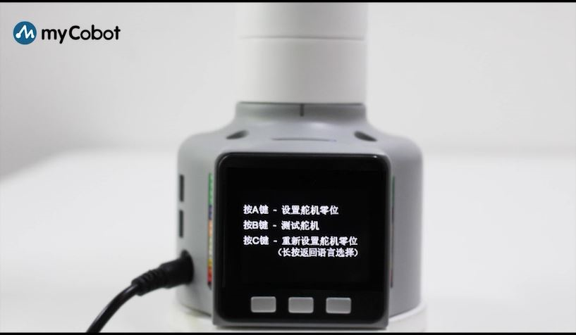
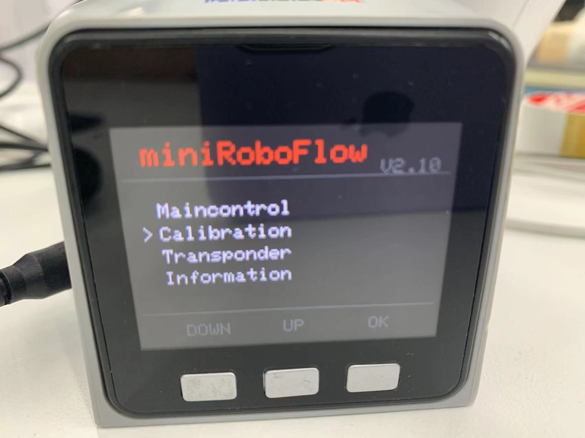
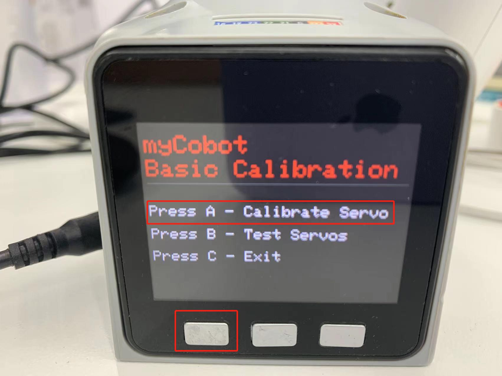
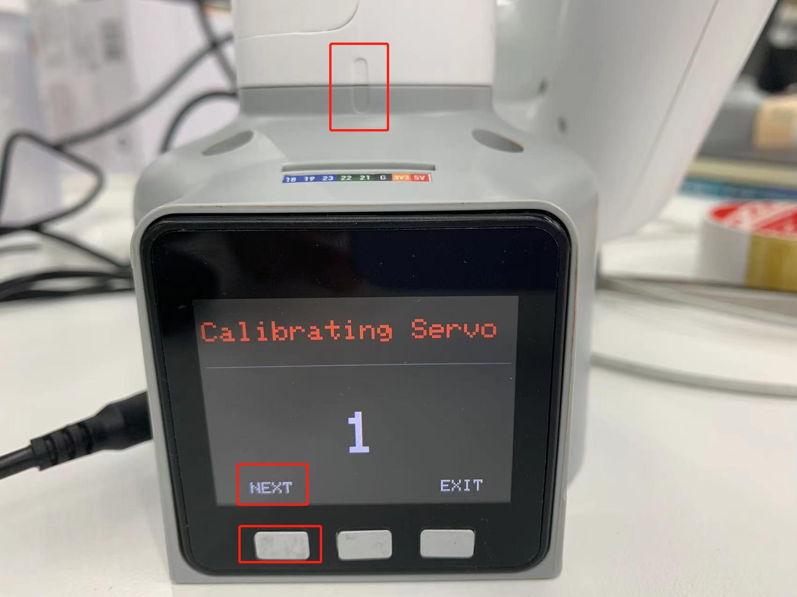
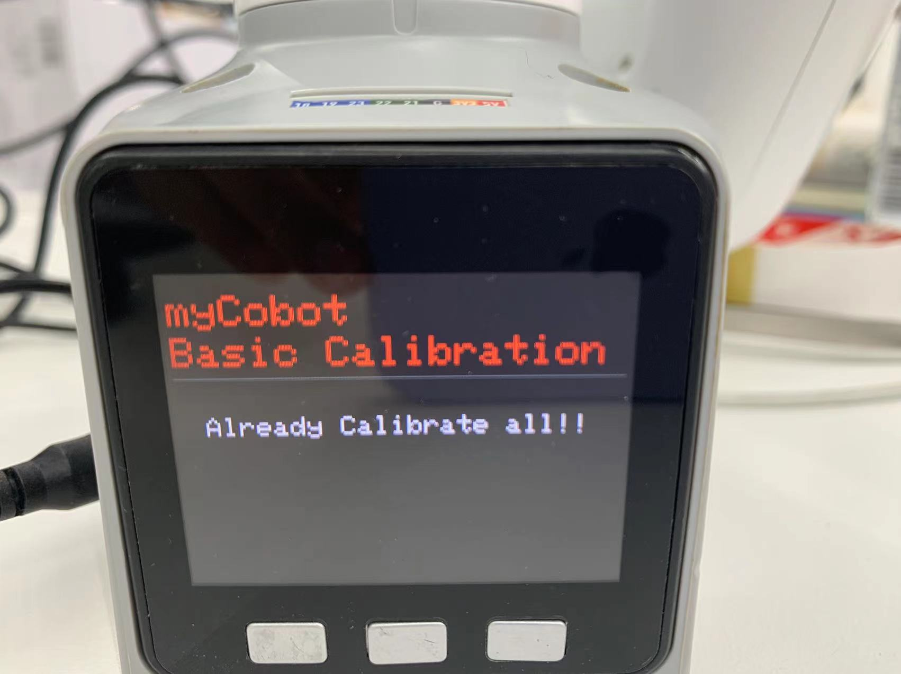
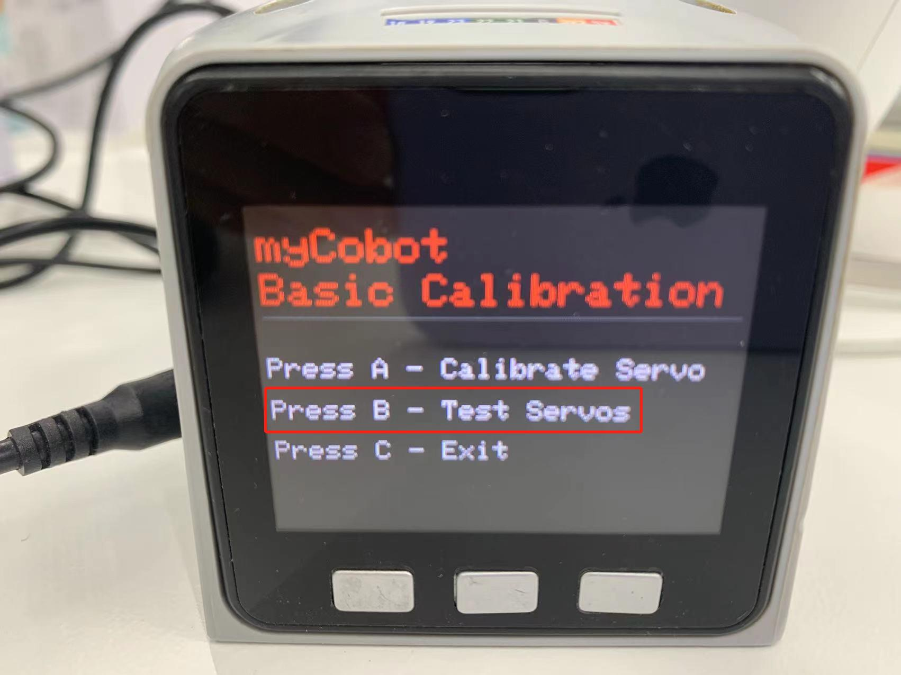
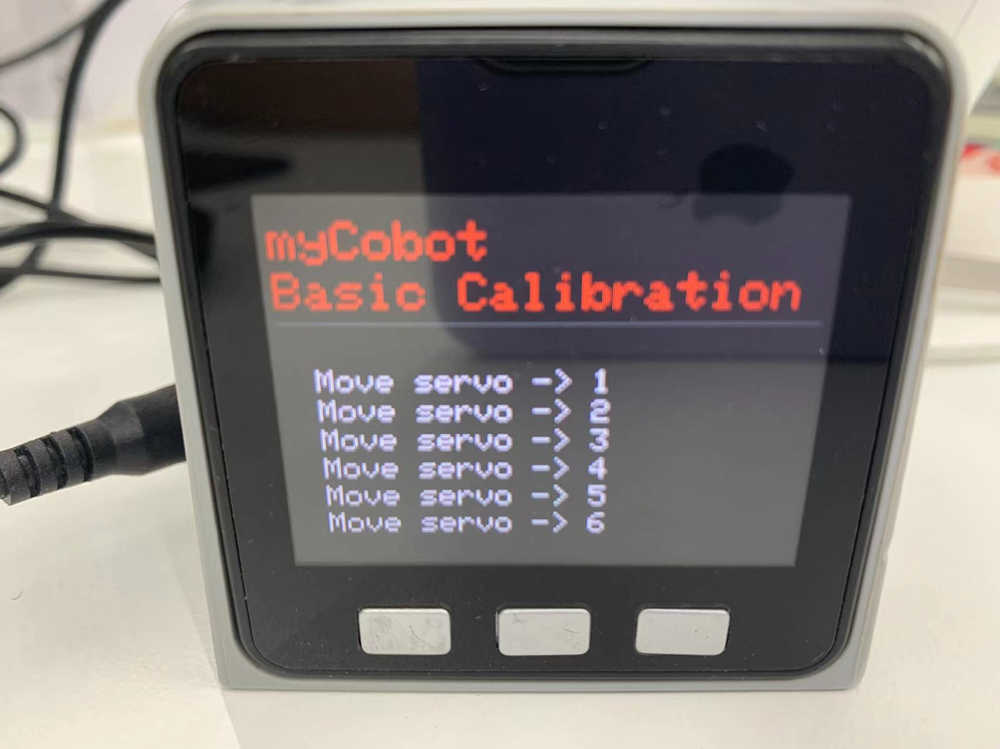
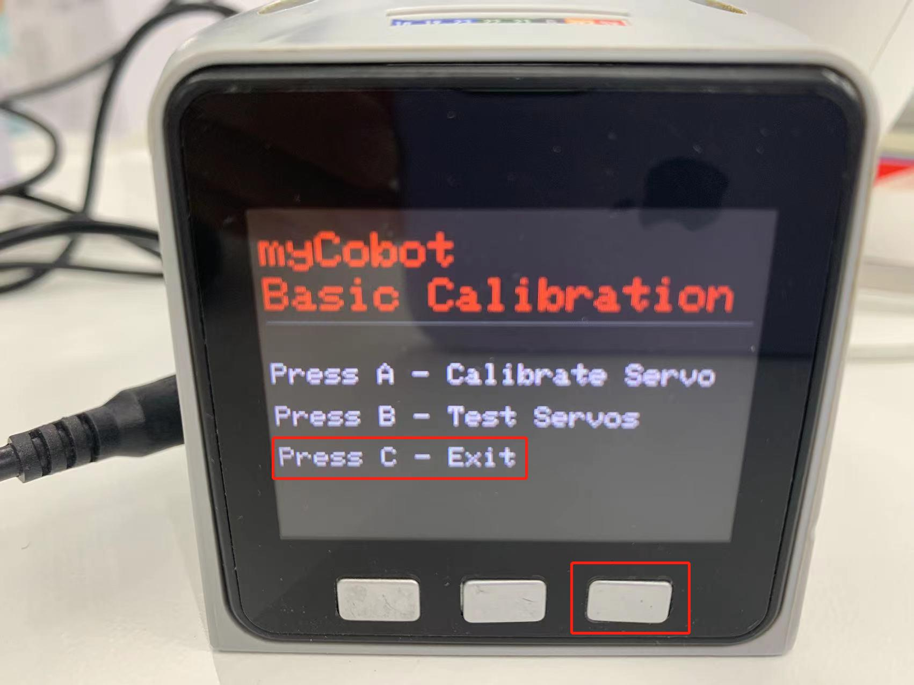

# 实现机械臂校准

## 校准机械臂

提示：默认机器人出厂时已经进行过此操作，无需重复进行操作。错误使用此功能可能会导致机器人损坏，如您的机器人工作无异常情况**请勿使用**，谢谢您的配合。

校准机械臂是对机械臂精准控制的前提，设置关节零位，初始化电机的电位值是后续进行进阶开发的基础。

**设备类型不同，操作方式也有所不同**，大概步骤如下：

- **Atom** 烧录最新版的 **atomMain**
- **M5Stack-basic**烧录 **minirobot**，选择 **Calibration** 功能，微处理器类设备无需烧录 **Basic**
- 将机械臂各关节转至零位状态（零位刻度线对齐），按校准按钮，开始校准机械臂
- 按下测试按钮，测试机械臂各关节零位
- 按下退出按钮，退出此功能

本节，我们将手把手教您如何校准机械臂，并在校准之后，对机械臂的关节进行测试验证。

## 适用设备

- myCobot 280 M5
- myCobot 320 M5
- myPalletizer 260 M5
- mechArm 270 M5

## 操作步骤

**Step 1:** Atom烧录最新版的atomMain。

**Step 2:** Basic烧录minirobot，选择Calibration功能。

**Step 3:** 按下A键 ，开始校准机械臂。

**Step 4:** 首先拖动机械臂使一号关节到达零位状态（零位刻度线对齐）。

**Step 5:** 按照屏幕提示的电机序号(1~6),拖动机械臂使每个关节到达零位（零位刻度线对齐）

**Step 6:** 依次按下NEXT，进入下一个电机校准，直至出现Already Calibrate all!! ，即完成校准。

**Step 7:** 按下EXIT ,可退出校准。

**Step 8:** 按下B键，测试机械臂各关节零位。

**Step 9:** 按下C键，退出此功能。

## 视频教程

地址：[https://www.bilibili.com/video/BV1FT4y1P7BV/](https://www.bilibili.com/video/BV1FT4y1P7BV/)