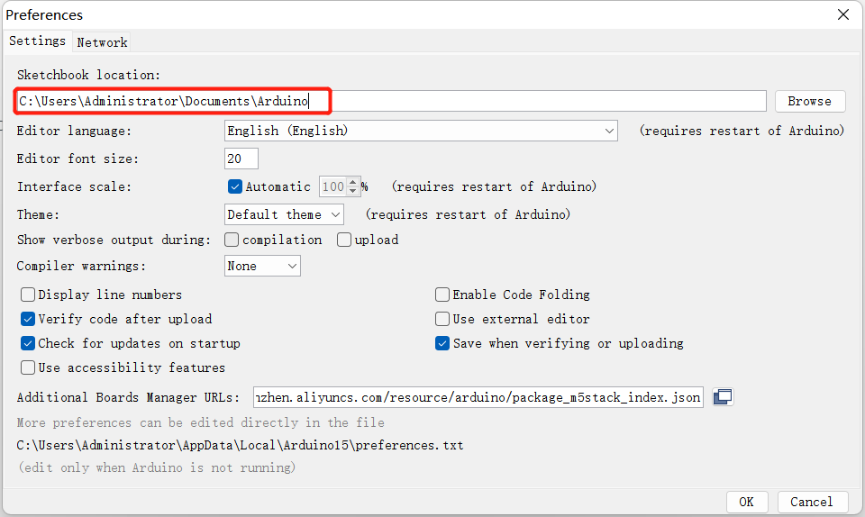
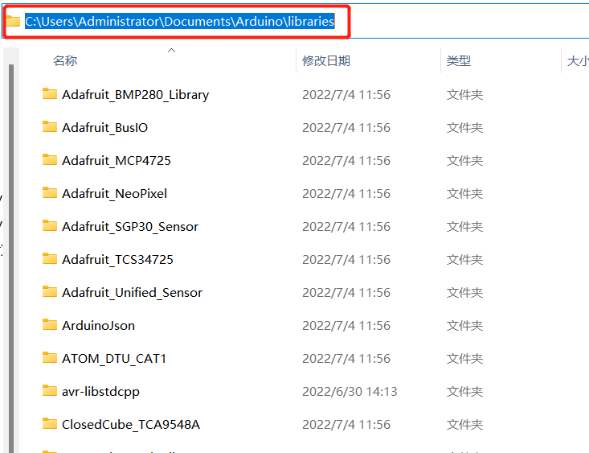

# Arduino 环境搭建

## 1.**Arduino IDE** 下载

下载 **Arduino IDE** 可以点击 [**Arduino 官网**](https://www.arduino.cc/en/software) 下载安装与电脑系统对应的版本。

- [Windows X64](https://downloads.arduino.cc/arduino-1.8.16-windows.exe)
  
- [Mac OS X](https://downloads.arduino.cc/arduino-1.8.16-macosx.zip)
  
- [Linux ARM 64](https://downloads.arduino.cc/arduino-1.8.16-linuxaarch64.tar.xz)

## 2.安装驱动

程序烧录前，M5Core 型主机（包含 BASIC/GRAY/M5GO/FIRE/FACES）/ **微控制类设备** 的用户请根据您使用的操作系统，点击下方按钮下载相应的 **CP210X** 驱动程序压缩包。在解压压缩包后，选择对应操作系统位数的安装包进行安装。

对于 **Mac OS** ，在安装之前确保 **系统偏好设置-->安全性和隐私-->通用** ，并允许从 App Store 和被认可的开发者

下载 **CP2104** 驱动程序

* [Windows10](https://m5stack.oss-cn-shenzhen.aliyuncs.com/resource/drivers/CP210x_VCP_Windows.zip)

* [MacOS](https://m5stack.oss-cn-shenzhen.aliyuncs.com/resource/drivers/CP210x_VCP_MacOS.zip)

* [Linux](https://m5stack.oss-cn-shenzhen.aliyuncs.com/resource/drivers/CP210x_VCP_Linux.zip)

在解压压缩包后，根据电脑**操作系统**选择对应安装包进行安装（win10和win11选择x64或x86进行安装）。

  **CP34X**

  - [ **Windows10** ](https://download.elephantrobotics.com/software/drivers/CH9102_VCP_SER_Windows.exe)
  
  - [ **MacOS** ](https://download.elephantrobotics.com/software/drivers/CH9102_VCP_MacOS.zip)
## 3.添加开发板

* 打开 Arduino IDE，选择 **文件 --> 首选项 --> 设置** ，将下方的网址添加到附加开发板管理器中
  https://m5stack.oss-cn-shenzhen.aliyuncs.com/resource/arduino/package_m5stack_index.json
  

* 添加完成后，选择 **工具 --> 开发版 --> 开发板管理器** ，在新弹出的对话框中，输入并搜索 **M5Stack** ，点击安装（若出现搜索失败的情况，可以尝试重启 **Arduino** 程序；若出现下载时出错，重新点击安装即可），如下图：

* 添加后选择 **工具 --> 开发板** ，查看是否成功，如下图：

## 4.添加相关库
  4.1 安装M5Stack库 
  1. 工具 --> 开发板 --> M5Stack Arduino选**M5Stack-Core-ESP32**，具体如下图所示： 

  2. 项目 --> 加载库 --> 管理库 搜索框输入**M5Stack**，具体如下图所示： 

  3. 找到后点击安装，往下翻，**M5Stack**在后面，具体可看图片中的下拉滑块所在位置，具体如下图所示： 

  4.2 安装MyCobotBasic库 

  **注意：** 请下载最新的库，第一版为v0.0.1。

  * 点击下载相关依赖库
    - [**MycobotBasic**](https://github.com/elephantrobotics/MyCobotBasic/tags)。具体请看下图，.zip适用于Windows系统，.tar.gz适用于Linux系统： 
    

  * 依赖库安装说明
    
    首先查看Arduino项目文件夹所在位置，可以通过点击 文件 --> 首选项进行查看（可以将路径复制到硬盘路径即可找到libraries文件夹）
    
    
---

---

1 将路径复制到这里然后按回车找到libraries文件夹

   解压到对应文件夹 **libraries** 目录下中即可，如果你正在使用 **Arduino** ，请不要覆盖，添加至已有的 **Library** 中即可。

  到此，恭喜您，已经搭建好 **Arduino** 相关的开发环境。

注意：Arduino环境配置及案例编译可以看我们哔哩哔哩上的视频 （ https://www.bilibili.com/video/BV1Vi4y1c7DQ/ ）。

