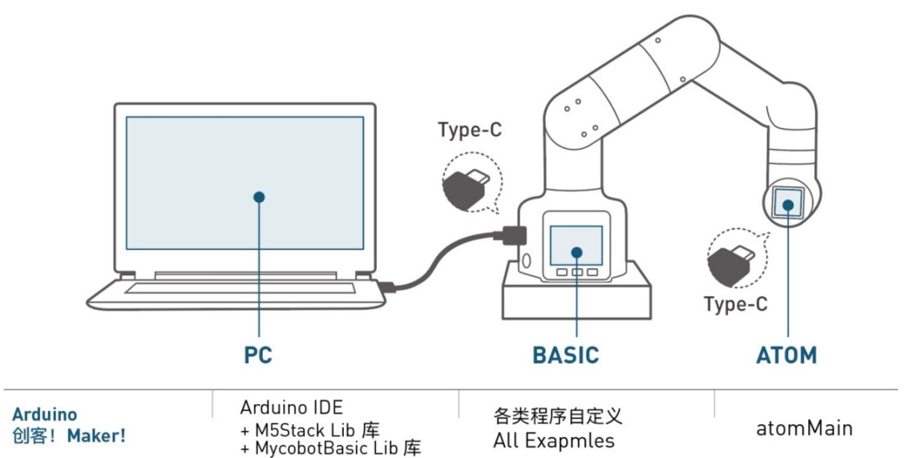

# Arduino 简单使用

## 1.连接设备

以 **myCobot 280-M5** 为例，用 Tyep-C 数据线把机械臂底座上的M5Stack-basic与 PC 端相连接。


## 2.固件要求  

* ATOM ：使用 **MyStudio** 烧录最新版 AtomMain

* Basic ：无要求

## 3.检测链接  

打开电脑设备管理器查看有无设备。如未检测到设备，请更换USB连接线，如果显示无法使用，请安装点击下载 **CP210X 驱动**（参考5.2软件使用说明） ，下载完成后解压并安装所需的驱动版本即可使用。

打开 **Arduino IDE -->工具 --> 端口** 查看有无设备。如未检测到设备，请更换USB连接线测试，或检测驱动是否安装成功。

## 4.开始开发

以烧录一个官方 demo 为例，打开 **Arduino IDE --> 文件 --> 示例--> MyCobotBasic** 就可以看到所有的项目示例（如果未看到示例，可以将Arduino重启）。选择烧录一个简单的 demo , 例如 **--> MyCobot280--> MyCobot280-M5--> AnglesControl** 。

从示例文件中打开AnglesControl.ino


**注意：** 选择开发板为 **M5Stack-Core-ESP32** 和对应的 **COM口** 。


如果您使用的是myCobot280-M5，**请使用MyCobot280-M5文件夹下的ParameterList.h，替换掉MyCobotBasic文件夹下的ParameterList.h**，具体请看下图：<br>


**注意：** 使用不同机型时，请使用各自案例目录下的"ParameterList.h"文件替换"MyCobotBasic\ParameterList.h"文件

点击上传并等待右下方进度条跑完<br>


等待直到右下方显示上传成功，程序就已经下载完成


这时我们就能看到 **机器人** 开始工作。

有关**basic按键与屏幕**使用的接口和驱动可参考如下文档：<br>

按键： https://docs.m5stack.com/en/api/core/button <br>
屏幕： https://docs.m5stack.com/en/api/core/lcd <br>

## 5.部分案例介绍
目前不同机型都有角度、坐标、夹爪控制，MyCobot320支持自适应夹爪与电动夹爪控制。<br>
miniRobot：<br>
myCobot280、320m5、mechArm270-M5使用案例，可以进行零位校准、拖动示教、通讯等（在此基础上，使用RoboFlow、python、myblockly等控制机械臂）、信息获取（获取舵机 atom连接状态、以及basic、atom固件版本）。<br>


注意：Arduino环境配置及案例编译可以查阅gitbook相关章节内容和哔哩哔哩上的视频 https://space.bilibili.com/2126215657/channel/seriesdetail?sid=619809。


**案例代码讲解说明**：

**AnglesControl**文件夹内的示例代码是用来控制机械臂的角度的，代码里包含了初始化、上电、控制单个关节的角度，以及控制所有关节回到初始位置的功能。以下为代码的详细注释

```arduino
#include <MyCobotBasic.h> // 引入 MyCobotBasic 库，用于控制 MyCobot 机械臂

MyCobotBasic myCobot; // 声明并实例化一个 MyCobotBasic 对象，用于调用机械臂控制方法
Angles angles = {0, 0, 0, 0, 0, 0}; // 定义一个 Angles 变量，初始化为六个关节的角度全为 0

void setup()
{
    myCobot.setup(); // 初始化机械臂的通信接口等基础设置，这是启动机械臂控制所必需的
    delay(100); // 延迟 100 毫秒，确保初始化完成
    myCobot.powerOn(); // 给机械臂上电，使其可以响应控制命令
    delay(100); // 再次延迟 100 毫秒，确保机械臂完全启动
}

void loop()
{
    myCobot.writeAngle((Joint)1, 100, 30); // 控制第一个关节（J1）移动到 100°，速度设置为 30
    delay(200); // 延迟 200 毫秒，等待关节移动到指定角度后再执行下一步
    myCobot.writeAngles(angles, 50); // 将所有关节移动到 angles 中指定的角度（此处为 0°），速度设置为 50
    delay(5000); // 延迟 5000 毫秒，让机械臂在所有关节回到初始位置后保持静止一段时间
}
```

**CoordsControl**文件夹内的示例代码是用来控制机械臂的坐标的，代码里包含了机械臂初始化、上电、机械臂根据指定坐标来移动，以下为代码的详细注释。

```
#include <MyCobotBasic.h> // 引入 MyCobotBasic 库，用于控制 MyCobot 机械臂

MyCobotBasic myCobot; // 声明并实例化一个 MyCobotBasic 对象，用于调用机械臂的控制方法

Coords coords = {200.8, -87.400, 113.300, -178.260, -30.760, -60.880}; // 定义一个 Coords 变量，表示目标的六个坐标值

void setup()
{
    myCobot.setup(); // 初始化机械臂的通信接口等基础设置，这是启动机械臂控制所必需的
    delay(100); // 延迟 100 毫秒，确保初始化完成
    myCobot.powerOn(); // 给机械臂上电，使其可以响应控制命令
    delay(100); // 再次延迟 100 毫秒，确保机械臂完全启动
    myCobot.writeAngles({0, -10, -123, 45, 0, 20}, 50); // 设置机械臂的初始姿态，每个关节角度为指定值，速度为 50
    delay(6000); // 延迟 6000 毫秒，等待机械臂移动到初始姿态
}

void loop()
{
    myCobot.writeCoord((Axis)3, 260, 30); // 控制机械臂的第三个轴（Z轴）移动到 260mm，速度为 30
    delay(300); // 延迟 300 毫秒，等待轴移动到指定位置后再执行下一步
    myCobot.writeCoords(coords, 30); // 按照定义的坐标控制多个轴同时移动到目标位置，速度为 30
    delay(5000); // 延迟 5000 毫秒，等待机械臂完成移动后保持静止一段时间
}
```

**GripperControl**文件夹内的示例代码是用来控制机械臂的夹爪的，在运行示例代码前请链接夹爪。代码里包含了机械臂初始化、上电、机械臂根据指定坐标来移动，以下为代码的详细注释。
```
#include <MyCobotBasic.h> // 引入 MyCobotBasic 库，用于控制 MyCobot 机械臂

MyCobotBasic myCobot; // 声明并实例化一个 MyCobotBasic 对象，用于调用机械臂的控制方法

void setup()
{
    myCobot.setup(); // 初始化机械臂的通信接口等基础设置，这是启动机械臂控制所必需的
    delay(100); // 延迟 100 毫秒，确保初始化完成
    myCobot.powerOn(); // 给机械臂上电，使其可以响应控制命令
    delay(100); // 再次延迟 100 毫秒，确保机械臂完全启动
}

void loop()
{
    myCobot.setGripperValue(80, 50); // 将夹爪移动到 80°，速度为 50
    delay(500); // 延迟 500 毫秒，等待夹爪移动到指定位置后再执行下一步
    myCobot.setGripperValue(20, 50); // 将夹爪移动到 20°，速度为 50
    delay(500); // 延迟 500 毫秒，等待夹爪移动到指定位置后再执行下一步
    myCobot.setGripperState(0, 30); // 打开夹爪，速度为 30
    delay(600); // 延迟 600 毫秒，等待夹爪完全打开后再执行下一步
    myCobot.setGripperState(1, 30); // 关闭夹爪，速度为 30
    delay(600); // 延迟 600 毫秒，等待夹爪完全关闭后再执行下一步
}
```