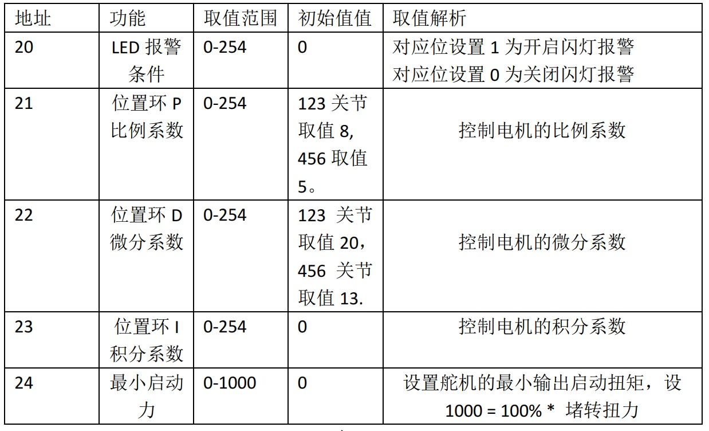

# arduino API

## 1 机器人整体运行状态 Overall Status 

1.1 `powerOn();`

- 功能：机器人上电，上电后才可以控制机器人

- 返回值：无

1.2 `powerOff();`

- 功能：机器人掉电

- 返回值：无

1.3 `isPoweredOn();`

- 功能：atom 状态查询，返回 atom 连接状态

- 返回值：打开 TRUE、关闭 FALSE

1.4 `getAtomVersion();`

- 功能：获取Atom固件版本

- 返回值：int类型的数值，数据需要/10，比如读取到版本号为12，实际需要除10，最终版本号为1.2

1.5 `setFreeMoveMode(bool mode);`

- 功能：设置自由移动模式，开启自由移动模式后，末端led为黄色，长按末端atom，可以手动移动机器人
- 参数说明：
- mode：模式，0/1，0--关闭自由移动，1--开启自由移动

- 返回值： 无

## 2 输入程序控制模式 MDI Mode and Robot Control (Manual Data Input)

2.1 `getAngles();`

- 功能：读取所有关节角度，使用时应定义一个 Angles angles，来接收读取到的角度，Angles 是库函数内置的变量或函数定义，可以定义一个内存为 6 的储存空间 angles，用来储存角度变量，使用的方式与数组相同。

- 返回值：Angles 类型的数组

2.2 `writeAngle(int joint, float value, int speed);`

- 功能：发送单关节角度

- 参数说明：
  关节序号 = joint，取值范围 1-6;
  指定角度值 = value，取值范围约-170°- +170°;
  指定速度 = speed， 取值范围 1-100;

- 返回值：无

2.3 `writeAngles(Angles angles, int speed);`

- 功能：关节角度同步执行，同时发送六个关节的角度给执行器 Angles 为库函数声明的定义类型，指定 angles 是容量大小为 6 个数据的容器，可理解为数组，赋值时可使用 for 循环赋值，也可单独赋值。

- 参数说明：
  Angles[0] = 具体角度，Angles[2] = 具体角度，以此类推取值范围 0-90（范围为定义，取值范围应和 writeAngle 相同） 单位：度 符号：°
  运动速度 = speed，取值范围 1-100 单位 %

- 返回值：无

2.4 `getCoords();`

- 功能：读取当前机械臂末端的 x, y, z, rx, ry, rz，使用时应定义一个 Coords tempcoords，来接收读取到的角度，Coords 是库函数内置的变量或函数定义，可以定义一个内存为 6 的储存空间 tempcoords，用来储存角度变量,使用的方式与数组相同。

- 返回值：Coords 类型下的一个数组，需要定义好 Coords 类型的变量

2.5 `writeCoord(Axis axis, float value, int speed);`

- 功能：发送单独坐标参数 X/ Y/ Z/ RX/ RY/ RZ 的具体数值，末端会在单独方向上移动，

- 参数说明：
  移动的路径坐标值 = value 取值范围 -300-300（axis=Axis::X,aixs=Axis::Y 和 axis=Axis::Z 为位置坐标分别为 X,Y,Z，单位 mm，位置坐标取值范围不统一，axis=Axis::RX, aixs=Axis::RY 和 axis=Axis::RZ 分别为 RX,RY,RZ 取值范围为 -180°-180° ，超出取值范围会返回 inverse kinematics no solution 提示）
  指定速度 =speed 取值范围 1-100 单位 %

- 返回值：无

2.6 `writeCoords(Coords coords, int speed);`

- 功能：发送指定的坐标参数，参数的类型应是 Coords，需要声明一个 Coords 类型的变量，此变量的使用方法与数组相同

- 参数说明：
  coords[0] = X, coords[1] = Y, coords[2] = Z,
  X,Y,Z 取值范围 -300.00-300.00（取值范围未定义，超出范围会返回 inverse kinematics no solution 提示） 单位 mm
  coords[3] = RX, coords[4] = RY, coords[5] = RZ,
  RX,RY,RZ 取值范围 -180-180
  指定速度 =speed 取值范围 1-100 单位 %

- 返回值：无

2.7 `checkRunning();`

- 功能：检查设备是否在运动

- 返回值：运动中回复 TRUE，否则回复 FALSE

2.8 `setEncoder(int joint, int encoder);`

- 功能：设定单一关节转动至指定电位值

- 参数说明：关节序号 = joint 取值范围 1-7 (7号关节一般为夹爪，夹爪电位值取值范围：1325-2048)；舵机电位值 = encoder 取值范围 0-4096（该范围应与每个关节的范围正相关）

- 返回值：无

2.9 `getEncoder(int joint);`

- 功能：获取指定关节电位值

- 参数说明：舵机序号 = joint 取值范围 1-7

- 返回值：int 类型，参考取值范围 0-4096

2.10 `setEncoders(Angles angleEncoders, int speed);`

- 功能：设定机械臂六个关节同步执行至指定位置

- 参数说明：需要定义一个 Angles 类型的一个变量 angleEncoders,，angleEncoders 的使用方法等同于数组，对数组 angleEncoders 赋值，取值范围 0-4096（该范围应与每个关节的范围正相关），数组的长度范围是6，指定速度 =speed，取值范围 1-100 单位 %

- 返回值：无

2.11 `getEncoders();`

- 功能：获取所有关节电位值

- 返回值：Angles 类型的数组，参考取值范围 0-4096

2.12 `getServoSpeeds();`

- 功能：获取所有舵机速度

- 返回值：Angles 类型的数组，不运动时速度为0

## 3 微动控制模式 JOG Mode

3.1 `jogAngle(int joint, int direction, int speed);`

- 功能：控制设备单一关节向一个方向运动

- 参数说明：
  关节舵机序号 = joint 取值范围 1-6 
  关节运动方向 = Direction 取值范围 -1/1
  指定速度 = speed，取值范围 1-100 单位%

- 返回值：无

3.2 `jogCoord(Axis axis, int direction, int speed);`

- 功能：控制设备在笛卡尔空间中向一个方向运动

- 参数说明：
  设备方向选择 = axis 取值 X,Y,Z,RX,RY,RZ
  关节运动方向 = Direction 取值 -1/1
  指定速度 = speed，取值范围 1-100 单位 %

- 返回值：无

3.3 `jogStop();`

- 功能：停止已经开始的指定方向运动

- 返回值：无

3.4 `ProgramPause();`

- 功能：程序暂停运行

- 返回值： 无

3.5 `ProgramResume();`

- 功能：程序恢复运行

- 返回值： 无

3.6 `TaskStop();`

- 功能：程序停止运行

- 返回值： 无

## 4 运行辅助信息 Running Status and Settings

4.1 `getSpeed();`

- 功能：读取设备的当前运行速度

- 返回值：int 类型，取值范围 1-100 ，单位 %

4.2 `setSpeed(int percentage);`

- 功能：设置设备运行速度

- 参数说明：percentage 取值范围 1-100 ，单位 %

4.3 `getJointMin(int joint);`

- 功能：读取关节最小限制角度

- 参数说明：关节舵机序号 = joint，取值范围 1-6

- 返回值：float 类型的数值

4.4 `getJointMax(int joint);`

- 功能：读取关节最大限制角度

- 参数说明：关节舵机序号 = joint，取值范围 1-6

- 返回值：float 类型的数值

4.5 `setMovementType(MovementType movement_type);`

- 功能：设置移动方式

- 参数说明：移动方式分别为以非线性路径移动(movej)和以线性路径移动(movel)

- 返回值：无

4.6 `getMovementType();`

- 功能：读取移动方式

- 返回值：非线性方式返回 0 ；线性方式返回 1 

## 5 关节电机设置 Joint Servo Control

5.1 `isServoEnabled(int joint);`

- 功能：查看单关节连接状态

- 参数说明：关节舵机序号 = joint，取值范围 1-6

- 返回值：连接状态，0/1，1--已连接，0--未连接

5.2 `isAllServoEnabled();`

- 功能：检测所有关节连接状态

- 返回值：连接状态，0/1，1--已连接，0--未连接

5.3 `getServoData(int joint, byte data_id);`

- 功能：读取舵机系统参数

- 参数说明：
  关节舵机序号 = joint，取值范围 1-6 ；
  数据地址 = data_id，取值范围请参考下图中地址

- 返回值：下图 1.1 中取值范围

5.4 `setServoData(int joint, byte data_id, byte data);`

- 功能：设置舵机系统参数

- 参数说明：  
  关节舵机序号 = joint，取值范围 1-6  
  数据地址 = data_id，取值范围请参考上图中地址  
  数据 = 上图中的取值范围  

- 返回值：无

5.5 `setServoCalibration(int joint);`

- 功能：关节零位校准，对应电位值为 2048

- 参数说明：关节舵机序号 = joint，取值范围 1-6

5.6 `releaseServo(byte servo_no);`

- 功能：放松/使机器人某一关节处于掉使能状态

- 参数说明：servo_no为 1-6

- 返回值：无

5.7 `focusServo(byte servo_no);`

- 功能：使机器人某一关节处于使能状态

- 参数说明：servo_no为 1-6

- 返回值：无

5.8 `getServoVoltages();`

- 功能：获取所有舵机电压

- 返回值： Angles 类型的数组，参考取值范围 8.4-12.0

5.9 `getServoStatus();`

- 功能：获取所有舵机状态

- 返回值： 0表示一切状态正常；1表示电压过压/欠压；2表示磁编码状态异常；4表示温度过热；8表示电流过流；32表示负载过载；当出现的数字不等于上述异常数字时，例如：3则表示电压过压/欠压和磁编码状态异常，7表示电压过压/欠压、磁编码状态异常和温度过热

5.10 `getServoTemps();`

- 功能：获取所有舵机温度

- 返回值： Angles 类型的数组，参考取值范围 0-255

## 6 Atom 末端IO控制 Atom IO Control

6.1 `setPinMode(byte pin_no, byte pin_mode);`

- 功能：设置 atom 指定引脚的状态模式

- 参数说明：
  引脚序号 = `pin_no` 取值范围：19、22、23、26、32、33
  输出模式 = `pin_mode` 取值范围：0、1

- 返回值：无

6.2 `setLEDRGB(byte r, byte g, byte b);`

- 功能：设定 atom 屏幕的 RGB 灯的颜色：

- 参数说明：
  红色光对应参数值 = r，取值范围 0x00-0xFF；
  绿色光对应参数值 = g，取值范围 0x00-0xFF；
  蓝色光对应参数值 = b，取值范围 0x00-0xFF；

- 返回值：无

6.3 `setGripperState(byte mode, int sp);`

- 功能：设置夹爪开合状态

- 参数说明：
- mode，夹爪开合模式，范围0/1， 0--夹爪打开到最大，1--夹爪闭合到最小
- sp，夹爪开合速度，范围1-100

6.4 `setGripperValue(int data, int sp);`

- 功能：设置夹爪开合角度

- 参数说明： 
- data，夹爪开合角度，范围0-100，0--闭合到最小角度，100--打开到最大角度
- sp，夹爪开合速度，范围1-100

- 返回值：无

6.5 `setGripperIni();`

- 功能：设置夹爪零点

- 返回值：无

6.6 `getGripperValue();`

- 功能：获取夹爪当前角度

- 返回值：返回当前的夹爪角度，范围 0-100

6.7 `isGripperMoving();`

- 功能：检测夹爪是否在运动

- 返回值：0 未运动，1 在运动

6.8 `void setEletricGripper(bool mode);`

- 注意：此接口仅MyCobot320机器人可用

- 功能：控制电动夹爪开合

- 参数说明： 
- mode：模式，0/1，0--夹爪打开到最大，1--夹爪闭合到最小

- 返回值：无

6.9 `void InitEletricGripper();`

- 注意：此接口仅MyCobot320机器人可用

- 功能：初始化电动夹爪开合，每次插上电动夹爪后，需要先初始化，才能控制，初始化成功后夹爪会开合一次

- 返回值：无

6.10 `void setGripperMode(bool mode);`

- 注意：此接口仅MyCobot320机器人可用

- 功能：设置自适应夹爪控制模式

- 参数说明： 
- mode：模式，0/1，0--485通信控制，1--io控制（io模式下，只能开或者关，不能设置角度，引脚23、33，开或者关时，两个引脚皆需要设置不同状态，必须是一高一低）

- 返回值：无

6.11 `bool getGripperMode();`

- 注意：此接口仅MyCobot320机器人可用

- 功能：设置自适应夹爪控制模式

- 返回值：自适应夹爪控制模式，0/1，0--485通信控制，1--io控制

6.12 `setDigitalOutput(byte pin_no, byte pin_state);`

- 功能：设置IO引脚的工作状态

- 参数说明：0 input; 1 output; 2 `pull_up_input`

- 返回值：无

6.13 `getDitialInput(byte pin_no);`

- 功能：读取输入

- 参数说明：引脚序号 = pin_no 取值范围：19、22、23、26、32、33

- 返回值：无

6.14 `setPWMOutput(byte pin_no,  int freq, byte pin_write);`

- 功能：设置ATOM末端IO输出指定占空比的PWM信号

- 参数说明：
- pin_no：IO序号 
- freq：时钟频率 
- pin_write：占空比 0-256 ; 128表示50% 

- 返回值：无

## 7 坐标控制模式

7.1 `setToolReference(Coords coords);`

- 功能：设置工具坐标系

- 参数说明：
  X,Y,Z 取值范围 -300.00-300.00（取值范围未定义，超出范围会返回 inverse kinematics no solution 提示） 单位 mm
  RX,RY,RZ 取值范围 -180.00-180.00

- 返回值： 无

7.2 `setWorldReference(Coords coords);`

- 功能：设置世界坐标系

- 参数说明：
  X,Y,Z 取值范围 -300.00-300.00（取值范围未定义，超出范围会返回 inverse kinematics no solution 提示） 单位 mm
  RX,RY,RZ 取值范围 -180.00-180.00

- 返回值： 无

7.3 `getToolReference();`

- 功能：获取工具坐标系

- 返回值：
  X,Y,Z 取值范围 -300.00-300.00（取值范围未定义，超出范围会返回 inverse kinematics no solution 提示） 单位 mm
  RX,RY,RZ 取值范围 -180.00-180.00

7.4 `getWorldReference();`

- 功能：获取世界坐标系

- 返回值：
  X,Y,Z 取值范围 -300.00-300.00（取值范围未定义，超出范围会返回 inverse kinematics no solution 提示） 单位 mm
  RX,RY,RZ 取值范围 -180.00-180.00

7.5 `setReferenceFrame(RFType rftype);`

- 功能：设置法兰坐标系

- 参数说明： 
  RFType::BASE 为将机器人基座作为基坐标，RFType::WORLD 为将世界坐标系作为基坐标。

- 返回值： 无

7.6 `getReferenceFrame();`

- 功能：获取法兰坐标系

- 返回值：
  X,Y,Z 取值范围 -300.00-300.00（取值范围未定义，超出范围会返回 inverse kinematics no solution 提示） 单位 mm
  RX,RY,RZ 取值范围 -180.00-180.00

7.7 `setEndType(EndType end_type);`

- 功能：设置末端坐标系

- 参数说明：
  EndType::FLANGE 为将末端设置为法兰，EndType::TOOL 为将末端设置为工具末端。

- 返回值： 无

7.8 `getEndType();`

- 功能：获取末端坐标系

- 返回值：
  X,Y,Z 取值范围 -300.00-300.00（取值范围未定义，超出范围会返回 inverse kinematics no solution 提示） 单位 mm
  RX,RY,RZ 取值范围 -180.00-180.00
