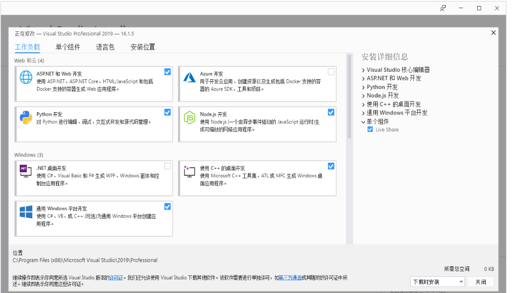
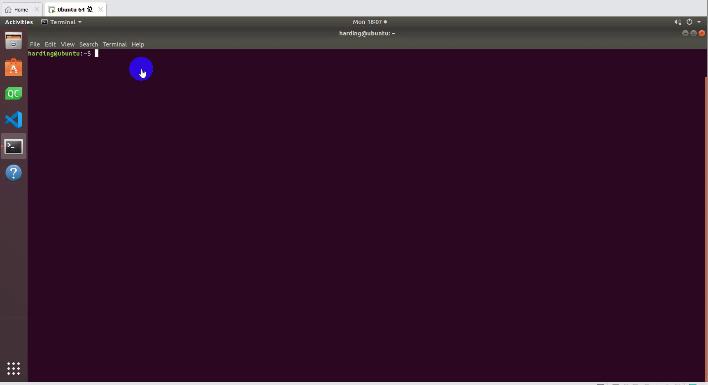

# C++ 环境搭建

## 1 确认开发目标

**MycobotCpp是一个和mycobot进行串口通讯的接口程序，调用的是我们公司自己开发的mycobot库，里面有简单的使用案例。如果您想通过**c++**进行自由开发，控制我们公司已经研发出来的机器人，那么它是您的选择。** 
支持的机械臂型号：**myCobot 280-M5、myCobot 320-M5** 
**运行MycobotCpp所需要的软件：vs2019、qt5.12.10、vsaddin（qt插件）。** 

## 2 Windows环境配置

### 2.1 安装vs2019

- 下载： 
首先在官网下载[vs2019](https://visualstudio.microsoft.com/zh-hans/vs/)。  

- 安装： 
安装完成后，会出现下图所示界面，主要选择“通用Windows平台开发、使用C++的桌面开发、ASRNET和Web开发”这3个（此处只是建议，具体可根据自己的需求选择，vs2019安装时间较长）。 

- 环境变量配置： 
此电脑--》右键 属性--》高级系统设置--》环境变量--》看系统变量处，点击新建--》变量名：VCINSTALLDIR 变量值：找到Redist所在目录(如：D:\vs2019\VC），具体如下图所示： 

### 2.2 安装qt5.12.10

- 下载： 
下载[qt5.12.10](https://download.qt.io/archive/qt/)及以上版本都可以，具体操作如下图： 

- 安装： 
首先登录qt账号，没有就先注册。接下来会出现选择组件的界面，windows上选择MinGW和MSVC即可，具体如下图所示： 

- 环境变量配置： 
	此电脑--》右键 属性--》高级系统设置--》环境变量--》看系统变量处，点击新建--》变量名：QTDIR 变量值：msvc2017_64所在目录（如：D:\qt5.12.10\5.12.10\msvc2017_64，具体看自己电脑的安装路径），具体如下图所示： 
	
### 2.3 安装qt插件vsaddin

- 下载： 
	首先选择对应vs2019的[vsaddin](https://download.qt.io/archive/vsaddin/)版本,具体操作如下图： 
	
- 安装：直接安装即可 
- 配置： 
	vs2019菜单栏 扩展--》QT VS ToolS--》QT Versions--》add new qtversion Path选择msvc2017_64所在路径（如：D:\qt5.12.10\5.12.10\msvc2017_64），具体操作如下图所示： 
	
## 3 Linux环境配置

### 3.1 安装qt5.12.10

- 下载： 
下载地址和Windows一样，选择linux上的安装包即可，具体可看上面的8.1.2.2。 

- 安装： 
	命令行安装：运行./“安装包名称”，如果没有执行权限，加执行权限：sudo chmod +x “安装包名称”，然后进入图形界面，和Windows一样； 
	图形界面安装：和Windows一样。 
	建议直接普通用户权限安装qt，安装成功后可以执行qmake --version，出现如下界面安装成功： 
	
	
- 配置： 
打开配置文件，普通用户安装qt：vi ~/.bashrc，root用户安装qt：vi ~/.profile。在配置文件中添加：export QTDIR=“qt所在目录”（如：export QTDIR=$HOME/Qt/5.12.10/gcc_64），具体如下图所示： 
