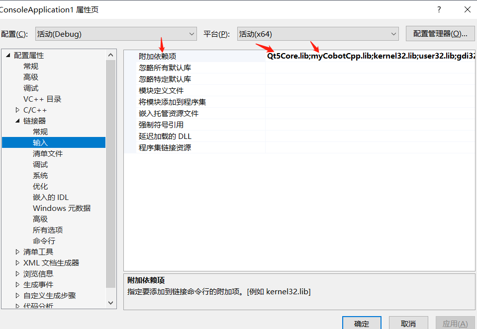

# myCobotCpp编译运行
## 下载
### 源码下载
github上下载[MycobotCpp](https://github.com/elephantrobotics/myCobotCpp/)。 
###  动态库下载
[依赖库下载](https://github.com/elephantrobotics/myCobotCpp/tags)（下载最新版本，注意选择**Windows**或者**Linux**，后缀.zip为Windows所需要的库，.tar.gz为Linux需要的库） 

##  Windows下运行

### 编译
vs2019打开MycobotCpp,选择x64-Release编译（启动项旁边，如果没有，点击下拉框--》管理配置进行添加），同时cmake设置的配置处也要选择release，最后点击生成。注意：一定选择x64-Release进行编译，具体如下图所示： 

### 运行
- 添加库文件：将.lib添加到myCobotCpp/lib，.lib和.dll添加到myCobotCppExample.exe同级目录下，如out/build/x64-Release/bin（.lib和.dll这两个文件在myCobotCpp-0.0.3-windows-msvc-x86_64.zip压缩包内） 
- 运行：选择启动项（绿色播放键旁，也就是运行按钮旁），下拉选择myCobotCppEXample.exe(bin\myCobotCppExample.exe)，点击运行，具体如下图所示： 

### 常见问题及解决办法： 
运行时错误： 

- 如果myCobotCpp.dll缺失，将之前放到lib目录下的myCobotCpp.dll放到mycobotcppexample.exe所在目录下 
- 如果报缺少QT5Core.dll，打开qt command（菜单栏搜索QT），选择msvc 2017 64-bit，执行windeployqt --release myCobotCppExample.exe所在目录（如：windeployqt --release D:\vs2019\myCobotCpp\out\build\x64-Release\bin） 此处执行命令后如果报找不到vs安装路径，请检查vs环境变量的设置 
- 以上步骤执行后，如果报缺少qt5serialport.dll文件，将qt安装目录处的此文件(路径如：D:\qt5.12.10\5.12.10\msvc2017_64\bin)，拷贝到myCobotCppExample.exe所在目录

## Linux下运行

### 编译构建
- mkdir build && cd build 
- cmake .. 
- cmake --build . 
### 运行
- 复制所有.so文件到lib目录下 
- 命令行运行：./bin/myCobotCppExample（此处是在build目录下运行）

## 在Ubuntu20.04上运行

### 编译
- mkdir build && cd build 
- cmake .. 
- cmake --build . 
### 运行
- 复制所有.so文件到lib目录下（注意下载后解压，不要在Windows解压后复制到Ubuntu，直接在Ubuntu解压，如：tar -xvf 然后直接拖动文件到终端） 
- 将libQt5SerialPort.so.5(在QT安装目录，如：/home/“用户名”/Qt5.12.10/5.12.10/gcc_64/lib)软链接到mycobotcpp/build/bin（不要直接复制），命令如下（注意选择你们的路径）：ln -s /home/“用户名”/Qt5.12.10/5.12.10/gcc_64/lib/libQt5SerialPort.so.5 /home/“用户名”/myCobotCpp/build/bin/libQt5SerialPort.so.5 

### 常见问题及解决办法
- 编译时出错： 
找不到QTDIR。解决：查看QTDIR是否配置正确，可在命令行输出查看：echo $QTDIR 

- 运行时出错： 
串口问题：无法打开串口。解决：修改机械臂串口权限，不能直接chmod...，这样每次重启都要再次该权限。直接修改文件： 

- cd /etc/udev/rules.d 
- sudo gedit 20-usb-serial.rules 
- 在文件在加入：KERNEL=="ttyUSB*" MODE="0777" 
- 找不到文件问题：如无法打开或者找不到libQt5SerialPort.so.5。解决：检查上面的运行步骤2

## 注意

如果不使用cmake编译，如直接在MFC中使用，按下图所示进行配置： 

