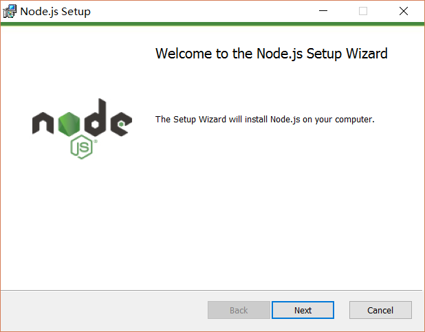
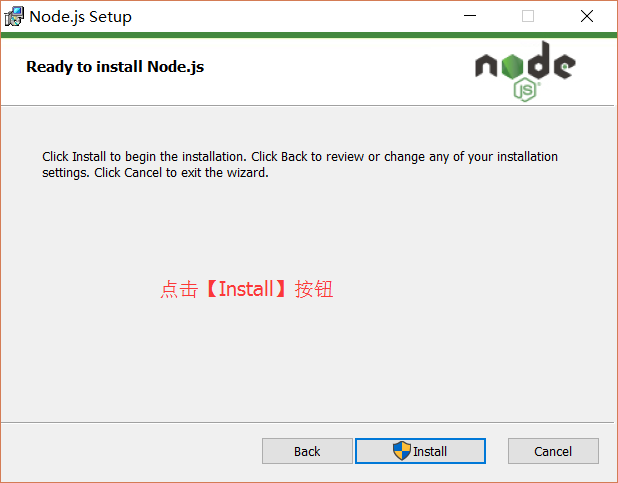
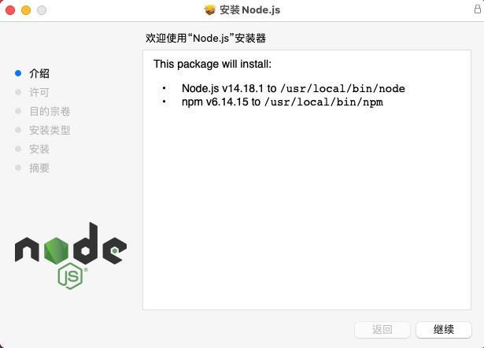
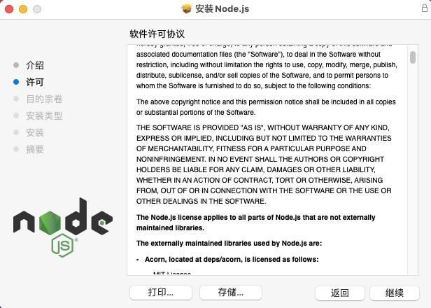
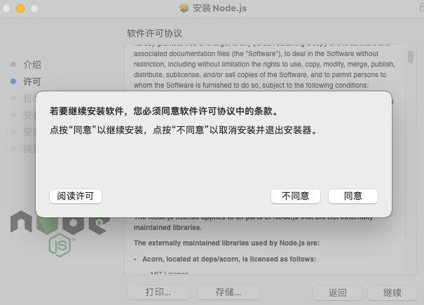

### 开发前准备
**node环境搭建**
[windows32位下载地址](https://npmmirror.com/mirrors/node/v16.13.2/node-v16.13.2-x86.msi)
[windows64位下载地址](https://npmmirror.com/mirrors/node/v16.13.2/node-v16.13.2-x64.msi)
[macOs下载地址](https://npmmirror.com/mirrors/node/v16.13.2/node-v16.13.2.pkg)

#### windows Node环境搭建
第一步 下载完成后，双击下载好的安装包，开始安装Node.js，点击next按钮


第二步 勾选左下红框内选项,再点击next


第三步 自定义安装目录


第四步 默认点击next按钮继续下一步


第五步 点击install


第六步 点击finsh安装完成


第七步 win+r打开运行，输入cmd进入命令指示符


第八步 输入node -v获取node版本，显示版本则安装成功


#### MacOs node环境搭建
第一步 下载完成后，双击下载好的安装包，开始安装Node.js，点击next按钮,点击继续


第二步 再次点击继续


第三步 点击 同意 继续下一步


第四步 点击自定义，选择安装地址，或是点击安装继续安装,并输入你的密码进行安装


第五步 提示安装成功点击关闭,退出安装程序


鼠标右键点击桌面选择打卡终端，进入终端后输入node -v,显示node版本号则表示安装成功


#### Linux node环境搭建
第一步 Node 官网已经把 linux 下载版本更改为已编译好的版本了，我们可以直接下载解压后使用：
```
# wget https://nodejs.org/dist/v10.9.0/node-v10.9.0-linux-x64.tar.xz    // 下载
# tar xf  node-v10.9.0-linux-x64.tar.xz       // 解压
# cd node-v10.9.0-linux-x64/                  // 进入解压目录
# ./bin/node -v                               // 执行node命令 查看版本
v10.9.0
```
第二步 解压文件的 bin 目录底下包含了 node、npm 等命令，我们可以使用 ln 命令来设置软连接：
```
ln -s /usr/software/nodejs/bin/npm   /usr/local/bin/ 
ln -s /usr/software/nodejs/bin/node   /usr/local/bin/
```
#### Ubuntu 源码安装 Node.js
第一步 以下部分我们将介绍在 Ubuntu Linux 下使用源码安装 Node.js 。 其他的 Linux 系统，如 Centos 等类似如下安装步骤。在 Github 上获取 Node.js 源码：
```
$ sudo git clone https://github.com/nodejs/node.git
Cloning into 'node'...
```
第二步 修改目录权限
```
$ sudo chmod -R 755 node
```
第三步 使用 ./configure 创建编译文件，并按照以下顺序来输入指令：
```
$ cd node
$ sudo ./configure
$ sudo make
$ sudo make install
```
第四步 查看 node 版本：
```
$ node --version
v0.10.25
```