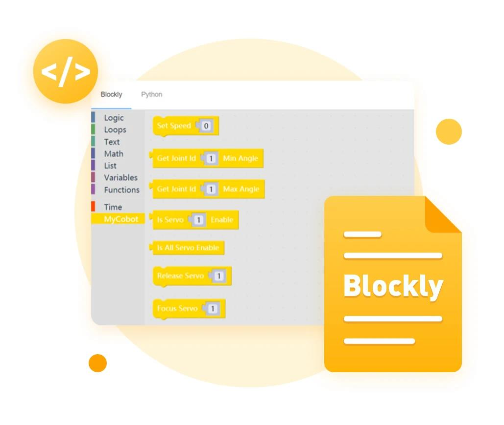

## myBlockly是什么？

**myBlockly** 是一个完全可视化的模块化编程软件，属于图形化编程语言。

**myBlockly** 在功能/设计上和MIT的儿童编程语言Scratch类似。

使用 **myBlockly** 的时候，用户可以通过拖曳模块，来构建代码逻辑，过程很像搭积木。

在用户视角下， **myBlockly** 是一个简单易用的可视化工具，用来生成代码。在开发者视角下， **myBlockly** 是一个文本框，里边包含了用户输入好的代码。

代码生成到文本框的过程，就是用户在 **myBlockly** 里拖曳的过程。

## myBlockly安装

**myBlockly的下载地址：**

- GitHub 地址：https://github.com/elephantrobotics/myblockly-package/releases
- 官网地址：https://www.elephantrobotics.com/download/

**适用设备：**
- myCobot 280
  - **myCobot 280 M5**
  - myCobot 280 PI
  - myCobot 280 Jetson Nano
  - myCobot 280 for Arduino

**使用前提：**

- **M5** 系列版本， 底部 **M5Stack-basic** 烧录 **miniRobot**，选择 **Transponder** 功能，末端 **ATOM** 烧录最新版的 **atomMain** (出厂默认已烧录)

- 配置 **Python 环境**，可参考Python 章节

  

## myBlockly开发使用引导

您可以根据以下指引来使用myBlockly对我们的机械臂进行开发

1.[myBlockly初始使用](5.1.1-myBlocklyFirstUse.md)

2.[控制RGB灯板](5.1.2-ControlRGB.md)

3.[控制机械臂回到原点](5.1.3-ControlRoboticArmBackZero.md)

4.[控制单关节运动](5.1.4-ControlSingleJoint.md)

5.[控制多个关节](5.1.5-ControlSinglesJoint.md)

6.[控制机械臂左右摆动](5.1.6-ControlRoboticSwingLeft&Right.md)

7.[控制机械臂跳舞](5.1.7-ControlRoboticArmDance.md)

8.[夹爪的使用](5.1.8-GripperUse.md)

9.[吸泵的使用](5.1.9-PumpUse.md)

10.[夹爪测试](5.13-gripperTest.md)

11.[IO测试](5.14-ioTest.md)

12.[Q&A](5.1.10Q&A.md)