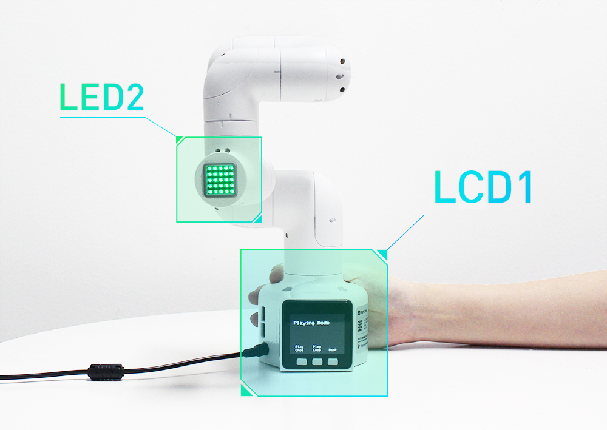
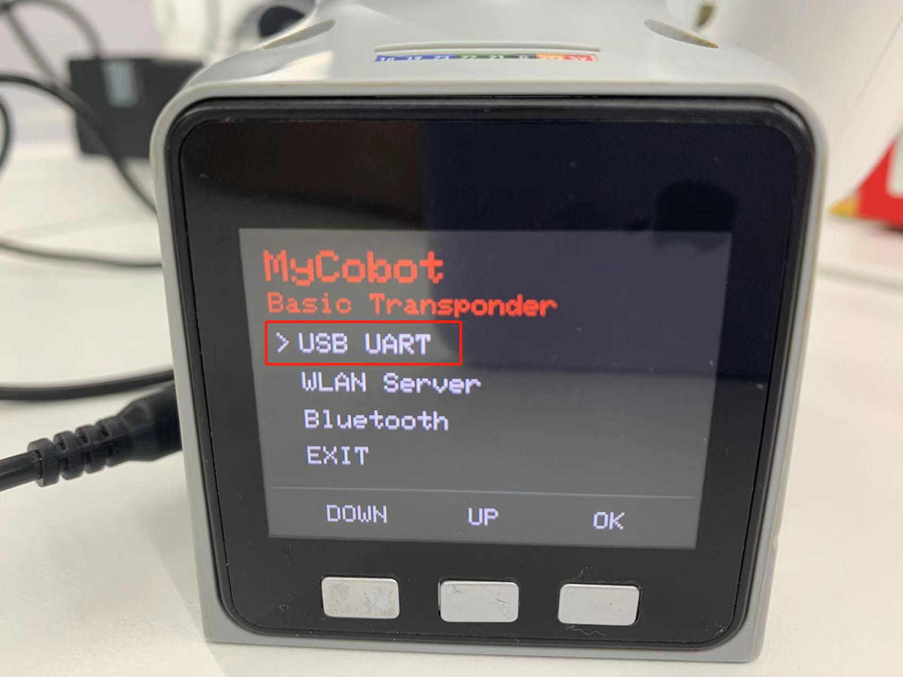

# 电脑控制

电脑控制的时效性对于微控制器机械臂至关重要。对于微控制器机械臂来说，我们通常对底座的 Basic 发送控制指令，通过电脑控制转发，末端执行器将对指令进行解析，继而执行目标动作。

该功能现主要用于客户在不同环境下自行开发机械臂。

**设备类型不同，操作方式也有所不同**，大概步骤如下：

- **Atom**烧录最新版的**atomMain**
- **M5Stack-basic**烧录**minirobot**，选择**Transponder**功能
- 按下检测键，检测 Basic 和末端执行器 Atom 是否正常通讯
- 按下退出按钮，退出此功能

本节，我们可以实时检测 Basic 和末端执行器 Atom 是否正常通讯。

---
## 实现通讯转发

## 适用设备
- myCobot 280 M5
- myCobot 320 M5
- myPalletizer 260 M5
- mechArm 270 M5

## 操作步骤
**Step 1:** Atom烧录最新版的atomMain。

**Step 2:** M5Stack-basic烧录minirobot，选择Transponder功能。

**Step 3:** 检测Atom的连接(ok表示连接正常，否则显示no)。

**Step 4:** 点击Exit退出此功能。

